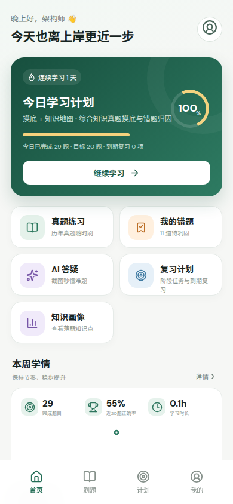
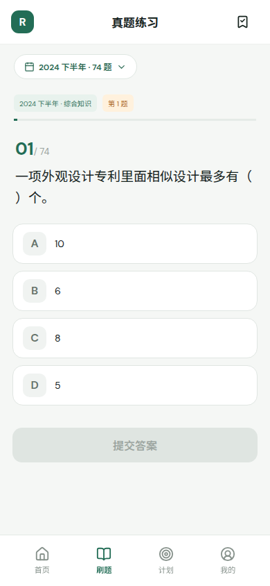
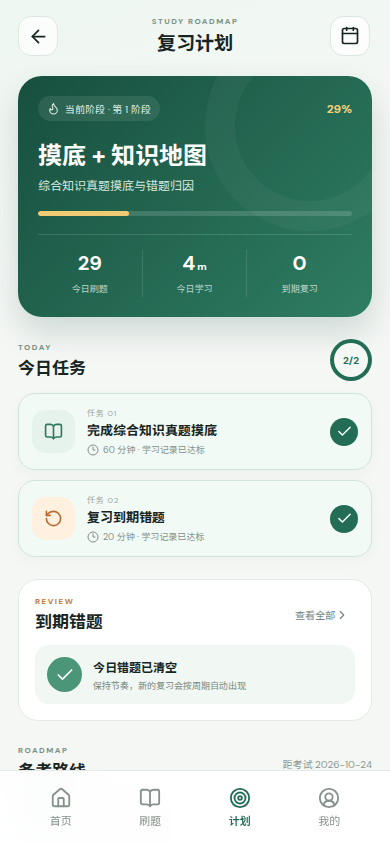
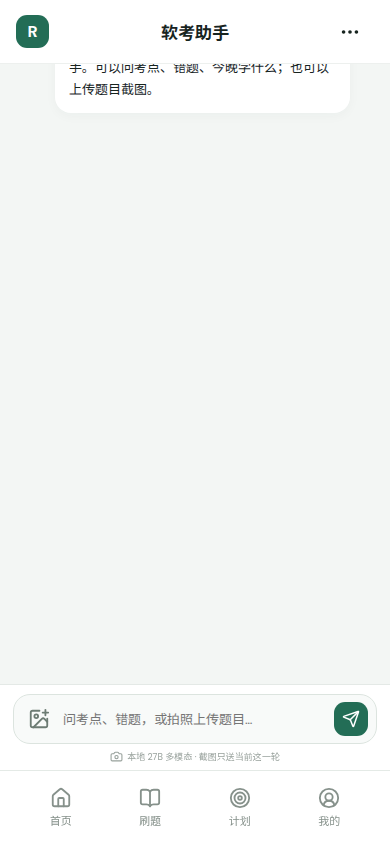

# 架构上岸：软考高级系统架构设计师备考助手

面向 2026 年下半年软考高级「系统架构设计师」的本地备考工具。它把历年真题练习、错题复习、学习计划、阶段路线、刷题打卡和 AI 答疑放在同一个移动端 Web 界面中。

项目同时保留 Claude Code / HAPI 备考工作区能力：Web 应用负责可视化学习闭环，Agent 负责资料检索、答疑和备考协作。

## 软件界面

<p align="center">
  
  
</p>

<p align="center">
  <strong>学习首页</strong> · 今日计划、连续学习、正确率与知识画像 &nbsp;&nbsp;&nbsp;
  <strong>真题练习</strong> · 按年份刷题、自动判分与错题收录
</p>

<p align="center">
  
  
</p>

<p align="center">
  <strong>复习计划</strong> · 阶段路线、真实任务状态与刷题打卡 &nbsp;&nbsp;&nbsp;
  <strong>AI 助手</strong> · 流式答疑、资料检索与截图识题
</p>

## 核心功能

### 真题练习

- 从 `zhenti/` 解析历年系统架构设计师真题。
- 支持按年份切换和题目进度记忆。
- 提交答案后判定正误，再展示解析入口。
- 答错自动收录到错题本，避免只依赖浏览器 `localStorage`。
- 支持从错题本直接跳回原题重做。

### 错题复习

- 错题列表、待复习和已掌握分类。
- 复习周期由真实答题记录派生，不由“点击进入页面”推进。
- 周期按连续答对推进，例如 `1 → 3 → 7 → 14` 天。
- 连续正确达到策略阈值后才标记为已掌握。

### 复习计划与阶段路线

- 今日任务、阶段路线、到期错题和量化目标集中展示。
- 任务完成状态由答题、错题复习和学习活跃记录自动判定。
- 后端拒绝直接 PATCH 伪造任务完成状态。
- 阶段完成依赖量化条件，不会仅因为日期到了就自动冒充完成。

### 刷题打卡日历

- 复习计划页提供月度刷题打卡日历。
- 有真实答题记录的日期会点亮，并显示当天题数。
- 支持切换上月和下月。
- 日历数据由 `/api/stats` 的 `calendar` 字段提供。

### 自动学习活跃计时

- 不需要用户手动点击“开始计时”或“结束计时”。
- 在前端刷题页、页面可见时自动累计活跃学习时间。
- 离开刷题页、页面进入后台或标签页隐藏时停止累计。
- 前端每 30 秒节流上报一次，页面隐藏或组件销毁时补写剩余增量。
- 服务端以 `clientId` 做幂等处理，避免重复计时和重复写入。
- 记录文件为 `state/study-sessions.json`。

### AI 备考助手

- `/api/chat/stream` 提供真正的上游流式响应。
- 前端按 token 增量渲染回答，不等完整内容生成后再伪切块。
- 支持本地资料检索、真题查询、错题复盘和进度查询。
- 支持上传题目截图并进行识别和考点分析。
- 支持工具调用，最多 10 轮模型—工具往返。
- 真题默认只出题不提前泄露答案；提交后再解析和评分。

## 技术结构

```text
React + Vite              前端移动端界面
Express + Node.js ESM     本地 API、状态写入、SSE 流式接口
Markdown                  历年真题和复习资料
JSON                      进度、答题、错题、计划和学习活跃账本
WebSocket + ACP           Claude Code 会话接入
```

主要目录：

```text
src/                  React 页面、交互和样式
server/               Express API、真题解析、Agent 和计划快照
state/                本地学习状态与结构化账本
zhenti/               可直接使用的历年真题
reference/            清洗后的复习参考资料
knowledge/            知识卡片
cases/                案例分析训练
essays/               论文训练素材
docs/screenshots/     README 展示截图
scripts/              校验和 ACP 冒烟脚本
```

## 本地运行 Web 应用

### 环境要求

- Node.js，建议使用当前项目已验证的 Node 版本。
- 已安装依赖：

```bash
npm install
```

### 开发模式

```bash
npm run dev
```

开发服务器默认监听：

```text
http://localhost:5174/?token=thinkmoon
```

当前 Web API 使用同一个访问令牌。生产环境不要直接复用示例令牌，应同步修改 `server/index.js` 的鉴权配置和访问方式。

### 生产构建

```bash
npm run build
npm start
```

也可以使用 Vite 预览构建产物：

```bash
npm run preview
```

### 可用脚本

| 命令 | 作用 |
| --- | --- |
| `npm run dev` | 启动 Express + Vite 开发服务 |
| `npm run build` | 构建前端生产产物 |
| `npm start` | 以生产模式启动服务 |
| `npm run preview` | 预览 Vite 构建产物 |
| `./scripts/validate.sh` | 执行项目结构校验 |

## 状态与数据边界

以下文件是学习闭环的核心账本：

| 文件 | 内容 | 权威性 |
| --- | --- | --- |
| `state/attempts.json` | 每次真实答题记录 | 事实账本 |
| `state/mistakes.json` | 错题收录列表 | 事实账本 |
| `state/study-sessions.json` | 刷题活跃时间和学习会话 | 事实账本 |
| `state/review-plan.json` | 今日计划、错题队列和阶段快照 | 派生快照 |
| `state/progress.json` | 兼容统计镜像和历史分数 | 兼容镜像 |
| `state/current.md` | 当前阶段和下一入口说明 | 人类可读状态 |
| `state/profile.json` | 用户画像、考试目标和偏好 | 用户配置 |

修改 JSON 状态后必须保持合法 JSON。不要为了演示界面直接手工修改完成状态、学习时长或错题复习周期；这些状态会在 API 读取和真实学习事件发生时重新计算。

## 主要 API

所有 API 默认使用 `X-API-Token: thinkmoon` 请求头鉴权。

| 方法 | 路径 | 说明 |
| --- | --- | --- |
| `GET` | `/api/questions` | 按年份读取真题 |
| `GET` | `/api/years` | 获取可用真题年份 |
| `GET` | `/api/stats` | 首页统计、日历和计划摘要 |
| `GET` | `/api/state` | 读取进度、错题和答题状态 |
| `GET` | `/api/review-plan` | 获取重算后的计划快照 |
| `POST` | `/api/attempts` | 写入一次答题事实 |
| `POST` | `/api/mistakes` | 添加或移除错题 |
| `POST` | `/api/study-activity` | 节流写入刷题活跃秒数 |
| `POST` | `/api/chat/stream` | AI 助手 SSE 流式对话 |
| `POST` | `/api/explain/stream` | 真题解析 SSE 流式生成 |

## 使用 Claude Code

在项目目录启动：

```bash
cd /home/liqinsi/Documents/project/ruankao-architect-agent
claude
```

可以直接说：

- `介绍一下你会怎么辅助我，不要启动正式备考`
- `开始备考`
- `今晚我有 90 分钟，开始学习`
- `给我一道可核验来源的真题`
- `查看当前进度`
- `复盘今天的错题`

## 通过 HAPI 使用

HAPI 对 Claude Code 使用原生 TUI/Agent SDK 集成，不需要 ACP 适配器。先在一个终端启动 Hub：

```bash
hapi hub --relay
```

再在另一个终端启动本项目的 Claude 会话：

```bash
cd /home/liqinsi/Documents/project/ruankao-architect-agent
hapi claude
```

`hapi` 是 `hapi claude` 的简写。务必从本项目目录创建会话，才能自动加载项目配置。若将来换机器且尚未全局安装 HAPI，可把命令替换成 `npx @twsxtd/hapi ...`。

## 设计原则

- **真实记录优先**：答题、错题和学习活跃时间先写事实，再派生统计。
- **禁止手工伪造**：任务完成和阶段完成不接受前端直接点击伪造。
- **流式优先**：AI 上游流式生成，前端增量展示。
- **考试约束优先**：真题来源、答案揭示和评分流程遵守项目规则。
- **资深开发者视角**：不泛泛科普，重点补齐考试定义、关键词、比较维度和答题表达。

## 校验

```bash
npm run build
node --check server/agent.js
node --check server/index.js
node --check server/review-plan.js
git diff --check
./scripts/validate.sh
```
