# 架构上岸：系统架构设计师备考助手

面向软考高级「系统架构设计师」的本地移动端 Web 应用。把综合知识真题、案例分析、知识地图、考点分布、错题复习、阶段计划和 AI 答疑放在同一套学习记录上。题目和个人进度保存在本地文件中；AI 功能需要自行配置模型服务。

## 页面实拍

以下截图由 Playwright 在当前代码的移动端视口下拍摄，使用仓库现有学习记录。截图只证明页面可展示及入口可到达，AI 回答和批改效果还取决于模型配置。

| 学习首页 | 综合知识刷题 | 案例分析 |
| --- | --- | --- |
| 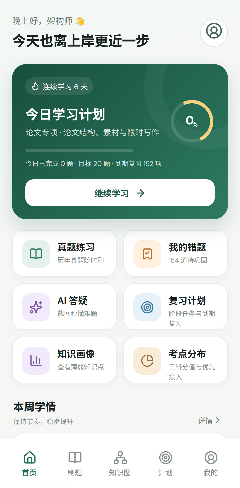 | 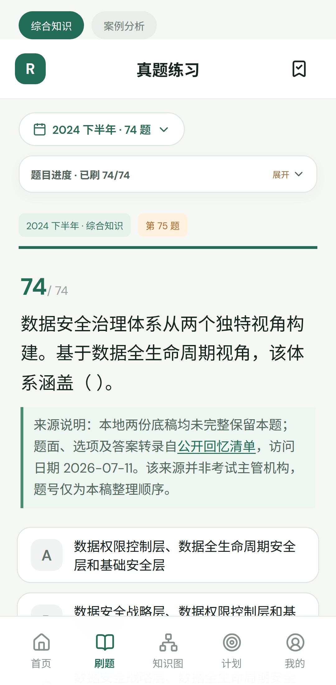 | 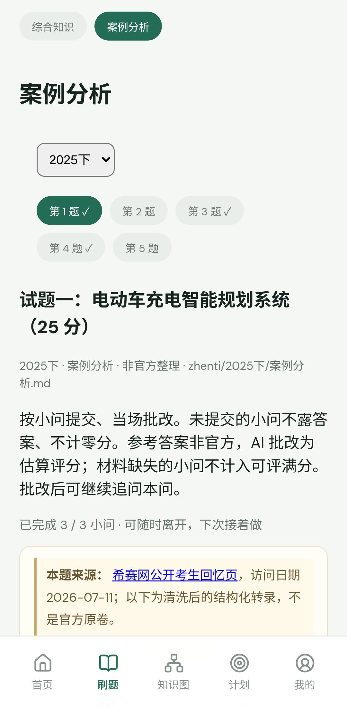 |
| **2026 上半年回忆题** | **错题本** | **复习计划** |
| 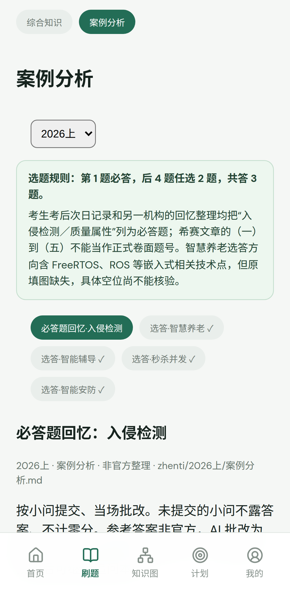 | 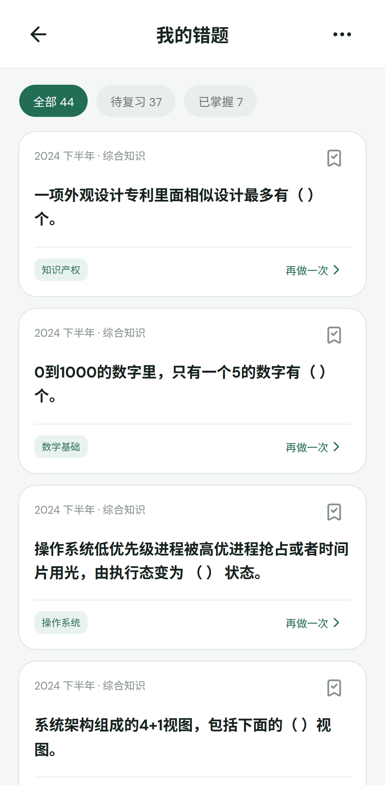 | 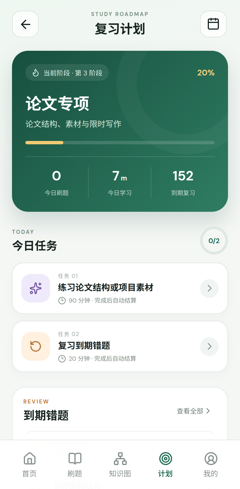 |
| **刷题日历** | **知识画像** | **考点分布** |
| 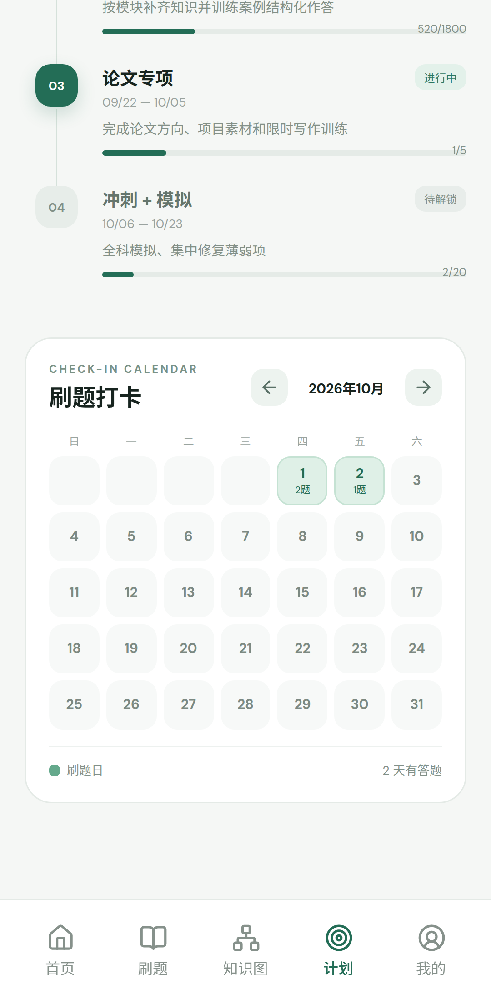 | 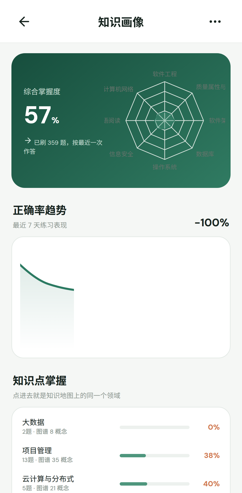 | 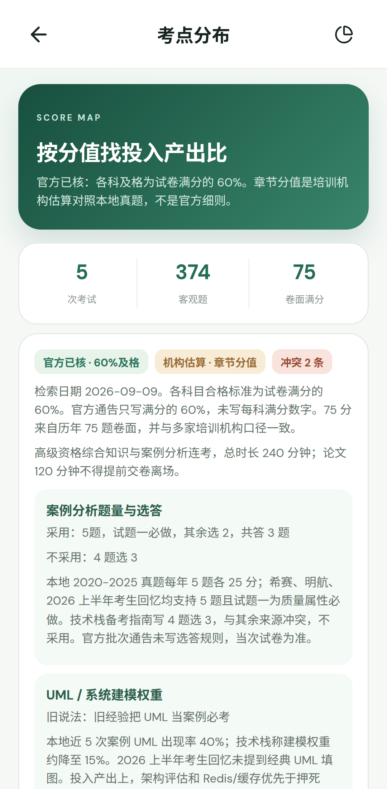 |
| **知识地图** | **AI 助手** | **题图放大** |
| 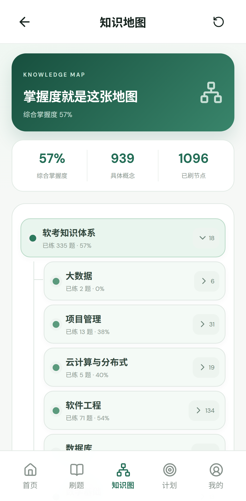 | 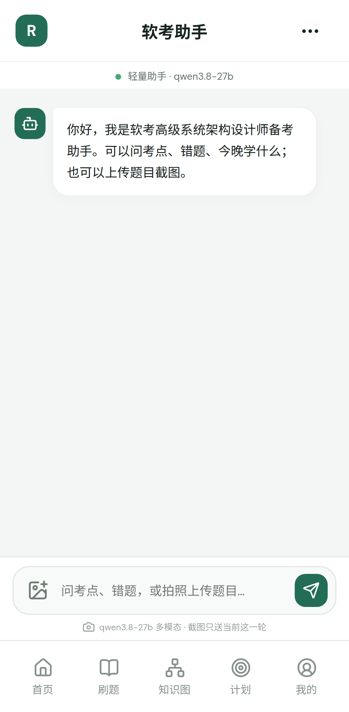 | 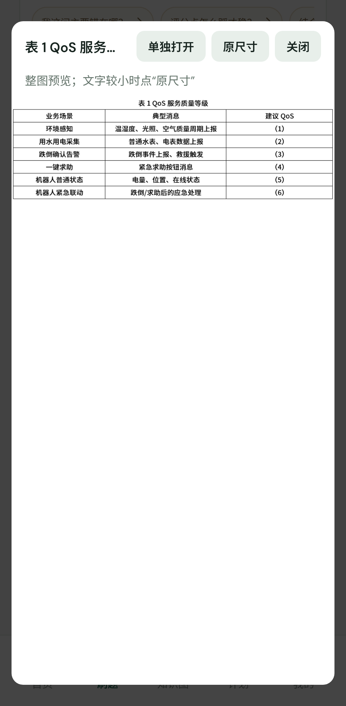 |

## 现在能做什么

### 综合知识真题

- 从 `zhenti/` 的 Markdown 解析 2020–2025 年综合知识题，按年份和题号练习，记录每题进度。
- 交卷后判定正误并显示解析入口；错题进入复习账本，可从错题页回到原题重做。
- AI 解析和批改后的追问使用流式接口，需要 `config/llm.json` 中可用的模型服务。

### 案例分析

- 收录 2020–2025 年 8 个考期共 40 道案例，另有 2026 上半年 5 道**部分题面回忆版**，合计 45 道。
- 按小问保存作答和 AI 估算评分；未提交的小问不显示参考答案，也不计零分。批改后可针对当前小问追问。浏览器会保留未提交草稿。
- 历年题图放在 `public/case-images/`；点击题图可放大、查看原尺寸。部分图是参考图或考生回忆图，页面和资料保留来源说明。
- 2026 上半年页面按“必答题回忆／选答方向”显示。公开资料存在题序冲突，部分题干或原图缺失；缺失的小问不开放作答。该场**不纳入完整历年考点频次和均分**。详见 [真题说明](zhenti/README.md) 与 [完整度审计](cases/research/案例分析题完整度审计-2026-09-28.md)。
- 参考答案及 AI 评分均非官方，不能当作正式成绩。

### 复习与分析

- 错题按待复习、已掌握分类，复习周期根据实际答题结果推进。
- 首页和复习计划展示当日任务、阶段路线、到期错题、学习时长与月度刷题日历。任务状态由答题和学习记录计算。
- 知识画像展示掌握度、正确率趋势与薄弱知识点；知识地图可展开领域、概念和关联真题。
- 考点分布按综合知识、案例分析、论文三科展示历史权重，并区分官方规则、机构估算与考生回忆。论文目前提供考点分布与素材，**没有独立的论文写作或 AI 批改页面**。

### AI 助手与 Agent

- AI 助手支持文本问答、截图识题、本地资料检索、真题检索、错题和进度查询；响应按 token 流式展示。
- Web 端的 AI 能力依赖 OpenAI 兼容的模型接口配置。应用还包含 WebSocket + ACP 会话接入代码；本地网页的核心刷题功能不依赖 ACP。
- `knowledge/`、`reference/`、`cases/` 和 `essays/` 保存可检索的备考资料。

## 快速启动

需要 Node.js 24（本次验证版本为 24.13.0）和 npm。

```bash
npm install
npm run dev
```

默认地址为 `http://localhost:5174/?token=Thinkmoon`。若端口已占用，可用 `PORT=5175 npm run dev`，再访问 5175 端口。服务启动时也会打印当前地址。浏览器验证成功后会把 Token 存入本地存储，并从地址栏移除。

**当前 Token 在 `server/index.js` 中固定为 `Thinkmoon`（区分大小写）。** 这是本地访问控制，不适合作为公开部署的认证方案。所有 `/api/*` 请求均需携带 `X-API-Token: Thinkmoon` 或 `?token=Thinkmoon`。

AI 功能还需要创建 `config/llm.json`（该文件已加入 `.gitignore`）：

```json
{
  "baseURL": "http://你的模型服务/v1",
  "apiKey": "你的密钥",
  "model": "模型名称"
}
```

服务端要求这三个字段均非空；`baseURL` 应指向兼容 `/chat/completions` 的接口。未配置时，真题浏览与已有学习记录仍可使用，AI 请求无法完成。模型名称由配置决定，页面上的模型标签只是当前界面文案。

生产构建与检查：

```bash
npm run build
npm start
node --test server/*.test.js
bash scripts/validate.sh
```

`npm start` 以生产模式从 `dist/` 提供页面；`npm run preview` 只预览 Vite 构建产物。构建或启动前先运行 `npm install`。

## 数据与目录

| 路径 | 内容 |
| --- | --- |
| `src/` | React 页面、交互、样式 |
| `server/` | Express API、真题解析、计划计算、Agent 与 ACP |
| `zhenti/` | 历年综合知识、案例、论文 Markdown |
| `public/case-images/` | 案例题图及标明来源的参考图 |
| `knowledge/`、`reference/` | 知识地图、考点核对资料和复习材料 |
| `cases/`、`essays/` | 案例研究与论文素材 |
| `state/` | 答题、错题、案例作答、计划和学习时间账本 |
| `docs/screenshots/` | README 使用的 Playwright 页面截图 |

核心状态文件：`attempts.json` 记综合知识答题，`case-attempts.json` 记案例小问，`mistakes.json` 记错题，`study-sessions.json` 记学习活跃时间，`knowledge-graph.json` 记知识图谱，`review-plan.json` 是可重新计算的计划快照。仓库目前追踪这些状态文件；公开分享或部署前应按自己的数据需求检查其内容。

## 主要 API

| 方法 | 路径 | 用途 |
| --- | --- | --- |
| GET | `/api/years`、`/api/questions` | 年份列表和综合知识题 |
| GET | `/api/cases?year=2026上` | 按考期读取案例与已有作答 |
| POST | `/api/cases/attempts` | 保存一个案例小问 |
| POST | `/api/cases/attempts/:id/grade` | 为已提交小问请求 AI 估算评分 |
| POST | `/api/cases/follow-up/stream` | 案例批改后追问 |
| GET | `/api/stats`、`/api/state`、`/api/review-plan` | 学习统计、账本和计划 |
| POST | `/api/attempts`、`/api/mistakes`、`/api/study-activity` | 记录答题、错题和活跃时间 |
| GET | `/api/knowledge-graph`、`/api/exam-points` | 知识地图与考点分布 |
| POST | `/api/chat/stream`、`/api/explain/stream` | AI 问答与真题解析 |

技术栈：React、Vite、Express、Node.js ESM、Markdown、JSON、SSE、WebSocket 和 ACP。
