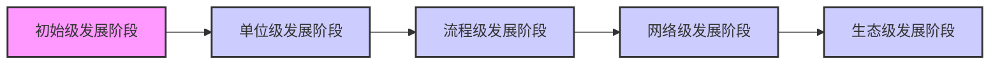

> 来源：2026年上半年系统架构设计师核心宝典（希赛）

# 第一章 系统工程与信息系统基础
## 1.1 系统工程
### 知识点 1：系统工程方法
【系统工程】是一种组织管理技术。

【系统工程】是为了最好的实现系统的目的，对系统的组成要素、组织结构、信息流、控制机构进行分析研究的科学方法。

【系统工程】从整体出发、从系统观念出发，以求【整体最优】。

【系统工程】利用计算机作为工具，对系统的结构、元素、信息和反馈等进行分析，以达到最优规划、最优设计、最优管理和最优控制的目的。

【系统工程方法】是一种现代的科学决策方法。

| 系统工程方法 | 关键点 |
| :--- | :--- |
| 霍尔三维结构 “硬科学” 方法论 | 逻辑维：逻辑维即解决问题的逻辑过程。 时间维：时间维即是工作进程。 知识维：知识维即是专业科学知识。 应用场景：组织和管理大型工程建设项目。 |
| 切克兰德方法 “软科学” 方法论 | 核心不是“最优化”，而是“比较”和“探寻”。 7 步骤：认识问题、根底定义、建立概念模型、比较及探寻、选择、设计与实施、评估与反馈 |
| 并行工程方法 | “制造过程”与“支持过程”并行。 强调三个方面：产品设计开发期间，最快速度按质完成；各项工作问题协调解决；适当的信息系统工具。 |
| 综合集成法 | 钱学森命名，【简单系统】和【巨系统】 四原则：整体论原则、相互联系原则、有序性原则、动态原则 |
| WSR 系统方法 | 实践准则：【懂物理】-【明事理】-【通人理】 |

霍尔三维结构内容：

| 逻辑维 | 时间维 | 知识维 |
| :--- | :--- | :--- |
| 1、明确问题 2、确定目标 建立价值体系或评价体系 3、系统综合 4、系统分析 5、优化 系统方案的优化选择 6、系统决策 7、实施计划 | 1、规划阶段 调研，谋求活动的规划与战略 2、拟定方案 提出具体的计划方案 3、研制阶段 完成研制方案及生产计划 4、生产阶段 生产零部件及提出安装计划 5、安装阶段 安装完毕，完成系统的运行计划 6、运行阶段 系统按照预期的用途开展服务 7、更新阶段 改进原有系统或消亡原有系统 | 工程、医药 建筑、商业 法律、管理 |

**考点 1：霍尔三维结构**

【2018年下】系统工程利用计算机作为工具，对系统的结构、元素、（）和反馈等进行分析，以达到最优（）、最优设计、最优管理和最优控制的目的。霍尔（A.D. Hall）于1969年提出了系统方法的三维结构体系，通常称为霍尔三维结构，这是系统工程方法论的基础。霍尔三维结构以时间维、（）维、知识维组成的立体结构概括性地表示出系统工程的各阶段、各步骤以及所涉及的知识范围。其中时间维是系统的工作进程，对于一个具体的工程项目，可以分为7个阶段，在（）阶段会做出研制方案及生产计划。

A.知识 B.需求 C.文档 D.信息
A.战略 B.规划 C.实现 D.处理
A.空间 B.结构 C.组织 D.逻辑
A.规划 B.拟定 C.研制 D.生产

【参考答案】DBDC

## 1.2 信息系统生命周期
### 知识点 1：信息系统生命周期
系统工程生命周期阶段及方法：

探索性研究→概念阶段→开发阶段→生产阶段→使用阶段→保障阶段→退役阶段

系统工程生命周期方法：

计划驱动方法：需求->设计->构建->测试->部署

渐进迭代式开发：提供连续交付以达到期望的系统

精益开发：起源于丰田，是一个动态的、知识驱动的，以客户为中心的过程
敏捷开发：更好的灵活性
信息系统生命周期：

[图：信息系统生命周期流程图，左侧为产生阶段、开发阶段、运行阶段、消亡阶段，右侧为单个系统开发流程：总体规划、系统分析、系统设计、系统实施、系统验收]

信息系统建设原则：

- 高层管理人员介入原则
- 用户参与开发原则
- 自顶向下规划原则
- 工程化原则
- 其他原则

**考点 1：信息系统生命周期**

【模拟题练习】在信息系统生命周期中，系统分析阶段的主要任务是（）。

A.确定系统目标

B.进行可行性研究

C.制定系统实施计划

D.完成系统验收

【参考答案】A

【希赛点拨】系统分析阶段的主要任务是对现行系统进行详细调查，彻底掌握现行系统的情况，明确用户的真实需求，并在此基础上提出新系统的逻辑模型。总结就是先设定目标再进行其他任务。

## 1.3 信息系统的分类

| 信息系统的分类 | 关键点 |
| :--- | :--- |
| 业务处理系统【TPS】 | 早期最初级的信息系统【20 世纪 50-60 年代】。 功能：数据输入、数据处理【批处理、OLTP】、数据库维护、文件报表产生。 |
| 管理信息系统【MIS】 | 高度集成化的人机信息系统。 金字塔结构：分多个层级。 |
| 决策支持系统【DSS】 | 由语言系统、知识系统和问题处理系统组成。 用于辅助决策、支持决策。 |
| 专家系统【ES】 | 知识+推理=专家系统。人工智能的一个重要分支。 |
| 办公自动化系统【OAS】 | 由计算机设备、办公设备、数据通信及网络设备、软件系统组成。 |
| 企业资源计划【ERP】 | 打通供应链，集成，整合。 |

### 知识点 1：决策支持系统【DSS】
【决策支持系统（Decision Support System, DSS）】是一个由语言系统、知识系统和问题处理系统3个互相关联的部分组成的，基于计算机的系统。

DSS 应具有的特征：

1. 数据和模型是 DSS 的主要资源。
2. DSS 用来支援用户做决策而不是代替用户做决策。
3. DSS 主要用于解决半结构化及非结构化问题。
4. DSS 的作用在于提高决策的有效性而不是提高决策的效率。

**考点 1：决策支持系统的特征**

【模拟题练习】决策支持系统（Decision Support System, DSS）是一个由语言系统、知识系统和问题处理系统3个互相关联的部分组成的，基于计算机的系统。以下关于 DSS 的描述中错误的是（）。

A.主要资源是数据和模型

B.用来支援用户作决策而不是代替用户作决策

C.主要用于解决半结构化和非结构化的问题

D.可以提高决策的效率

【参考答案】D

### 知识点 2：专家系统【ES】
【专家系统（Expert System, ES）】是一个智能计算机程序系统，其内部含有某个领域具有专家水平的大量知识与经验，能够利用人类专家的知识和解决问题的方法来处理该领域的问题。

| 系统 | 专家系统 | 一般计算机系统 |
| :--- | :--- | :--- |
| 功能 | 解决问题、解释结果、进行判断与决策 | 解决问题 |
| 处理能力 | 处理数字与符号 | 处理数字 |
| 处理问题种类 | 多属准结构性或非结构性，可处理不确定的知识， 适用于特定的领域 | 多属结构性，处理确定的知识 |

[图：专家系统结构图]

- **知识库**：存储求解实际问题的领域知识。
- **综合数据库**：存储问题的状态描述、中间结果、求解过程的记录等信息。
- **推理机**：实质是【规则解释器】。
- **知识获取**：两方面功能——知识的编辑求精及知识自学习。
- **解释程序**：面向用户服务的。

**考点 1：专家系统的组成**

【模拟题练习】以下关于专家系统【ES】的说法，不正确的是（）。

A.专家系统不但能解决问题解释结果，还能进行判断与决策

B.专家系统中的知识库用于存储问题的状态描述、中间结果、求解过程等信息

C.专家系统可用于处理不确定的知识，主要使用于特定的领域

D.专家系统内部含有某个领域具有专家水平的大量知识与经验

【参考答案】B

【希赛点拨】专家系统中的综合数据库用于存储问题的状态描述、中间结果、求解过程等信息。

## 1.4 政府信息化与电子政务
### 知识点 1：电子政务
电子政务主要有3类角色：政府（Government）、企（事）业单位（Business）及公民（Citizen）。如果有第4类就是公务员（Employee）。

[图：电子政务交互模型]

| 类型 | 应用 |
| :--- | :--- |
| G2G | 基础信息的采集、处理和利用，如：人口信息、地理信息。及政府间：计划管理、财务管理、通信系统、各级政府决策支持。 |
| G2B | 政府给企事业单位颁发【各种营业执照、许可证、合格证、质量认证】。 |
| B2G | 企业向政府缴税； 企业向政府供应各种商品和服务【含竞/投标】； 企业向政府提建议，申诉。 |
| G2C | 社区公安和水、火、天灾等与公共安全有关的信息； 户口、各种证件和牌照的管理。 |
| C2G | 个人应向政府缴纳的各种税款和费用； 个人向政府反馈民意【征求群众意见】； 报警服务（盗贼、医疗、急救、火警等）。 |
| G2E | 政府内部管理系统。 |

**考点 1：电子政务行为主体**

【2013年下】与电子政务相关的行为主体主要有三个，即（），政府的业务活动也主要围绕着这三个行为主体展开。

A.政府、数据及电子政务系统

B.政府、企（事）业单位及中介

C.政府、服务机构及企事业单位

D.政府、企（事）业单位及公民

【参考答案】D

【希赛点拨】与电子政务相关的行为主体包括：政府、企（事）业单位及公民。常见的电子政务形式包括：G2G、G2B、G2C，其中的 G 是政府、B 是企（事）业单位、C 是公民。

【2015年下】电子政务的主要应用模式中不包括（）。

A.政府对政府（Government To Government）

B.政府对客户（Government To Customer）

C.政府对公务员（Government To Employee）

D.政府对企业（Government To Business）

【参考答案】B

【希赛点拨】B 选项中：政府对客户（Government To Customer）不正确，应是：政府对公民（Government To Citizen）。

**考点 2：电子政务应用**

【2016年下】电子政务是对现有的政府形态的一种改造，利用信息技术和其他相关技术，将其管理和服务职能进行集成，在网络上实现政府组织结构和工作流程优化重组。与电子政务相关的行为主体有三个，即政府、（）及居民。国家和地方人口信息的采集、处理和利用，属于（）的电子政务活动。

A.部门 B.企（事）业单位 C.管理机构 D.行政机关
A.政府对政府 B.政府对居民 C.居民对居民 D.居民对政府

【参考答案】BA

【希赛点拨】电子政务的行为主体包括：政府、企（事）业单位及居民。

国家和地方人口信息的采集、处理和利用，属于政府对政府的电子政务活动。

【模拟题练习】电子政务主要有3类角色：政府（Government）、企（事）业单位（Business）及公民（Citizen），政府与政府、政府与企（事）业单位以及政府与公民之间的互动构成了5种不同的、却又相互关联的领域。其中人口信息、地理信息的采集属于（）领域；颁发许可证、合格证属于（）领域；证件和牌照的管理属于（）。

A.政府对企（事）业单位（G2B） B.政府与政府（G2G）
C.企业对政府（B2G） D.政府对公民（G2C）
A.政府对企（事）业单位（G2B） B.政府与政府（G2G）
C.企业对政府（B2G） D.政府对公民（G2C）
A.政府对企（事）业单位（G2B） B.政府与政府（G2G）
C.企业对政府（B2G） D.政府对公民（G2C）

【参考答案】BAD

## 1.5 企业信息化与电子商务
### 知识点 1：信息化概念
企业信息化涉及三类创新：

**【技术创新】** 在生产工艺设计、产品设计中使用计算机辅助设计系统，并通过互联网及时了解和掌握创新的技术信息，加快从技术向生产的转化。还有，生产技术信息技术相结合，能够大幅度地提高技术水平和产品的竞争力。

**【管理创新】** 按照市场发展的要求，要对企业现有的管理流程重新整合，从作为管理核心的财务、资金管理，转向技术、物资、人力资源的管理，并延伸到企业技术创新、工艺设计、产品设计、生产制造过程的管理，进而扩展到客户关系管理、供应链的管理乃至发展到电子商务。

**【制度创新】** 那些不适应企业信息化的管理体制、管理机制和管理制度必须得到创新。

信息化需求的三个层次：

组织对信息化的需求是【组织信息化的原动力】。

**一是战略需求。** 组织信息化的目标是提升组织的竞争能力、为组织的可持续发展提供一个支持环境。从某种意义上来说，信息化对组织不仅仅是服务的手段和实现现有战略的辅助工具；信息化可以把组织战略提升到一个新的水平，为组织带来新的发展契机。特别是对于企业，信息化战略是企业竞争的基础。

**二是运作需求。** 组织信息化的运作需求是组织信息化需求非常重要且关键的一环，它包含三方面的内容：一是实现信息化战略目标的需要；二是运作策略的需要。三是人才培养的需要。

## 1.5 企业信息化与电子商务

### 知识点 1：信息化概念

**企业信息化涉及三类创新：**

- **【技术创新】** 在生产工艺设计、产品中使用计算机辅助设计系统，并通过互联网及时了解和掌握创新的技术信息，加快从技术向生产的转化。还有，生产技术与信息技术相结合，能够大幅度地提高技术水平和产品的竞争力。
- **【管理创新】** 按照市场发展的要求，要对企业现有的管理流程重新整合，从作为管理核心的财务、资金管理，转向技术、物资、人力资源的管理，并延伸到企业技术创新、工艺设计、产品设计、生产制造过程的管理，进而扩展到客户关系管理、供应链的管理乃至发展到电子商务。
- **【制度创新】** 那些不适应企业信息化的管理体制、管理机制和管理制度必须得到创新。

**信息化需求的三个层次：**

**组织对信息化的需求是【组织信息化的原动力】。**

- 一是**战略需求**。组织信息化的目标是提升组织的竞争能力、为组织的可持续发展提供一个支持环境。从某种意义上来说，信息化对组织不仅仅是服务的手段和实现现有战略的辅助工具；信息化可以把组织战略提升到一个新的水平，为组织带来新的发展契机。特别是对于企业，信息化战略是企业竞争的基础。
- 二是**运作需求**。组织信息化的运作需求是组织信息化需求非常重要且关键的一环，它包含三方面的内容：一是实现信息化战略目标的；二是运作策略的需要。三是人才培养的需要。

---

- 三是**技术需求**。由于系统开发时间过长等问题在信息技术层面上对系统的完善、升级、集成和整合提出了需求。也有的组织，原来基本上没有大型的信息系统项目，有的也只是一些单机应用，这样的组织的信息化需求，一般是从头开发新的系统。

组织的三个层次的需求并不是相互孤立的，而是有着内在的联系。信息化需求的获取是一个自上而下的过程，需要对这些需求进行综合分析，才能把握组织对信息化建设的方向。

#### 考点 1：企业信息化的三类创新

- **【2013年下】** 企业信息化涉及对企业管理理念的创新，按照市场发展的要求，对企业现有的管理流程重新整合，管理核心从对（ ）的管理，转向对（ ）的管理，并延伸到对企业技术创新、工艺设计、产品设计、生产制造过程的管理，进而还要扩展到对（ ）的管理乃至发展到电子商务。
    - A.人力资源和物资  B.信息技术和知识  C.财务和物料  D.业务流程和数据
    - A.业务流程和数据  B.企业信息系统和技术  C.业务流程、数据和接口  D.技术、物资和人力资源
    - A.客户关系和供应链  B.信息技术和知识  C.生产技术和信息技术  D.信息采集、存储和共享
- **【参考答案】** CDA

#### 考点 2：信息化需求的三个层次

- **【2021年下】** 政府、企业等对信息化的需求是能组织信息化的原动力，它决定了组织信息化的价值取向和成果效益水平，而需求本身又是极为复杂的，它是一个系统性的、多层次的目标体系，组织信息化需求通常包含三个层次，即（ ），三个层次的需求并不是相互孤立的，而是有着内在的联系。
    - A.战略需求，运作需求，功能需求
    - B.战略需求，运作需求，技术需求
    - C.市场需求，技术需求，用户需求
    - D.市场需求，技术需求，领域需求
- **【参考答案】** B

---

- **【2017年下】** 组织信息化需求通常包含三个层次，其中（ ）需求的目标是提升组织的竞争能力，为组织的可持续发展提供支持环境。（ ）需求包含实现信息化战略目标的需求、运营策略的需求和人才培养的需求三个方面。技术需求主要强调在信息层技术层面上对系统的完善、升级、集成和整合提出的需求。
    - A.战略  B.发展  C.人事  D.财务
    - A.规划  B.运作  C.营销  D.管理
- **【参考答案】** AB

### 知识点 2：企业信息化方法

- **业务流程重组方法：** “彻底的、根本性的” 重新设计流程。
- **核心业务应用方法：** 围绕核心业务推动信息化。
- **信息系统建设方法：** 建设信息系统作为企业信息化的重点和关键。
- **主题数据库方法：** 建立面向企业的核心业务的数据库，消除“信息孤岛”。
- **资源管理方法：** 切入点是为**企业资源管理**提供强大的能力。如：ERP、SCM。
- **人力资本投资方法：** 人力资本理论【**注意不是人力资源管理**】把一部分企业的优秀员工看作是一种资本，能够取得投资收益。

#### 考点 1：企业信息化方法及其特点

- **【2012年下】** 企业信息化程度是国家信息化建设的基础和关键，企业信息化方法不包括（ ）。
    - A.业务流程重组
    - B.组织机构变革
    - C.供应链管理
    - D.人力资本投资
- **【参考答案】** B

**【希赛点拨】** 企业信息化程度是国家信息化建设的基础和关键，企业信息化就是企业利用现代信息技术，通过信息资源的深入开发和广泛利用，实现企业生产过程的自动化、管理方式的网络化、决策支持的智能化和商务运营的电子化，不断提高生产、经营、管理、决策的效率和水平，进而提高企业经济效益和企业竞争力的过程。企业信息化方法主要包括业务流程重组、核心业务应用、信息系统建设、主题数据库、资源管理和人力资本投资方法。而供应链管理的简称为（SCM），属于资源管理方法，是企业信息化方法中的一种。所以答案选 B 选项。

---

- **【2011年下】** 以下关于企业信息化方法的叙述中，正确的是（ ）。
    - A.业务流程重构是对企业的组织结构和工作方法进行重新设计，SCM（供应链管理）是一种重要的实现手段
    - B.在业务数量浩繁且流程错综复杂的大型企业里，主题数据库方法往往形成许多“信息孤岛”，造成大量的无效或低效投资
    - C.人力资源管理把企业的部分优秀员工看作是一种资本，能够取得投资收益
    - D.围绕核心业务应用计算机和网络技术是企业信息化建设的有效途径
- **【参考答案】** D

**【希赛点拨】** 选项 A 描述错误，因为 SCM 不是业务流程重构的实现手段。选项 B 描述错误，因为事务型数据库容易形成信息孤岛，而主题数据库不容易形成“信息孤岛”。C 选项描述错误，因为人力资源是把所有员工看作是一种资本，而非部分员工。

### 知识点 3：信息系统战略规划 (ISSP)

信息系统战略规划（Information System Strategic Planning, ISSP）是从企业战略出发，构建企业基本的信息架构，对企业内、外信息资源进行统一规划、管理与应用，利用信息控制企业行为，辅助企业进行决策，帮助企业实现战略目标。

**ISSP 方法经历了三个主要阶段，各个阶段所使用的方法也不一样。**

- **第一个阶段（以数据处理为核心）**
    - 主要以数据处理为核心，围绕职能部门需求的信息系统规划，主要的方法包括：
        1. 企业系统规划法（BSP）--CU 矩阵：自上而下识别系统目标，自下而上设计信息系统，对组织机构的变动具有适应性。
        2. 关键成功因素法（CSF）：找出实现目标的关键信息集合，从而确定开发优先次序。
        3. 战略集合转化法（SST）：把战略目标看成“信息集合”，把战略目标转变成信息系统的战略目标。
        4. 其它方法包括：投资回收法、征费法、零线预算法、阶石法。
- **第二个阶段（以企业内部管理信息系统为核心）**
    - 主要以企业内部管理信息系统为核心，围绕企业整体需求进行信息系统规划，主要的方法包括战略数据规划法（SDP）、信息工程法（IE）和战略栅格法（SG）；
- **第三个阶段（以集成为核心）**

---

在综合考虑企业内外环境的情况下，以集成为核心，围绕企业战略需求进行信息系统规划，主要的方法包括价值链分析法（VCA）和战略一致性模型（SAM）。

#### 考点 1：信息系统战略规划方法

- **【2017年下】** 用于管理信息系统规划的方法有很多，其中（ ）将整个过程看成是一个“信息集合”，并将组织的战略目标转变为管理信息系统的战略目标。（ ）通过自上而下地识别企业目标、企业过程和数据，然后对数据进行分析，自下而上地设计信息系统。
    - A.关键成功因素法  B.战略目标集转化法
    - C.征费法  D.零线预算法
    - A.企业信息分析与集成法  B.投资回收法
    - C.企业系统规划法  D.阶石法
- **【参考答案】** BC

- **【模拟题练习】** 信息系统规划方法中，关键成功因素法通过对关键成功因素的识别，找出实现目标所需要的关键信息集合，从而确定系统开发的（ ）。企业系统规划法认为企业目标到系统目标的转化需要通过进行（ ）分析得到。
    - A.系统边界  B.功能指标  C.优先次序  D.性能指标
    - A.关键成功因素  B.过程/数据分析  C.信息集合  D.主要矛盾
- **【参考答案】** CB

**【希赛点拨】** 企业系统规划法虽然也首先强调目标，但它没有明显的目标导引过程。它通过识别企业“过程”引出了系统目标，企业目标到系统目标的转化是通过企业过程/数据类等矩阵（CU 矩阵）的分析得到的。

### 知识点 4：企业资源计划 (ERP)

（1） 发展过程

---

[图：发展过程图，包含“物料需求计划(MRP)”、“制造资源计划(MRP II)”、“企业资源计划(ERP)”节点。其中MRP II标注“核心是物流，主线是计划”；ERP标注“打通了供应链，扩展到了非制造业，重心转移到财务”。]

（2） ERP 结构

ERP 是将企业所有资源（企业三大流：物流、资金流、信息流）进行集成整合，全面一体化管理的管理信息系统。

包括三方面：生产控制（计划、制造）、物流管理（分销、采购、库存管理）和财务管理（会计核算、财务管理）。这三个系统本身就是一个集成体，它们相互之间有相应的接口，能够很好地整合在一起。

#### 考点 1：ERP 结构

- **【2012年下】** ERP 中的企业资源包括（ ）。
    - A.物流、资金流和信息流
    - B.物流、工作流和信息流
    - C.物流、资金流和工作流
    - D.资金流、工作流和信息流
- **【参考答案】** A

**【希赛点拨】** ERP 中的企业资源包括企业的“三流”资源，即物流资源、资金流资源和信息流资源。ERP 实际上就是对这个“三流”资源进行全面集成管理的管理信息系统。

- **【2016年下】** ERP（Enterprise Resource Planning）是建立在信息技术的基础上，利用现代企业的先进管理思想，对企业的物流、资金流和（ ）流进行全面集成管理的管理信息系统，为企业提供决策、计划、控制与经营业绩评估的全方位和系统化的管理平台。在 ERP 系统中，（ ）管理模块主要是对企业物料的进、出、存进行管理。

---

- A.产品  B.人力资源  C.信息  D.加工
- A.库存  B.物料  C.采购  D.销售
- **【参考答案】** CA

**【希赛点拨】** 采购与库存管理是 ERP 的基本模块，其中采购管理模块是对采购工作——从采购订单产生至货物收到的全过程进行组织、实施与控制，库存管理（Inventory Management, IM）模块则是对企业物料的进、出、存进行管理。

### 知识点 5：客户管理 CRM

CRM（Customer Relationship Management）理念：将客户看作资产；客户关怀是中心，**目的是提高收入**；核心思想是以客户为中心。

**CRM 的主要模块：**

- 销售自动化；
- 营销自动化；
- 客户服务与支持；
- 商业智能。

**CRM 的价值：**

- 提高工作效率，节省开支；
- 提高客户满意度；
- 提高客户的忠诚度。

#### 考点 1：CRM 的主要模块

- **【2012年下】** CRM 是一套先进的管理思想及技术手段，它通过将（ ）进行有效的整合，最终为企业涉及的各个领域提供了集成环境。CRM 系统的四个主要模块包括（ ）。
    - A.员工资源、客户资源与管理技术
    - B.销售资源、信息资源与商业智能
    - C.销售管理、市场管理与服务管理
    - D.人力资源、业务流程与专业技术
    - A.电子商务支持、呼叫中心、移动设备支持、数据分析
    - B.信息分析、网络应用支持、客户信息仓库、工作流集成
    - C.销售自动化、营销自动化、客户服务与支持、商业智能

---

- D.销售管理、市场管理、服务管理、现场服务管理
- **【参考答案】** DC

**【希赛点拨】** CRM 是一套先进的管理思想及技术手段，它通过将人力资源、业务流程与专业技术进行有效的整合，最终为企业涉及的客户或者消费者的各个领域提供了完美的集成，使得企业可以更低成本、更高效率地满足客户的需求，并与客户建立起基于学习型关系的一对一营销模式，从而让企业可以最大程度提高客户满意度和忠诚度。CRM 系统的主要模块包括销售自动化、营销自动化、客户服务与支持、商业智能。

### 知识点 6：供应链管理 SCM

SCM 理念：强调联合，整合与优化“三流”，打通企业间“信息孤岛”，严格的数据交换标准。将制造商、供应商、分销商、零售商，在计划（策略性）、采购、制造、配送、退货等各方面联系起来。

**信息化的三流**

1. 信息流【核心】
    - 需求信息流（需方到供方）：如客户订单、生产计划、采购合同等。
    - 供应信息流（供方到需方）：如入库单、完工报告单、库存记录、可供销售量、提货发运单等。
2. 资金流【辅助】
3. 物流【辅助】

#### 考点 1：信息流的分类

- **【2015年下】** 供应链中的信息流覆盖了从供应商、制造商到分销商，再到零售商等供应链中的所有环节，其信息流分为需求信息流和供应信息流，（ ）属于需求信息流，（ ）属于供应信息流。
    - A.库存记录  B.生产计划  C.商品入库单  D.提货发运单
    - A.客户订单  B.采购合同  C.完工报告单  D.销售报告
- **【参考答案】** BC

**【希赛点拨】** 供应链中的信息流覆盖了从供应商、制造商到分销商再到零售商等供应链中的所有环节。其信息流分为需求信息流和供应信息流，这是两个不同流向的信息流。当需求信息（如客户订单、生产计划、采购合同等）从需方向供方流动时，便引发物流。同时供应信息（如入库单、完工报告单、库存记录、可供销售量、提货发运单等）又同物料一起沿着供应链从供方向需方流动。

---

- **【模拟题练习】** 在供应链的管理中，涉及到信息化的三流：信息流、资金流、物流，其中（ ）是核心。具体细化时，信息流又可分为需求信息流和供应信息流，（ ）属于需求信息流，（ ）属于供应信息流。
    - A.商流  B.信息流  C.资金流  D.物流
    - A.客户订单  B.可供销售量  C.商品入库单  D.提货发运单
    - A.客户订单  B.采购合同  C.库存记录  D.生产计划
- **【参考答案】** BAC

#### 考点 2：企业供应链构成

- **【模拟题练习】** 下面不属于企业供应链构成节点的是（ ）。
    - A.制造商
    - B.供应商
    - C.配送中心
    - D.视频会议
- **【参考答案】** D

**【希赛点拨】** SCM 是企业的有效性管理，表现了企业在战略和战术上对业务流程的优化。整合并优化了供应商、制造商、零售商的业务效率，使商品以正确的数量、正确的品质、在正确的地点、以正确的时间、最佳的成本进行生产和销售。SCM 包括计划、采购、制造、配送、退货五大基本内容。

### 知识点 7：商业智能 BI

- （1）过程
    - 需求分析→数据仓库建模→数据抽取→建立 BI 分析报表→用户培训和数据模拟测试→系统改进和完善
- （2）相关技术：数据仓库+数据挖掘+OLAP
- （3）用途：决策分析【分析历史数据预判未来】
- （4）数据仓库

---

| 数据库 | 数据仓库【特点】 |
| :--- | :--- |
| 面向应用：应用组织数据 | 面向主题：主题组织数据 |
| 零散的：一个应用对应一个数据库 | 集成的：整个企业对应一个数据仓库 |
| CRUD：增删改查是常态 | 相对稳定的（非易失的）： 查询为主、基本无修改与删除 |
| 解决当下应用问题 | 反映历史变化（时变的）： 各个阶段信息都有，并可预测未来趋势 |

- （5）数据挖掘：分类：
    - 关联分析：挖掘出隐藏和数据间的相互关系。
    - 序列模式分析：侧重点是分析数据间的先后关系（因果关系）。
    - 分类分析：为每一个记录赋予一个标记再按标记分类。
    - 聚类分析：分类分析法的逆过程。
- （6）数据湖
    - 概念：数据湖是一个存储企业的各种各样原始数据的大型仓库，其中的数据可供存取、处理、分析及传输。
    - 特点：数据湖从企业的多个数据源获取原始数据，并且针对不同的目的，同一份原始数据还可能有多种满足特定内部模型格式的数据副本。因此，数据湖中被处理的数据可能是任意类型的信息，从结构化数据到完全非结构化数据。
    - 区别：**数据仓库**仅支持分析处理，**数据湖**既支持分析处理，也支持事务处理。
    - 比较：

| 维度 | 数据仓库 | 数据湖 |
| :--- | :--- | :--- |
| 数据 | 清洗过的数据 结构化的数据 | 原始数据 结构化，半结构化数据 |
| 模式 | 数据存储之前定义数据模式 数据集成之前完成大量工作 数据的价值提前明确 | 数据存储之后定义数据模式 提供敏捷，简单的数据集成 数据的价值尚未明确 |
| 存取方法 | 标准 SQL 接口 | 应用程序，类 SQL 的程序 |
| 优势 | 多数据源集成 干净，安全的数据 转换一次，多次使用 | 无限扩展性 并行执行 支持编程框架 数据经济 |

### 考点 1：商业智能相关技术

【2014年下】商业智能是企业对商业数据的搜集、管理和分析的系统过程，主要技术包括（ ）。
A.数据仓库、联机分析和数据挖掘
B.数据采集、数据清洗和数据挖掘
C.联机分析、多维度分析和跨维度分析
D.数据仓库、数据挖掘和业务优化重组
【参考答案】 A

### 考点 2：数据挖掘

【2013年下】数据挖掘是从数据库的大量数据中揭示出隐含的、先前未知的并有潜在价值的信息的非平凡过程，主要任务有（ ）。
A.聚类分析、联机分析、信息检索等
B.信息检索、聚类分析、分类分析等
C.聚类分析、分类分析、关联规则挖掘等
D.分类分析、联机分析、关联规则挖掘等
【参考答案】 C
【希赛点拨】 数据挖掘的任务有关联分析、聚类分析、分类分析、异常分析、特异群组分析和演变分析等等。

## 知识点 8：BPR 和 BPM

BPR 是对企业的业务流程进行根本性的再思考和彻底性的再设计，从而获得可以用诸如成本、质量、服务和速度等方面的业绩来衡量的显著性的成就。

BPM 是一种以规范化的构造端到端的卓越业务流程为中心，以持续的提高组织业务绩效为目的的系统化方法。

**BPM 与 BPR 区别：**

BPM 与 BPR 管理思想最根本的不同就在于流程管理并不要求对所有的流程进行再造。构造卓越的业务流程并不是流程再造，而是根据现有流程的具体情况，对流程进行规范化的设计。

### 考点 1：BPR 定义

【模拟题练习】 业务流程重组(Business Process Reengineering, BPR)是针对企业业务流程的基本问题进行回顾，其核心思路是对业务流程的（ ）改造，BPR 过程通常以（ ）为中心。
A.增量式 B.根本性 C.迭代式 D.保守式
A.流程 B.需求 C.组织 D.资源
【参考答案】 BA
【希赛点拨】 业务流程重组 (Business Process Reengineering, BPR) 是针对企业业务流程的基本问题进行反思，并对它进行彻底的重新设计，使业绩取得显著性的提高。与目标管理、全面质量管理、战略管理等理论相比，BPR 要求企业管理人员从根本上重新思考企业已形成的基本信念，即对长期以来企业在经营中所遵循的基本信念 (例如，分工思想、等级制度、规模经营和标准化生产等体制性问题) 进行重新思考。这就需要打破原有的思维定势，进行创造性思维。
业务流程重组(Business Process Reengineering, BPR)是针对企业业务流程的基本问题进行回顾，其核心思路是对业务流程的 根本性 改造，BPR 过程通常以流程为中心。

## 1.6 企业应用集成

### 知识点 1：企业应用集成

企业集成分类：
按集成成分：

| | 集成点 | 效果 | 解题关键点 |
| :--- | :--- | :--- | :--- |
| 界面集成 | 界面 | 统一入口，产生“整体”感觉 | “整体”感觉 最小代价实现一体化操作 |
| 数据集成 | 数据 | 不同来源的数据逻辑或物理上“集中” | 其他集成方法的基础 |
| 控制集成 | 应用逻辑 | 调用其他系统已有方法，达到集成效果 | |
| 业务流程集成(过程集成) | 应用逻辑 | 跨企业，或优化流程而非直接调用 | 企业之间的信息共享能力 |
| 门户集成 | | 将内部系统对接到互联网上 | 发布到互联网上 |

(1) 表示集成（界面集成）

把各应用系统的界面集成起来，统一入口，产生“整体”感觉。

[图：表示集成（界面集成）架构图]

(2) 数据集成

数据集成是应用集成和业务过程集成的基础。把不同来源、格式、特点性质的数据在逻辑上或物理上有机地集中，从而为企业提供全面的数据共享。ETL、数据仓库、联邦数据库都可视为数据集成。

[图：数据集成架构图]

(3) 控制集成（功能集成、应用集成、API 集成）

业务逻辑层次集成，可以借助于远程过程调用或远程方法调用、面向消息的中间件等技术。

[图：控制集成架构图]

(4) 业务流程集成（过程集成，B2B）

进行业务流程集成时，企业必须对各种业务信息的交换进行定义、授权和管理，以便改进操作、减少成本、提高响应速度。

按传输方式分：

| | 特点 |
| :--- | :--- |
| 消息集成 | 数据量小，交互频繁，立即地，异步 |
| 共享数据库 | 交互频繁，立即地，同步 |
| 文件传输 | 数据量大，交互频度小，即时性要求低（月末，年末） |

EAI 提供4个层次的服务：

| EAI 提供 4 个层次的服务 | 功能 |
| :--- | :--- |
| 流程控制服务 | 解决人工参与的长期的工作流程控制问题 |
| 应用连接服务 | 应用连接适配器将应用接口连接至 EAI 平台 |
| 信息传递与转化服务 | 负责传递消息和转化消息 |
| 通讯服务 | 通过通讯中间件进行消息的路由 |

企业集成技术的架构层次：

| 企业集成技术的架构层次 | 说明 |
| :--- | :--- |
| 会聚集成 | 集成化运行 |
| 应用集成 | 语用互操作 模式：集成适配器、集成信使、集成面板和集成代理 4 种 |
| 数据集成 | 语义互通 模式：数据联邦、数据复制、基于接口的数据集成 |
| 网络集成 | 语法互联 |

企业门户：

企业信息门户 (Enterprise Information Portal, EIP)：使员工/合作伙伴/客户/供应商都能够访问企业内部网络和因特网存储的各种自己所需的信息。【统一访问入口】
企业知识门户 (Enterprise Knowledge Portal, EKP)：企业网站的基础上增加知识性内容。【企业知识库】
企业应用门户 (Enterprise Application Portal, EAP)：以商业流程和企业应用为核心，把商业流程中功能不同的应用模块通过门户技术集成在一起。【企业信息系统的网上集成界面】
垂直门户：为某一特定的行业服务的，传送的信息只属于人们感兴趣的领域。

### 考点 1：企业集成的特点

【2013年下】企业信息集成按照组织范围分为企业内部的信息集成和外部的信息集成。在企业内部的信息集成中，（ ）实现了不同系统之间的互操作，使得不同系统之间能够实现数据和方法的共享；（ ）实现了不同应用系统之间的连接、协调运作和信息共享。
A.技术平台集成 B.数据集成 C.应用系统集成 D.业务过程集成
A.技术平台集成 B.数据集成 C.应用系统集成 D.业务过程集成
【参考答案】 CD

【2019年下】系统应用集成构建统一标准的基础平台，在各个应用系统的接口之间共享数据和功能，基本原则是保证应用程序的（ ）。系统应用集成提供了4个不同层次的服务，最上层服务是（ ）服务。
A.独立性 B.相关性 C.互操作性 D.排他性
A.通信 B.信息传递与转化 C.应用连接 D.流程控制
【参考答案】 AD
【希赛点拨】 EAI 构建统一标准的基础平台，将进程、软件、标准和硬件联合起来，连接具有不同功能和目的而又独自运行的企业内部的应用系统，以达到信息和流程的共享，使企业相关应用整合在一起。
EAI 就是在各个应用系统的接口之间共享数据和功能。EAI 的基本原则就是集成多个系统并保证系统互不干扰，也就是独立性。因此第一空选择 A 选项独立性。排他性一般理解为不能共存，因此在这里并不合适。
EAI 的终极目标就是将多个企业和企业内部的多个应用集成到一个虚拟的、统一的应用系统中。因此实施 EAI 必须遵循如下原则：应用程序的独立性；面向商业流程；独立于技术；平台无关。

EAI 提供4个层次的服务，从下至上依次为通信服务、信息传递与转化服务、应用连接服务、流程控制服务，最上层是流程控制服务，第二空选择 D 选项。

【2024年下】在企业集成技术架构层次中，自下而上依次为（ ）。其中，数据集成主要有三种模式，分别为（ ）。
A.网络集成、数据集成、应用集成和会聚集成 B.网络集成、会聚集成、数据集成和应用集成
C.网络集成、数据集成、会聚集成和服务集成 D.网络集成、会聚集成、数据集成和服务集成
A.数据复制、数据转换和数据融合 B.数据复制、数据融合和数据抽取
C.数据联邦、数据复制和基于接口的数据集成 D.数据抽取、数据复制和数据测试
【参考答案】 AC
【希赛点拨】 企业集成技术的架构层次：网络集成（语法互联）、数据集成（语义互通）、应用集成（语用互操作）、会聚集成（集成化运行）。
其中数据集成主要有以下三种模式：数据联邦、数据复制和基于接口的数据集成。

(1) 数据联邦
数据联邦是指不同的应用共同访问一个全局虚拟数据库，通过全局虚拟数据库管理系统为不同的应用提供全局信息服务，实现不同的应用和数据源之间的信息共享和数据交换，其具体实现由客户端应用、全局信息服务和若干个局部数据源三部分组成。

(2) 数据复制模式
在数据复制模式中，通过底层应用数据源之间的一致性复制来实现（访问不同数据库的）不同应用之间的信息共享和互操作，其实现的关键是必须能够提供一个或多个数据库系统之间实现数据转换和传输的基础结构（以屏蔽不同数据库间数据模型的差异）。

(3) 基于接口的数据集成模式
在基于接口的数据集成模式中，不同的应用系统之间利用适配器（或接口代理）提供的应用编程接口来实现相互调用。应用适配器或接口代理通过其开放或私有接口将业务信息从其所封装的具体应用系统中提取出来，进而实现不同的应用系统之间业务数据的共享与互交换。接口调用的方式可以采用同步调用方法，也可以采用基于消息中间件的异步方法来实现。

### 考点 2：企业门户

【2010年下】某大型公司欲开发一个门户系统，该系统以商业流程和企业应用为核心，将商业流程中不同的功能模块通过门户集成在一起，以提高公司的集中贸易能力、协同能力和信息管理能力。根据这种需求，采用企业（ ）门户解决方案最为合适。

A.信息
B.知识
C.应用
D.垂直
【参考答案】 C
【希赛点拨】 企业门户是一个信息技术平台，这个平台可以提供个性化的信息服务，为企业提供一个单一的访问企业各种信息资源和应用程序的入口。现有的企业门户大致可以分为企业信息门户、企业知识门户和企业应用门户三种。其中企业信息门户重点强调为访问结构化数据和非结构化数据提供统一入口，实现收集、访问、管理和无缝集成。企业知识门户提供了一个创造、搜集和传播企业知识的平台，通过企业知识门户，员工可以与工作团队中的其他成员取得联系，寻找能够提供帮助的专家。企业应用门户是一个用来提高企业的集中贸易能力、协同能力和信息管理能力的平台。它以商业流程和企业应用为核心，将商业流程中功能不同的应用模块通过门户集成在一起，提高公司的集中贸易能力、协同能力和信息管理能力。

## 1.7 数字化转型智能制造体系

### 知识点 1：企业数字化转型与智能制造体系

【数字化】是新一代信息技术真正的实现推动整个【商业模式的变革】，推动产业链的重构，推动改进企业与消费者之间的关系，以及企业与合作伙伴之间的关系。

企业数字化转型的五个发展阶段分别为：初始级发展阶段、单元级发展阶段、流程级发展阶段、网络级发展阶段、生态级发展阶段。

*   **初始级发展阶段**: 数码化：信息的数字化，记录、存储、传输数码化。
*   **单位级发展阶段**: 数量化：提升单向业务的运行规范性和效率。
*   **流程级发展阶段**: 数字化：关键业务流程及关键业务与设备设施、软硬件、行为活动等要素间的集成优化。
*   **网络级发展阶段**: 数模化：组织（企业）级数字化和产业互联网级网络化，实现以数据为驱动的业务模式创新。
*   **生态级发展阶段**: 数用化：生态级数字化和泛在物联网级网络化，推动与生态合作伙伴间资源、业务、能力等要素的开放共享和协同合作。

智能制造体系架构中，系统层级是指与企业生产活动相关的组织结构的层级划分，包括设备层、单元层、车间层、企业层和协同层。

(1) 设备层是指企业利用传感器、仪器仪表、机器、装置等，实现实际物理流程并感知和操控物理流程的层级；

(2) 单元层是指用于企业内处理信息、实现监测和控制物理流程的层级；

(3) 车间层是实现面向工厂或车间的生产管理的层级；

(4) 企业层是实现面向企业经营管理的层级；

(5) 协同层是企业实现其内部和外部信息互联和共享，实现跨企业间业务协同的层级。

### 考点 1：企业数字化转型的发展阶段

【2021年下】企业数字化转型的五个发展阶段依次是（ ）。
A.初始级发展阶段、单元级发展阶段、流程级发展阶段、网络级发展阶段、生态级发展阶段
B.初始级发展阶段、单元级发展阶段、系统级发展阶段、网络级发展阶段、生态级发展阶段
C.初始级发展阶段、单元级发展阶段、流程级发展阶段、网络级发展阶段、优化级发展阶段
D.初始级发展阶段、流程级发展阶段、系统级发展阶段、网络级发展阶段、生态级发展阶段
【参考答案】 A

### 考点 2：智能制造体系

【模拟题练习】 智能制造系统架构从生命周期、系统层级和智能特征3个维度对智能制造所涉及的活动、装备、特征等内容进行描述，其中，系统层级是对与企业生产活动相关的组织结构的层级划分，包括（ ）。
A.设备层、单元层、车间层、企业层和应用层
B.设备层、单元层、传输层、企业层和应用层
C.设备层、单元层、传输层、企业层和协同层
D.设备层、单元层、车间层、企业层和协同层
【参考答案】 D

