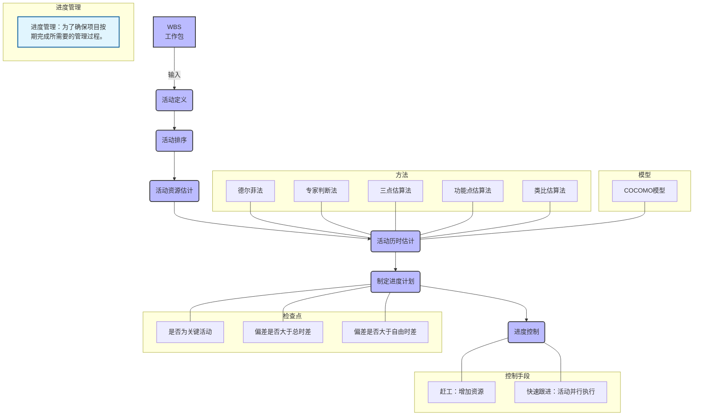
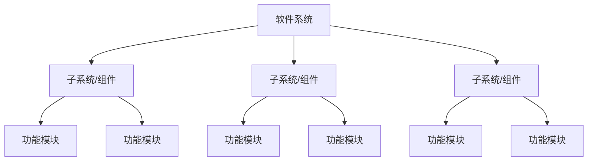

> 来源：2026年上半年系统架构设计师核心宝典（希赛）

# 第二章 项目管理

## 2.1 立项管理—盈亏平衡管理

### 知识点 1：盈亏平衡管理

销售额=固定成本+可变成本+税费+利润【正常情况下】
销售额=固定成本+可变成本+税费【盈亏平衡时】

### 考点 1：盈亏平衡点

【2020年下】某厂生产的某种电视机，销售价为每台2500元，去年的总销售量为25000台，固定成本总额为250万元，可变成本总额为4000万元，税率为16%，则该产品年销售量的盈亏平衡点为（ ）台（只有在年销售量超过它时才能盈利）。
A.5000
B.10000
C.15000
D.20000
【参考答案】 A
【希赛点拨】 本题考查的是盈亏平衡点计算问题。
盈亏平衡点也称为零利润点或保本点，是全部销售收入等于全部成本时的产量。当销售收入高于盈亏平衡点时，表示企业是盈利的状态；当销售收入低于盈亏平衡点时，表示企业是亏损的状态。
去年卖了25000台电视机，每台售价2500元，固定成本250万，可变成本4000万，税率16%。
总营收：$25000 \times 2500 = 6250\text{万}$
固定成本：$250\text{万}$
可变成本：$4000\text{万}$，占营收比例：$64\%$ ($4000\text{万}/6250\text{万}=64\%$)。
税不属于成本，但与可变成本性质相似，会随销量变化。
设盈亏平衡时的销售量为 X 台。则有：
$2500000 + X \times 2500 \times 64\% + X \times 2500 \times 16\% = X \times 2500$
$500X = 2500000$
解得：$X = 5000$

## 2.2 进度管理（时间管理）


### 知识点 1：进度管理

进度管理：为了确保项目按期完成所需要的管理过程。

过程



工作分解结构【WBS】



**【WBS 分解的基本要求】**
a) WBS 的工作包是可控和可管理的，不能过于复杂。
b) 任务分解也不能过细，一般原则 WBS 的树形结构不超过6层。
c) 每个工作包要有一个交付成果。
d) 每个任务必须有明确定义的完成标准。
e) WBS 必须有利于责任分配。

进度控制

可能出现的问题：
* 是否为关键活动
* 偏差是否大于总时差


* 偏差是否大于自由时差

采取的手段：
赶工：增加资源、加班
快速跟进：活动并行执行

进度网络图-关键路径法（PERT）

关键路径法是在制订进度计划时使用的一种进度网络分析技术。关键路线法沿着项目进度网络路线进行正向与反向分析，从而计算出所有计划活动理论上的最早开始与完成日期、最迟开始与完成日期，不考虑任何资源限制。

如下图：单代号网络图

```mermaid
graph LR
    A[<center>ES 5, EF 11, LS 0, LF 5, Duration 5<br>0 | 0 | 5</center>]
    B[<center>ES 5, EF 13, LS 5, LF 13, Duration 8<br>5 | 0 | 13</center>]
    C[<center>ES 13, EF 23, LS 13, LF 23, Duration 10<br>13 | 0 | 23</center>]
    D[<center>ES 13, EF 18, LS 18, LF 23, Duration 5<br>18 | 5 | 23</center>]
    E[<center>ES 23, EF 33, LS 28, LF 38, Duration 10<br>28 | 5 | 38</center>]
    F[<center>ES 23, EF 38, LS 23, LF 38, Duration 15<br>23 | 0 | 38</center>]
    G[<center>ES 38, EF 48, LS 38, LF 48, Duration 10<br>38 | 0 | 48</center>]

    A --> B
    A --> C
    B --> D
    C --> E
    D --> F
    E --> G
    F --> G
    
    classDef node fill:#f9f,stroke:#333,stroke-width:2px;
    class A,B,C,D,E,F,G node;
```

[图：四种依赖关系示意图 (FS, FF, SS, SF)]

| ES | 持续时间 | EF |
| :--- | :--- | :--- |
| **LS** | **活动编号** | **LF** |
| | **总时差** | |

ES：最早开始时间 EF：最早完成时间
LS：最迟开始时间 LF：最迟完成时间

(1) 总时差（松弛时间）：
在不延误总工期的前提下，该活动的机动时间。活动的总时差等于该活动最迟完成时间与最早完成时间之差，或该活动最迟开始时间与最早开始时间之差。

(2) 自由时差：
在不影响紧后活动的最早开始时间前提下，该活动的机动时间。
对于有紧后活动的活动，其自由时差等于所有紧后活动最早开始时间减去本活动最早完成时间所得之差的最小值。
对于没有紧后活动的活动，也就是以网络计划终点节点为完成节点的活动，其自由时差等于计划工期与本活动最早完成时间之差。


- 偏差是否大于自由时差

采取的手段：
- 赶工：增加资源、加班
- 快速跟进：活动并行执行

**进度网络图-关键路径法 (PERT)**

关键路径法是在制订进度计划时使用的一种进度网络分析技术。关键路线法沿着项目进度网络路线进行正向与反向分析，从而计算出所有计划活动理论上的最早开始与完成日期、最迟开始与完成日期，不考虑任何资源限制。

如下图：单代号网络图

| | | | |
| :---: | :---: | :---: | :---: |
| 5 | 2 | 7 | **B** |
| 11 | 6 | 13 | |

| | | | |
| :---: | :---: | :---: | :---: |
| 13 | 10 | 23 | **D** |
| 13 | 0 | 23 | |

| | | | |
| :---: | :---: | :---: | :---: |
| 23 | 10 | 33 | **F** |
| 28 | 5 | 38 | |

| | | | |
| :---: | :---: | :---: | :---: |
| 0 | 5 | 5 | **A** |
| 0 | 0 | 5 | |

| | | | |
| :---: | :---: | :---: | :---: |
| 38 | 10 | 48 | **H** |
| 38 | 0 | 48 | |

| | | | |
| :---: | :---: | :---: | :---: |
| 5 | 8 | 13 | **C** |
| 5 | 0 | 13 | |

| | | | |
| :---: | :---: | :---: | :---: |
| 13 | 5 | 18 | **E** |
| 18 | 5 | 23 | |

| | | | |
| :---: | :---: | :---: | :---: |
| 23 | 15 | 38 | **G** |
| 23 | 0 | 38 | |

A → B (FS)
A → B (FF)
A → B (SS)
A → B (SF)

| ES | 持续时间 | EF |
| :---: | :---: | :---: |
| | 活动编号 | |
| LS | 总时差 | LF |

**ES**：最早开始时间   **EF**：最早完成时间
**LS**：最迟开始时间   **LF**：最迟完成时间

(1) 总时差（松弛时间）：
在不误总工期的前提下，该活动的机动时间。活动的总时差等于该活动最迟完成时间与最早完成时间之差，或该活动最迟开始时间与最早开始时间之差。

(2) 自由时差：
在不影响紧后活动的最早开始时间前提下，该活动的机动时间。
对于有紧后活动的活动，其自由时差等于所有紧后活动最早开始时间减去本活动最早完成时间所得之差的最小值。
对于没有紧后活动的活动，也就是以网络计划终点节点为完成节点的活动，其自由时差等于计划工期与本活动最早完成时间之差。

---


对于网络计划中以终点节点为完成节点的活动，其自由时差与总时差相等。此外，由于活动的自由时差是其总时差的构成部分，所以，当活动的总时差为零时，其自由时差必然为零，可不必进行专门计算。

**Gantt 图**

| 工作编号 | 工作名称 | 工作时间(M) | 项目进度 (1-10) |
| :---: | :--- | :---: | :--- |
| 1 | 需求分析 | 3 | (1-3) |
| 2 | 设计建模 | 3 | (3-5) |
| 3 | 编码 | 3.5 | (5-8) |
| 4 | 测试 | 3 | (8-10) |
| 5 | 实施部署 | 2 | (9-10) |

*(检查日期)*

**优点**：甘特图直观、简单、容易制作，便于理解，能很清晰地标识出直到每一项任务的起始与结束时间，一般适用比较简单的小型项目，可用于 WBS 的任何层次、进度控制、资源优化、编制资源和费用计划。
**缺点**：不能系统地表达一个项目所包含的各项工作之间的复杂关系，难以进行定量的计算和分析，以及计划的优化等。

**考点 1：进度管理**
【2018年下】项目时间管理中的过程包括（ ）。
A. 活动定义、活动排序、活动的资源估算和工作进度分解
B. 活动定义、活动排序、活动的资源估算、活动历时估算、制订计划和进度控制
C. 项目章程、项目范围管理计划、组织过程资产和批准的变更申请
D. 生产项目计划、项目可交付物说明、信息系统要求说明和项目度量标准

**【参考答案】** B

**考点 2：工作分解结构 WBS**
【2010年下】项目时间管理包括使项目按时完成所必需的管理过程，活动定义是其中的一个重要过程。通常可以使用（ ）来进行活动定义。
A. 鱼骨图

---


B. 工作分解结构（WBS）
C. 层次分解结构
D. 功能分解图

**【参考答案】** B

**【希赛点拨】** 项目时间管理包括使项目按时完成所必需的管理过程。项目时间管理中的过程包括：活动定义、活动排序、活动的资源估算、活动历时估算、制定进度计划以及进度控制。
为了得到工作分解结构（Work Breakdown Structure，WBS）中最底层的交付物，必须执行一系列的活动。对这些活动的识别以及归档的过程就是活动定义。

**鱼骨图（Ishikawa Diagram）** 又称因果图，是一种发现问题“根本原因”的方法，通常用来进行因果分析。

**考点 3：关键路径法**
【2019年下】某工程项目包括六个作业 A-F，各个作业的衔接关系以及所需时间见下表。作业 D 最多能拖延（ ）天，而不会影响该项目的总工期。

| 作业 | A | B | C | D | E | F |
| :---: | :---: | :---: | :---: | :---: | :---: | :---: |
| 紧前作业 | - | A | A | A | B, C | D |
| 时间/天 | 5 | 7 | 3 | 4 | 2 | 3 |

A. 0
B. 1
C. 2
D. 3

**【参考答案】** C

**【希赛点拨】** 本题考查的是时间管理进度网络图的分析。
根据题干给出的依赖关系，可以画出单代号进度网络图，并分析其各活动的最早开始和完成时间、最晚开始和完成时间，以及总时差。结果如下：

---


*(网络图节点数据)*
| | | | |
| :---: | :---: | :---: | :---: |
| 0 | 5 | 5 | **A** |
| 0 | 0 | 5 | |

| | | | |
| :---: | :---: | :---: | :---: |
| 5 | 7 | 12 | **B** |
| 5 | 0 | 12 | |

| | | | |
| :---: | :---: | :---: | :---: |
| 5 | 3 | 8 | **C** |
| 9 | 4 | 12 | |

| | | | |
| :---: | :---: | :---: | :---: |
| 5 | 4 | 9 | **D** |
| 7 | 2 | 11 | |

| | | | |
| :---: | :---: | :---: | :---: |
| 12 | 2 | 14 | **E** |
| 12 | 0 | 14 | |

| | | | |
| :---: | :---: | :---: | :---: |
| 9 | 3 | 12 | **F** |
| 11 | 2 | 14 | |

本题考查的 D 活动能够延迟的时间，就是其总时差，即可以延迟 2 天不会影响项目总工期。

### 2.3 软件质量管理

**知识点 1：软件质量管理**

影响软件质量的3组因素：

| 类别 | 因素 | 说明 |
| :--- | :--- | :--- |
| **产品修改** | 可理解性 | 我能理解它吗？ |
| | 可维修性 | 我能修复它吗？ |
| | 灵活性 | 我能改变它吗？ |
| | 可测试性 | 我能测试它吗？ |
| **产品转移** | 可移植性 | 我能在另一台机器上使用它吗？ |
| | 可再用性 | 我能再用它的某些部分吗？ |
| | 互运行性 | 我能把它和另一个系统结合吗？ |
| **产品运行** | 正确性 | 它按我的需要工作吗？ |
| | 健壮性 | 对意外环境它能适当地响应吗？ |
| | 效率 | 完成预定功能时它需要的计算机资源多吗？ |
| | 完整性 | 它是安全的吗？ |
| | 可用性 | 我能使用它吗？ |
| | 风险 | 能按预定计划完成它吗？ |

**软件质量控制与质量保证：**

(1) **质量保证**一般是每隔一定时间（例如，每个阶段末）进行的，主要通过系统的质量审计和过程分析来保证项目的质量。独特工具包括：**质量审计和过程分析**。

(2) **质量控制**是实时监控项目的具体结果，以判断它们是否符合相关质量标准，制定有效方案，以消除产生质量问题的原因。

(3) **质量保证的主要目标**

【事前预防】工作。
尽量在刚刚引入缺陷时即将其捕获，而不是让缺陷扩散到下一个阶段。
作用于【过程】而【不是最终产品】。
贯穿于【所有的活动之中】，而不是只集中于一点。

---


(4) 软件能力成熟度模型集成（CMMI）

**组织能力成熟度**（阶段式）

| 成熟度等级 | 特点 |
| :---: | :---: |
| 初始级【L1】 | 随意且混乱、组织成功依赖于个人能力 |
| 已管理级【L2】 | 项目级可重复【建立了项目级的控制过程】 |
| 已定义级【L3】 | 组织级，文档化标准化 |
| 定义管理级【L4】 | 量化式管理【过程性能可预测】 |
| 优化级【L5】 | 持续优化 |

注：CMMI 另有连续式，其内容本质上与阶段式一致。
CMMI 文件体系：顶层方针文件→过程文件→规程文件→模板类文件

(5) **数据管理能力成熟度模型（DCMM）**
【DCMM 的8个核心能力域】定义了数据战略、数据治理、数据架构、数据应用、数据安全、数据质量、数据标准和数据生存周期等。

| 成熟度等级 | 描述 |
| :---: | :--- |
| 优化级【L5】 | 数据被认为是组织生存和发展的基础，相关管理流程能实时优化，能在行业内进行最佳实践分享 |
| 量化管理级【L4】 | 数据被认为是获取竞争优势的重要资源，数据管理的效率能量化分析和监控 |
| 稳健级【L3】 | 数据被当作绩效目标的重要资产，在组织层面制定了标准化管理流程，促进数据管理规范化 |
| 受管理级【L2】 | 组织意识到数据是资产，根据管理策略的要求制定管理流程，指定了相关人员进行初步管理 |
| 初始级【L1】 | 数据需求管理是项目级体现，没有统一管理流程，被动式管理 |

(6) 数据安全治理的目标主要有三个：满足合规要求、管理数据安全风险、促进数据开发利用。这些目标旨在确保数据安全与业务发展的双向促进，同时保障组织在数据安全方面的合规性。
数据安全治理体系是组织达成数据安全治理目标需要具备的能力框架：

---


**【图：数据安全治理体系评估框架】**

| 评估维度 | 体系结构（层级） | 评估等级 |
| :---: | :--- | :---: |
| 组织架构 | **数据安全战略** (数据安全规划, 机构人员管理) | 持续优化级 |
| 制度流程 | **数据全生命周期安全** (数据采集, 数据传输, 数据存储, 数据使用, 数据共享, 数据销毁) | 量化评估级 |
| 技术工具 | **基础安全** (数据分类分级, 合规管理, 合作方管理, 监控审计) | 全面治理级 |
| 人员能力 | (身份认证及访问控制, 安全风险分析, 安全事件应急) | 重点执行级 / 初始级 |

**考点 1：软件质量保证**
【2011年下】软件质量保证是软件项目控制的重要手段，（ ）是软件质量保证的主要活动之一。
A. 风险评估
B. 软件评审
C. 需求分析
D. 架构设计

**【参考答案】** B

**【希赛点拨】** 软件质量保证是软件质量管理的重要组成部分。软件质量保证主要是从软件产品的过程规范性角度来保证软件的品质。其主要活动包括：质量审计（包括软件评审）和过程分析。

**考点 2：CMMI**
【2021年下】某软件企业在项目开发过程中目标明确，实施过程遵守既定的计划与流程，资源准备充分，权责到人，对整个流程进行严格的监测、控制与审查，符合企业管理体系与流程制度。因此，该企业达到了 CMMI 评估的（ ）。
A. 可重复级
B. 已定义级
C. 量化级
D. 优化级

**【参考答案】** B

---


**【希赛点拨】** 本题考查 CMMI 各级需要达到的规范程度，题目中虽未明示管理过程域，但体现的思想是符合企业的体系与流程，而可重复级仅到项目层次，只有到已定义级，才是针对企业，而此时又未强调量化，所以应选已定义级。

【2022年下】CMMI 是软件企业进行多方面能力评价的、集成的成熟度模型，软件企业在实施过程中，为了达到本地化，应组织体系编写组，建立基于 CMMI 的软件质量管理体系文件，体系文件的层次结构一般分为四层，包括：
①顶层方针 ②模板类文件 ③过程文件 ④规程文件
按照自顶向下的塔型排列，以下顺序正确的是（ ）。
A. ①④③②
B. ①④②③
C. ①②③④
D. ①③④②

**【参考答案】** D

**【希赛点拨】** 各个过程定义的负责人根据 CMMI 体系文件编写规范，完成相关文件的编写。
相关文件自顶向下排列为：
1) 方针文件：过程文件及其他相关文件都应遵循方针文件
2) 过程文件：根据过程文件模板编制各 PA 过程文件，并对流程进行描述。
3) 指南/规范文件：结合相应模板清晰说明如何完成这项工作，并说明对应的标准和需求。
4) 模板文件：模板分为两类，一类是 word 文档模板，一类是 excel 表格模板。word 文档：尽量利用公司现有的模板来制作，对需要填写替换的部分，给出具体解释或举例说明；excel 表格：主要用于需要自动计算数据的模板，对需要填写替换的部分，给出具体解释或举例说明。所以答案选择 D 选项。

**考点 3：数据管理能力成熟度模型（DCMM）**
【2022年下】数据管理能力成熟度评估模型（DCMM）是我国首个数据管理领域的国家标准，DCMM 提出了符合我国企业的数据管理框架，该框架将组织数据管理能力划分为8个能力域，分别为：数据战略、数据治理、数据架构、数据标准、数据质量、数据安全、（ ）。
A. 数据应用和数据生存周期
B. 数据应用和数据测试
C. 数据维护和数据生存周期

---


D. 数据维护和数据测试

**【参考答案】** A

**考点 4：数据安全治理**
【2024年下】数据安全治理的目标主要包括（ ）三个方面。数据安全治理体系是组织达成数据安全治理目标需要具备的能力框架，其中数据分类分级属于该体系中的（ ）。
A. 满足用户需求、满足技术安全规范、促进数据开发利用
B. 满足合规需求、管理用户安全风险、满足数据安全规范
C. 满足用户需求、管理用户安全风险、促进数据开发利用
D. 满足合规要求、管理数据安全风险、促进数据开发利用

A. 数据全生命周期安全层
B. 访问权限控制层
C. 数据安全战略层
D. 基础安全层

**【参考答案】** DD

### 2.4 软件配置管理

**知识点 1：软件配置管理**

(1) **产品配置**是指一个产品在其生命周期各个阶段所产生的各种形式（机器可读或人工可读）和各种版本的文档、计算机程序、部件及数据的集合。

(2) **关于配置项**
**基线配置项**（可交付成果）：需求文档、设计文档、源代码、可执行代码测试用例、运行软件所需数据等。
**非基线配置项**：各类计划（如项目管理计划，进度管理计划）、各类报告。

软件配置管理核心内容包括【版本控制】和【变更控制】。

**版本控制**

---


**【图：配置项变更控制流程图】**
`修改` -> `草稿` -> (通过评审) -> `变更控制` -> `正式` -> `修改` -> (再次通过评审) -> `正式`
(注：若评审不通过，返回草稿)

处于草稿状态的配置项的版本号格式为：**0.YZ**，其中 YZ 数字范围为01～99。随着草稿的不断完善，YZ 的取值应递增。YZ 的初值和增幅由开发者自己把握。

处于正式发布状态的配置项的版本号格式为：**X.Y**。其中 X 为主版本号，取值范围为1～9；Y 为次版本号，取值范围为1～9。配置项第一次正式发布时，版本号为**1.0**。

如果配置项的版本升级幅度比较小，一般只增大 Y 值，X 值保持不变。只有当配置项版本升级幅度比较大时，才允许增大 X 值。

处于正在修改状态的配置项的版本号格式为：**X.Y.Z**。在修改配置项时，一般只增大 Z 值，X,Y 值保持不变。

**软件工具**

按软件过程活动将软件工具分为：
**软件开发工具**：需求分析工具、设计工具、编码与排错工具。
**软件维护工具**：版本控制工具（VSS、CVS、SCCS、SVN）、文档分析工具、开发信息库工具、逆向工程工具、再工程工具。
**软件管理和软件支持工具**：项目管理工具、配置管理工具、软件评价工具等。

配置管理工具的常见功能包括版本控制、变更管理、配置状态管理、访问控制和安全控制等。配置管理工具是包含了版本控制工具的。
版本控制工具用来存储、更新、恢复和管理一个软件的多个版本。

**考点 1：配置项**
【2009年下】配置项是构成产品配置的主要元素，其中（ ）不属于配置项。
A. 设备清单
B. 项目质量报告
C. 源代码
D. 测试用例

**【参考答案】** A

**【希赛点拨】** 配置项是构成产品配置的主要元素，配置项主要有以下两大类：
(1) 属于产品组成部分的工作成果：如需求文档、设计文档、源代码和测试用例等；

---


(2) 属于项目管理和机构支撑过程域产生的文档：如工作计划、项目质量报告和项目跟踪报告等。这些文档虽然不是产品的组成部分，但是值得保存。所以设备清单不属于配置项。

【2011年下】软件产品配置是指一个软件产品在生存周期各个阶段所产生的各种形式和各种版本的文档、计算机程序、部件及数据的集合。该集合的每一个元素称为该产品配置中的一个配置项。下列不应该属于配置项的是（ ）。
A. 源代码清单
B. 设计规格说明书
C. 软件项目实施计划
D. CASE 工具操作手册

**【参考答案】** D

**【希赛点拨】** 本题考查软件产品配置项的相关知识。源代码清单、设计规格说明书、软件项目实施计划均可以成为配置项。而工具操作手册是指导开发人员使用 CASE 工具来做开发的一个说明文档，它与软件产品并无直接关联，不宜作为配置项。

**考点 2：版本控制**
【2015年下】项目配置管理中，配置项的状态通常包括（ ）。
A. 草稿、正式发布和正在修改
B. 草稿、技术评审和正式发布
C. 草稿、评审或审批、正式发布
D. 草稿、正式发布和版本变更

**【参考答案】** A

**【希赛点拨】** 配置项的状态有3种：“草稿”（Draft）、“正式发布”（Released）和“正在修改”（Changing）。

配置项状态变迁如图所示：
**【图：配置项状态变迁图】**
`草稿` (自由修改) -> `评审或审批` (否/决 -> 回到草稿) -> (通过) -> `变更控制` -> `正式发布` -> `正在修改` -> `评审或审批` (否/决 -> 回到正在修改, 通过 -> 回到正式发布)


