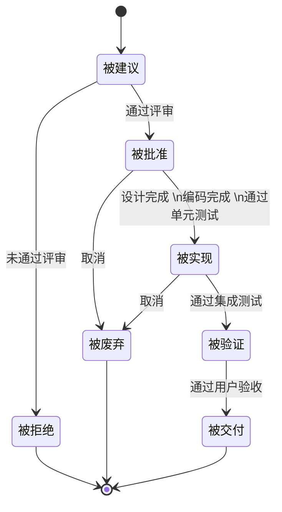
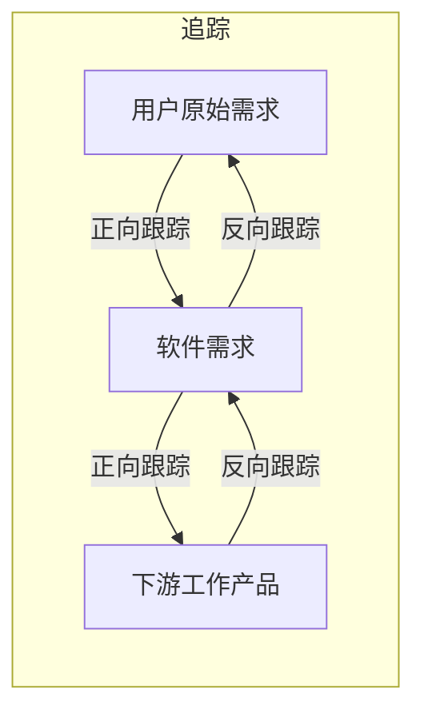
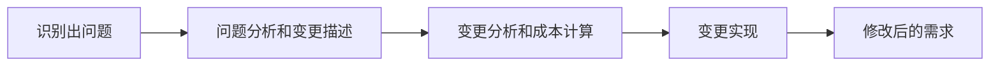
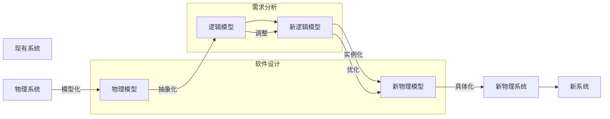
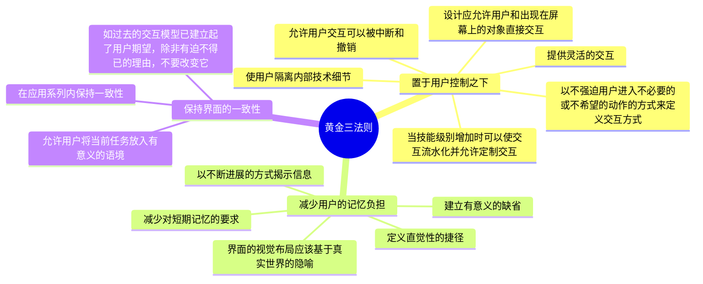

> 来源：2026年上半年系统架构设计师核心宝典（希赛）

# 第三章 软件工程

## 3.1 信息系统开发方法

### 知识点 1：信息系统开发方法

(1) 结构化开发方法

用户至上，自顶向下，逐步分解（求解），严格区分工作阶段，每阶段有任务与成果，强调系统开发过程的整体性和全局性，系统开发过程工程化，文档资料标准化。

优点：

理论基础严密，它的指导思想是用户需求在系统建立之前就能被充分了解和理解。由此可见，结构化方法注重开发过程的整体性和全局性。

缺点：

开发周期长；文档、设计说明繁琐，工作效率低。

要求在开发之初全面认识系统的信息需求，充分预料各种可能发生的变化，但这并不十分现实；若用户参与系统开发的积极性没有充分调动，就会造成系统交接过程不平稳，使系统运行与维护管理难度加大。

阶段固化，不善变化，适用于需求明确的开发场景。

(2) 原型法开发方法

适用于需求不明确的开发，按功能分为水平原型（界面）、垂直原型（复杂算法）；按最终结果分为抛弃式原型、演化式原型。原型法的特点在于原型法对用户的需求是动态响应、逐步纳入的，系统分析、设计与实现都是随着对一个工作模型的不断修改而同时完成的，相互之间并无明显界限，也没有明确分工。系统开发计划就是一个反复修改的过程。适于用户需求开始时定义不清、管理决策方法结构化程度不高的系统开发，开发方法更易被用户接受；但如果用户配合不好，盲目修改，就会拖延开发过程。

抛弃型原型（Throw-It-Away Prototype），此类原型在系统真正实现以后就放弃不用了。

演化型原型（Evolutionary Prototype），此类原型的构造从目标系统的一个或几个基本需求出发，通过修改和追加功能的过程逐渐丰富，演化成最终系统。

(3) 面向对象方法

最早来源于仿真领域，其特点是系统的描述及信息模型的表示与客观实体相对应，符合人们的思维习惯，有利于系统开发过程中用户与开发人员的交流和沟通，缩短开发周期，提供系统开发的准确性和效率。具有更好的复用性，关键在于建立一个全面、合理、统一的模型，分析、设计、实现三个阶段界限不明确。


(4) 面向服务的方法

以粗粒度、松散耦合的系统功能为核心，强调系统功能的标准化和构件化，加强了系统的灵活性、可复用性和可演化性。

从概念上讲，SOA 方法有三个主要的抽象级别：操作、服务、业务流程。

操作：代表单个逻辑工作单元（LUW）的事务。执行操作通常会导致读、写或修改一个或多个持久性数据。SOA 操作可以直接与面向对象（OO）的方法相比。它们都有特定的结构化接口，并且返回结构化的响应。完全同方法一样，特定操作的执行可能涉及调用附加的操作。操作位于最底层。

服务：代表操作的逻辑分组。例如，如果我们将 Customer Profiling 视为服务，则按照电话号码查找客户、按照名称和邮政编码列出顾客和保存新客户的数据就代表相关的操作。

业务流程：为实现特定业务目标而执行的一组长期运行的动作或活动。业务流程通常包括多个业务调用。业务流程的例子有：接纳新员工、出售产品或服务和完成订单。

(5) 其他开发方法

形式化方法（净室软件工程【受控污染级别的环境】；数学模型化；所有东西均可证明/验证，而不是测试）、统一过程方法、敏捷方法、基于架构的开发方法（ABSD）

考点 1：原型开发方法

快速迭代式的原型开发能够有效控制成本，（）是指在开发过程中逐步改进和细化原型直至产生出目标系统。

A.可视化原型开发

B.抛弃式原型开发

C.演化式原型开发

D.增量式原型开发

【参考答案】 C

【希赛点拨】原型开发分两大类：快速原型法（又称抛弃式原型法）和演化式原型法。其中快速原型法是快速开发出一个原型，利用该原型获取用户需求，然后将该原型抛弃。而演化式原型法是将原型逐步进化为最终的目标系统。

考点 2：软件开发方法特点

【2011年下】下列关于各种软件开发方法的叙述中，错误的是（ ）。

A.结构化开发方法的缺点是开发周期较长，难以适应需求变化


B.可以把结构化方法和面向对象方法结合起来进行系统开发，使用面向对象方法进行自顶向下的划分，自底向上地使用结构化方法开发系统

C.与传统方法相比，敏捷开发方法比较适合需求变化较大或者开发前期需求不是很清晰的项目，以它的灵活性来适应需求的变化

D.面向服务的方法以粗粒度、松散耦合和基于标准的服务为基础，增强了系统的灵活性、可复用性和可演化性

【参考答案】 B

【希赛点拨】 B 选项中“自底向上地使用结构化方法开发系统”显然是错误的，因为结构化方法的一个核心特色为：“自顶向下，逐步求精”，而非自底向上。

【模拟题练习】以下关于软件开发方法的说法中，正确的是（ ）。

A.面向服务的方法中服务的抽象层级属于低级，多个服务可以构成业务流程

B.结构化开发方法是一种自顶向下的开发方法，该方法是建立在严格数学基础上的

C.原型化开发方法可分为水平型原型和垂直型原型，其中垂直型原型适合解决复杂算法问题

D.面向对象方法更符合人们的思维习惯，但复用方面弱于结构化开发方法

【参考答案】 C

【希赛点拨】面向服务的方法中服务的抽象层级属于中级，而非低级。结构化开发方法是一种自顶向下的开发方法，但它不是建立在严格数学基础上的。建立在严格数学基础上的，是形式化方法。面向对象方法更符合人们的思维习惯，其复用方面强于结构化开发方法。

## 3.2 软件过程模型

### 知识点 1：软件过程模型


(1) 原型模型

典型的原型开发方法模型。适用于需求不明确的场景，可以帮助用户明确需求。可以分为【抛弃型原型】与【演化型原型】

原型模型两个阶段：

1、原型开发阶段；

2、目标软件开发阶段。

(2) 瀑布模型

瀑布模型是将软件生存周期中的各个活动规定为线性顺序连接的若干阶段的模型，包括需求分析、设计、编码、运行与维护。

瀑布模型的特点是严格区分阶段，每个阶段因果关系紧密相连，只适合需求明确的项目。

缺点：软件需求完整性、正确性难确定；

严格串行化，很长时间才能看到结果；

瀑布模型要求每个阶段一次性完全解决该阶段工作，这不现实。

(3) 增量模型

融合了瀑布模型的基本成分和原型实现的迭代特征，可以有多个可用版本的发布，核心功能往往最先完成，在此基础上，每轮迭代会有新的增量发布，核心功能可以得到充分测试。强调每一个增量均发布一个可操作的产品。

(4) 螺旋模型

以快速原型为基础+瀑布模型，典型特点是引入了风险分析。它是由制定计划、风险分析、实施工程、客户评估这一循环组成的，它最初从概念项目开始第一个螺旋。

(5) V 模型和 W 模型

V 模型强调测试贯穿项目始终，而不是集中在测试阶段。是一种测试的开发模型。


W 模型强调测试和开发【并行进行】。

(6) 快速应用开发 RAD

概念：RAD 是瀑布模型的一个高速变种，适用比传统生命周期快得多的开发方法，它强调极短的开发周期，通常适用基于构件的开发方法获得快速开发。

过程：业务建模→数据建模→过程建模→应用生成→测试与交付

适用性：RAD 对模块化要求比较高，如果某项功能不能被模块化，则其构件就会出问题；如果高性能是一个指标，且必须通过调整结构使其适应系统构件才能获得，则 RAD 也有可能不能奏效；RAD 要求开发者和客户必须在很短的时间完成一系列的需求分析，任何一方配合不当都会导致失败；RAD 只能用于管理信息系统的开发，不适合技术风险很高的情况。

(7) 构件组装模型

【优点】易扩展、易重用、降低成本、安排任务更灵活。

【缺点】构件设计要求经验丰富的架构师、设计不好的构件难重用、强调重用可能牺牲其它指标（如性能）、第三方构件质量难控制。

(8) 统一过程（在软考中 UP、RUP 都指统一过程）

典型特点是用例驱动、以架构为中心、迭代和增量。

统一过程把一个项目分为四个不同的阶段：

构思阶段（初始/初启阶段）：定义最终产品视图和业务模型、确定系统范围。

细化阶段（精化阶段）：设计及确定系统架构、制定工作计划及资源要求。

构造阶段：开发剩余构件和应用程序功能，把这些构件集成为产品，并进行详细测试。

移交阶段：确保软件对最终用户是可用的，进行β测试，制作产品发布版本。


9个核心工作流：业务建模、需求、分析与设计、实现、测试、部署、配置与变更管理、项目管理、环境。

(9) 敏捷开发

敏捷开发是一种以人为核心、迭代、循序渐进的开发方法，适用于小团队和小项目，具有小步快跑的思想。常见的敏捷开发方法有极限编程法、水晶法、并列争球法和自适应软件开发方法。

极限编程（XP）：在一些对费用控制严格的公司中使用，非常有效，近螺旋式的开发方法。四大价值观（沟通【加强面对面沟通】、简单【不过度设计】、反馈【及时反馈】、勇气【接受变更的勇气】），十二大最佳实践（简单设计、测试驱动、代码重构、结对编程、持续集成、现场客户、发行版本小型化、系统隐喻、代码集体所有制、规划策略、规范代码、40小时工作机制）。

水晶方法：提倡“机动性”的方法，拥有对不同类型项目非常有效的敏捷过程。

开放式源码：程序开发人员在地域上分布很广【其他方法强调集中办公】。

SCRUM：明确定义了可重复的方法过程。

特征驱动开发方法（FDD）：认为有效的软件开发需要3要素【人、过程、技术】。定义了6种关键的项目角色：项目经理、首席架构设计师、开发经理、主程序员、程序员和领域专家。

ASD 方法：其核心是三个非线性的、重叠的开发阶段：猜测、合作与学习。

动态系统开发方法（DSDM）：倡导以业务为核心。

敏捷宣言：

个体和交互胜过过程和工具；

可工作的软件胜过大量的文档；

客户合作胜过合同谈判；

响应变化胜过遵循计划。

考点 1：模型的概念及特点

【2010年下】（）把整个软件开发流程分成多个阶段，每一个阶段都由目标设定、风险分析、开发和有效性验证以及评审构成。

A.原型模型

B.瀑布模型

C.螺旋模型

D.V 模型

【参考答案】 C


【2018年下】软件开发过程模型中，（）主要由原型开发阶段和目标软件开发阶段构成。

A.原型模型

B.瀑布模型

C.螺旋模型

D.基于构件的模型

【参考答案】 A

考点 2：模型的适用场景

【2009年下】（）方法以原型开发思想为基础，采用迭代增量式开发，发行版本小型化，比较适合需求变化较大或者开发前期对需求不是很清晰的项目。

A.信息工程

B.结构化

C.面向对象

D.敏捷

【参考答案】 D

【模拟题练习】快速应用开发（Rapid Application Development，RAD）是一种比传统生存周期法快得多的开发方法，它强调极短的开发周期。RAD 模型是（）的一个高速变种，通过使用（）方法获得快速开发。以下哪种情形适合使用快速应用开发方法（）。

A.瀑布模型

B.原型模型

C.螺旋模型

D.增量模型

A.基于构件的软件

B.基于服务的开发

C.统一过程

D.面向对象开发

A.系统模块化程度较高

B.新系统与现有系统有较高的互操作性

C.用户不愿参与到需求分析中

D.技术层面难度不大、但需要采用很多新技术

【参考答案】 AAA

【希赛点拨】

快速应用开发（Rapid Application Development，RAD）是一种比传统生存周期法快得多的开发方法，它强调极短的开发周期。RAD 模型是瀑布模型的一个高速变种，通过使用基于构件的开发方法获得快速开发。如果需求理解得很好，且约束了项目范围，利用这种模型可以很快地开发出功能完善的信息系统。但是 RAD 也具有以下局限性：


① 并非所有应用都适合 RAD。RAD 对模块化要求比较高，如果有一项功能不能被模块化，那么 RAD 所需要的构件就会有问题；如果高性能是一个指标，且该指标必须通过调整接口使其适应系统构件才能获得，则 RAD 也有可能不能奏效。

② 开发者和客户必须在很短的时间完成一系列的需求分析，任何一方配合不当，都会导致 RAD 项目失败。

③ RAD 只能用于管理信息系统的开发，不适合技术风险很高的情况。例如，当一个新系统要采用很多新技术，或当新系统与现有系统有较高的互操作性时，就不适合使用 RAD。

## 3.3 基于构件的软件工程（CBSE）

### 知识点 1：基于构件的软件工程

CBSE 体现了“购买而不是重新构造”的哲学。

CBSE 的构件应该具备的特征：

1、可组装性：所有外部交互必须通过公开定义的接口进行。

2、可部署性：构件总是二进制形式的，能作为一个独立实体在平台上运行。

3、文档化：用户根据文档来判断构件是否满足需求。

4、独立性：可以在无其他特殊构件的情况下进行组装和部署。

5、标准化：符合某种标准化的构件模型。

【构件的组装】：

1、顺序组装：按顺序调用已经存在的构件，可以用两个已经存在的构件来创造一个新的构件。

2、层次组装：被调用构件的“提供”接口必须和调用构件的“请求”接口兼容。

3、叠加组装：多个构件合并形成新构件，新构件整合原构件的功能，对外提供新的接口。

【构件模型要素】

【接口】构件通过构件接口来定义，构件模型规定应如何定义构件接口以及在接口定义中应该包含的要素，如操作名、参数以及异常等。

【使用信息】为使构件远程分布和访问，必须给构件一个特定的、全局唯一的名字或句柄。构件元数据是构件本身相关的数据，比如构件的接口和属性信息。用户可以通过元数据找到构件提供的服务。构件模型的实现通常包括访问构件的元数据的特定方法。构件是通用实体，在部署的时候，必须对构件进行配置来适应应用系统。

【部署】构件模型包括一个规格说明，指出应该如何打包构件使其部署成为一个独立的可执行实体。部署信息中包含有关包中内容的信息和它的二进制构成的信息。


考点 1：构件的组装

【模拟题练习】构件的组装有多种组装方式，其中，（）被调用构件的“提供”接口必须和调用构件的“请求”接口兼容。

A.顺序组装

B.层次组装

C.自适应组装

D.叠加组装

【参考答案】 B

考点 2：构件模型要素

【2024年上】以下关于构件的描述中，（）是不正确的。

A.构件是二进制形式，无需在部署前编译

B.构件元数据是构件本身相关的数据

C.构件是通用实体，不能对构件进行配置来适应应用系统

D.构件是一个独立的软件单元

【参考答案】 C

## 3.4 逆向工程

### 知识点 1：逆向工程

【逆向工程是设计的恢复过程】

实现级：包括程序的抽象语法树、符号表、过程的设计表示。

结构级：包括反映程序分量之间相互依赖关系的信息，例如调用图、结构图、程序和数据结构。

功能级：包括反映程序段功能及程序段之间关系的信息，例如数据和控制流模型。


领域级：包括反映程序分量或程序诸实体与应用领域概念之间对应关系的信息，例如实体关系模型。

【逆向工程恢复信息的方法】：

使用用户指导下的搜索与变换方法可导出实现级、结构级信息。

使用变换式方法可导出实现级、结构级、功能级信息。

使用基于领域知识的方法可导出功能级、领域级信息。

使用铅板恢复法可导出实现级、结构级信息。

与逆向工程相关的概念有重构、设计恢复、再工程和正向工程。

(1) 重构/重组（restructuring）。重构是指在【同一抽象级别】上转换系统描述形式。

(2) 设计恢复（design recovery）。设计恢复是指借助工具从已有程序中抽象出有关数据设计、总体结构设计和过程设计等方面的信息。

(3) 逆向工程（reverse engineering）：逆向工程是分析程序，力图在比源代码更高抽象层次上建立程序的表示过程，逆向工程是设计的恢复过程。

(4) 正向工程（forward engineering）。正向工程是指不仅从现有系统中恢复设计信息，而且使用该信息去改变或重构现有系统，以改善其整体质量。

(5) 再工程/重构工程（Re-engineering）。再工程是对现有系统的重新开发过程，包括逆向工程、新需求的考虑过程和正向工程三个步骤。

考点 1：逆向工程的抽象层次

【2009年下】逆向工程导出的信息可以分为4个抽象层次，其中（）可以抽象出程序的抽象语法树、符号表等信息；（）可以抽象出反映程序段功能及程序段之间关系的信息。

A.实现级

B.结构级

C.功能级

D.领域级

A.实现级

B.结构级

C.功能级

D.领域级

【参考答案】 AC

考点 2：逆向工程恢复信息的方法

【2025年下】在逆向工程中，（）用于导出功能级和领域级信息。

A.用户指导下的搜索与变换方法

B.变换式方法

C.铅板恢复法

D.基于领域知识的方法

【参考答案】 D


考点3:逆向工程相关概念

【2017年下】应用系统构建中可以采用多种不同的技术，（）可以将软件某种形式的描述转换为更高级的抽象表现形式，而利用这些获取的信息，（）能够对现有系统进行修改或重构，从而产生系统的一个新版本。

A.逆向工程(Reverse Engineering)
B.系统改进 (System Improvement)
C.设计恢复 (Design Recovery)
D.再工程 (Re-engineering)
A.逆向工程(Reverse Engineering)
B.系统改进 (System Improvement)
C.设计恢复 (Design Recovery)
D.再工程 (Re-engineering)

【参考答案】AD

## 3.5 净室软件工程

### 知识点1:净室软件工程

净室即无尘室、洁净室。也就是一个受控污染级别的环境。

使用盒结构规约(或形式化方法)进行分析和设计建模，并且强调将正确性验证，而不是测试，作为发现和消除错误的主要机制。

使用统计的测试来获取认证被交付的软件的可靠性所必需的出错率信息。

【技术手段】:

1.统计过程控制下的增量式开发:控制迭代

2.基于函数的规范和设计:盒子结构

定义3种抽象层次:行为视图(黑盒)$\rightarrow$有限状态机视图(状态盒)$\rightarrow$过程视图(明盒)

3.正确性验证:净室工程的核心

4.统计测试和软件认证:使用统计学原理，总体太大时必须采用抽样方法。

【缺点】:

太理论化，正确性验证的步骤比较困难且耗时。

开发小组不进行传统的模块测试，这是不现实的。

脱胎于传统软件工程，不可避免带有传统软件工程的一些弊端。

考点1:净室软件工程的技术手段

以下关于软件开发方法的叙述，错误的是( )。


A.对于较为复杂的应用问题，适合采用形式化方法进行需求分析

B.形式化方法的优势在于能够精确地表述和研究应用问题及其软件实现

C.净室软件工程将正确性验证作为发现和排除错误的主要机制

D.净室软件工程强调统计质量控制技术，包括客户对软件使用预期的测试

【参考答案】A

【希赛点拨】形式化方法是一种具有坚实数学基础的方法，从而允许对系统和开发过程做严格处理和论证，适用于那些系统安全级别要求极高的软件的开发。形式化方法的主要优越性在于它能够数学地表述和研究应用问题及软件实现。但是它要求开发人员具备良好的数学基础。用形式化语言书写的大型应用问题的软件规格说明往往过于细节化，并且难为用户和软件设计人员所理解。由于这些缺陷，形式化方法在目前的软件开发实践中并未得到普遍应用。

净室软件工程 (Cleanroom Software Engineering, CSE) 是软件开发的一种形式化方法，可以开发较高质量的软件。它使用盒结构规约进行分析和建模，并且将正确性验证作为发现和排除错误的主要机制，使用统计测试来获取认证软件可靠性所需要的信息。CSE 强调在规约和设计上的严格性，还强调统计质量控制技术，包括基于客户对软件的预期使用测试。

【模拟题练习】净室软件工程是一种应用数学与统计学理论以经济的方式生产高质量软件工程的技术，力图通过严格的工程化的软件过程达到开发中的零缺陷或接近零缺陷。以下技术手段中，()是净室软件工程的核心。

A.统计控制下的增量式开发
B.基于函数的规范和设计
C.正确性验证
D.统计测试和软件认证

【参考答案】C

## 3.6 需求工程

### 知识点1:需求工程阶段划分

软件需求是指用户对系统在功能、行为、性能、设计约束等方面的期望。


【需求工程主要活动的阶段划分】

- 需求获取
- 需求分析
- 形成需求规格【形成SRS】
- 需求确认与验证【形成需求基线(经过评审的SRS)】
- 需求管理【变更控制、版本控制、需求跟踪、需求状态跟踪】

需求管理是对【需求基线】进行管理

考点1:需求工程的主要活动

【2011年下】下列关于软件需求管理或需求开发的叙述中，正确的是( )。

A.所谓需求管理是指对需求开发的管理

B.需求管理包括:需求获取、需求分析、需求定义和需求验证

C.需求开发是将用户需求转化为应用系统成果的过程

D.在需求管理中，要求维持对用户原始需求和所有产品构件需求的双向跟踪

【参考答案】D

【希赛点拨】需求管理是一种用于查找、记录、组织和跟踪系统需求变更的系统化方法。而非对需求开发的管理。需求开发包括:需求获取、需求分析、需求定义和需求验证，而非需求管理。需求的跟踪属于需求管理的范畴。

### 知识点2:需求开发

需求获取:


- 业务需求(整体全局)
- 用户需求(用户视角)
- 功能需求(计算机化)
- 功能需求
- 性能需求(非功能)
- 设计约束

- 基本需求(明示,常规需求)
- 期望需求(隐含)
- 兴奋需求(多余)

| 方法 | 特点 |
|---|---|
| 用户面谈 | 1 对 1-3, 有代表性的用户, 了解主观想法, 交互好。成本高, 要有领域知识支撑。 |
| 联合需求计划(JRP) | 高度组织的群体会议, 各方参与, 了解想法, 消除分歧, 交互好, 成本高。 |
| 问卷调查 | 用户多, 无法一一访谈, 成本低。 |
| 现场观察 | 针对较为复杂的流程和操作。 |
| 原型化方法 | 通过简易系统方式解决早期需求不确定问题。 |
| 头脑风暴法 | 一群人围绕新业务, 发散思维, 不断产生新的观点。 |

需求分析:

结构化需求分析(SA):

- 行为模型
    - 状态转换图
        - 状态(初态、终态)
        - 事件
- 数据字典
- 功能模型
    - 数据流图
        - 数据流
        - 加工
        - 数据存储
        - 外部实体
- 数据模型
    - E-R图
        - 数据元素
        - 数据结构
        - 数据流
        - 数据存储
        - 加工逻辑
        - 外部实体
    - 实体
    - 联系

面向对象需求分析:


- 用例模型
    - 识别参与者
    - 合并需求获取用例
    - 细化用例描述
    - 调整用例模型
- 分析模型
    - 定义概念类
    - 识别类之间的关系
    - 为类添加职责
    - 建立交互图
    - 包含关系
    - 扩展关系
    - 泛化关系
    - 依赖关系
    - 关联关系
    - 聚合关系
    - 组合关系
    - 泛化关系
    - 实现关系
    - 用例名称
    - 简要说明
    - 事件流
    - 非功能需求
    - 前置条件
    - 后置条件
    - 扩展点
    - 优先级

(1) UML图分类

- UML图
    - 静态图(结构图)
        - 类图:一组类、接口、协作和它们之间的关系
        - 对象图:一组对象及它们之间的关系
        - 构件图:一个封装的类和它的接口
        - 部署图:软硬件之间映射
        - 制品图:系统的物理结构
        - 包图:由模型本身分解而成的组织单元，以及它们之间的依赖关系
        - 组合结构图
    - 动态图(行为图)
        - 用例图:系统与外部参与者的交互
        - 顺序图:强调按时间顺序 (交互图)
        - 通信图(协作图)
        - 定时图:强调实际时间
        - 交互概览图
        - 活动图:类似程序流程图,并行行为
        - 状态图:状态转换变迁

类图 (Class diagram): 类图描述一组类、接口、协作和它们之间的关系。

对象图 (Object diagram): 对象图描述一组对象及它们之间的关系。对象图描述了在类图中所建立的事物实例的静态快照。

构件图 (Component diagram): 构件图描述一个封装的类和它的接口、端口，以及由内嵌的构件和连接件构成的内部结构。构件图用于表示系统的静态设计实现视图。对于由小的部件构建大的系统来说，构件图是很重要的。构件图是类图的变体。

部署图 (Deployment diagram): 部署图描述对运行时的处理节点及在其中生存的构件的配置。部署图给出了架构的静态部署视图，通常一个节点包含一个或多个部署图。软硬件之间映射。

制品图:系统的物理结构

包图:由模型本身分解而成的组织单元，以及它们之间的依赖关系，包的图标像是一个带标签的文件夹，包的基本思想是把共同工作的元素放到一个文件夹中。例:多个类或构件组成了一个个子系统，就可以将它们放到一个包中。


组合结构图

用例图:系统与外部参与者的交互

顺序图 (Sequence diagram): 又称序列图。是一种交互图 (Interaction diagram), 它强调对象之间消息发送的顺序, 同时显示对象之间的交互。强调按时间顺序。顺序图的组合片段:Loop【循环】:如果满足“循环条件”, 则重复执行本框中的内容。Alt【条件分支】:满足条件 1, 则执行条件 1 对应的内容, 满足条件 2 则执行条件 2 对应的内容。Opt【可选分支】: 如果条件满足, 则执行框中内容, 否则跳过不执行。

通信图 (Communication diagram): 又称协作图。也是一种交互图，它强调收发消息的对象或参与者的结构组织。顺序图和通信图表达了类似的基本概念, 但它们所强调的概念不同, 顺序图强调的是时序, 通信图强调的是对象之间的组织结构 (关系)。

定时图:强调实际时间

交互概览图

状态图 (State diagram): 状态图描述一个状态机，它由状态、转移、事件和活动组成。状态图给出了对象的动态视图。它对于接口、类或协作的行为建模尤为重要, 而且它强调事件导致的对象行为, 这非常有助于对反应式系统建模。状态转换变迁。

活动图 (Activity diagram): 活动图将进程或其他计算结构展示为计算内部一步步的控制流和数据流。活动图专注于系统的动态视图。它对系统的功能建模和业务流程建模特别重要, 并强调对象间的控制流程。类似程序流程图, 并行行为。

(2) UML图关系

用例关系包括: 包含关系、扩展关系、泛化关系。

包含关系

扩展关系

泛化关系


包含关系: 其中这个提取出来的公共用例称为抽象用例, 而把原始用例称为基本用例或基础用例, 当可以从两个或两个以上的用例中提取公共行为时, 应该使用包含关系来表示它们。

扩展关系: 如果一个用例明显地混合了两种或两种以上的不同场景, 即根据情况可能发生多种分支, 则可以将这个用例分为一个基本用例和一个或多个扩展用例, 这样使描述可能更加清晰。

泛化关系: 当多个用例共同拥有一种类似的结构和行为的时候, 可以将它们的共性抽象成为父用例, 其他的用例作为泛化关系中的子用例。在用例的泛化关系中, 子用例是父用例的一种特殊形式, 子用例继承了父用例所有的结构、行为和关系。

类图/对象图关系:

(a) 关联关系
(b) 依赖关系
(c) 泛化关系
(d) 聚合关系
(e) 组合关系
(f) 实现关系

泛化(继承)关系: 特殊/一般关系

实现关系: 接口与类之间的关系

关联关系: 描述了一组链, 链是对象之间的连接。

组合关系: 整体与部分生命周期相同。

聚合关系: 整体与部分生命周期不同。

依赖关系: 一个事物发生变化影响另一个事物。

其中根据继承内容, 继承关系可分为:

【取代继承 (Replacement Inheritance)】指子类可以替换父类(如遵循 Liskov 替换原则), 但子类的能力通常与父类相同或兼容, 并不强调添加新内容导致能力扩展。

【受限继承 (Restricted Inheritance)】子类继承父类, 但限制了某些功能 (如缩小方法范围或值域), 导致子类的能力小于父类。

【特化继承 (Specialization Inheritance)】子类完全继承父类的所有特性(属性和方法), 并在此基础上添加新的特性或修改行为, 从而使子类的能力大于或等于父类。

【包含继承 (Inclusion Inheritance)】通常指子类包含父类的所有特性, 但更侧重于类型包含或子类型关系 (如接口继承), 并不强调添加新内容。

需求定义(形成需求规格):


严格定义法
- 所有需求都能够被预先定义
- 开发人员与用户之间能够准确而清晰地交流
- 采用图形/文字可以充分体现最终系统

原型法
- 并非所有的需求都能在开发前被准确的说明
- 项目参加者之间通常都存在交流上的困难
- 需要实际的、可供用户参与的系统模型
- 有合适的系统开发环境
- 反复是完全需要和值得提倡的, 需求一旦确定, 就应遵从严格的方法

需求确认与验证:

需求验证
- 需求评审
- 需求测试
    - 正式评审
    - 非正式评审

- 用户签字确认
- 验收标准之一

考点1:需求获取方法

【2014年下】下列关于联合需求计划 (Joint Requirement Planning, JRP) 的叙述中, 不正确的是( )。

A.在 JRP 实施之前, 应制定详细的议程, 并严格遵照议程进行

B.在讨论期间尽量避免使用专业术语

C. JRP 是一种相对来说成本较高但十分有效的需求获取方法

D. JRP 的主要目的是对需求进行分析和验证

【参考答案】D

【希赛点拨】JRP 的主要意图是收集需求, 而不是对需求进行分析和验证。

考点2:需求分析方法

【2014年下】在结构化分析方法中, 用()表示功能模型, 用()表示行为模型。

A.ER图
B.用例图
C.DFD
D.对象图
A.通信图
B.顺序图
C.活动图
D.状态转换图

【参考答案】CD

【希赛点拨】在结构化分析中, 主要进行三个方面的建模: 功能建模、行为建模和数据建模。功能建模一般采用 DFD, 行为建模一般采用状态转换图, 数据建模一般采用 ER 图。


【2021年下】结构化设计是一种面向数据流的设计方法, 以下不属于结构化设计工具的是()。

A.盒图
B.HIPO图
C.顺序图
D.程序流程图

【参考答案】C

【希赛点拨】顺序图属于面向对象分析与设计工具, 而非结构化设计工具。答案选择 C 选项。

考点3:UML图

【2021年下】UML (Unified Modeling Language) 是面向对象设计的建模工具, 独立于任何具体程序设计语言, 以下()不属于 UML 中的模型。

A.用例图
B.协作图
C.活动图
D.PAD图

【参考答案】D

考点4:UML图关系

【2015年下】用例 (use case) 用来描述系统对事件做出响应时所采取的行动。用例之间是具有相关性的。在一个会员管理系统中, 会员注册时可以采用电话和邮件两种方式。用例“会员注册”和“电话注册”、“邮件注册”之间是()关系。

A.包含 (include)
B.扩展 (extend)
C.泛化 (generalize)
D.依赖 (depends on)

【参考答案】C

【希赛点拨】

泛化关系是从另一个角度来看的继承关系, 也就是说, 当两个用例之间可能存在父子关系时, 可判定为泛化关系。在本题中, “电话注册”与“邮件注册”都属于“会员注册”, 它们是“会员注册”的具体形式, 所以存在父子关系, 可判定为泛化关系。


【模拟题练习】根据继承内容, 继承可分为特化继承、()、受限继承和包含继承。

A.实现继承
B.取代继承
C.接口继承
D.多重继承

【参考答案】B

考点5:需求定义方法

【2011年下】通常有两种常用的需求定义方法: 严格定义方法和原型方法。下述的各种假设条件中, “()”不适合使用严格定义方法进行需求定义。

A.所有需求都能够被预先定义
B.开发人员与用户之间能够准确而清晰地交流
C.需求不能在系统开发前被完全准确地说明
D.采用图形(或文字)充分体现最终系统

【参考答案】C

【希赛点拨】需求定义方法包括严格定义方法和原型方法两种。严格定义方法适用于需求已全面获取, 需求较为明确的情况。如果达不到这个要求, 则适宜用原型方法。

考点6:需求基线

【2020年下】软件需求开发的最终文档经过评审批准后, 就定义了开发工作的( ), 它在客户和开发者之间构筑了产品功能需求和非功能需求的一个( ), 是需求开发和需求管理之间的桥梁。

A.需求基线
B.需求标准
C.需求用例
D.需求分析
A.需求用例
B.需求管理标准
C.需求约定
D.需求变更

【参考答案】AC

【希赛点拨】需求开发的结果应该有项目视图和范围文档、用例文档和 SRS, 以及相关的分析模型。经评审批准, 这些文档就定义了开发工作的需求基线。本题第一空描述的是需求基线, 选择 A 选项。这个基线在客户和开发人员之间就构成了软件需求的一个约定, 它是需求开发和需求管理之间的桥梁。第二空选择 C 选项。

### 知识点3:需求管理


(1) 定义需求基线



需求的状态

(2) 需求跟踪



(3) 变更控制
带有风险的做法：无足够用户参与，忽略了用户分类，用户需求的不断增加，模棱两可的需求，不必要的特性，过于精简的 SRS，不准确的估算。



考点 1: 需求管理
【2009年下】以下关于需求管理的叙述中，正确的是（ ）。
A.需求管理是一个对系统需求及其变更进行了解和控制的过程
B.为了获得项目，开发人员可以先向客户做出某些承诺
C.需求管理的重点在于收集和分析项目需求
D.软件开发过程是独立于需求管理的活动
【参考答案】A


【2018年下】需求管理是一个对系统需求变更、了解和控制的过程。以下活动中，（ ）不属于需求管理的主要活动。
A.文档管理
B.需求跟踪
C.版本控制
D.变更控制
【参考答案】A
【希赛点拨】需求管理的活动包括：
1、变更控制；2、版本控制；3、需求跟踪；4、需求状态跟踪。

考点 2: 需求跟踪
【2011年下】利用需求跟踪能力链（traceability link）可以跟踪一个需求使用的全过程，也就是从初始需求到实现的前后生存期。需求跟踪能力链有4类，如下图所示：

```mermaid
graph LR
    subgraph 追溯和需求
        ①
    end
    subgraph 从需求追溯
        ②
    end
    ① --> ②
    ② --> 下一级工作产品
    下一级工作产品 --> ② : 回溯到需求
    ② --> ① : 从需求回溯
```

其中的①和②分别是（ ）。
A.客户需求、软件需求
B.软件需求、客户需求
C.客户需求、当前工作产品
D.软件需求、当前工作产品
【参考答案】A
【希赛点拨】本题考查需求跟踪相关内容。需求跟踪时，是分层次进行的，首先需要确认从用户方获取的需求，是否与软件需求能一一对应，然后再看软件需求到下一级工作产品之间是否存在一一对应的关系。这样层层传递的方式，可以尽量避免开发不需要的功能，以及遗漏该开发的内容。

考点 3: 变更控制
【2015年下】一个大型软件系统的需求总是有变化的。为了降低项目开发的风险，需要一个好的变更控制过程。如下图所示的需求变更管理过程中，①②③处对应的内容应是（ ）；自动化工具能够帮助变更控制过程更有效地运作，（ ）是这类工具应具有的特性之一。


```mermaid
graph LR
    A[识别出问题] --> ①
    ① --> ②
    ② --> ③
    ③ --> B[修改后的需求]
```

A.问题分析与变更描述，变更分析与成本计算，变更实现
B.变更描述与变更分析，成本计算，变更实现
C.问题分析与变更描述，变更分析，变更实现
D.变更描述，变更分析，变更实现
A.自动维护系统的不同版本
B.支持系统文档的自动更新
C.自动判定变更是否能够实施
D.记录每一个状态变更的日期及变更者
【参考答案】AD

### 3.7 系统建模过程

#### 知识点 1: 系统建模



(1) 结构化建模方法：结构化建模方法是以过程为中心的技术，可用于分析一个现有的系统以及定义新系统的业务需求。结构化建模方法所绘制的模型称为数据流图（DFD）。对于流程较为稳定的系统可考虑结构化建模方法。
(2) 信息工程建模方法（或数据库建模方法）：信息工程建模方法是一种以数据为中心，但过程敏感的技术，它强调在分析和研究过程需求之前，首先研究和分析数据需求。信息工程建模方法所创建的模型被称为实体-联系图（ERD）。主要用于数据建模。


(3) 面向对象建模方法：面向对象建模方法将“数据”和“过程”集成到被称为“对象”的结构中，消除了数据和过程的人为分离现象。面向对象建模方法所创建的模型被称为对象模型。随着面向对象技术的不断发展和应用，形成了面向对象的建模标准，即 UML（统一建模语言）。UML 定义了几种不同类型的模型图，这些模型图以对象的形式共建一个信息系统或应用系统。是目前比较常用的建模方法。

考点 1: 系统建模方法
【模拟题练习】结构化建模方法和信息工程建模方法都是常见的信息系统建模方法，请问这两种建模方法的基本工具分别是（ ）。
A.数据流图和实体联系图
B.数据流图和数据字典
C.流程图和 UML
D.数据流图和流程图
【参考答案】A

### 3.8 系统设计

#### 知识点 1: 界面设计

用户界面设计是指用户与系统之间架起一座桥梁，主要内容包括：定义界面形式、定义基本的交互控制形式、定义图形和符号、定义通用的功能键和组合键的含义及其操作内容、定义帮助策略等。




考点 1: 界面设计
【2014年下】下列关于用户界面设计的叙述中，错误的是（ ）。
A.界面交互模型应经常进行修改
B.界面的视觉布局应该尽量与真实世界保持一致
C.所有可视信息的组织需要按照统一的设计标准
D.确保用户界面操作和使用的一致性
【参考答案】A

#### 知识点 2: 结构化设计

(1) 概要设计【外部设计】：功能需求分配给软件模块，确定每个模块的功能和调用关系，形成模块结构图。
(2) 详细设计【内部设计】：为每个具体任务选择适当的技术手段和处理方法。
(3) 结构化设计原则：
模块独立性原则（高内聚、低耦合）；
保持模块的大小适中；
多扇入，少扇出；
深度和宽度均不宜过高。
(4) 模块四要素：
输入和输出：模块的输入来源和输出去向都是同一个调用者，即一个模块从调用者那儿取得输入，进行加工后再把输出返回调用者。


处理功能：指模块把输入转换成输出所做的工作。
内部数据：指仅供该模块本身引用的数据。
程序代码：指用来实现模块功能的程序。

(5) 模块独立性的度量
1.聚合：衡量模块内部各元素结合的紧密程度

| 内聚类型 | 描述 |
| :--- | :--- |
| 功能内聚 | 完成一个单一功能，各个部分协同工作，缺一不可。 |
| 顺序内聚 | 处理元素相关，而且必须顺序执行。 |
| 通信内聚 | 所有处理元素集中在一个数据结构的区域上。 |
| 过程内聚 | 处理元素相关，而且必须按特定的次序执行。 |
| 时间内聚（瞬时内聚） | 所包含的任务必须在同一时间间隔内执行。 |
| 逻辑内聚 | 完成逻辑上相关的一组任务。 |
| 偶然内聚（巧合内聚） | 完成一组没有关系或松散关系的任务。 |

2.耦合：度量不同模块间互相依赖的程度

| 耦合类型 | 描述 |
| :--- | :--- |
| 非直接耦合 | 两个模块之间没有直接关系，它们之间的联系完全是通过主模块的控制和调用来实现的。 |
| 数据耦合 | 一组模块借助参数表传递简单数据。 |
| 标记耦合 | 一组模块通过参数表传递记录信息（数据结构）。 |
| 控制耦合 | 模块之间传递的信息中包含用于控制模块内部逻辑的信息。 |
| 外部耦合 | 一组模块都访问同一全局简单变量，而且不是通过参数表传递该全局变量的信息。 |
| 公共耦合 | 多个模块都访问同一个公共数据环境。 |
| 内容耦合 | 一个模块直接访问另一个模块的内部数据；一个模块不通过正常入口转到另一个模块的内部；两个模块有一部分程序代码重叠；一个模块有多个入口。 |

考点 1: 概要设计和详细设计
【2011年下】系统设计是软件开发的重要阶段，（ ）主要是按系统需求说明来确定此系统的软件结构，并设计出各个部分的功能和接口。
A.外部设计
B.内部设计


C.程序设计
D.输入/输出设计
【参考答案】A
【希赛点拨】在软件开发中，外部设计又称为概要设计，其主要职能是设计各个部分的功能、接口、相互如何关联。内部设计又称为详细设计，其主要职能是设计具体一个模块的实现。所以本题应选 A。

考点 2: 模块独立性
【2021年下】软件设计过程中，可以用耦合和内聚两个定性标准来衡量模块的独立程度，耦合衡量不同模块彼此间互相依赖的紧密程度，应采用以下设计原则（ ），内聚衡量一个模块内部各个元素彼此结合的紧密程度，以下属于高内聚的是（ ）。
A.尽量使用内容耦合、少用控制耦合和特征耦合、限制公共环境耦合的范围、完全不用数据耦合
B.尽量使用数据耦合、少用控制耦合和特征耦合、限制公共环境耦合的范围、完全不用内容耦合
C.尽量使用控制耦合、少用数据耦合和特征耦合、限制公共环境耦合的范围、完全不用内容耦合
D.尽量使用特征耦合、少用数据耦合和控制耦合、限制公共环境耦合的范围、完全不用内容耦合
A.偶然内聚
B.时间内聚
C.功能内聚
D.逻辑内聚
【参考答案】BC

【模拟题练习】软件设计过程中，可以用耦合和内聚两个定性标准来衡量模块的独立程度，耦合衡量不同模块彼此间互相依赖的紧密程度，以下关于耦合的说法中正确的是（ ）。
A.公共耦合的耦合性最高，所以要控制使用
B.标记耦合是指一组模块借助参数表传递简单数据
C.高耦合低内聚，耦合性越高越好
D.尽量使用数据耦合、少用控制耦合和特征耦合、限制公共环境耦合的范围、完全不用内容耦合
【参考答案】D
【希赛点拨】对题目选项出现的几种耦合的使用优先级进行排序。（耦合性越低越好）
非直接耦合>数据耦合>特征耦合>控制耦合>外部耦合>公共耦合>内容耦合


#### 知识点 3: 面向对象设计

(1) 过程

```mermaid
graph LR
    subgraph 分析模型
        A1[用例模型]
        A2[分析模型(领域模型)]
    end
    subgraph 设计师
        D1[设计用例实现方案]
        D2[设计技术支撑实施]
        D3[设计用户界面]
        D4[细化设计模型]
    end
    subgraph 设计模型
        E1[架构图(用包图表示)]
        E2[用例实现图(用交互图表示)]
        E3[类图(完整、精确)]
        E4[其他(状态图、活动图等)]
    end
    A1 & A2 --> D1 & D2 & D3 & D4
    D1 & D2 & D3 & D4 --> E1 & E2 & E3 & E4
```

(2) 设计原则
单一职责原则：设计目的单一的类。
开放-封闭原则：对扩展开放，对修改封闭。
李氏（Liskov）替换原则：子类可以替换父类。
依赖倒置原则：要依赖于抽象，而不是具体实现；针对接口编程，不要针对实现编程。
接口隔离原则：使用多个专门的接口比使用单一的总接口要好。
组合重用原则：要尽量使用组合，而不是继承关系达到重用目的。
迪米特（Demeter）原则（最少知识法则）：一个对象应当对其他对象有尽可能少的了解。

(3) 类的分类

| 类的分类 | 示例 |
| :--- | :--- |
| 边界类 | 机器接口: API接口, 人机交互: API接口 | 例：显示屏、窗口、打印机接口、通信协议、对话框、菜单、传感器、终端、报表、二维码 |
| 控制类 | 应用逻辑, 业务逻辑, 数据访问逻辑 | 例：身份验证器 |
| 实体类 | 数据 | 例：学员类、课程类 |

考点 1: 面向对象设计过程


【2009年下】面向对象的设计模型包含以（ ）表示的软件体系结构图，以（ ）表示的用例实现图，完整精确的类图，针对复杂对象的状态图和用以描述流程化处理的活动图等。
A.部署图 B.包图 C.协同图 D.交互图
A.部署图 B.包图 C.协同图 D.交互图
【参考答案】BD
【希赛点拨】面向对象的设计模型包含以包图表示的软件体系结构图，以交互图表示的用例实现图，完整精确的类图，针对复杂对象的状态图和用以描述流程化处理的活动图等。

考点 2: 面向对象设计原则
【2011年下】最少知识原则（也称为迪米特法则）是面向对象设计原则之一，指一个软件实体应当尽可能少地与其他实体发生相互作用。这样，当一个实体被修改时，就会尽可能少地影响其他的实体。下列叙述中，“（ ）”不符合最少知识原则。
A.在类的划分上，应当尽量创建松耦合的类
B.在类的设计上，只要有可能，一个类型应当设计成不变类
C.在类的结构设计上，每个类都应当尽可能提高对其属性和方法的访问权限
D.在对其他类的引用上，一个对象对其他对象的引用应当降到最低
【参考答案】C
【希赛点拨】迪米特（Demeter）法则（最少知识原则）：一个对象应当对其他对象有尽可能少的了解。
迪米特法则的应用准则：
1) 在类的划分上，应当创建有弱耦合的类。类之间的耦合越弱，就越有利于复用。
2) 在类的结构设计上，每一个类都应当尽量降低成员的访问权限。一个类不应当 public 自己的属性，而应当通过提供取值和赋值的方法让外界间接访问自己的属性。
3) 在类的设计上，只要有可能，一个类应当设计成不变类。
4) 在对其他对象的引用上，一个类对其他对象的引用应该降到最低。
其中迪米特法则的主要理念是让一个对象尽可能少地了解其他对象，这样，就能尽可能少地产生违规操作，让设计出来的系统更稳定。在本题中，C 选项提到“尽可能提高对其属性和方法的访问权限”违背了迪米特法则。

【2015年下】在面向对象设计的原则中，（ ）原则是指抽象不应该依赖于细节，细节应该依赖于抽象，即应针对接口编程，而不是针对实现编程。


A.开闭
B.里氏替换
C.最少知识
D.依赖倒置
【参考答案】D

考点 3: 类的分类
【2013年下】在面向对象设计中，（ ）可以实现界面控制、外部接口和环境隔离。（ ）作为完成用例业务的责任承担者，协调、控制其他类共同完成用例规定的功能或行为。
A.实体类 B.控制类 C.边界类 D.交互类
A.实体类 B.控制类 C.边界类 D.交互类
【参考答案】CB
【希赛点拨】
1.实体类
实体类映射需求中的每个实体，实体类保存需要存储在永久存储体中的信息，例如，在线教育平台系统可以提取出学员类和课程类，它们都属于实体类。实体类通常都是永久性的，它们所具有的属性和关系是长期需要的，有时甚至在系统的整个生存期都需要。

2.控制类
控制类是用于控制用例工作的类，一般是由动宾结构的短语（“动词+名词”或“名词+动词”）转化来的名词，例如，用例“身份验证”可以对应于一个控制类“身份验证器”，它提供了与身份验证相关的所有操作。控制类用于对一个或几个用例所特有的控制行为进行建模，控制对象（控制类的实例）通常控制其他对象，因此，它们的行为具有协调性。

3.边界类
边界类用于封装在用例内、外流动的信息或数据流。边界类位于系统与外界的交接处，包括所有窗体、报表、打印机和扫描仪等硬件的接口，以及与其他系统的接口。要寻找和定义边界类，可以检查用例模型，每个参与者和用例交互至少要有一个边界类，边界类使参与者能与系统交互。边界类是一种用于对系统外部环境与其内部运作之间的交互进行建模的类。常见的边界类有窗口、通信协议、打印机接口、传感器和终端等。实际上，在系统设计时，产生的报表都可以作为边界类来处理。

【模拟题练习】在面向对象设计中，（ ）保存需要存储在永久存储体中的信息。（ ）位于系统与外界的交接处，用于封装在用例内、外流动的信息或数据流。


A.实体类 B.边界类 C.交互类 D.控制类
A.实体类 B.边界类 C.交互类 D.控制类
【参考答案】AB

### 3.9 软件测试

#### 知识点 1: 软件测试

(1) 动态测试与静态测试

| 动态测试<br>【计算机运行】 | 白盒测试法 |
| :--- | :--- |
| | 灰盒测试法 |
| | 黑盒测试法 |
| 静态测试<br>【人工监测和计算机辅助分析】 | 桌前检查 |
| | 代码审查 |
| | 代码走查 |

静态测试都是做的静态分析，其中静态分析包括：
控制流分析：是否存在没有使用的语句/无法达到的语句/调用并不存在的子程序。
数据流分析：引用未定义的变量、对以前未使用的变量再次赋值。
接口分析：模块之间接口的一致性、子程序和函数之间的接口一致性、函数形参与实参的数量、顺序、类型的一致性。
表达式分析：括号不配对、数组引用越界、除数为零。

(2) 黑盒测试与白盒测试
白盒测试【结构测试】：关注内部结构与逻辑。

| 控制流分析、数据流分析、路径分析、程序变异【错误驱动测试】 |
| :--- |
| **【路径覆盖】（最强）** |
| **【逻辑覆盖】（由强到弱排列）** |
| 修正条件/判定条件覆盖 | 条件组合条件覆盖 | 条件/判定覆盖 | 条件覆盖判定覆盖 | 语句覆盖 |

黑盒测试【功能测试】：关注输入输出及功能。

以下是第 71 页至第 80 页的精确转写内容：


### 3.9 软件测试

#### 知识点 1：软件测试

**(1) 动态测试与静态测试**

[图：软件测试分类结构图]
- 动态测试【计算机运行】
  - 白盒测试法
  - 灰盒测试法
  - 黑盒测试法
- 静态测试【人工监测和计算机辅助分析】
  - 桌前检查
  - 代码审查
  - 代码走查

**静态测试**都是做的静态分析，其中静态分析包括：

- **控制流分析**：是否存在没有使用的语句/无法达到的语句/调用并不存在的子程序。
- **数据流分析**：引用未定义的变量、对以前未使用的变量再次赋值。
- **接口分析**：模块之间接口的一致性、子程序和函数之间的接口一致性、函数形参与实参的数量、顺序、类型的一致性。
- **表达式分析**：括号不配对、数组引用越界、除数为零。

**(2) 黑盒测试与白盒测试**

**白盒测试【结构测试】**：关注内部结构与逻辑。

- 控制流分析、数据流分析、路径分析、程序变异【**错误驱动测试**】
- 【**路径覆盖**】（最强）
- 【**逻辑覆盖**】（由强到弱排列）
  - 修正条件/判定
  - 条件组合
  - 条件/判定覆盖
  - 条件覆盖
  - 判定覆盖
  - 语句覆盖

**黑盒测试【功能测试】**：关注输入输出及功能。


| 方法 | 描述 |
| :--- | :--- |
| 等价类划分 | 不同等价类，揭示不同问题；有效等价类/无效等价类。 |
| 边界值分析 | $1 \le x \le 10$，可取 $x$ 的值为 $0、1、10$ 和 $11$ 作为测试数据。 |
| 错误推测 | 依靠测试人员的经验和直觉。 |
| 判定表 | 最适合描述在多个逻辑条件取值的组合所构成的复杂情况下，分别要执行哪些不同的动作。 |
| 因果图 | 根据输入条件与输出结果之间的因果关系来设计测试用例。 |

**(3) 自动化测试。** 自动化测试就是软件测试的自动化，即在预先设定的条件下自动运行被测程序，并分析运行结果。总的来说，这种测试方法就是将**以人驱动**的测试行为转化为**机器执行**的一种过程。不适合场景：项目周期短，需求变动频繁。常见自动化测试：单元自动化测试、接口自动化测试、UI 自动化测试。

**(4) 软件测试阶段**

- **单元测试**：依据【**详细设计**】，模块测试，模块功能、性能、接口等。
- **集成测试**：依据【**概要设计**】，模块间的接口。
- **系统测试**：依据【**需求文档**】，在真实环境下，验证完整的软件配置项能否和系统正确连接。
- **确认测试**：依据【**需求文档**】，验证软件与需求的一致性。内部确认测试、Alpha 测试、Beta 测试、验收测试。
- **其他测试**：


| 其他测试 | 描述 |
| :--- | :--- |
| **AB 测试** | 多版本同时使用，利于收集各版本的用户反馈，评估出最好版本。故也算是一种【**网页优化方法**】。 |
| **Web 测试** | Web 系统测试与其他系统测试测试内容基本相同，只是测试重点不同。<br>Web 代码测试包括：源代码规则分析、链接测试、框架测试、表格测试、图形测试等方面。 |
| **链接测试** | 链接测试可分为 3 个方面：<br>1. 测试所有链接是否按指示的那样确实链接到了该链接的页面。<br>2. 测试所链接的页面是否存在。<br>3. 保证 Web 应用系统上没有孤立的页面。 |
| **表单测试** | 验证服务器是否能正确保存这些数据，后台运行的程序能否正确解释和使用这些信息。测试提交操作的完整性。 |
| **回归测试** | 测试软件变更之后，变更部分的正确性和对变更需求的符合性。 |

**(5) 集成测试策略**

[图：集成测试策略流程图]
- 一次性组装【风险高】 / 增量式组装【测试全面】
  - 自顶向下【需要桩模块】
  - 自底向上【需要驱动模块】
  - 混合式【桩模块和驱动模块都需要】

[图：测试模块关系图]
- 测试用例 $\rightarrow$ 驱动模块 $\rightarrow$ 测试结果
- 被测模块 $\rightarrow$ 桩模块

**(6) 系统测试**


[图：系统测试分类图]
- **功能测试**
- **性能测试**
  - 负载测试：各种工作负载下系统的性能
  - 压力测试：系统的瓶颈或不能接受的性能点
  - 强度测试：系统资源特别低的情况下运行
  - 容量测试【并发测试】：同时在线的最大用户数
  - 可靠性测试：MTTF 之类的参数
- 健壮性测试
- 用户界面测试
- 安全性测试
- 安装与反安装测试

**系统测试活动与步骤**：制订系统测试计划（进行人员以及任务的确定，明确测试范围、测试方法、测试环境与辅助工具）、设计系统测试用例（如：等价类划分、边界值分析等测试方法的应用）、执行系统测试（执行设计好的测试用例，并记录结果）、缺陷管理与改错（消除已发现的错误）。

**【测试用例组成部分】**：测试用例标识、被测对象、测试环境及条件、测试输入、操作步骤、预期输出、判断输出结果是否符合标准、测试对象的特殊需求。

**(7) 软件测试与软件调试**

**软件调试方法：**

- **蛮力法**：主要思想是“**通过计算机找错**”，低效，耗时。
- **回溯法**：从出错处人工沿控制流程**往回追踪**，直至发现出错的根源。复杂程序由于回溯路径多，难以实施。
- **原因排除法**：主要思想是演绎和归纳，用二分法实现。

**软件测试与软件调试的区别**：调试是测试之后的活动，测试和调试在目标、方法和思路上都有所不同。

| 软件测试 | 软件调试 |
| :--- | :--- |
| 目的是找出存在的错误 | 目的是定位错误并修改程序以修正错误 |
| 从一个已知的条件开始，使用预先定义的过程，有预知的结果 | 从一个未知的条件开始，结束的过程不可预计 |
| 测试过程可以事先设计，进度可以事先确定 | 调试不能描述过程或持续时间 |

**考点 1：动态测试与静态测试**

【2018年下】软件测试一般分为两个大类：动态测试和静态测试。前者通过运行程序发现错误，包括（ ）等方法；后者采用人工和计算机辅助静态分析的手段对程序进行检测，包括（ ）等方法。

A. 边界值分析、逻辑覆盖、基本路径
B. 桌面检查、逻辑覆盖、错误推测
C. 桌面检查、代码审查、代码走查
D. 错误推测、代码审查、基本路径
A. 边界值分析、逻辑覆盖、基本路径
B. 桌面检查、逻辑覆盖、错误推测


C. 桌面检查、代码审查、代码走查
D. 错误推测、代码审查、基本路径

【参考答案】AC

**【希赛点拨】** 本题考查测试的分类，测试可以分为动态测试与静态测试。

动态测试是通过运行程序发现错误，包括黑盒测试（等价类划分、边界值分析法、错误推测法）与白盒测试（各种类型的覆盖测试）。

静态测试是人工测试方式，包括桌前检查（桌面检查）、代码走查、代码审查。

**考点 2：黑盒测试与白盒测试**

【2012年下】以下关于黑盒测试用例设计方法的叙述，错误的是（ ）。

A. 边界值分析通过选择等价类边界作为测试用例，不仅重视输入条件边界，而且也必须考虑输出域边界
B. 因果图方法是从用自然语言书写的程序规格说明的描述中找出因（输入条件）和果（输出或程序状态的改变），可以通过因果图转换为判定表
C. 正交试验设计法，就是使用已经造好了的正交表格来安排试验并进行数据分析的一种方法，目的是用最少的测试用例达到最高的测试覆盖率
D. 等价类划分法根据软件的功能说明，对每一个输入条件确定若干个有效等价类和无效等价类，但只能为有效等价类设计测试用例

【参考答案】D

**【希赛点拨】** 黑盒测试也称为功能测试，主要用于集成测试，确认测试和系统测试阶段。黑盒测试根据软件需求规格说明所规定的功能来设计测试用例，一般包括功能分解、等价类划分、边界值分析、判定表、因果图、状态图、随机测试、错误推测和正交试验法等。

在设计测试用例时，等价类划分是用得最多的一种黑盒测试方法。所谓等价类就是某个输入域的集合，对每一个输入条件确定若干个有效等价类和若干个无效等价类，分别设计覆盖有效等价类和无效等价类的测试用例。无效等价类是用来测试非正常的输入数据的，所以要为每个无效等价类设计一个测试用例。

边界值分析通过选择等价类边界作为测试用例，不仅重视输入条件边界，而且也必须考虑输出域边界。在实际测试工作中，将等价类划分法和边界值分析结合使用，能更有效地发现软件中的错误。

因果图方法是从用自然语言书写的程序规格说明的描述中找出因（输入条件）和果（输出或程序状态的改变），可以通过因果图转换为判定表。

正交试验设计法，就是使用已经造好了的正交表格来安排试验并进行数据分析的一种方法，目的是用最少的测试用例达到最高的测试覆盖率。


【2022年下】在白盒测试中，测试强度最高的是（ ）。

A. 语句覆盖
B. 分支覆盖
C. 判定覆盖
D. 路径覆盖

【参考答案】D

**考点 3：软件测试阶段**

【2015年下】（ ）的目的是检查模块之间，以及模块和已集成的软件之间的接口关系，并验证已集成的软件是否符合设计要求。其测试的技术依据是（ ）。

A. 单元测试
B. 集成测试
C. 系统测试
D. 回归测试
A. 软件详细设计说明书
B. 技术开发合同
C. 软件概要设计文档
D. 软件配置文档

【参考答案】BC

**考点 4：其他测试**

【模拟题练习】以下关于测试的说法，正确的是（ ）。

A. Web 系统测试的测试内容与其它系统测试内容完全不同，其测试内容包括：链接测试、表格测试、图形测试等
B. 链接测试需要保证 Web 应用系统上没有孤立的页面
C. 回归测试一般用于集成测试阶段，它强调组装模块时应增量式组装，因为这样测试更全面
D. AB 测试也叫金丝雀测试，主要看新版本的软件能否正常运行，如果能正常运行就逐步平移部署

【参考答案】B

**考点 5：集成测试策略**

【2016年下】软件集成测试将已通过单元测试的模块集成在一起，主要测试模块之间的协作性。从组装策略而言，可以分为（ ）。集成测试计划通常是在（ ）阶段完成，集成测试一般采用黑盒测试方法。

A. 批量式组装和增量式组装
B. 自顶向下和自底向上组装
C. 一次性组装和增量式组装
D. 整体性组装和混合式组装
A. 软件方案建议
B. 软件概要设计


C. 软件详细设计
D. 软件模块集成

【参考答案】CB

**【希赛点拨】** 集成测试可以分为一次性组装和增量式组装，增量式组装测试效果更好。集成测试计划一般在概要设计阶段完成。

**考点 6：系统测试**

【2009年下】系统测试将软件、硬件、网络等其它因素结合，对整个软件进行测试。（ ）不是系统测试的内容。

A. 路径测试
B. 可靠性测试
C. 安装测试
D. 安全测试

【参考答案】A

**【希赛点拨】** 系统测试是根据系统方案说明书来设计测试用例，常见的系统测试主要有恢复测试、安全性测试、压力测试、性能测试、可靠性测试、可用性测试、可维护性测试和安装测试。

【2019年下】软件性能测试有多种不同类型的测试方法，其中，（ ）用于测试在限定的系统下考查软件系统极限运行的情况，（ ）可用于测试系统同时处理的在线最大用户数量。

A. 强度测试
B. 负载测试
C. 压力测试
D. 容量测试
A. 强度测试
B. 负载测试
C. 压力测试
D. 容量测试

【参考答案】AD

**【希赛点拨】** 根据测试目的不同，性能测试主要包括压力测试、负载测试、并发测试和可靠性测试等。

- **强度测试**：是在系统资源特别低的情况下考查软件系统极限运行情况。本题第一空选择 A 选项。
- **负载测试**：用于测试超负荷环境中程序是否能够承担，确定在各种工作负载下系统的性能，测试当负载逐渐增加时，系统各项性能指标的变化情况。
- **压力测试**：通过确定系统的瓶颈或不能接收的性能点，来获得系统能够提供的最大服务级别的测试。负载测试和压力测试可以结合进行，统称为负载压力测试。
- **容量测试**：并发测试也称为容量测试，主要用于测试系统可同时处理的在线最大用户数量。本题第二空选择 D 选项。


【2025年下】软件测试用例主要由（ ）组成。

A. 测试计划
B. 测试规则
C. 测试分析
D. 输入数据和预期输出结果

【参考答案】D

**考点 7：软件测试与软件调试**

【2025年上】以下关于软件测试与调试说法错误的是（ ）。

A. 测试是调试之后的活动，测试和调试在目标、方法和思路上都有所不同
B. 测试从一个已知的条件开始，使用预先定义的过程，有预知的结果；调试从一个未知的条件开始，结束的过程不可预计
C. 测试过程可以事先设计，进度可以事先确定；而调试不能描述过程或持续时间
D. 测试的目的是找出程序中存在的错误，而调试的目的是定位错误并且修改程序以修正错误

【参考答案】A

### 3.10 系统运行与软件维护

#### 知识点 1：系统转换计划

**(1) 遗留系统演化策略**


[图：遗留系统演化策略矩阵图]
- **高技术水平 vs 业务价值**
- **高水平/低价值**：针对“信息孤岛”，集成
- **高水平/高价值**：改造（包括系统功能的增强和数据模型的改造两个方面）
- **低水平/低价值**：淘汰
- **低水平/高价值**：继承

开发新系统时，需要完全兼容遗留系统的功能模型和数据模型

- **淘汰策略**：遗留系统的技术含量较低，且具有较低的业务价值。对遗留系统的完全淘汰是企业资源的根本浪费，系统分析师应该善于“变废为宝”，通过对遗留系统功能的理解和借鉴，可以帮助新系统的设计，降低新系统开发的风险。
- **继承策略**：遗留系统的技术含量较低，已经满足企业运作的功能或性能要求，且具有较高的商业价值，目前企业的业务尚紧密依赖该系统。对这种遗留系统的演化策略为**继承**。**在开发新系统时，需要完全兼容遗留系统的功能模型和数据模型**。为了保证业务的连续性，新老系统必须并行运行一段时间，再逐渐切换到新系统上运行。
- **改造策略**：遗留系统具有较高的业务价值，基本上能够满足企业业务运作和决策支持的需要。这种系统可能建成的时间还很短，对这种遗留系统的演化策略为**改造**。改造包括系统功能的增强和数据模型的改造两个方面。系统功能的增强是指在原有系统的基础上增加新的应用要求，对遗留系统本身不做改变；数据模型的改造是指将遗留系统的旧的数据模型向新的数据模型的转化。
- **集成策略**：遗留系统的技术含量较高，但其业务价值较低，可能只能完成某个部门（或子公司）的业务管理。这种系统在各自的局部领域里工作良好，但对于整个企业来说，存在多个这样的系统，不同的系统基于不同的平台、不同的数据模型，形成了一个个**信息孤岛**，对这种遗留系统的演化策略为**集成**。

**(2) 新旧系统转换策略**

[图：新旧系统转换策略示意图]
- **直接转换策略**：现有系统直接停止，新系统立即投入。
- **并行转换策略**：现有系统与**新系统**并行运行一段时间。
- **分段转换策略**：现有系统逐步替换为新系统。

- **直接转换**：直接转换是在原有系统停止运行的某一时刻，新系统立即投入运行，中间没有过渡阶段。采用这种方式时，人力和费用最省，适用于系统不太复杂或现有系统完全不能使用的场合。但是这种方式风险高。


- **并行转换**：并行转换就是新系统和旧系统并行工作一段时间，经过这段时间的试运行后，再用新系统正式替换下现有系统。那么这种方式，它的好处就是风险很小。在转换期间还可以同时比较新旧两套系统的性能，而且能够让操作人员得到全面的培训，所以对于一些比较大的信息系统，或者处理过程比较复杂，数据比较重要的系统。并行转换是一种最常用的转换方式。那么这种转换方式也有缺点，缺点就在于两套系统并行期间。要有两组人员，或者两套处理方式同时并存，在人力和费用上消耗比较大，转换的周期比较长，而且难以控制新旧系统当中数据的变化。所以这就要求要做好转换计划，并且要加强管理。
- **分段转换**：这是直接转换和并行转换的结合，也就是分期分批、逐步转换。一般比较大的系统采用这种方式比较合适，它能够保证软件平稳运行，费用也不太高，就是将大的系统分成多个子系统，成熟一个子系统就切换一个子系统，主要是分期分批。这种新旧转换，震动比较小，用户比较容易接受。但是由于采取的是渐进的方式，会导致新旧系统的转换周期比较长。

**考点 1：遗留系统演化策略**

【2022年下】在对遗留系统进行评估时，对于技术含量较高、业务价值较低且仅能完成某个部门的业务管理的遗留系统，一般采用的遗留系统演化策略是（ ）策略。

A. 淘汰
B. 继承
C. 集成
D. 改造

【参考答案】C

【模拟题练习】遗留系统（Legacy System）的演化策略分为淘汰策略、继承策略、改造策略和集成策略。我们在对遗留系统进行评估时，对于技术含量较低，但目前企业的业务尚紧密依赖该系统，一般采用的遗留系统演化策略是（ ）策略。

A. 改造
B. 继承
C. 集成
D. 淘汰

【参考答案】B

**考点 2：旧系统转换策略**


【模拟题练习】某公司正在实施新旧信息系统的转换，若想转换的风险降到最低，采用（ ）方式最合适。

A.并行转换
B.分段转换
C.分块转换
D.直接转换

【参考答案】A

【希赛点拨】直接转换就是在确定系统试运行准确无误时，立刻启用新系统并终止旧系统的运行，该方式简单，但风险大；并行转换是新旧系统并行工作一段时间，并经过一段时间的考验以后，新系统正式替代旧系统，该方式安全，风险小，但实施费用高；分段转换实际上是以上两种转换方式的结合，是一种混合方式，风险适中；分块转换为迷惑选项，不存在此种转换方式。由以上分析知，并行转换的风险最小，故选A。

## 知识点 2：系统维护

(1) 影响软件可维护性的因素

【可理解性】是指通过阅读源代码和相关文档，了解软件的功能和如何运行的难易程度。

【可修改性】是指修改软件的难易程度。

【可测试性】是指验证软件程序正确的难易程度。

可测试性好的软件，通常意味着软件设计简单，复杂性低。因为软件的复杂性越大，测试的难度也就越大。

【可靠性】一个软件的可靠性越高，需要维护的概率就会越低。

【可移植性】是指将软件从一个环境移植到新的环境下正确运行的难易程度。

软件运行环境的变化是软件维护的一种常见情形，可移植性好的软件会降低维护的概率。

(2) 软件维护类型

**正确性维护【修BUG】**：识别和纠正软件错误/缺陷，测试不可能发现所有错误。

**适应性维护【应变】**：为使应用软件适应环境变化【外部环境、数据环境】而进行的修改。

**完善性维护【新需求】**：为扩充功能和改善性能而进行的修改。

**预防性维护【针对未来】**：为了适应未来的软硬件环境的变化，应主动增加预防性的新的功能，以使系统适应各类变化而不被淘汰。经典实例：【专用】改【通用】。


考点 1：影响软件可维护性的因素

【模拟题练习】可维护性通常包括（ ），对（ ）的修改不归结为软件的维护工作。

A.可用性和可理解性  B.可修改性、数据独立性和数据一致性
C.可测试性和稳定性  D.可理解性、可修改性和可测试性
A.文档  B.数据
C.需求分析  D.代码

【参考答案】DC

【希赛点拨】软件的可维护性通常包括可理解性、可修改性和可测试性。

软件维护是软件生命周期的最后一个阶段，而与软件维护有关的绝大多数问题的根源在于计划阶段和开发阶段的工作缺陷，这就经常涉及软件中的代码、数据和文档的维护工作，而需求分析并不是软件的维护工作。

考点 2：软件维护类型

【2011年下】软件（ ）是指改正产生于系统开发阶段而在系统测试阶段尚未发现的错误。

A.完善性维护
B.适应性维护
C.正确性维护
D.预防性维护

【参考答案】C

【希赛点拨】软件维护的类型包括：改正性维护（正确性维护）、适应性维护、完善性维护、预防性维护。

**改正性维护**：在软件交付使用后，必然会将一部分隐藏的错误被带到运行阶段来。这些隐藏下来的错误在某些特定的使用环境下就会暴露出来。为了识别和纠正软件错误、改正软件性能上的缺陷、排除实施中的错误使用，应当进行的诊断和改正错误的过程，就叫做改正性维护。

**适应性维护**：随着计算机的飞速发展，外部环境（新的硬、软件配置）或数据环境（数据库、数据格式、数据输入/输出方式、数据存储介质）可能发生变化，为了使软件适应这种变化，而去修改软件的过程就叫做适应性维护。

**完善性维护**：在软件的使用过程中，用户往往会对软件提出新的功能与性能要求。为了满足这些要求，需要修改或再开发软件，以扩充软件功能、增强软件性能、改进加工效率、提高软件的可维护性。这种情况下进行的维护活动叫做完善性维护。


**预防性维护**：为了提高软件的可维护性、可靠性等而提出的一种维护类型，它为以后进一步改进软件打下良好基础。通常，预防性维护定义为：“把今天的方法学用于昨天的系统以满足明天的需要”。也就是说，采用先进的软件工程方法对需要维护的软件或软件中的某一部分（重新）进行设计、编制和测试。


## 3.11 系统工程建模

### 知识点 1:基于模型的系统工程 (Model Based Systems Engineering, MBSE)

MBSE (Model Based Systems Engineering，基于模型的系统工程)

【MBSE的三大支柱】

【建模语言】沟通标准化，MBSE的核心。典型代表:SysML，OPM。 ——————> 【软件工程】UML

【建模方法】类似于路线图，如：INCONSE面向对象系统工程法。 ———> 面向对象开发

【建模工具】如：Agilian，Modelio。 ———————> Visio、Rose

[图：两个同心圆，外圈标注“系统工程”，内圈标注“软件工程”]

MBSE 是建模方法的形式化应用，以使建模方法支持系统需求、分析、设计、验证和确认等活动，这些活动从概念性设计阶段开始，持续贯穿到设计开发以及后来的所有生命周期阶段。

考点 1：MBSE 的三大支柱

【模拟题练习】MBSE 是建模方法的形式化应用，下面（ ）不属于 MBSE 的三大支柱。

A.建模语言
B.建模工具
C.建模分析
D.建模思路

【参考答案】C

### 知识点 2：SysML 【系统建模语言】

对象管理组织 OMG 在对 UML 2.0 的子集进行重用和扩展的基础上，提出了一种新的系统建模语言 (Systems Modeling Language, SysML)，作为系统工程的标准建模语言。SysML 的目的是统一系统工程中使用的建模语言。


[图：SysML图 树状结构图]
SysML图
├─ 行为图
│  ├─ 活动图
│  ├─ 序列图
│  ├─ 状态机图
│  └─ 用例图
├─ 需求图
└─ 结构图
   ├─ 模块定义图
   ├─ 内部模块图
   │  └─ 参数图
   └─ 包图

SysML 中的需求关系：包含、跟踪、继承需求、改善、满足、验证和复制。

**包含 (Include)**：需求可以且只能包含其他需求。

**跟踪 (Trace)**：对提供方元素（位于箭头端）的修改可能会导致对客户端元素（位于尾端）修改的需要。

**继承 (deriveReqt)**：一个需求可以继承另一个需求的属性。

**改善 (refine)**：表示一个需求改进了另一个需求的满足程度。

**满足 (satisfy)**：一般是模块满足某种需求。

**验证 (verify)**：表示一个需求验证了另一个需求的正确性。

**复制 (Copy)**：表示一个需求复制了另一个需求的特性。

考点 1：SysML 的需求关系

【模拟题练习】SysML (Systems Modeling Language) 是系统工程的标准建模语言，下面需求关系解释错误的是（ ）

A.跟踪 (Trace)：对提供方元素（位于箭头端）的修改可能会导致对客户端元素（位于尾端）修改的需要。
B.验证 (verify)：表示一个需求验证了另一个需求的正确性。
C.改善 (refine)：表示一个需求改进了另一个需求的满足程度。
D.包含 (Include)：一般是模块满足某种需求。

【参考答案】D


