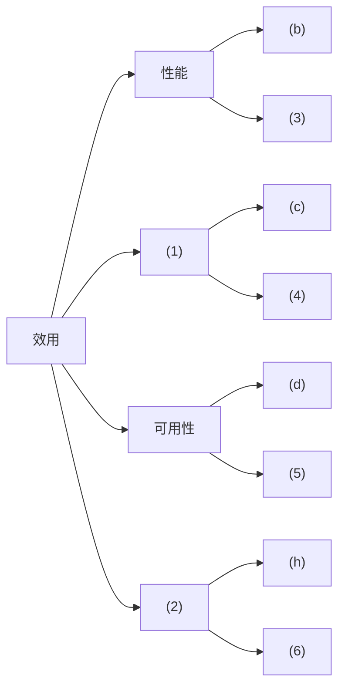
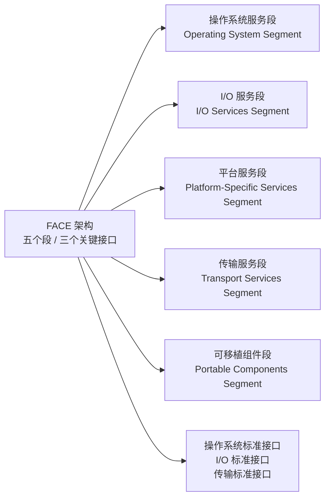
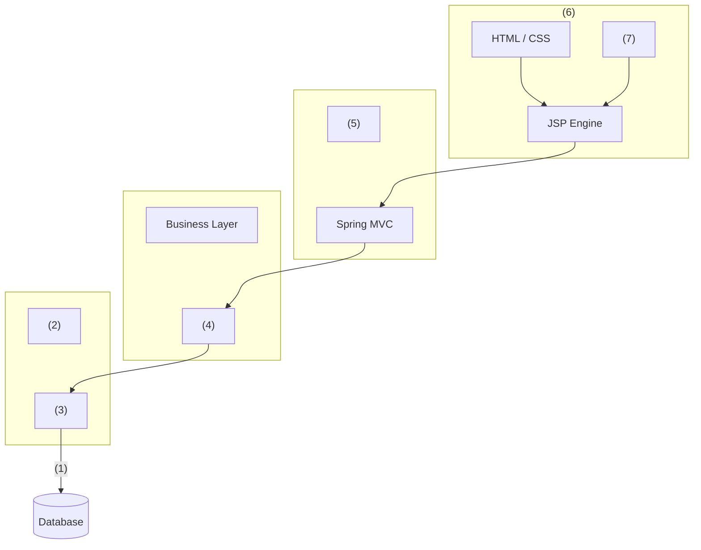

# 2020年下半年系统架构设计师案例分析（清洗版）

> **底稿：** [02.历年真题/2020年下半年-系统架构设计师-案例分析.md](../02.历年真题/2020年下半年-系统架构设计师-案例分析.md)
>
> **答案性质：** 底稿所附答案与解析，非官方标准答案。
>
> **答案可信度：** 低（7 项可作答图表结构已恢复，但主 PDF 缺少试题三，且全卷尚未对照官方原卷）。
>
> **主试题数量：** 5（每题 25 分）。
>
> **作答规则：** 底稿未保留试卷总说明；案例分析科目通常为试题一必答、试题二至五任选二题，具体以当次原卷为准。
>
> **清洗状态：** 已完成结构、页面噪声与显见 OCR/Markdown 清理，并逐页目视核对一份固定提交中的 5 页非官方公开 PDF；尚未对照官方原卷逐字复核。
>
> **图表恢复来源：** [Altria1979/System_Architect 固定提交中的 2020 案例分析 PDF](<https://github.com/Altria1979/System_Architect/blob/472e0e3fc3860aa1dffcac9f1d278a943ea5eb59/%E7%9C%9F%E9%A2%98%20(%E9%87%8D%E7%82%B9)/%E5%8E%86%E5%B9%B4%E7%9C%9F%E9%A2%98%E5%8F%8A%E8%A7%A3%E6%9E%90/2020%E5%B9%B4/2020%E5%B9%B4%E7%B3%BB%E7%BB%9F%E6%9E%B6%E6%9E%84%E5%B8%88%E8%80%83%E8%AF%95%E7%A7%91%E7%9B%AE%E4%BA%8C%EF%BC%9A%E6%A1%88%E4%BE%8B%E5%88%86%E6%9E%90.pdf>)，访问日期：2026-07-12；固定 Git blob 为 `1edafd9c14f42f37899cdccbdc07ca4e74074587`，本地核对文件 SHA-256 为 `735f64d56cd6a1ea344616b68309dab4e1ec84cffa87d86611a6c44430ae9190`。该 GitHub 仓库未声明许可证，来源也不是考试主管机构；本稿只转录表格单元格、表单字段、节点、连线和层次关系，不复制扫描页或原图版式。
>
> **已知限制：** 表1-1、图1-1、图2-1、图3-1、表4-1、表5-1和图5-1均已恢复为可作答的结构化转录，但不是官方原图、原表。主 PDF 将“题目三”标为“暂无”，因此图3-1仅依据本地底稿内容和 The Open Group 官方 FACE 资料制作功能清单示意，不声称复原原题布局；来源边界详见相邻说明。

## 试题一（25分）

阅读以下关于软件架构设计与评估的叙述，在答题纸上回答问题1和问题2。

### 说明

某公司拟开发一套在线软件开发系统，支持用户通过浏览器在线进行软件开发活动。该系统的主要功能包括代码编辑、语法高亮显示、代码编译、系统调试、代码仓库管理等。在需求分析与架构设计阶段，公司提出的需求和质量属性描述如下：

(a)根据用户的付费情况对用户进行分类，并根据类别提供相应的开发功能；

(b)在正常负载情况下，系统应在0.2秒内对用户的界面操作请求进行响应；

(c)系统应该具备完善的安全防护措施，能够对黑客的攻击行为进行检测与防御；

(d)系统主站点断电后，应在3秒内将请求重定向到备用站点；

(e)系统支持中文昵称，但用户名必须以字母开头，长度不少于8个字符；

(f)系统宕机后，需要在15秒内发现错误并启用备用系统；

(g)在正常负载情况下，用户的代码提交请求应该在0.5秒内完成；

(h)系统支持硬件设备灵活扩容，应保证在2人·天内完成所有的部署与测试工作；

(i)系统需要为针对代码仓库的所有操作情况进行详细记录，便于后期查阅与审计；

(j)更改系统的Web界面风格需要在4人·天内完成；

(k)系统本身需要提供远程调试接口，支持开发团队进行远程排错。

在对系统需求、质量属性和架构特性进行分析的基础上，该公司的系统架构师给出了两种候选的架构设计方案，公司目前正在组织相关专家对候选系统架构进行评估。

### 问题

#### 问题1（13分）

针对该系统的功能，李工建议采用管道-过滤器（pipe and filter)的架构风格，而王工则建议采用仓库（repository)架构风格。请指出该系统更适合采用哪种架构风格，并针对系统的主要功能，从数据处理方式、系统的可扩展性和处理性能三个方面对这两种架构风格进行比较与分析，填写表1-1中的(1)~(4)空白处。

> **图表状态：** 原表未入库；下表依据文件头所列非官方 PDF 第 1 页作结构化转录，不是原表，保留原题空号。

| 架构风格名称 | 数据处理方式 | 系统拓展性 | 处理性能 |
|---|---|---|---|
| 管道-过滤器 | 数据驱动机制，处理流程事先确定，交互性差 | (2) | 劣势：需数据格式转换，性能降低；优势：支持开发调用，性能提高 |
| 仓库 | (1) | 数据与处理解耦，可动态添加或删除组件 | 劣势：(3)；优势：(4) |

#### 问题2（12分）

在架构评估过程中，质量属性效用树（utility tree)是对系统质量属性进行识别和优先级排序的重要工具。请将合适的质量属性名称填入图1-1中(1)、(2)空白处，并选择题干描述的(a)~(k)填入(3)~(6)空白处，完成该系统的效用树。

> **图表状态：** 原图未入库；下图依据文件头所列非官方 PDF 第 2 页转录效用树的分支与空号位置，是结构化重绘示意，不是原图，保留原题空号。

### 参考答案与解析

> 以下答案与解析来自底稿，非官方标准答案，内容仍需复核。

#### 问题1

该系统更适合采用仓库架构风格。

(1)数据存储在中心仓库，处理流程独立，支持交互式处理。

(2)数据与处理紧密关联，调整处理流程需要系统重新启动。

(3)数据与处理分离，需要加载数据，性能降低。

(4)数据处理组件之间一般无依赖关系，可并发调用，提高性能。

本题考查软件架构评估方面的知识与应用，主要包括质量属性效用树和架构分析两个部分。

此类题目要求考生认真阅读题目对系统需求的描述，经过分类、概括等方法，从中确定软件功能需求、软件质量属性、架构风险、架构敏感点、架构权衡点等内容，并采用效用树这一工具对架构进行评估。

本问题考查考生对影响系统架构风格选型的理解与掌握。根据系统要求，李工建议采用管进-过滤器（pipe and filter)的架构风格，而王工则建议采用仓库（repository)架构风格。考生需要从系统的主要功能和要求，从数据处理方式、系统的可扩展性和处理性能三个方面对这两种架构风格的优势和劣势进行比较与分析。具体如下表所示。

经过综合比较与分析，可以看出该系统更适合使用仓库风格。

#### 问题2

(1) 安全性

(2) 可修改性

(3) (g)

(4) (i)

(5) (f)

(6) (j)

在架构评估过程中，质量属性效用树（utility tree)是对系统质量属性进行识别和优先级排序的重要工具。质量属性效用树主要关注性能、可用性、安全性和可修改性等四个用户最为关注的质量属性，考生需要对题干的需求进行分析，逐一找出这四个质量属性对应的描述，然后填入空白处即可。

经过对题干进行分析，可以看出：

(a) 根据用户的付费情况对用户进行分类，并根据类别提供相应的开发功能（功能需求)；

(b) 在正常负载情况下，系统应在0.2秒内对用户的界面操作请求进行响应（性能)；

(c) 系统应该具备完善的安全防护措施，能够对黑客的攻击行为进行检测与防御（安全性);

(d) 系统主站点断电后，应在3秒内将请求重定向到备用站点（可用性)；

(e) 系统支持中文昵称，但用户名必须以字母开头，长度不少于8个字符（功能需求);

(f) 系统宕机后，需要在15秒内发现错误并启用备用系统（可用性)；

(g) 在正常负载情况下，用户的代码提交请求应该在0.5秒内完成（性能)；

(h) 系统支持硬件设备灵活扩容，应保证在2人·天内完成所有的部署与测试工作（可修改性)；

(i) 系统需要为针对代码仓库的所有操作情况进行详细记录，便于后期查阅与审计(安全性);

(j) 更改系统的Web界面风格需要在4人·天内完成（可修改性)；

(k) 系统本身需要提供远程调试接口，支持开发团队进行远程排错（可测试性）。

## 试题二（25分）

阅读下列说明，回答问题1至问题3，将解答填入答题纸的对应栏内。

### 说明

某企业委托软件公司开发一套包裹信息管理系统，以便于对该企业通过快递收发的包裹信息进行统一管理。在系统设计阶段，需要对不同快递公司的包裹单信息进行建模，其中，邮政包裹单如图2-1所示。

### 问题

#### 问题1（14分）

请说明关系型数据库开发中，逻辑数据模型设计过程包含哪些任务？该包裹单的逻辑数据模型中应该包含哪些实体？并给出每个实体的主键属性。

> **图表状态：** 原扫描表单未入库；下表依据文件头所列非官方 PDF 第 2 页转录可辨认字段分区，是结构化转录，不是原表单，也不保留条码、机构标识、印章位置或版式。

| 表单区域 | 可辨认字段（结构化转录） |
|---|---|
| 标识 | 国内普通包裹详情单（通知单联）、单号 |
| 收件人 | 用户代码、姓名、电话（手机）、单位名称、详细地址、邮政编码、收件人名章 |
| 寄件人 | 用户代码、姓名、电话（手机）、单位名称、详细地址、邮政编码、签字 |
| 包裹与附加服务 | 内件品名及数量、是否短信回执、是否保价、保价金额、寄件人声明、验视人员名章 |
| 计费 | 重量、资费、挂号费、保价费、回执费、总计 |

> **版本冲突：** 该 PDF 第 2 页解析把收件人、寄件人的主键写为“用户代码”，本地底稿答案写为“电话”。两者均非官方；本文只转录表单字段，不裁决主键。

#### 问题2（6分）

请说明什么是超类实体？结合图中包裹单信息，试设计一种超类实体，给出完整的属性列表。

> **图表引用：** 本问题与问题1共用上方图2-1字段结构化转录。

#### 问题3（5分）

请说明什么是派生属性，并结合图2-1的包裹单信息说明哪个属性是派生属性。

> **图表引用：** 本问题与问题1共用上方图2-1字段结构化转录。
>
> **版本冲突：** 该 PDF 第 3 页解析将“资费、总计”均列为派生属性，本地底稿答案只列“总计”。两者均非官方；本文保留两套答案，不据表单字段自动裁决。

### 参考答案与解析

> 以下答案与解析来自底稿，非官方标准答案，内容仍需复核。

#### 问题1

逻辑数据模型设计过程包含的任务：

(1)构建系统上下文数据模型，包含实体及实体之间的联系；

(2)绘制基于主键的数据模型，为每个实体添加主键属性；

(3)构建全属性数据模型，为每个实体添加非主键属性；

(4)利用规范化技术建立系统规范化数据模型。

包裹单的逻辑数据模型中包含的实体：

(1)收件人（主键：电话)；

(2)寄件人（主键：电话)；

(3)包裹单（主键：编号）。

本题考查数据库设计与建模相关知识及应用。

数据库设计过程包括了逻辑数据建模和物理数据建模，逻辑数据建模阶段主要构造实体联系图表达实体及其属性和实体间的联系，物理数据建模阶段主要根据所选数据库系统设计数据库模式。实体联系图(Entity Relationship Diagram)指以实体、联系、属性三个基本概念概括数据的基本结构，从而描述静态数据结构的概念模式。实体是具有公共性质的可相互区別的现实世界对象的集合，可以是具体的，也可以是抽象的概念或联系。属性是实体所具有模拟特性，一个实体可由若干个属性来刻画。联系是数据对象彼此之间存在的相互关系。

此类题目要求考生认真阅读题目对问题的描述，准确理解数据库设计的主要任务和实体联系图中各个元素的含义，结合图中所给出的包裹单示意图中所描述的数据项，分析其关系确定实体、属性和联系。

在关系型数据库开发中，逻辑数据模型建设的主要任务是构建实体联系图。构建过程中，首先通过上下文数据模型确定实体及其联系，为每个实体确定其标识性属性并添加完整属性，在此基础上利用规范化技术对所建立逻辑数据模型进行优化，一般需要满足第三范式3NF要求。对图2-1所示包裹单中所有数据项进行分析，主要涉及的实体包括收件人、寄件人及其之间的关联实体包裹单，其余数据项设计为上述三个实体的属性即可。

#### 问题2

超类实体是将多个实体中相同的属性组合起来构造出的新实体。

用户（姓名、电话、单位名称、详细地址）

数据库建模中可以对属性相似的实体进行进一步的抽象，通过将多个实体中相同的属性组合起来构造出新的抽象实体，即超类实体，原有多个实体称之为子类实体，通过两者之间的继承关系来表达抽象实体和具体实体的关系。图2-1中收件人和寄件人的属性都包括了姓名、电话、单位名称、详细地址和邮政编码等信息，可以设计出一个超类实体“用户”来实现通用属性的抽象表示。

#### 问题3

派生属性是指某个实体的非主键属性由该实体其他非主键属性决定。

包裹单中的总计是由资费、挂号费、保价费、回执费计算得出，所以是派生属性。

在数据库优化过程中，第三范式要求消除派生属性，即某个实体的非主键属性由该实体其他非主键属性决定，那么该属性可以称之为派生属性。图2-1所示属性中，包裹单的属性 “费用总计”是由资费、挂号费、保价费、回执费等计算得出，所以是派生属性。

## 试题三（25分）

阅读以下关于开放式嵌入式软件架构设计的相关描述，回答问题1至问题3。

### 说明

某公司一直从事宇航系统研制任务，随着宇航产品综合化、网络化技术发展的需要，公司的业务量急剧增加，研制新的软件架构已迫在眉睫。公司架构师王工广泛调研了多种现代架构的基础，建议采用基于FACE (Future Airborne Capability Environment)的宇航系统开放式软件架构，以实现宇航系统的跨平台复用，实现宇航软件高质量、低成本的开发。公司领导肯定了王工的提案，并指出公司要全面实施基于FACE的开放式软件架构，应注意每个具体项目在实施中如何有效实现从需求到架构设计的关系，掌握基于软件需求的软件架构设计方法，并做好开放式软件架构中各段间的接口标准化设计工作。

### 问题

#### 问题1（9分）

王工指出，软件开发中需求分析是根本，架构设计是核心，不考虑软件需求便进行软件架构设计很可能导致架构设计的失败，因此，如何把软件需求映射到软件架构至关重要。请从描述语言、非功能性需求描述、需求和架构的一致性等三个方面，用300字以内的文字说明软件需求到架构的映射存在哪些难点。

#### 问题2（10分）

图3-1是王工给出的FACE架构布局，包括操作系统、I/O服务、平台服务、传输服务和可移植组件等5个段；操作系统、I/O和传输等3个标准接口。请分析图3-1给出的FACE架构的相关信息，用300字以内的文字简要说明FACE 5个段的含义。

> **图表状态：** 原题图未取得；文件头所列主 PDF 在题目三处明确标为“暂无”。下图仅依据本地底稿列出的五段、三个接口以及 The Open Group 官方 FACE 资料制作功能清单示意，不是原题图，也不声称恢复原图的相对位置或内部服务框。

| 段 | 本地底稿所述职责（结构化整理） |
|---|---|
| 操作系统服务段 | 提供操作系统、运行时和操作系统级健康监控等基础服务，并向上提供标准接口 |
| I/O 服务段 | 抽象专用 I/O 设备，屏蔽平台服务软件与硬件设备的关系 |
| 平台服务段 | 提供平台共性服务，如健康监控、配置、日志、流媒体、设备及图像服务 |
| 传输服务段 | 为可移植组件提供平台性数据交换服务，组件通过传输服务交换而不直接调用 |
| 可移植组件段 | 承载用户软件、公共服务和可移植组件 |

> **交叉依据：** [The Open Group FACE FAQ](https://www.opengroup.org/content/future-airborne-capability-environment-face/faqs)确认 FACE 技术标准由五个段和三个关键接口组成；[FACE 工作组章程](https://www.opengroup.org/content/future-airborne-capability-environment-face/group-charters)列出 OSS、IOSS、PSSS、TSS、PCS 等正式段名。访问日期：2026-07-12。官方资料只能验证功能清单，不能证明本地底稿中的原题图布局。

#### 问题3（6分）

FACE架构的核心能力是可支持应用程序的跨平台执行和可移植性，要达到可移植能力，必须解决应用程序的紧耦合和封装的障碍。请用200字以内的文字简要说明在可移植性上，应用程序的紧耦合和封装问题的主要表现分别是什么，并给出解决方案。

### 参考答案与解析

> 以下答案与解析来自底稿，非官方标准答案，内容仍需复核。

#### 问题1

(1)需求和架构描述语言存在差异：软件需求是频繁获取的非正规的自然语言，而软件架构常用的是一种正式语言。

(2)非功能属性难于在架构中描述：系统属性中描述的非功能性需求通常很难在架构模型中形成规约。

(3)需求和架构的一致性难以保障：从软件需求映射到软件架构的过程中，保持一致性和可追溯性很难，且复杂程度很高，因为单一的软件需求可能定位到多个软件架构的关注点。反之，架构元素也可能有多个软件需求。

FACE是近年来宇航领域提出的一种面向服务的、安全可靠、可移植、可扩展的开放式嵌入式系统架构，可实现宇航软件的跨平台复用以及高质量、低成本的开发工作。从图3-1可以看出，FACE将宇航软件分为5个功能服务段，各段之间通过标准的服务接口或传输服务实现功能间的相互调用。架构设计是软件系统开发中的重要环节，其架构的优劣直接影响着软件系统的功能实现，因此，架构能否全面反映需求是架构设计的重中之重。

通常在软件开发过程中，需求会随着开发深入而有所变化，而架构又不能完全地将需求全部反映出来，因此，如何把软件需求映射到软件架构是至关重要一个问题，在架构设计时，架构设计师应密切关注需求到架构的映射存在以下5方面的难点：

(1)需求和架构描述语言存在差异：软件需求是频繁获取的非正规的自然语言，而软件架构常用某种正式语言。

(2)非功能属性难以在架构中描述：系统属性中描述的非功能性需求通常很难在架构模型中形成规约。

(3)需求和架构的一致性难以保障：从软件需求映射到软件架构的过程中，保持一致性和可追溯性很难，且复杂程度很高，因为单一的软件需求可能定位到多个软件架构的关注点。反之，架构元素也可能有多个软件需求。

(4)用迭代和同步演化方法开发软件时，由于需求的不完整而带来的架构设计困难：架构设计必须基于一个准确的需求开展，而有些软件需求只能在建模后甚至是在架构实现时才能被准确理解。

(5)难以确定和细化包含这些需求的架构相关信息：大规模系统必须满足数以千计的需求，会导致很难确定和细化包含这些需求的架构相关信息。

#### 问题2

操作系统服务段：为FACE架构其他段提供操作系统、运行时和操作系统级健康监控等服务。通过开放式OSGi框架为上层功能提供OS标准接口，并可实现上层组件的即插即用能力。

I/O服务段：主要针对专用I/O设备进行抽象，屏蔽平台服务段软件与硬件设备的关系。 由于图形服务软件和GPU处理器紧密相关，因此I/O服务段不对GPU驱动进行抽象。

平台服务段：主要是指用户需要的共性软件，如：系统级健康监控（HM)、配置、日志和流媒体等服务。本段可包括平台公共服务、平台设备服务和平台图像服务等三类。

传输服务段：主要为上层可移植组件段提供平台性的数据交换服务。可移植组件将通过传输服务段提供的服务实现交换，禁止组件间直接调用。

可移植组件段:提供了多组件使用能力和功能服务。主要包括公共服务和可移植组件两类。

从图3-1可知，FACE架构由5个基本段组成，每段内又分为多个功能服务，从这些服务可以看出每段的基本能力。例如，操作系统段是FACE架构的基本功能，除基本操作系统外，还涵盖了运行库，操作系统的健康监控（HM)，图中所给出的OSGi框架，实现功能组件“即插即用”能力。如果考生掌握了面向服务的架构风格，就不难给出各个段的具体含义。

(1)操作系统服务段：为FACE架构其他段提供操作系统、运行时和操作系统级健康监控等服务。通过开放式OSGi框架为上层功能提供OS标准接口，并可实现上层组件的即插即用能力。本段是FACE架构的基本服务段。

(2)I/O服务段：主要针对专用I/O设备进行抽象，屏蔽平台服务段软件与硬件设备的关系，形成一种虚拟设备，这里隐含着对系统中的所有硬件I/O的虚拟化。由于图形服务软件和GPU处理器紧密相关，因此I/O服务段不对GPU驱动进行抽象。

(3)平台服务段：主要是指平台/用户需要的共性服务软件，主要涵盖跨平台的系统管理、共享设备服务，以及健康管理等。如：系统级健康监控（HM)、配置、日志和流媒体等服务。本段主要包括平台公共服务、平台设备服务和平台图像服务等三类。

(4)传输服务段:通过使用传统跨平台中间件软件(如CORBA、DDA等)，为平台上层可移植组件段提供平台性的数据交换服务，可移植组件将通过传输服务段提供的服务实现交换，禁止组件间直接调用。本段应具备QoS质量特征服务、配置能力服务以及分布式传输服务等。

(5)可移植组件段：为用户软件段，提供了多组件使用能力和功能服务。主要包括公共服务和可移植组件两类。

#### 问题3

紧耦合问题主要表现在：I/O问题、业务逻辑问题和表现问题。

解决方案：可采用分离原则，通过隔离实现硬件特定信息和少数模块的代码，减少耦合性。

封装问题主要表现在：ICD硬编码问题、组件的紧耦合问题、直接调用问题。

解决方案：可以通过提供数据源或槽的软件服务的方法，将紧耦合组件分解出应用程序，并将平台相关部分加入计算环境中，在计算平台内提供数据源或槽的软件服务，并实现接口标准化。

紧耦合和封装是软件模块化设计中最难以解决的两个问题，要使软件具备良好的可移植性、可复用性，就必须清楚其问题的表现形式。

紧耦合是应用程序移植的一个障碍，进一步说，就是计算平台的硬件设备和软件模块及其沟通之间的耦合代表了一个应用程序的可移植性方面的障碍。原因是便携性使得每个平台设备都有一个接口控制文件（ICD),描述了由硬件所支持的消息和协议，应用程序对消息和协议的支持将紧密耦合于硬件。若要移植，需要太多的工作来修改应用程序以支持不同的结构元素。

为了尽量减少支持新的硬件设备所需要的工作，可采用分离原则，通过隔离实现硬件特定信息和少数模块的代码，来减少耦合性。

通常紧耦合问题主要表现在I/O问题、业务逻辑问题和表现问题。

传统的应用程序不可移植的另一个原因是这些应用程序被紧密耦合到组固定的接口，而这些数据的每个数据源或槽（sinks)都暴露出了设备的特殊接口，这些特殊接口在每个平台中都是不同的。这样，支持平台设备的接口控制文件（ICD)是被硬编码到应用程序中，就导致应用程序不能成功在不同计算平台上执行。

为了解决这种接口控制文件（ICD)被硬编码而难以封装的问题，可以通过提供数据源或槽的软件服务的方法，从紧耦合组件分解出应用程序，并将平台相关部分加入计算环境中，在计算平台内提供数据源或槽的软件服务，并实现接口标准化。

通常封装问题主要表现在：ICD硬编码问题、组件的紧耦合问题、直接调用问题。

## 试题四（25分）

阅读以下关于数据库缓存的叙述，在答题纸上回答问题1至问题3。

### 说明

某互联网文化发展公司因业务发展，需要建立网上社区平台，为用户提供一个对网络文化产品（如互联网小说、电影、漫画等）进行评论、交流的平台。该平台的部分功能如下：

(a)用户帖子的评论计数器；

(b)支持粉丝列表功能；

(c)支持标签管理；

(d)支持共同好友功能等；

(e)提供排名功能，如当天最热前10名帖子排名、热搜榜前5排名等；

(f)用户信息的结构化存储；

(g)提供好友信息的发布/订阅功能。

该系统在性能上需要考虑高性能、高并发，以支持大量用户的同时访问。开发团队经过综合考虑，在数据管理上决定采用Redis+数据库（缓存+数据库）的解决方案。

### 问题

#### 问题1（10分）

Redis支持丰富的数据类型，并能够提供一些常见功能需求的解决方案。请选择题干描述的（a）~（g）功能选项，填入表4-1中（1）~（5）的空白处。

> **图表状态：** 原表未入库；下表依据文件头所列非官方 PDF 第 3 页作结构化转录，不是原表，保留原题空号。

| 数据类型 | 存储的值 | 可实现的业务功能 |
|---|---|---|
| String | 字符串等 | (1) |
| List | 列表 | (2) |
| Set | 无序集合 | (3) |
| Hash | 包括键值对的无序列表 | (4) |
| Zset | 有序集合 | (5) |

#### 问题2（7分）

该网上社区平台需要为用户提供7X24小时的不间断服务。同时在系统出现宕机等故障时，能在最短时间内通过重启等方式重新建立服务。为此，开发团队选择了Redis持久化支持。Redis有两种持久化方式，分别是RDB(Redis DataBase)持久化方式和AOF(Append Only File)持久化方式。开发团队最终选择了RDB方式。

请用200字以内的文字，从磁盘更新频率、数据安全、数据一致性、重启性能和数据文件大小五个方面比较两种方式，并简要说明开发团队选择RDB的原因。

#### 问题3（8分）

缓存中存储当前的热点数据，Redis为每个KEY值都设置了过期时间，以提高缓存命中率。为了清除非热点数据，Redis选择“定期删除+惰性删除”策略。如果该策略失效，Redis内存使用率会越来越高，一般应采用内存淘汰机制来解决。

请用100字以内的文字简要描述该策略的失效场景，并给出三种内存淘汰机制。

### 参考答案与解析

> 以下答案与解析来自底稿，非官方标准答案，内容仍需复核。

#### 问题1

(1)(a)

(2)(b)、(g)

(3)(c)、(d)

(4)(f)

(5)(e)

本题考查数据库缓存的基本概念和具体应用。

本问题考查Redis数据库缓存产品基本数据类型的常见应用。

(1)STRING类型：常规的key/value缓存应用，常规计数如粉丝数等；

(2)LIST类型：各类列表应用，如关注列表、好友列表、订阅列表等；

(3)SET类型：与LIST类似，但提供去重操作，也提供集合操作，可实现共同关注、共同喜好、共同好友等功能；

(4)HASH类型：存储部分变更数据，如用户数据等；

(5)ZSET类型：类似SET但提供自动排序，也可实现带权重的队列，勿各类排行榜等。

#### 问题2

磁盘更新频率：AOF比RDB文件更新频率高。

数据安全：AOF比RDB更安全。

数据一致性：RDB间隔一段时间存储，可能发生数据丢失和不一致；AOF通过append模式写文件，即使发生服务器岩机，也可通过redis-check-aof工具解决数据一致性问题。

重启性能:RDB性能比AOF好。

数据文件大小：AOF文件比RDB文件大。

综合上述五个方面的比较，考虑在系统出现宕机等故障时，需要在最短时间内通过重启等方式重新建立服务，因此开发团队最终选择了RDB方式。

本问题考查Redis持久化存储的基本概念及应用。

Redis提供了两种持久化存储的机制，分别是RDB(Redis DataBase)持久化方式和AOF(Append Only File)持久化方式。RDB持久化方式是指在指定的时间间隔内将内存中的数据集快照写入磁盘，是Redis默认的持久化方式。AOF方式是指redis会将每一个收到的写命令都通过write函数追加到日志文件中。

两种方式各有优缺点，大致的比较如下 ：

(1)磁盘更新频率：AOF比RDB文件更新频率高。

(2)数据安全：AOF比RDB更安全。

(3)数据一致性:RDB间隔一段时间存储，可能发生数据丢失和不一致;AOF通过append模式写文件，即使发生服务器宕机，也可通过redis-check-aof工具解决数据一致性问题。

(4)重启性能：RDB性能比AOF好。

(5)数据文件大小:AOF文件比RDB文件大。

该项目的实际需求是：在系统出现宕机等故障时，需要在最短时间内通过重启等方式重新建立服务，因此重启性能是最需要考虑的因素，故该开发团队选样RDB方式。

#### 问题3

失效场景：如果“定期删除”没删除KEY,也没即时去请求KEY,也就是说“惰性删除”也没生效。这样，Redis默认的“定期删除+惰性删除”策略就失效了。

对此，可采用内存淘汰机制解决：

(1)从已设置过期时间的数据集最近最少使用的数据淘汰。

(2)从已设置过期时间的数据集将要过期的数据淘汰。

(3)从已设置过期时间的数据集任意选择数据淘汰。

(4)从数据集最近最少使用的数据淘汰。

(5)从数据集任意选择数据淘汰。

本问题考查Redis使用过程中数据清除相关的概念。

缓存中一般用来存储当前的热点数据，Redis为每个KEY值都设置了过期时间，以提高缓存命中率。为了清除非热点数据，Redis选择“定期删除+惰性删除”策略。

“定期删除+惰性删除”策略也会存在失效的可能。比如，如果“定期删除”没删除KEY, 也没即时去请求KEY,也就是说“惰性删除”也没生效。这样，Redis默认的“定期删除+惰性删除”策略就失效了。

如果该策略失效，Redis内存使用率会越来越高，一般应采用内存淘汰机制来解决。常见的内存淘汰机制有：

(1)从已设置过期时间的数据集最近最少使用的数据淘汰。

(2)从已设置过期时间的数据集将要过期的数据淘。

(3)从已设置过期时间的数据集任意选择数据淘汰。

(4)从数据集最近最少使用的数据淘汰。

(5)从数据集任意选择数据淘汰。

## 试题五（25分）

阅读以下关于Web系统架构设计的叙述,在答题纸上回答问题1至问题3。

### 说明

某公司拟开发一款基于Web的工业设备监测系统，以实现对多种工业设备数据的分类采集、运行状态监测以及相关信息的管理。该系统应具备以下功能：

现场设备状态采集功能：根据数据类型对设备监测指标状态信号进行分类采集；

设备采集数据传输功能：利用可靠的传输技术，实现将设备数据从制造现场传输到系统后台;

设备监测显示功能：对设备的运行状态、工作状态以及报警状态进行监则并提供相应的图形化显示界面；

设备信息管理功能：支持设备运行历史状态、报警记录、参数信息的查询。

同时，该系统还需满足以下非功能性需求：

(a) 系统应支持大于100个工业设备的并行监测；

(b) 设备数据从制造现场传输到系统后台的传输时间小于1s;

(c) 系统应7X24小时工作;

(d) 可抵御常见XSS攻击：

(e) 系统在故障情况下，应在0.5小时内恢复；

(f) 支持数据审计。

面对系统需求，公司召开项目组讨论会议，制定系统设计方案，最终决定采用三层拓扑结构，即现场设备数据采集层、Web监测服务层和前端Web显示层。

### 问题

#### 问题1（6分）

请按照性能、安全性和可用性等三类非功能性需求分类，选择题干描述的（a）~（f） 填入（1）~（3）。

> **图表状态：** 原表未入库且底稿未标出此缺口；下表依据文件头所列非官方 PDF 第 4 页作结构化转录，不是原表，保留原题空号。

| 非功能性需求类别 | 非功能性需求 |
|---|---|
| 性能 | (1) |
| 安全性 | (2) |
| 可用性 | (3) |

#### 问题2（14分）

该系统的Web监测服务层拟采用SSM (spring+spring MVC+Mybatis)框架进行系统研发。SSM框架的工作流程图如图5-1所示，请从下面给出的（a）~（k）中进行选择，补充完善图5-1中（1）~（7）处空白的内容。

(a) Connection Pool

(b) Struts2

(c) Persistent Layer

(d) Mybatis

(e) HTTP

(f) MVC

(g) Kafka

(h) View Layer

(i) JSP

(j) Controller Layer

(k) Spring

> **图表状态：** 原图未入库；下图依据文件头所列非官方 PDF 第 5 页转录各层、框架组件与数据访问方向，是结构化重绘示意，不是原图，保留原题空号。

> **版本差异：** 固定 PDF 与本地底稿的选项字母顺序不同，但按选项内容换算后，七个空的映射一致。本文沿用本题题干中的本地选项顺序，不能把该 PDF 解析中的答案字母直接抄入。

#### 问题3（5分）

该工业设备检测系统拟采用工业控制领域中统一的数据访问机制，实现与多种不同设备的数据交互，请用200字以内的文字说明采用标准的数据访问机制的原因。

### 参考答案与解析

> 以下答案与解析来自底稿，非官方标准答案，内容仍需复核。

#### 问题1

(1) (a) (b)

(2) (d) (f)

(3) (c) (e)

本题考查Web系统架构设计相关知识及如何在实际问题中综合应用。

此类题目要求考生认真阅读题目对现实系统需求的描述，结合Web系统设计相关知识、实现技术等完成Web系统分析设计。

软件质量属性有可用性、可修改性、性能、安全性、可测试性、易用性等。可用性关注的是系统产生故障的可能性和从故障中恢复的能力；性能关注的是系统对事件的响应时间：安全性关注的是系统保护合法用户正常使用系统、阻止非法用户攻击系统的能力；可测试性关注的是系统发现错误的能力；易用性关注的是对用户来说完成某个期望任务的容易程度和系统所提供的用户支持的种类。

#### 问题2

(1)(a)

(2)(c)

(3)(d)

(4)(k)

(5)(j)

(6)(h)

(7)(i)

SSM框架是spring MVC, spring和Mybatis框架的整合，是标准的MVC模式。其使用spring MVC负责请求的转发和视图管理；spring实现业务对象管理；Mybatis作为数据对象的持久化引擎。

因此，基于SSM的工业设备监测系统设计架构如下图所示。

#### 问题3

该工业设备检测系统需与不同设备进行数据交互，采用标准的数据访问机制可以在硬件供应商和软件开发商之间建立一套完整的规则。只要遵循这套规则，数据交互对两者来说都是透明的，硬件供应商只需考虑应用程序的多种需求和传输协议，软件开发商也不必了解硬件的实质和操作过程，实现对设备数据采集的统一管理。

标准的数据访问机制可以在硬件供应商和软件开发商之间建立一套完整的规则。只要遵循这套规则，数据交互对两者来说都是透明的，硬件供应商只需考虑应用程序的多种需求和传输协议，软件开发商也不必了解硬件的实质和操作过程，实现对设备数据采集的统一管理。

例如，OPC (OLE for Process Control)即用于过程控制的OLE,是一个工业标准。OPC是为了不同供应厂商的设备和应用程序之间的软件接口标准化，使其间的数据交换更加简单化的目的而提出的。作为结果，可以向用户提供不依赖于特定开发语言和开发环境且可以自由组合使用的过程控制软件组件产品。利用OPC的系统，是由按照应用程序（客户程序）的要求提供数据采集服务的OPC服务器，使用OPC服务器所必需的OPC接口，以及接受服务的OPC应用程序所构成。OPC服务器是按照各个供应厂商的硬件所开发的，使之可以吸收各个供应厂商硬件和系统的差异，从而实现不依存于硬件的系统构成。同时利用一种叫作Variant的数据类型，可以不依存于硬件中固有数据类型。
