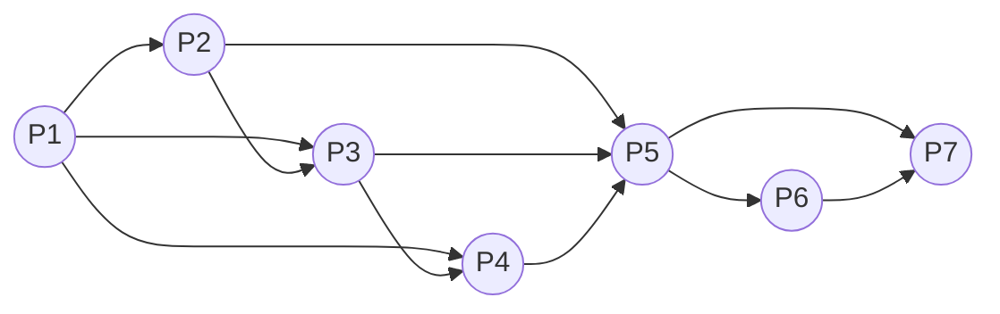

# 2020年下半年-系统架构设计师-综合知识

> **来源层级：** 主体来自本地原始整理版（`02.历年真题/2020年下半年-系统架构设计师-综合知识.md`），按待复核的非官方第三方整理资料处理。
>
> **固定 PDF 对照来源（非官方）：** [Altria1979/System_Architect 固定提交中的 2020 综合知识 PDF](<https://github.com/Altria1979/System_Architect/blob/472e0e3fc3860aa1dffcac9f1d278a943ea5eb59/%E7%9C%9F%E9%A2%98%20%28%E9%87%8D%E7%82%B9%29/%E5%8E%86%E5%B9%B4%E7%9C%9F%E9%A2%98%E5%8F%8A%E8%A7%A3%E6%9E%90/2020%E5%B9%B4/2020%E5%B9%B4%E7%B3%BB%E7%BB%9F%E6%9E%B6%E6%9E%84%E5%B8%88%E8%80%83%E8%AF%95%E7%A7%91%E7%9B%AE%E4%B8%80%EF%BC%9A%E7%BB%BC%E5%90%88%E7%9F%A5%E8%AF%86.pdf>)共 20 页，固定 Git blob 为 `591cc8aac2e3177f3440f240ee34dfbd85b3eae6`，访问日期：2026-07-12；本地核对文件 SHA-256 为 `55648a12e7a63c444781e6ed97f2b139e66ae1ee56c800b7e24a9818d4b661a7`。该 PDF 不是考试主管机构发布的官方原卷，而且其题序与本稿并非同一完整版本；就本次核查的三处缺失结构而言，仅第 10 题可与 PDF 第 15 页印刷题号 29 精确对应，第 1、6 题均未在其中出现同版题面。
>
> **补充结构来源（非官方）：** [Qicoder“2020 架构上午题”公开整理页](<https://ebook.qicoder.com/%E7%B3%BB%E7%BB%9F%E6%9E%B6%E6%9E%84%E8%AE%BE%E8%AE%A1%E5%B8%88/notes/2020%E6%9E%B6%E6%9E%84%E4%B8%8A%E5%8D%88%E9%A2%98.html>)，访问日期：2026-07-12。第 1 题前趋图及第 6 题四个公式选项逐项取自该页所嵌图片；本文只转录节点、边和公式，不嵌入图片或复制原页面版式。该网页同样不是官方来源，且未提供可固定到提交的版本标识。
>
> **答案性质：** 文中的“正确答案”和解析均为非官方整理，未获考试主管机构确认。
>
> **来源题号映射：** Qicoder 第 6 题是一道双空题，对应本稿第 6～7 题；Qicoder 第 9 题和固定 PDF 印刷题号 29 对应本稿第 10 题。
>
> **清洗状态：** 已完成结构清洗、题号与答案数量核验；第 1 题前趋图、第 6 题公式选项和第 10 题页表/地址翻译过程均已恢复为可作答的结构化转录。所有重绘或转录均不是原卷图。
>
> 题目数量：75（题号 1—75 连续；每题保留 A—D 四个选项和一个现有答案）。
>
> **已知限制：** 未与官方纸质试卷逐题核验。固定 PDF 的 20 页题序、题量和部分题面与本稿不同，不能用于回填第 1、6 题；第 6 题公开页的 D 项图片与其解析正文还存在 `AD`/`BC` 的来源内冲突，已在题下注明且未自动裁决。第 10 题两来源的答案位数写法不同，亦并列保留。全文题目、答案和解析仍应按“待复核”处理。

---

## 第1题

前趋图（Precedence Graph）是一个有向无环图，记为：→={(Pi，Pj)|Pi must complete before Pj may start} 。假设系统中进程P={P1，P2，P3，P4，P5，P6，P7}，且进程的前趋图如下：

那么， 该前驱图可记为 （ ）。

> **结构化重绘示意（不是原图；来源非官方）：** 以下 11 条有向边逐条转录自文件头所列 Qicoder 公开题页的第 1 题图片；节点位置、圆形样式和线条走向未复制。固定 PDF 的 20 页中未出现同版题面，故未用其中其他前趋图替换本题。

- **A.** →={(P1，P2)， (P3, P1)，(P4 P1)，(P5 P2)，(P5, P3)，(P6，P4)， (P7, P6)，(P7，P6)，(P5，P,6)，(P4，P5)， (P6，P7)}
- **B.** →={(P1，P2)， (P1，P3)， (P1，P4)，（P2，P5)， (P2, P3)， (P3，P4)， (P3, P5)，(P4, P5)，(P5，P6)， (P5, P7) ，(P6，P7)}
- **C.** →={(P1，P2)，(P1，P3)，(P1，P4)，(P2, P5)，(P2, P3)，(P3, P4)，(P5，P3)，(P4，P5)，(P5，P6)， (P7，P5) ，(P6, P7)}
- **D.** →={(P1， P2)，(P1，P3)，(P2，P3)，(P2，P5)， (P3，P6)，(P3，P4）(P4，P7)， (P5，P6)，(P6, P7)，(P6，P5)，(P7， P5)}

**正确答案：B**

**解析：**

本题考查操作系统的基本概念。

前趋图是一个有向无环图，记为DAG (Directed Acyclic Graph)，用于描述进程之间执行的前后关系。图中的每个结点可用于描述一个程序段或进程，乃至一条语句；结点间的有向边则用于表示两个结点之间存在的偏序（Partial Order,亦称偏序关系）或前趋关系 (Precedence Relation) “ →”。

对于试题所示的前趋图，存在前趋关系：(P1，P2)，(P1，P3)， (P1，P4)，（P2，P5)， (P2, P3)， (P3，P4)， (P3, P5)，(P4, P5)，(P5，P6)， (P5, P7) ，(P6，P7)

可记为：P={P1，P2，P3，P4，P5，P6，P7}

→={(P1，P2)，(P1，P3)， (P1，P4)，（P2，P5)， (P2, P3)， (P3，P4)， (P3, P5)，(P4, P5)，(P5，P6)， (P5, P7) ，(P6，P7)}

注意：在前趋图中，没有前趋的结点称为初始结点（Initial Node),没有后继的结点称为终止结点（Final Node)。

---

## 第2题

在支持多线程的操作系统中，假设进程P创建了线程T1、T2和T3，那么下列说法正确的是（）。

- **A.** 该进程中已打开的文件是不能被T1、T2 和T3共享的
- **B.** 该进程中T1的栈指针是不能被T2共享的，但可被T3共享
- **C.** 该进程中T1的栈指针是不能被T2和T3共享的
- **D.** 该进程中某线程的栈指针是可以被T1、T2和T3共享的

**正确答案：C**

**解析：**

本题是对线程相关概念的考查。

在同一进程中的各个线程都可以共享该进程所拥有的资源，如访问进程地址空间中的每一个虚地址；访问进程所拥有的已打开文件、定时器、信号量等，但是不能共享进程中某线程的栈指针。

其中已打开的文件是可以被T1、T2 和T3共享的，A选项错误。线程的栈指针属于线程独享资源，不可被其他线程共享，D选项错误。
T1的栈指针是T1线程独享的，不可以被T2和T3共享，所以B错误，C正确。

---

## 第3题

假设某计算机的字长为32位，该计算机文件管理系统磁盘空间管理采用位示图（bitmap）记录磁盘的使用情况。若磁盘的容量为300GB，物理块的大小为4MB，那么位示图的大小为（ ）个字。

- **A.** 2400
- **B.** 3200
- **C.** 6400
- **D.** 9600

**正确答案：A**

**解析：**

本题考查的是典型的位示图计算题型。
位示图是利用二进制的一位来表示磁盘中的一个盘块的使用情况。一般把“1”作为盘块已分配的标记，把“0”作为空闲标志。根据题意系统中字长为32位，所以一个字可记录32个物理块的使用情况。若磁盘的容量为300GB，物理块的大小为4MB，那么该磁盘有300*1024/4=76800个物理块，所需的位示图的大小为76800/32=2400个字。所以答案为A选项。

---

## 第4题

实时操作系统主要用于有实时要求的过程控制等领域。因此，在实时操作系统中，对于来自外部的事件必须在（）。

- **A.** 一个时间片内进行处理
- **B.** 一个周转时间内进行处理
- **C.** 一个机器周期内进行处理
- **D.** 被控对象允许的时间范围内进行处理

**正确答案：D**

**解析：**

本题考查的实时操作系统相关概念。

实时是指计算机对于外来信息能够以足够快的速度进行处理，并在被控对象允许的时间范围内做出快速响应。实时操作系统是保证在一定时间限制内完成特定功能的操作系统。答案选D选项。实时操作系统有硬实时和软实时之分，硬实时要求在规定的时间内必须完成操作，这是在操作系统设计时保证的；软实时则只要按照任务的优先级，尽可能快地完成操作即可。

---

## 第5题

通常在设计关系模式时，派生属性不会作为关系中的属性来存储。按照这个原则，假设原设计的学生关系模式为Students（学号，姓名，性别，出生日期，年龄，家庭地址），那么该关系模式正确的设计应为（ ）。

- **A.** Students（学号，性别，出生日期，年龄，家庭地址）
- **B.** Students（学号，姓名，性别，出生日期，年龄）
- **C.** Students（学号，姓名，性别，出生日期，家庭地址）
- **D.** Students（学号，姓名，出生日期，年龄，家庭地址）

**正确答案：C**

**解析：**

本题考查的是数据库的基本概念。
派生属性是数据库中的衍生数据，是一种特殊属性。派生属性是指可以由其他属性进行计算来获得的属性，如年龄可以由出生日期和系统当前时间计算获得，是派生属性。选项ABD中都有年龄属性，所以只有C选项正确。
注意这里出生日期并不是派生属性，因为年龄和系统当前时间只能计算出生年份，不能准确地计算出日期。

---

## 第6题

给出关系R(U，F), U={A, B, C, D, E}，F={A→B, D→C, BC→E, AC→B}，求属性闭包的等式成立的是（ ）。R的候选关键字为（ ）。

> **公式转录（不是原始图片；来源非官方）：** 以下四式逐项转录自文件头所列 Qicoder 公开题页第 6 题的四张选项图片。固定 PDF 第 17 页虽有另一道属性闭包题，但其属性集和函数依赖均不同，未用于补写本题。

- **A.** $(A)^+_F=U$
- **B.** $(B)^+_F=U$
- **C.** $(AC)^+_F=U$
- **D.** $(AD)^+_F=U$

**正确答案：D**

> **来源内冲突（非官方，未自动裁决）：** 公开题页的 D 项图片清楚标作 $(AD)^+_F=U$，其答案栏也记为 D；但同页解析正文把 D 项误写成了 `(BC)^+_F=U`。本稿按选项图片恢复题面并保留原有答案 D，不用冲突的解析文字覆盖选项，也不据此宣称官方答案。

**解析：**

按题面函数依赖作编辑核算：$(A)^+_F=\{A,B\}$，$(B)^+_F=\{B\}$，$(AC)^+_F=\{A,B,C,E\}$；而从 `AD` 出发，可依次由 `A→B`、`D→C`、`BC→E` 得到 $(AD)^+_F=\{A,B,C,D,E\}=U$。该核算用于检查转录自洽性，不替代官方判卷依据。

---

## 第7题

给出关系R(U，F), U={A, B, C, D, E}，F={A→B, D→C, BC→E, AC→B}，求属性闭包的等式成立的是（ ）。R的候选关键字为（ ）。

- **A.** AD
- **B.** AB
- **C.** AC
- **D.** BC

**正确答案：A**

**解析：**

`A` 和 `D` 都不能由其他属性推出，故候选关键字必须包含二者。由 `A→B`、`D→C` 和 `BC→E` 可得 $(AD)^+_F=U$；同时 `A`、`D` 任一真子集的闭包都不是 `U`，所以 `AD` 是候选关键字。此处与 Qicoder 双空题的第二空答案 A 一致，但仍属非官方整理。

---

## 第8题

在分布式数据库中有分片透明、复制透明、位置透明和逻辑透明等基本概念。其中，是指用户无需知道数据存放的物理位置。其中，（ ）是指用户无需知道数据存放的物理位置。

- **A.** 分片透明
- **B.** 逻辑透明
- **C.** 位置透明
- **D.** 复制透明

**正确答案：C**

**解析：**

本题考查对分布式数据库基本概念的理解。
分片透明是指用户或应用程序不需要知道逻辑上访问的表具体是怎么分块存储的。复制透明是指采用复制技术的分布方法，用户不需要知道数据是复制到哪些节点，如何复制的。位置透明是指用户无需知道数据存放的物理位置。逻辑透明是指用户或应用程序无需知道局部场地使用的是哪种数据模型。

---

## 第9题

以下关于操作系统微内核架构特征的说法，不正确的是（）。

- **A.** 微内核的系统结构清晰，利于协作开发
- **B.** 微内核代码量少，系统具有良好的可移植性
- **C.** 微内核有良好的伸缩性、扩展性
- **D.** 微内核的功能代码可以互相调用，性能很高

**正确答案：D**

**解析：**

本题考查微内核操作系统的相关知识。
微内核相比于传统内核，效率较差。D选项的叙述是错误的。
采用微内核结构的操作系统与传统的操作系统相比，其优点是提高了系统的灵活性、可扩充性，增强了系统的可靠性，提供了对分布式系统的支持。其原因如下：
① 灵活性和可扩展性：由于微内核OS的许多功能是由相对独立的服务器软件来实现的，当开发了新的硬件和软件时，微内核OS只须在相应的服务器中增加新的功能，或再增加一个专门的服务器。与此同时，也必然改善系统的灵活性，不仅可在操作系统中增加新的功能，还可修改原有功能，以及删除已过时的功能，以形成一个更为精干有效的操作系统。
② 增强了系统的可靠性和可移植性：由于微内核是出于精心设计和严格测试的，容易保证其正确性；另一方面是它提供了规范而精简的应用程序接口（API），为微内核外部的程序编制高质量的代码创造了条件。此外，由于所有服务器都是运行在用户态，服务器与服务器之间采用的是消息传递通信机制，因此，当某个服务器出现错误时，不会影响内核，也不会影响其他服务器。另外，由于在微内核结构的操作系统中，所有与特定CPU和I/O设备硬件有关的代码，均放在内核和内核下面的硬件隐藏层中，而操作系统其他绝大部分（即各种服务器）均与硬件平台无关，因而，把操作系统移植到另一个计算机硬件平台上所需做的修改是比较小的。
③ 提供了对分布式系统的支持：由于在微内核OS中，客户和服务器之间以及服务器和服务器之间的通信，是采用消息传递通信机制进行的，致使微内核OS能很好地支持分布式系统和网络系统。事实上，只要在分布式系统中赋予所有进程和服务器唯一的标识符，在微内核中再配置一张系统映射表（即进程和服务器的标识符与它们所驻留的机器之间的对应表），在进行客户与服务器通信时，只需在所发送的消息中标上发送进程和接收进程的标识符，微内核便可利用系统映射表，将消息发往目标，而无论目标是驻留在哪台机器上。

---

## 第10题

分页内存管理的核心是将虚拟内存空间和物理内存空间皆划分为大小相同的页面，并以页面作为内存空间的最小分配单位。下图给出了内存管理单元的虚拟地址到物理地址的翻译过程，假设页面大小为4KB，那么CPU发出虚拟地址0010000000000100后，其访问的物理地址是（ ）。

> **页表结构化转录（不是原图；来源非官方）：** 以下三列逐格转录自文件头所列固定 PDF 第 15 页印刷题号 29。无效项中的页框字段也按图面可见值保留；表格样式、蓝色指示线和物理容量示意未复制。

| 虚拟页号 | 物理页框 | 有效位 |
| ---: | :---: | ---: |
| 9 | `111` | 1 |
| 8 | `001` | 0 |
| 7 | `000` | 0 |
| 6 | `000` | 0 |
| 5 | `110` | 1 |
| 4 | `100` | 0 |
| 3 | `000` | 0 |
| 2 | `110` | 1 |
| 1 | `010` | 1 |
| 0 | `000` | 0 |

> **结构化重绘示意（不是原图；来源非官方）：** 页面大小为 4KB，故页内偏移为 12 位；下图只表达题图中本次地址翻译所经过的页号、页表项和拼接关系。

> **位数写法差异（非官方，未自动裁决）：** 固定 PDF 的 A 项写作 `110 000000000100`（3 位页框号与 12 位偏移拼接），本地整理版 A 项写作 `0110000000000100`（前补 `0` 成 16 位）。二者都指向页框 `110` 和偏移 `000000000100`；本稿保留本地选项及答案 A，不据非官方来源改判。

- **A.** 0110000000000100
- **B.** 0100000000000100
- **C.** 1100000000000000
- **D.** 1100000000000010

**正确答案：A**

**解析：**

本题考查的是页式存储地址转换相关计算。
逻辑地址=逻辑页号+页内地址，物理地址=物理块号+页内地址。它们的页内地址是相同的，变化的时候只需要将逻辑页号变换为物理块号就可以了。已知页面大小为4K，也就是 2^12，所以页内地址有12位。已知逻辑地址为：0010 0000 0000 0100 所以高4位为页号，低12位为页内偏移量，所以逻辑地址对应的逻辑页号为2（10），由图可知对应的物理块号为110。最后把物理块号和页内偏移地址拼合得：0110 0000 0000 0100，答案选A。

---

## 第11题

以下关于计算机内存管理的描述中，（）属于段页式内存管理的描述。

- **A.** 一个程序就是一段，使用基址极限对来进行管理
- **B.** 一个程序分为许多固定大小的页面，使用页表进行管理
- **C.** 程序按逻辑分为多段，每一段内又进行分页，使用段页表来进行管理
- **D.** 程序按逻辑分成多段，用一组基址极限对来进行管理。 基址极限对存放在段表里

**正确答案：C**

**解析：**

本题考查的是段页式存储的基本概念。

段页式存储管理方式即先将用户程序分成若干个段，再把每个段分成若干个页，并为每一个段赋予一个段名，使用段页表来进行管理。所以正确答案为C选项。选项A的管理方法属于分区式管理；选项B的管理方法属于页式管理；选项D的管理方法属于段式管理。

---

## 第12题

软件脆弱性是软件中存在的弱点（或缺陷），利用它可以危害系统安全策略，导致信息丢失、系统价值和可用性降低。嵌入式系统软件架构通常采用分层架构，它可以将问题分解为一系列相对独立的子问题，局部化在每一层中， 从而有效地降低单个问题的规模和复杂性，实现复杂系统的分解。但是，分层架构仍然存在脆弱性。常见的分层架构的脆弱性包括（）等两个方面。

- **A.** 底层发生错误会导致整个系统无法正常运行、层与层之间功能引用可能导致功能失效
- **B.** 底层发生错误会导致整个系统无法正常运行、层与层之间引入通信机制势必造成性能下降
- **C.** 上层发生错误会导致整个系统无法正常运行、层与层之间引入通信机制势必造成性能下降
- **D.** 上层发生错误会导致整个系统无法正常运行、层与层之间功能引用可能导致功能失效

**正确答案：B**

**解析：**

本题考查的是分层结构的特点。
首先根据分层的特点来看，分层架构是低耦合的，依赖关系非常简单，上层只能依赖于下层，没有循环依赖。所以底层错误将导致整个系统无法运行，而上层错误一般影响的是错误的这一部分，对整个系统的影响并不是完全的。所以C选项和D选项的描述是错误的。
其次，系统的风险可以看作是威胁利用了脆弱性而引起的。其中，威胁可以看成从系统外部对系统产生的作用而导致系统功能及目标受阻的现象。脆弱性可以看成是系统内部的薄弱点。脆弱性是客观存在的，但它本身没有实际伤害。B选项“层与层之间引入通信机制势必造成性能下降”是客观存在的系统薄弱点，而A选项的描述是一种可能性，并不是客观存在的，所以B选项是系统脆弱性的体现。

---

## 第13题

以下关于区块链应用系统中“挖矿”行为的描述中，错误的是（）。

- **A.** 矿工“挖矿”取得区块链的记账权，同时获得代币奖励
- **B.** “挖矿”本质上是在尝试计算一个Hash碰撞
- **C.** “挖矿”是一种工作量证明机制
- **D.** 可以防止比特币的双花攻击

**正确答案：D**

**解析：**

本题考查了区块链技术的相关应用。

比特币网络通过“挖矿”来生成新的比特币。所谓“挖矿”实质上是用计算机解决一项复杂的数学问题，来保证比特币网络分布式记账系统的一致性。比特币网络会自动调整数学问题的难度，让整个网络约每10分钟得到一个合格答案。随后比特币网络会新生成一定量的比特币作为区块奖励，奖励获得答案的人。A选项正确。
本质上，挖矿的过程就是计算哈希函数，并以此来确认交易的过程。哈希函数值具有不可篡改、不可逆性。但哈希函数输入的原始数据长度是不定长的，可以随意长度，而得出的摘要值是固定长度的。因此，存在一个可能，同样一个哈希值对应的不止一个数据串。这个现象就是哈希碰撞。B选项正确。
工作量证明机制（PoW）是我们最熟知的一种共识机制。工作量证明机制PoW就是工作越多，收益越大。这里的工作就是计算出一个满足规则的随机数，谁能最快地计算出唯一的数字，谁就能做信息公示人。C选项正确。
“双花”问题是指一笔数字现金在交易中被反复使用的现象。传统的加密数字货币和其他数字资产，都具有无限可复制性，人们在交易过程中，难以确认这笔数字现金是否已经产生过一次交易。在区块链技术中，中本聪通过对产生的每一个区块盖上时间戳（时间戳相当于区块链公证人）的方式保证了交易记录的真实性，保证每笔货币被支付后，不能再用于其他支付。在这个过程中，当且仅当包含在区块中的所有交易都是有效的且之前从未存在过的，其他节点才认同该区块的有效性。所以双花攻击解决的方法就是通过时间戳。用户发起的每一笔交易都有时间记录，“挖矿”行为不能防止双花攻击，D选项错误。

---

## 第14题

在Linux系统中，DNS的配置文件是（），它包含了主机的域名搜索顺序和DNS服务器的地址。

- **A.** /etc/hostname
- **B.** /dev/host.conf
- **C.** /etc/resolv.conf
- **D.** /dev/name .conf

**正确答案：C**

**解析：**

本题考查的是DNS的相关应用。
当进行DNS解析的时候，需要系统指定一台DNS服务器，以便当系统要解析域名的时候，可以向所设定的域名服务器进行查询。在包括Linux系统在内的大部分UNIX系统中，DNS服务器的IP地址都存放在/etc/resolv.conf文件中。也就是说在图形方式配置网络参数的时候，所设置的DNS服务器就是存放在这个文件中的。用户也完全可以用手动的方式修改这个文件的内容来进行DNS设置。配置文件不会放在dev目录下。
**备考提示（非官方）：**
/etc/resolv.conf文件的每一行是由一个关键字和随后的参数组成的，常见的关键字有：
Nameserver：指定DNS服务器的IP地址，可以有多行，查询的时候按照次序进行，只有当一个DNS服务器不能使用的时候，才查询后面的DNS服务器。
Domain：用来定义默认域名（主机的本地域名）。
Search：它的多个参数指明域名查询顺序。当要查询没有域名的主机，主机将在由Search声明的域中分别查找。Domain和Search不能共存；如果同时存在，后面出现的将会被使用。

---

## 第15题

下面关于网络延迟的说法中，正确的是（） 。

- **A.** 在对等网络中，网络的延迟大小与网络中的终端数量无关
- **B.** 使用路由器进行数据转发所带来的延迟小于交换机
- **C.** 使用Internet服务能够最大限度地减小网络延迟
- **D.** 服务器延迟的主要影响因素是队列延迟和磁盘IO延迟

**正确答案：D**

**解析：**

本题考查的是网络相关知识。

对等网络，即对等计算机网络，是一种在对等者(Peer)之间分配任务和工作负载的分布式应用架构，是对等计算模型在应用层形成的一种组网或网络形式。在对等网络中，由于采用总线式的连接，因此网络中的终端数量越多，终端所能够分配到的转发时隙就越小，所带来的延迟也就越大。A选项错误。
路由器一般采取存储转发方式，而交换机采取的是直接转发方式，相比存储转发方式，直接转发方式转发时延更小。因为存储转发方式需要对待转发的数据包进行重新拆包，分析其源地址和目的地址，再根据路由表对其进行路由和转发，而直接转发方式不对数据包的三层地址进行分析，因此路由器转发所带来的延迟要大于交换机。B选项错误。
数据在Internet中传输时，由于互联网中的转发数据量大且所需经过的节点多，势必会带来更大的延迟。C选项错误。
网络延迟=处理延迟+排队延迟+发送延迟+传播延迟。如果不考虑网络环境，服务器的延迟的主要因素是队列延迟和磁盘IO延迟。D选项正确。

---

## 第16题

进行系统监视通常有三种方式：一是通过（），如UNIX/Linux系统中的ps、last等；二是通过系统记录文件查阅系统在特定时间内的运行状态；三是集成命令、文件记录和可视化技术的监控工具，如（） 。

- **A.** 系统命令
- **B.** 系统调用
- **C.** 系统接口
- **D.** 系统功能

**正确答案：A**

**解析：**

本题考查的是系统安全相关知识。

系统监视的目标是为了评估系统性能。要监视系统性能，需要收集某个时间段内的3种不同类型的性能数据：
（1）常规性能数据。该信息可帮助识别短期趋势（如内存泄漏）。经过一两个月的数据收集后，可以求出结果的平均值并用更紧凑的格式保存这些结果。这种存档数据可帮助人们在业务增长时作出容量规划，并有助于在日后评估上述规划的效果。
（2）比较基准的性能数据。该信息可帮助人们发现缓慢、历经长时间才发生的变化。通过将系统的当前状态与历史记录数据相比较，可以排除系统问题并调整系统。由于该信息只是定期收集的，所以不必对其进行压缩存储。
（3）服务水平报告数据。该信息可帮助人们确保系统能满足一定的服务或性能水平，也可能会将该信息提供给并不是性能分析人员的决策者。收集和维护该数据的频率取决于特定的业务需要。

进行系统监视通常有 3 种方式。

一是通过系统本身提供的命令，如 UNIX/Liunx 中的 W、ps、last，Windows 中的netstat 等，第一空选择A选项。

二是通过系统记录文件查阅系统在特定时间内的运行状态；

三是集成命令、文件记录和可视化技术的监控工具，提供直观的界面，操作人员只需要进行一些可视化的设置，而不需要记忆繁杂的命令行参数，即可完成监视操作，如Windows的Perfmon应用程序。第二空选择C选项。

Linux 的top是基于命令行的，Linux 的iptables是基于包过滤的防火墙工具。

目前，已经有些厂商提供专业化的监视平台，将上面3种方式集成到一个统一的监控平台，进行统一监控，并提供各类分析数据和分析报表，帮助用户进行性能的评估和诊断。

---

## 第17题

进行系统监视通常有三种方式：一是通过（），如UNIX/Linux系统中的ps、last等；二是通过系统记录文件查阅系统在特定时间内的运行状态；三是集成命令、文件记录和可视化技术的监控工具，如（） 。

- **A.** Windows 的netstat
- **B.** Linux 的iptables
- **C.** Windows的Perfmon
- **D.** Linux 的top

**正确答案：C**

**解析：**

本题考查的是系统安全相关知识。

系统监视的目标是为了评估系统性能。要监视系统性能，需要收集某个时间段内的3种不同类型的性能数据：
（1）常规性能数据。该信息可帮助识别短期趋势（如内存泄漏）。经过一两个月的数据收集后，可以求出结果的平均值并用更紧凑的格式保存这些结果。这种存档数据可帮助人们在业务增长时作出容量规划，并有助于在日后评估上述规划的效果。
（2）比较基准的性能数据。该信息可帮助人们发现缓慢、历经长时间才发生的变化。通过将系统的当前状态与历史记录数据相比较，可以排除系统问题并调整系统。由于该信息只是定期收集的，所以不必对其进行压缩存储。
（3）服务水平报告数据。该信息可帮助人们确保系统能满足一定的服务或性能水平，也可能会将该信息提供给并不是性能分析人员的决策者。收集和维护该数据的频率取决于特定的业务需要。

进行系统监视通常有 3 种方式。

一是通过系统本身提供的命令，如 UNIX/Liunx 中的 W、ps、last，Windows 中的netstat 等，第一空选择A选项。

二是通过系统记录文件查阅系统在特定时间内的运行状态；

三是集成命令、文件记录和可视化技术的监控工具，提供直观的界面，操作人员只需要进行一些可视化的设置，而不需要记忆繁杂的命令行参数，即可完成监视操作，如Windows的Perfmon应用程序。第二空选择C选项。

Linux 的top是基于命令行的，Linux 的iptables是基于包过滤的防火墙工具。

目前，已经有些厂商提供专业化的监视平台，将上面3种方式集成到一个统一的监控平台，进行统一监控，并提供各类分析数据和分析报表，帮助用户进行性能的评估和诊断。

---

## 第18题

与电子政务相关的行为主体主要有三类，即政府、企(事)业单位及居民。因此，政府的业务活动也主要围绕着这三类行为主体展开。政府与政府、政府与企(事)业单位以及政府与居民之间的互动构成了5种不同的、却又相互关联的领域。其中人口信息采集、处理和利用业务属于（）领域；营业执照的颁发业务属于（）领域； 户籍管理业务属于（）领域；参加政府工程投标活动属于（）领域。

- **A.** 政府对企（事）业单位（G2B）
- **B.** 政府对政府（G2G）
- **C.** 企业对政府（B2G）
- **D.** 政府对居民（G2C）

**正确答案：B**

**解析：**

本题考查的是电子政务相关概念。
电子政务的主要3类角色：政府、企（事）业单位及居民。如果有第4类就是公务员。
政府对政府（G2G，Government To Government）：政府之间的互动及政府与公务员之间的互动。包括基础信息的采集、处理和利用，如人口/地理/资源信息等；各级政府决策支持；政府间通信。第一空选择B选项。
政府对企业（G2B，Government To Business）：政府为企业提供的政策环境。包括产业政策、进出口、注册、纳税、工资、劳保、社保等各种规定；政府向企事业单位颁发的各种营业执照、许可证、合格证、质量认证等。第二空选择A选项。
政府对公民（G2C，Government To Citizen）：政府对公民提供的服务。包括关于社区公安和水、火、天灾等与公共安全有关的信息等，还包括户口、各种证件的管理等政府提供的各种服务。第三空选择D选项。
政府对公务员（G2E，Government To Employee）：政府与政府公务员即政府雇员。包括政府机构通过网络技术实现内部电子化管理（例如，OA系统等）的重要形式。
企业对政府（B2G，Business To Government）：企业纳税及企业为政府提供服务。包括企业参加政府各项工程的竞/投标，向政府供应各种商品和服务，企业向政府提建议，申诉。第四空选择C选项。
公民对政府（C2G，Citizen To Government）：个人除了应向政府缴纳税费和罚款及按政府要求填报各种信息和表格外，更重要的是开辟居民参政、议政的渠道，使政府的各项工作不断得以改进和完善。政府需要利用这个渠道来了解民意，征求群众意见，以便更好地为人民服务。此外，报警服务（盗贼、医疗、急救、火警等）即在紧急情况下居民需要向政府报告并要求政府提供的服务，也属于这个范围。

---

## 第19题

与电子政务相关的行为主体主要有三类，即政府、企(事)业单位及居民。因此，政府的业务活动也主要围绕着这三类行为主体展开。政府与政府、政府与企(事)业单位以及政府与居民之间的互动构成了5种不同的、却又相互关联的领域。其中人口信息采集、处理和利用业务属于（）领域；营业执照的颁发业务属于（）领域； 户籍管理业务属于（）领域；参加政府工程投标活动属于（）领域。

- **A.** 政府对企（事）业单位（G2B）
- **B.** 政府对政府（G2G）
- **C.** 企业对政府（B2G）
- **D.** 政府对居民（G2C）

**正确答案：A**

**解析：**

本题考查的是电子政务相关概念。
电子政务的主要3类角色：政府、企（事）业单位及居民。如果有第4类就是公务员。
政府对政府（G2G，Government To Government）：政府之间的互动及政府与公务员之间的互动。包括基础信息的采集、处理和利用，如人口/地理/资源信息等；各级政府决策支持；政府间通信。第一空选择B选项。
政府对企业（G2B，Government To Business）：政府为企业提供的政策环境。包括产业政策、进出口、注册、纳税、工资、劳保、社保等各种规定；政府向企事业单位颁发的各种营业执照、许可证、合格证、质量认证等。第二空选择A选项。
政府对公民（G2C，Government To Citizen）：政府对公民提供的服务。包括关于社区公安和水、火、天灾等与公共安全有关的信息等，还包括户口、各种证件的管理等政府提供的各种服务。第三空选择D选项。
政府对公务员（G2E，Government To Employee）：政府与政府公务员即政府雇员。包括政府机构通过网络技术实现内部电子化管理（例如，OA系统等）的重要形式。
企业对政府（B2G，Business To Government）：企业纳税及企业为政府提供服务。包括企业参加政府各项工程的竞/投标，向政府供应各种商品和服务，企业向政府提建议，申诉。第四空选择C选项。
公民对政府（C2G，Citizen To Government）：个人除了应向政府缴纳税费和罚款及按政府要求填报各种信息和表格外，更重要的是开辟居民参政、议政的渠道，使政府的各项工作不断得以改进和完善。政府需要利用这个渠道来了解民意，征求群众意见，以便更好地为人民服务。此外，报警服务（盗贼、医疗、急救、火警等）即在紧急情况下居民需要向政府报告并要求政府提供的服务，也属于这个范围。

---

## 第20题

与电子政务相关的行为主体主要有三类，即政府、企(事)业单位及居民。因此，政府的业务活动也主要围绕着这三类行为主体展开。政府与政府、政府与企(事)业单位以及政府与居民之间的互动构成了5种不同的、却又相互关联的领域。其中人口信息采集、处理和利用业务属于（）领域；营业执照的颁发业务属于（）领域； 户籍管理业务属于（）领域；参加政府工程投标活动属于（）领域。

- **A.** 政府对企（事）业单位（G2B）
- **B.** 政府对政府（G2G）
- **C.** 企业对政府（B2G）
- **D.** 政府对居民（G2C）

**正确答案：D**

**解析：**

本题考查的是电子政务相关概念。
电子政务的主要3类角色：政府、企（事）业单位及居民。如果有第4类就是公务员。
政府对政府（G2G，Government To Government）：政府之间的互动及政府与公务员之间的互动。包括基础信息的采集、处理和利用，如人口/地理/资源信息等；各级政府决策支持；政府间通信。第一空选择B选项。
政府对企业（G2B，Government To Business）：政府为企业提供的政策环境。包括产业政策、进出口、注册、纳税、工资、劳保、社保等各种规定；政府向企事业单位颁发的各种营业执照、许可证、合格证、质量认证等。第二空选择A选项。
政府对公民（G2C，Government To Citizen）：政府对公民提供的服务。包括关于社区公安和水、火、天灾等与公共安全有关的信息等，还包括户口、各种证件的管理等政府提供的各种服务。第三空选择D选项。
政府对公务员（G2E，Government To Employee）：政府与政府公务员即政府雇员。包括政府机构通过网络技术实现内部电子化管理（例如，OA系统等）的重要形式。
企业对政府（B2G，Business To Government）：企业纳税及企业为政府提供服务。包括企业参加政府各项工程的竞/投标，向政府供应各种商品和服务，企业向政府提建议，申诉。第四空选择C选项。
公民对政府（C2G，Citizen To Government）：个人除了应向政府缴纳税费和罚款及按政府要求填报各种信息和表格外，更重要的是开辟居民参政、议政的渠道，使政府的各项工作不断得以改进和完善。政府需要利用这个渠道来了解民意，征求群众意见，以便更好地为人民服务。此外，报警服务（盗贼、医疗、急救、火警等）即在紧急情况下居民需要向政府报告并要求政府提供的服务，也属于这个范围。

---

## 第21题

与电子政务相关的行为主体主要有三类，即政府、企(事)业单位及居民。因此，政府的业务活动也主要围绕着这三类行为主体展开。政府与政府、政府与企(事)业单位以及政府与居民之间的互动构成了5种不同的、却又相互关联的领域。其中人口信息采集、处理和利用业务属于（）领域；营业执照的颁发业务属于（）领域； 户籍管理业务属于（）领域；参加政府工程投标活动属于（）领域。

- **A.** 政府对企（事）业单位（G2B）
- **B.** 政府对政府（G2G）
- **C.** 企业对政府（B2G）
- **D.** 政府对居民（G2C）

**正确答案：C**

**解析：**

本题考查的是电子政务相关概念。
电子政务的主要3类角色：政府、企（事）业单位及居民。如果有第4类就是公务员。
政府对政府（G2G，Government To Government）：政府之间的互动及政府与公务员之间的互动。包括基础信息的采集、处理和利用，如人口/地理/资源信息等；各级政府决策支持；政府间通信。第一空选择B选项。
政府对企业（G2B，Government To Business）：政府为企业提供的政策环境。包括产业政策、进出口、注册、纳税、工资、劳保、社保等各种规定；政府向企事业单位颁发的各种营业执照、许可证、合格证、质量认证等。第二空选择A选项。
政府对公民（G2C，Government To Citizen）：政府对公民提供的服务。包括关于社区公安和水、火、天灾等与公共安全有关的信息等，还包括户口、各种证件的管理等政府提供的各种服务。第三空选择D选项。
政府对公务员（G2E，Government To Employee）：政府与政府公务员即政府雇员。包括政府机构通过网络技术实现内部电子化管理（例如，OA系统等）的重要形式。
企业对政府（B2G，Business To Government）：企业纳税及企业为政府提供服务。包括企业参加政府各项工程的竞/投标，向政府供应各种商品和服务，企业向政府提建议，申诉。第四空选择C选项。
公民对政府（C2G，Citizen To Government）：个人除了应向政府缴纳税费和罚款及按政府要求填报各种信息和表格外，更重要的是开辟居民参政、议政的渠道，使政府的各项工作不断得以改进和完善。政府需要利用这个渠道来了解民意，征求群众意见，以便更好地为人民服务。此外，报警服务（盗贼、医疗、急救、火警等）即在紧急情况下居民需要向政府报告并要求政府提供的服务，也属于这个范围。

---

## 第22题

软件文档是影响软件可维护性的决定因素。软件的文档可以分为用户文档和（）两类。其中，用户文档主要描述（）和使用方法，并不关心这些功能是怎样实现的。

- **A.** 系统文档
- **B.** 需求文档
- **C.** 标准文档
- **D.** 实现文档

**正确答案：A**

**解析：**

本题考查的是软件文档相关知识。

软件系统的文档可以分为用户文档和系统文档两类，它是影响软件可维护性的重要因素。
用户文档主要描述所交付系统的功能和使用方法，并不关心这些功能是怎样实现的。用户文档是了解系统的第一步，它可以让用户获得对系统准确的初步印象。
用户文档至少应该包括下述5方面的内容。
①功能描述：说明系统能做什么。
②安装文档：说明怎样安装这个系统以及怎样使系统适应特定的硬件配置。
③使用手册：简要说明如何着手使用这个系统（通过丰富的例子说明怎样使用常用的系统功能，并说明用户操作错误是怎样恢复和重新启动的）。
④参考手册：详尽描述用户可以使用的所有系统设施以及它们的使用方法，并解释系统可能产生的各种出错信息的含义（对参考手册最主要的要求是完整，因此通常使用形式化的描述技术）。
⑤操作员指南（如果需要有系统操作员的话）：说明操作员应如何处理使用中出现的各种情况。
系统文档是从问题定义、需求说明到验收测试计划这样一系列和系统实现有关的文档。描述系统设计、实现和测试的文档对于理解程序和维护程序来说是非常重要的。

---

## 第23题

软件文档是影响软件可维护性的决定因素。软件的文档可以分为用户文档和（）两类。其中，用户文档主要描述（）和使用方法，并不关心这些功能是怎样实现的。

- **A.** 系统实现
- **B.** 系统设计
- **C.** 系统功能
- **D.** 系统测试

**正确答案：C**

**解析：**

本题考查的是软件文档相关知识。

软件系统的文档可以分为用户文档和系统文档两类，它是影响软件可维护性的重要因素。
用户文档主要描述所交付系统的功能和使用方法，并不关心这些功能是怎样实现的。用户文档是了解系统的第一步，它可以让用户获得对系统准确的初步印象。
用户文档至少应该包括下述5方面的内容。
①功能描述：说明系统能做什么。
②安装文档：说明怎样安装这个系统以及怎样使系统适应特定的硬件配置。
③使用手册：简要说明如何着手使用这个系统（通过丰富的例子说明怎样使用常用的系统功能，并说明用户操作错误是怎样恢复和重新启动的）。
④参考手册：详尽描述用户可以使用的所有系统设施以及它们的使用方法，并解释系统可能产生的各种出错信息的含义（对参考手册最主要的要求是完整，因此通常使用形式化的描述技术）。
⑤操作员指南（如果需要有系统操作员的话）：说明操作员应如何处理使用中出现的各种情况。
系统文档是从问题定义、需求说明到验收测试计划这样一系列和系统实现有关的文档。描述系统设计、实现和测试的文档对于理解程序和维护程序来说是非常重要的。

---

## 第24题

软件需求开发的最终文档经过评审批准后，就定义了开发工作的（），它在客户和开发者之间构筑了产品功能需求和非功能需求的一个（）， 是需求开发和需求管理之间的桥梁。

- **A.** 需求基线
- **B.** 需求标准
- **C.** 需求用例
- **D.** 需求分析

**正确答案：A**

**解析：**

本题是对需求工程相关概念的考查。

需求开发的结果应该有项目视图和范围文档、用例文档和SRS，以及相关的分析模型。经评审批准，这些文档就定义了开发工作的需求基线。本题第一空描述的是需求基线，选择A选项。

这个基线在客户和开发人员之间就构成了软件需求的一个约定，它是需求开发和需求管理之间的桥梁。第二空选择C选项。

---

## 第25题

软件需求开发的最终文档经过评审批准后，就定义了开发工作的（），它在客户和开发者之间构筑了产品功能需求和非功能需求的一个（）， 是需求开发和需求管理之间的桥梁。

- **A.** 需求用例
- **B.** 需求管理标准
- **C.** 需求约定
- **D.** 需求变更

**正确答案：C**

**解析：**

本题是对需求工程相关概念的考查。

需求开发的结果应该有项目视图和范围文档、用例文档和SRS，以及相关的分析模型。经评审批准，这些文档就定义了开发工作的需求基线。本题第一空描述的是需求基线，选择A选项。

这个基线在客户和开发人员之间就构成了软件需求的一个约定，它是需求开发和需求管理之间的桥梁。第二空选择C选项。

---

## 第26题

软件过程是制作软件产品的一组活动及其结果。这些活动主要由软件人员来完成，软件活动主要包括软件描述、（） 、软件有效性验证和（）。 其中，（）定义了软件功能以及使用的限制。

- **A.** 软件模型
- **B.** 软件需求
- **C.** 软件分析
- **D.** 软件开发

**正确答案：D**

**解析：**

本题考查的是软件过程的相关知识。
软件生命周期模型又称软件开发模型（software develop model）或软件过程模型（software process model），它是从某一个特定角度提出的软件过程的简化描述。软件过程模型是软件开发实际过程的抽象与概括，它应该包括构成软件过程的各种活动，也就是对软件开发过程各阶段之间关系的一个描述和表示。
软件过程模型的基本概念：软件过程是制作软件产品的一组活动以及结果，这些活动主要由软件人员来完成，软件活动主要有如下一些：
1、软件描述。必须定义软件功能以及使用的限制。第三空选择C选项。
2、软件开发。也就是软件的设计和实现，软件工程人员制作出能满足描述的软件。
3、软件有效性验证。软件必须经过严格的验证，以保证能够满足客户的需求。
4、软件演化。改进软件以适应不断变化的需求。

第一空和第二空选择D选项和C选项。

---

## 第27题

软件过程是制作软件产品的一组活动及其结果。这些活动主要由软件人员来完成，软件活动主要包括软件描述、（） 、软件有效性验证和（）。 其中，（）定义了软件功能以及使用的限制。

- **A.** 软件分析
- **B.** 软件测试
- **C.** 软件演化
- **D.** 软件开发

**正确答案：C**

**解析：**

本题考查的是软件过程的相关知识。
软件生命周期模型又称软件开发模型（software develop model）或软件过程模型（software process model），它是从某一个特定角度提出的软件过程的简化描述。软件过程模型是软件开发实际过程的抽象与概括，它应该包括构成软件过程的各种活动，也就是对软件开发过程各阶段之间关系的一个描述和表示。
软件过程模型的基本概念：软件过程是制作软件产品的一组活动以及结果，这些活动主要由软件人员来完成，软件活动主要有如下一些：
1、软件描述。必须定义软件功能以及使用的限制。第三空选择C选项。
2、软件开发。也就是软件的设计和实现，软件工程人员制作出能满足描述的软件。
3、软件有效性验证。软件必须经过严格的验证，以保证能够满足客户的需求。
4、软件演化。改进软件以适应不断变化的需求。

第一空和第二空选择D选项和C选项。

---

## 第28题

软件过程是制作软件产品的一组活动及其结果。这些活动主要由软件人员来完成，软件活动主要包括软件描述、（） 、软件有效性验证和（）。 其中，（）定义了软件功能以及使用的限制。

- **A.** 软件分析
- **B.** 软件测试
- **C.** 软件描述
- **D.** 软件开发

**正确答案：C**

**解析：**

本题考查的是软件过程的相关知识。
软件生命周期模型又称软件开发模型（software develop model）或软件过程模型（software process model），它是从某一个特定角度提出的软件过程的简化描述。软件过程模型是软件开发实际过程的抽象与概括，它应该包括构成软件过程的各种活动，也就是对软件开发过程各阶段之间关系的一个描述和表示。
软件过程模型的基本概念：软件过程是制作软件产品的一组活动以及结果，这些活动主要由软件人员来完成，软件活动主要有如下一些：
1、软件描述。必须定义软件功能以及使用的限制。第三空选择C选项。
2、软件开发。也就是软件的设计和实现，软件工程人员制作出能满足描述的软件。
3、软件有效性验证。软件必须经过严格的验证，以保证能够满足客户的需求。
4、软件演化。改进软件以适应不断变化的需求。

第一空和第二空选择D选项和C选项。

---

## 第29题

对应软件开发过程的各种活动，软件开发工具有需求分析工具、（）、编码与排错工具、测试工具等。按描述需求定义的方法可将需求分析工具分为基于自然语言或图形描述的工具和基于（）的工具。

- **A.** 设计工具
- **B.** 分析工具
- **C.** 耦合工具
- **D.** 监控工具

**正确答案：A**

**解析：**

本题考查的是软件开发工具的相关知识。
软件开发工具用来辅助开发人员进行软件开发活动，对应软件开发过程的各种活动，软件开发工具包括需求分析工具、设计工具、编码与排错工具、测试工具等。
1、需求分析工具用以辅助软件需求分析活动，辅助系统分析员从需求定义出发，生成完成的、清晰的、一致的功能规范。按描述需求定义的方法可以将需求分析工具分为基于自然语言或图像描述的工具和基于形式化需求定义语言的工具。
（1）基于自然语言或图形描述的工具：这类工具采用分解与抽象等基本手段，对用户问题逐步求精，并在检测机制的辅助下，发现其中可能存在的问题（如一致性），通过对问题描述的修改，逐步形成能正确反映用户需求的功能规范。比如结构化分析方法采用的数据流图。
（2）基于形式化需求定义语言的工具：基于形式化需求定义语言的工具大多以基于知识的需求智能助手的形式出现，并把人工智能技术运用于软件工程。这类工具通常具有一个知识库和一个推理机制。
（3）其他需求分析工具：可执行规范语言以及原型技术为需求分析工具提供了另一条实现途径，这些工具通过运行可执行规范或原型，将有关的结果显示给用户和系统分析员，以便进行需求确认。
2、设计工具：设计工具用以辅助软件设计活动，辅助设计人员从软件功能规范出发，得到相应的设计规范。
3、编码与排错工具：编码工具和排错工具用以辅助程序员进行编码活动。编码工具辅助程序员用某种程序语言编制源程序，并对源程序进行翻译，最终转换成可执行的代码，主要有编辑程序、汇编程序、编译程序和生成程序等。排错工具用来辅助程序员寻找源程序中错误的性质和原因，并确定其出错的位置，主要有源代码排错程序和排错程序生成程序两类。
4、软件维护工具：软件维护工具辅助软件维护过程中的活动，辅助维护人员对软件代码及其文档进行各种维护活动。软件维护工具主要有版本控制工具、文档分析工具、开发信息库工具、逆向工程工具和再工程工具等。
5、软件管理和软件支持工具：软件管理过程和软件支持过程往往要涉及软件生存周期中的多个活动，软件管理和软件支持工具用来辅助管理人员和软件支持人员的管理活动和支持活动，以确保软件高质高效地完成。其中常用的工具有项目管理工具、配置管理工具、软件评价工具等。

---

## 第30题

对应软件开发过程的各种活动，软件开发工具有需求分析工具、（）、编码与排错工具、测试工具等。按描述需求定义的方法可将需求分析工具分为基于自然语言或图形描述的工具和基于（）的工具。

- **A.** 用例
- **B.** 形式化需求定义语言
- **C.** UML
- **D.** 需求描述

**正确答案：B**

**解析：**

本题考查的是软件开发工具的相关知识。
软件开发工具用来辅助开发人员进行软件开发活动，对应软件开发过程的各种活动，软件开发工具包括需求分析工具、设计工具、编码与排错工具、测试工具等。
1、需求分析工具用以辅助软件需求分析活动，辅助系统分析员从需求定义出发，生成完成的、清晰的、一致的功能规范。按描述需求定义的方法可以将需求分析工具分为基于自然语言或图像描述的工具和基于形式化需求定义语言的工具。
（1）基于自然语言或图形描述的工具：这类工具采用分解与抽象等基本手段，对用户问题逐步求精，并在检测机制的辅助下，发现其中可能存在的问题（如一致性），通过对问题描述的修改，逐步形成能正确反映用户需求的功能规范。比如结构化分析方法采用的数据流图。
（2）基于形式化需求定义语言的工具：基于形式化需求定义语言的工具大多以基于知识的需求智能助手的形式出现，并把人工智能技术运用于软件工程。这类工具通常具有一个知识库和一个推理机制。
（3）其他需求分析工具：可执行规范语言以及原型技术为需求分析工具提供了另一条实现途径，这些工具通过运行可执行规范或原型，将有关的结果显示给用户和系统分析员，以便进行需求确认。
2、设计工具：设计工具用以辅助软件设计活动，辅助设计人员从软件功能规范出发，得到相应的设计规范。
3、编码与排错工具：编码工具和排错工具用以辅助程序员进行编码活动。编码工具辅助程序员用某种程序语言编制源程序，并对源程序进行翻译，最终转换成可执行的代码，主要有编辑程序、汇编程序、编译程序和生成程序等。排错工具用来辅助程序员寻找源程序中错误的性质和原因，并确定其出错的位置，主要有源代码排错程序和排错程序生成程序两类。
4、软件维护工具：软件维护工具辅助软件维护过程中的活动，辅助维护人员对软件代码及其文档进行各种维护活动。软件维护工具主要有版本控制工具、文档分析工具、开发信息库工具、逆向工程工具和再工程工具等。
5、软件管理和软件支持工具：软件管理过程和软件支持过程往往要涉及软件生存周期中的多个活动，软件管理和软件支持工具用来辅助管理人员和软件支持人员的管理活动和支持活动，以确保软件高质高效地完成。其中常用的工具有项目管理工具、配置管理工具、软件评价工具等。

---

## 第31题

软件设计包括四个既独立又相互联系的活动：（） 、 软件结构设计、人机界面设计和（）。

- **A.** 用例设计
- **B.** 数据设计
- **C.** 程序设计
- **D.** 模块设计

**正确答案：B**

**解析：**

本题考查的是软件设计阶段的任务。

软件设计包括体系结构设计、接口设计、数据设计和过程设计。
结构设计：定义软件系统各主要部件之间的关系。
数据设计：将模型转换成数据结构的定义。好的数据设计将改善程序结构和模块划分，降低过程复杂性。
接口设计（人机界面设计）：软件内部，软件和操作系统之间以及软件和人之间如何通信。
过程设计：系统结构部件转换成软件的过程描述。确定软件各个组成部分内的算法及内部数据结构，并选定某种过程的表达形式来描述各种算法。

---

## 第32题

软件设计包括四个既独立又相互联系的活动：（） 、 软件结构设计、人机界面设计和（）。

- **A.** 接口设计
- **B.** 操作设计
- **C.** 输入输出设计
- **D.** 过程设计

**正确答案：D**

**解析：**

本题考查的是软件设计阶段的任务。

软件设计包括体系结构设计、接口设计、数据设计和过程设计。
结构设计：定义软件系统各主要部件之间的关系。
数据设计：将模型转换成数据结构的定义。好的数据设计将改善程序结构和模块划分，降低过程复杂性。
接口设计（人机界面设计）：软件内部，软件和操作系统之间以及软件和人之间如何通信。
过程设计：系统结构部件转换成软件的过程描述。确定软件各个组成部分内的算法及内部数据结构，并选定某种过程的表达形式来描述各种算法。

---

## 第33题

信息隐蔽是开发整体程序结构时使用的法则，通过信息隐蔽可以提高软件的（）、可测试性和（）。

- **A.** 可修改性
- **B.** 可扩充性
- **C.** 可靠性
- **D.** 耦合性

**正确答案：A**

**解析：**

本题考查质量属性相关知识。
信息隐藏是提高可修改性的典型设计策略，又因为信息隐藏可以有一定保密作用，所以也可以提高安全性。不过信息隐蔽从一定程度上说可以提升安全性，但是相对提升可修改性、可测试性和可移植性来说没有那么显著，这里第二空选择可移植性会更合适。信息隐蔽是开发整体程序结构时使用的法则，即将每个程序的成分隐蔽或封装在一个单一的设计模块中，并且尽可能少地暴露其内部的处理过程。通常会将困难的决策、可能修改的决策、数据结构的内部连接，以及对它们所做的操作细节、内部特征码、与计算机硬件有关的细节等隐蔽起来。通过信息隐蔽可以提高软件的可修改性、可测试性和可移植性，它也是现代软件设计的一个关键性原则。
常考质量属性及相应设计策略如下：
1、性能
性能（performance）是指系统的响应能力，即要经过多长时间才能对某个事件做出响应，或者在某段时间内系统所能处理的事件的个数。
代表参数：响应时间、吞吐量
设计策略：优先级队列、资源调度
2、可用性
可用性（availability）是系统能够正常运行的时间比例。经常用两次故障之间的时间长度或在出现故障时系统能够恢复正常的速度来表示。
代表参数：故障间隔时间
设计策略：冗余、心跳线
3、安全性
安全性（security）是指系统在向合法用户提供服务的同时能够阻止非授权用户使用的企图或拒绝服务的能力。安全性又可划分为机密性、完整性、不可否认性及可控性等特性。
设计策略：追踪审计
4、可修改性
可修改性（modifiability）是指能够快速地以较高的性能价格比对系统进行变更的能力。通常以某些具体的变更为基准，通过考察这些变更的代价衡量可修改性。
主要策略：信息隐藏
5、可靠性
可靠性（reliability）是软件系统在应用或系统错误面前，在意外或错误使用的情况下维持软件系统的功能特性的基本能力。主要考虑两个方面：容错、健壮性。
代表参数：MTTF、MTBF
设计策略：冗余、心跳线

---

## 第34题

信息隐蔽是开发整体程序结构时使用的法则，通过信息隐蔽可以提高软件的（）、可测试性和（）。

- **A.** 封装性
- **B.** 安全性
- **C.** 可移植性
- **D.** 可交互性

**正确答案：C**

**解析：**

本题考查质量属性相关知识。
信息隐藏是提高可修改性的典型设计策略，又因为信息隐藏可以有一定保密作用，所以也可以提高安全性。不过信息隐蔽从一定程度上说可以提升安全性，但是相对提升可修改性、可测试性和可移植性来说没有那么显著，这里第二空选择可移植性会更合适。信息隐蔽是开发整体程序结构时使用的法则，即将每个程序的成分隐蔽或封装在一个单一的设计模块中，并且尽可能少地暴露其内部的处理过程。通常会将困难的决策、可能修改的决策、数据结构的内部连接，以及对它们所做的操作细节、内部特征码、与计算机硬件有关的细节等隐蔽起来。通过信息隐蔽可以提高软件的可修改性、可测试性和可移植性，它也是现代软件设计的一个关键性原则。
常考质量属性及相应设计策略如下：
1、性能
性能（performance）是指系统的响应能力，即要经过多长时间才能对某个事件做出响应，或者在某段时间内系统所能处理的事件的个数。
代表参数：响应时间、吞吐量
设计策略：优先级队列、资源调度
2、可用性
可用性（availability）是系统能够正常运行的时间比例。经常用两次故障之间的时间长度或在出现故障时系统能够恢复正常的速度来表示。
代表参数：故障间隔时间
设计策略：冗余、心跳线
3、安全性
安全性（security）是指系统在向合法用户提供服务的同时能够阻止非授权用户使用的企图或拒绝服务的能力。安全性又可划分为机密性、完整性、不可否认性及可控性等特性。
设计策略：追踪审计
4、可修改性
可修改性（modifiability）是指能够快速地以较高的性能价格比对系统进行变更的能力。通常以某些具体的变更为基准，通过考察这些变更的代价衡量可修改性。
主要策略：信息隐藏
5、可靠性
可靠性（reliability）是软件系统在应用或系统错误面前，在意外或错误使用的情况下维持软件系统的功能特性的基本能力。主要考虑两个方面：容错、健壮性。
代表参数：MTTF、MTBF
设计策略：冗余、心跳线

---

## 第35题

按照外部形态，构成一个软件系统的构件可以分为五类，其中，（）是指可以进行版本替换并增加构件新功能。

- **A.** 装配的构件
- **B.** 可修改的构件
- **C.** 有限制的构件
- **D.** 适应性构件

**正确答案：B**

**解析：**

本题考查构件的基本概念。
如果把软件系统看成是构件的集合，那么从构件的外部形态来看，构成一个系统的构件可分为5类：
（1）独立而成熟的构件。独立而成熟的构件得到了实际运行环境的多次检验，该类构件隐藏了所有接口，用户只需用规定好的命令进行使用。例如，数据库管理系统和操作系统等。
（2）有限制的构件。有限制的构件提供了接口，指出了使用的条件和前提，这种构件在装配时，会产生资源冲突、覆盖等影响，在使用时需要加以测试。例如，各种面向对象程序设计语言中的基础类库等。
（3）适应性构件。适应性构件进行了包装或使用了接口技术，把不兼容性、资源冲突等进行了处理，可以直接使用。这种构件可以不加修改地使用在各种环境中。例如ActiveX等。
（4）装配的构件。装配（assemble）的构件在安装时，已经装配在操作系统、数据库管理系统或信息系统不同层次上，使用胶水代码（glue code）就可以进行连接使用。目前一些软件商提供的大多数软件产品都属这一类。
（5）可修改的构件。可修改的构件可以进行版本替换。如果对原构件修改错误、增加新功能，可以利用重新“包装”或写接口来实现构件的替换。这种构件在应用系统开发中使用得比较多。

---

## 第36题

中间件是提供平台和应用之间的通用服务，这些服务具有标准的程序接口和协议。中间件的基本功能包括：为客户端和服务器之间提供（）；提供（）保证交易的一致性；提供应用的（） 。

- **A.** 连接和通信
- **B.** 应用程序接口
- **C.** 通信协议支持
- **D.** 数据交换标准

**正确答案：A**

**解析：**

本题考查的是构件与中间件相关知识。
中间件是一种独立的系统软件或服务程序，可以帮助分布式应用软件在不同的技术之间共享资源。中间件可以：
1、负责客户机与服务器之间的连接和通信，以及客户机与应用层之间的高效率通信机制。
2、提供应用的负载均衡和高可用性、安全机制与管理功能，以及交易管理机制，保证交易的一致性。
3、提供应用层不同服务之间的互操作机制，以及应用层与数据库之间的连接和控制机制。
4、提供多层架构的应用开发和运行的平台，以及应用开发框架，支持模块化的应用开发。
5、屏蔽硬件、操作系统、网络和数据库的差异。
6、提供一组通用的服务去执行不同的功能，避免重复的工作，使应用之间可以协作。

---

## 第37题

中间件是提供平台和应用之间的通用服务，这些服务具有标准的程序接口和协议。中间件的基本功能包括：为客户端和服务器之间提供（）；提供（）保证交易的一致性；提供应用的（） 。

- **A.** 安全控制机制
- **B.** 交易管理机制
- **C.** 标准消息格式
- **D.** 数据映射机制

**正确答案：B**

**解析：**

本题考查的是构件与中间件相关知识。
中间件是一种独立的系统软件或服务程序，可以帮助分布式应用软件在不同的技术之间共享资源。中间件可以：
1、负责客户机与服务器之间的连接和通信，以及客户机与应用层之间的高效率通信机制。
2、提供应用的负载均衡和高可用性、安全机制与管理功能，以及交易管理机制，保证交易的一致性。
3、提供应用层不同服务之间的互操作机制，以及应用层与数据库之间的连接和控制机制。
4、提供多层架构的应用开发和运行的平台，以及应用开发框架，支持模块化的应用开发。
5、屏蔽硬件、操作系统、网络和数据库的差异。
6、提供一组通用的服务去执行不同的功能，避免重复的工作，使应用之间可以协作。

---

## 第38题

中间件是提供平台和应用之间的通用服务，这些服务具有标准的程序接口和协议。中间件的基本功能包括：为客户端和服务器之间提供（）；提供（）保证交易的一致性；提供应用的（） 。

- **A.** 基础硬件平台
- **B.** 操作系统服务
- **C.** 网络和数据库
- **D.** 负载均衡和高可用性

**正确答案：D**

**解析：**

本题考查的是构件与中间件相关知识。
中间件是一种独立的系统软件或服务程序，可以帮助分布式应用软件在不同的技术之间共享资源。中间件可以：
1、负责客户机与服务器之间的连接和通信，以及客户机与应用层之间的高效率通信机制。
2、提供应用的负载均衡和高可用性、安全机制与管理功能，以及交易管理机制，保证交易的一致性。
3、提供应用层不同服务之间的互操作机制，以及应用层与数据库之间的连接和控制机制。
4、提供多层架构的应用开发和运行的平台，以及应用开发框架，支持模块化的应用开发。
5、屏蔽硬件、操作系统、网络和数据库的差异。
6、提供一组通用的服务去执行不同的功能，避免重复的工作，使应用之间可以协作。

---

## 第39题

应用系统开发中可以采用不同的开发模型，其中，（ ）将整个开发流程分为目标设定、风险分析、开发和有效性验证、评审四个部分；（ ）则通过重用来提高软件的可靠性和易维护性，程序在进行修改时产生较少的副作用。

- **A.** 瀑布模型
- **B.** 螺旋模型
- **C.** 构件模型
- **D.** 对象模型

**正确答案：B**

**解析：**

本题考查的是软件开发模型相关知识。
瀑布模型可以说是最早使用的软件生存周期模型之一。由于这个模型描述了软件生存的一些基本过程活动，所以它被称为软件生存周期模型。这些活动从一个阶段到另一个阶段逐次下降，形式上很像瀑布。瀑布模型的特点是因果关系紧密相连，前一个阶段工作的结果是后一个阶段工作的输入。本题与瀑布模型无关。
螺旋模型是在快速原型的基础上扩展而成的。这个模型把整个软件开发流程分成多个阶段，每个阶段都由4部分组成，它们是：①目标设定。为该项目进行需求分析，定义和确定这一个阶段的专门目标，指定对过程和产品的约束，并且制订详细的管理计划。②风险分析。对可选方案进行风险识别和详细分析，制订解决办法，采取有效的措施避免这些风险。③开发和有效性验证。风险评估后，可以为系统选择开发模型，并且进行原型开发，即开发软件产品。④评审。对项目进行评审，以确定是否需要进入螺旋线的下一次回路，如果决定继续，就要制订下一阶段计划。第一题答案为B选项。
构件组装模型通过重用来提高软件的可靠性和易维护性，程序在进行修改时产生较少的副作用。一般开发过程为：设计构件组装→建立构件库→构建应用软件→测试与发布。构件组装模型的优点如下：（1）构件的自包容性让系统的扩展变得更加容易。（2）设计良好的构件更容易被重用，降低软件开发成本。（3）构件的粒度较整个系统更小，因此安排开发任务更加灵活，可以将开发团队分成若干组，并行地独立开发构件。

---

## 第40题

应用系统开发中可以采用不同的开发模型，其中，（ ）将整个开发流程分为目标设定、风险分析、开发和有效性验证、评审四个部分；（ ）则通过重用来提高软件的可靠性和易维护性，程序在进行修改时产生较少的副作用。

- **A.** 瀑布模型
- **B.** 螺旋模型
- **C.** 构件模型
- **D.** 对象模型

**正确答案：C**

**解析：**

本题考查的是软件开发模型相关知识。
瀑布模型可以说是最早使用的软件生存周期模型之一。由于这个模型描述了软件生存的一些基本过程活动，所以它被称为软件生存周期模型。这些活动从一个阶段到另一个阶段逐次下降，形式上很像瀑布。瀑布模型的特点是因果关系紧密相连，前一个阶段工作的结果是后一个阶段工作的输入。本题与瀑布模型无关。
螺旋模型是在快速原型的基础上扩展而成的。这个模型把整个软件开发流程分成多个阶段，每个阶段都由4部分组成，它们是：①目标设定。为该项目进行需求分析，定义和确定这一个阶段的专门目标，指定对过程和产品的约束，并且制订详细的管理计划。②风险分析。对可选方案进行风险识别和详细分析，制订解决办法，采取有效的措施避免这些风险。③开发和有效性验证。风险评估后，可以为系统选择开发模型，并且进行原型开发，即开发软件产品。④评审。对项目进行评审，以确定是否需要进入螺旋线的下一次回路，如果决定继续，就要制订下一阶段计划。第一题答案为B选项。
构件组装模型通过重用来提高软件的可靠性和易维护性，程序在进行修改时产生较少的副作用。一般开发过程为：设计构件组装→建立构件库→构建应用软件→测试与发布。构件组装模型的优点如下：（1）构件的自包容性让系统的扩展变得更加容易。（2）设计良好的构件更容易被重用，降低软件开发成本。（3）构件的粒度较整个系统更小，因此安排开发任务更加灵活，可以将开发团队分成若干组，并行地独立开发构件。

---

## 第41题

关于敏捷开发方法的特点，不正确的是（）。

- **A.** 敏捷开发方法是适应性而非预设性
- **B.** 敏捷开发方法是面向过程的而非面向人的
- **C.** 采用迭代增量式的开发过程，发行版本小型化
- **D.** 敏捷开发中强调开发过程中相关人员之间的信息交流

**正确答案：B**

**解析：**

本题考查的是敏捷开发方法的相关知识。

敏捷开发是一种以人为核心、迭代、循序渐进的开发方法。在敏捷开发中，软件项目的构建被切分成多个子项目，各个子项目的成果都经过测试，具备集成和可运行的特征。换言之，就是把一个大项目分为多个相互联系，但也可独立运行的小项目，并分别完成，在此过程中软件一直处于可使用状态。敏捷方法特别强调相关人员之间的信息交流。因为项目失败的原因最终都可以追溯到信息没有及时准确地传递到应该接受它的人。特别提倡直接的面对面交流，交流成本远远低于文档的交流。按照高内聚、松散耦合的原则将项目划分为若干个小组，以增加沟通。

（1）敏捷开发方法是“适应性”（Adaptive）而非“预设性”（Predictive）。

（2）敏捷开发方法是“面向人”（people oriented）而非“面向过程”（process oriented）。

B选项描述错误，本题选择B选项。

---

## 第42题

自动化测试工具主要使用脚本技术来生成测试用例，其中，（ ）是录制手工测试的测试用例时得到的脚本；（ ）是将测试输入存储在独立的数据文件中，而不是在脚本中。

- **A.** 线性脚本
- **B.** 结构化脚本
- **C.** 数据驱动脚本
- **D.** 共享脚本

**正确答案：A**

**解析：**

本题考查的是自动化测试相关知识。
自动化测试工具主要使用脚本技术来生成测试用例，测试脚本不仅可以在功能测试上模拟用户的操作，比较分析，而且可以用在性能测试、负载测试上。虚拟用户可以同时进行相同的、不同的操作，给被测软件施加足够的数据和操作，检查系统的响应速度和数据吞吐能力。
线性脚本，是录制手工执行的测试用例得到的脚本，这种脚本包含所有的击键、移动、输入数据等，所有录制的测试用例都可以得到完整的回放。
结构化脚本，类似于结构化程序设计，具有各种逻辑结构、函数调用功能。
共享脚本，共享脚本是指可以被多个测试用例使用的脚本，也允许其他脚本调用。共享脚本可以在不同主机、不同系统之间共享，也可以在同一主机、同一系统之间共享。
数据驱动脚本，将测试输入存储在独立的（数据）文件中，而不是存储在脚本中。可以针对不同数据输入实现多个测试用例。
关键字驱动脚本，关键字驱动脚本是数据驱动脚本的逻辑扩展。它将数据文件变成测试用例的描述，采用一些关键字指定要执行的任务。

---

## 第43题

自动化测试工具主要使用脚本技术来生成测试用例，其中，（ ）是录制手工测试的测试用例时得到的脚本；（ ）是将测试输入存储在独立的数据文件中，而不是在脚本中。

- **A.** 线性脚本
- **B.** 结构化脚本
- **C.** 数据驱动脚本
- **D.** 共享脚本

**正确答案：C**

**解析：**

本题考查的是自动化测试相关知识。
自动化测试工具主要使用脚本技术来生成测试用例，测试脚本不仅可以在功能测试上模拟用户的操作，比较分析，而且可以用在性能测试、负载测试上。虚拟用户可以同时进行相同的、不同的操作，给被测软件施加足够的数据和操作，检查系统的响应速度和数据吞吐能力。
线性脚本，是录制手工执行的测试用例得到的脚本，这种脚本包含所有的击键、移动、输入数据等，所有录制的测试用例都可以得到完整的回放。
结构化脚本，类似于结构化程序设计，具有各种逻辑结构、函数调用功能。
共享脚本，共享脚本是指可以被多个测试用例使用的脚本，也允许其他脚本调用。共享脚本可以在不同主机、不同系统之间共享，也可以在同一主机、同一系统之间共享。
数据驱动脚本，将测试输入存储在独立的（数据）文件中，而不是存储在脚本中。可以针对不同数据输入实现多个测试用例。
关键字驱动脚本，关键字驱动脚本是数据驱动脚本的逻辑扩展。它将数据文件变成测试用例的描述，采用一些关键字指定要执行的任务。

---

## 第44题

考虑软件架构时，重要的是从不同的视角(perspective) 来检查，这促使软件设计师考虑架构的不同属性。例如，展示功能组织的（）能判断质量特性， 展示并发行为的（）能判断系统行为特性。选择的特定视角或视图也就是逻辑视图、进程视图、实现视图和（）。 使用（）来记录设计元素的功能和概念接口，设计元素的功能定义了它本身在系统中的角色，这些角色包括功能、性能等。

- **A.** 静态视角
- **B.** 动态视角
- **C.** 多维视角
- **D.** 功能视角

**正确答案：A**

**解析：**

本题是对软件架构相关知识的考查。

当考虑架构时，重要的是从不同的视角（perspective)来检查，这促使设计师考虑具体架构的不同属性。例如：展示功能组织的静态视角能判断质量特性，展示并发行为的动态视角能判断系统行为特性。在ABSD（基于架构的软件设计）方法中，使用不同的视角来观察设计元素，一个子系统并不总是一个静态的架构元素，而是可以从动态和静态视角观察的架构元素。将选择的特定视角或视图与Kruchten提出的类似，也就是逻辑视图、进程视图、实现视图和配置视图。使用逻辑视图来记录设计元素的功能和概念接口，设计元素的功能定义了它本身在系统中的角色，这些角色包括功能性能等。进程视图也称为并发视图，使用并发视图来检查系统多用户的并发行为。使用“并发”来代替“进程”，是为了强调没有对进程或线程进行任何操作，一旦执行这些操作，则并发视图就演化为进程视图。使用的最后一个视图是配置视图，配置视图代表了计算机网络中的节点，也就是系统的物理结构。

---

## 第45题

考虑软件架构时，重要的是从不同的视角(perspective) 来检查，这促使软件设计师考虑架构的不同属性。例如，展示功能组织的（）能判断质量特性， 展示并发行为的（）能判断系统行为特性。选择的特定视角或视图也就是逻辑视图、进程视图、实现视图和（）。 使用（）来记录设计元素的功能和概念接口，设计元素的功能定义了它本身在系统中的角色，这些角色包括功能、性能等。

- **A.** 开发视角
- **B.** 动态视角
- **C.** 部署视角
- **D.** 功能视角

**正确答案：B**

**解析：**

本题是对软件架构相关知识的考查。

当考虑架构时，重要的是从不同的视角（perspective)来检查，这促使设计师考虑具体架构的不同属性。例如：展示功能组织的静态视角能判断质量特性，展示并发行为的动态视角能判断系统行为特性。在ABSD（基于架构的软件设计）方法中，使用不同的视角来观察设计元素，一个子系统并不总是一个静态的架构元素，而是可以从动态和静态视角观察的架构元素。将选择的特定视角或视图与Kruchten提出的类似，也就是逻辑视图、进程视图、实现视图和配置视图。使用逻辑视图来记录设计元素的功能和概念接口，设计元素的功能定义了它本身在系统中的角色，这些角色包括功能性能等。进程视图也称为并发视图，使用并发视图来检查系统多用户的并发行为。使用“并发”来代替“进程”，是为了强调没有对进程或线程进行任何操作，一旦执行这些操作，则并发视图就演化为进程视图。使用的最后一个视图是配置视图，配置视图代表了计算机网络中的节点，也就是系统的物理结构。

---

## 第46题

考虑软件架构时，重要的是从不同的视角(perspective) 来检查，这促使软件设计师考虑架构的不同属性。例如，展示功能组织的（）能判断质量特性， 展示并发行为的（）能判断系统行为特性。选择的特定视角或视图也就是逻辑视图、进程视图、实现视图和（）。 使用（）来记录设计元素的功能和概念接口，设计元素的功能定义了它本身在系统中的角色，这些角色包括功能、性能等。

- **A.** 开发视图
- **B.** 配置视图
- **C.** 部署视图
- **D.** 物理视图

**正确答案：B**

**解析：**

本题是对软件架构相关知识的考查。

当考虑架构时，重要的是从不同的视角（perspective)来检查，这促使设计师考虑具体架构的不同属性。例如：展示功能组织的静态视角能判断质量特性，展示并发行为的动态视角能判断系统行为特性。在ABSD（基于架构的软件设计）方法中，使用不同的视角来观察设计元素，一个子系统并不总是一个静态的架构元素，而是可以从动态和静态视角观察的架构元素。将选择的特定视角或视图与Kruchten提出的类似，也就是逻辑视图、进程视图、实现视图和配置视图。使用逻辑视图来记录设计元素的功能和概念接口，设计元素的功能定义了它本身在系统中的角色，这些角色包括功能性能等。进程视图也称为并发视图，使用并发视图来检查系统多用户的并发行为。使用“并发”来代替“进程”，是为了强调没有对进程或线程进行任何操作，一旦执行这些操作，则并发视图就演化为进程视图。使用的最后一个视图是配置视图，配置视图代表了计算机网络中的节点，也就是系统的物理结构。

---

## 第47题

考虑软件架构时，重要的是从不同的视角(perspective) 来检查，这促使软件设计师考虑架构的不同属性。例如，展示功能组织的（）能判断质量特性， 展示并发行为的（）能判断系统行为特性。选择的特定视角或视图也就是逻辑视图、进程视图、实现视图和（）。 使用（）来记录设计元素的功能和概念接口，设计元素的功能定义了它本身在系统中的角色，这些角色包括功能、性能等。

- **A.** 逻辑视图
- **B.** 物理视图
- **C.** 部署视图
- **D.** 用例视图

**正确答案：A**

**解析：**

本题是对软件架构相关知识的考查。

当考虑架构时，重要的是从不同的视角（perspective)来检查，这促使设计师考虑具体架构的不同属性。例如：展示功能组织的静态视角能判断质量特性，展示并发行为的动态视角能判断系统行为特性。在ABSD（基于架构的软件设计）方法中，使用不同的视角来观察设计元素，一个子系统并不总是一个静态的架构元素，而是可以从动态和静态视角观察的架构元素。将选择的特定视角或视图与Kruchten提出的类似，也就是逻辑视图、进程视图、实现视图和配置视图。使用逻辑视图来记录设计元素的功能和概念接口，设计元素的功能定义了它本身在系统中的角色，这些角色包括功能性能等。进程视图也称为并发视图，使用并发视图来检查系统多用户的并发行为。使用“并发”来代替“进程”，是为了强调没有对进程或线程进行任何操作，一旦执行这些操作，则并发视图就演化为进程视图。使用的最后一个视图是配置视图，配置视图代表了计算机网络中的节点，也就是系统的物理结构。

---

## 第48题

在软件架构评估中，（）是影响多个质量属性的特性，是多个质量属性的（）。例如，提高加密级别可以提高安全性，但可能要耗费更多的处理时间，影响系统性能。如果某个机密消息的处理有严格的时间延迟要求，则加密级别可能就会成为一个（）。

- **A.** 敏感点
- **B.** 权衡点
- **C.** 风险决策
- **D.** 无风险决策

**正确答案：B**

**解析：**

本题考查的是架构评估相关知识。

敏感点是一个或多个构件（和/或构件之间的关系）的特性。
权衡点是影响多个质量属性的特性，是多个质量属性的敏感点。
风险点是指架构设计中潜在的、存在问题的架构决策所带来的隐患。
非风险点是指不会带来隐患，一般以“XXX要求是可以实现（或接受）的”方式表达。
第一二空答案为BA。
从题干中“提高加密级别可以提高安全性，但可能要耗费更多的处理时间，影响系统性能。”可以看出改变加密级别可能会对安全性和性能这两个质量属性产生非常重要的影响。所以第三空应该选择B选项权衡点。

---

## 第49题

在软件架构评估中，（）是影响多个质量属性的特性，是多个质量属性的（）。例如，提高加密级别可以提高安全性，但可能要耗费更多的处理时间，影响系统性能。如果某个机密消息的处理有严格的时间延迟要求，则加密级别可能就会成为一个（）。

- **A.** 敏感点
- **B.** 权衡点
- **C.** 风险决策
- **D.** 无风险决策

**正确答案：A**

**解析：**

本题考查的是架构评估相关知识。

敏感点是一个或多个构件（和/或构件之间的关系）的特性。
权衡点是影响多个质量属性的特性，是多个质量属性的敏感点。
风险点是指架构设计中潜在的、存在问题的架构决策所带来的隐患。
非风险点是指不会带来隐患，一般以“XXX要求是可以实现（或接受）的”方式表达。
第一二空答案为BA。
从题干中“提高加密级别可以提高安全性，但可能要耗费更多的处理时间，影响系统性能。”可以看出改变加密级别可能会对安全性和性能这两个质量属性产生非常重要的影响。所以第三空应该选择B选项权衡点。

---

## 第50题

在软件架构评估中，（）是影响多个质量属性的特性，是多个质量属性的（）。例如，提高加密级别可以提高安全性，但可能要耗费更多的处理时间，影响系统性能。如果某个机密消息的处理有严格的时间延迟要求，则加密级别可能就会成为一个（）。

- **A.** 敏感点
- **B.** 权衡点
- **C.** 风险决策
- **D.** 无风险决策

**正确答案：B**

**解析：**

本题考查的是架构评估相关知识。

敏感点是一个或多个构件（和/或构件之间的关系）的特性。
权衡点是影响多个质量属性的特性，是多个质量属性的敏感点。
风险点是指架构设计中潜在的、存在问题的架构决策所带来的隐患。
非风险点是指不会带来隐患，一般以“XXX要求是可以实现（或接受）的”方式表达。
第一二空答案为BA。
从题干中“提高加密级别可以提高安全性，但可能要耗费更多的处理时间，影响系统性能。”可以看出改变加密级别可能会对安全性和性能这两个质量属性产生非常重要的影响。所以第三空应该选择B选项权衡点。

---

## 第51题

针对二层C/S软件架构的缺点，三层C/S架构应运而生。在三层C/S架构中，增加了一个（）。三层C/S架构是将应用功能分成表示层、功能层和（）三个部分。 其中（）是应用的用户接口部分，担负与应用逻辑间的对话功能。

- **A.** 应用服务器
- **B.** 分布式数据库
- **C.** 内容分发
- **D.** 镜像

**正确答案：A**

**解析：**

本题考查的是C/S架构风格的相关知识。

C/S架构是基于资源不对等，且为实现共享而提出来的，是20世纪90年代成熟起来的技术，C/S结构将应用一分为二，服务器（后台）负责数据管理，客户机（前台）完成与用户的交互任务。
C/S软件架构具有强大的数据操作和事务处理能力，模型思想简单，易于人们理解和接受。但随着企业规模的日益扩大，软件的复杂程度不断提高，传统的二层C/S结构存在以下几个局限：
1.二层C/S结构为单一服务器且以局域网为中心，所以难以扩展至大型企业广域网或Internet；
2.软、硬件的组合及集成能力有限；
3.服务器的负荷太重，难以管理大量的客户机，系统的性能容易变坏；
4.数据安全性不好。因为客户端程序可以直接访问数据库服务器，那么，在客户端计算机上的其他程序也可想办法访问数据库服务器，从而使数据库的安全性受到威胁。
正是因为二层C/S有这么多缺点，因此，三层C/S结构应运而生。三层C/S结构是将应用功能分成表示层、功能层和数据层三个部分。
表示层是应用的用户接口部分，它担负着用户与应用间的对话功能。它用于检查用户从键盘等输入的数据，并显示应用输出的数据。在变更用户接口时，只需改写显示控制和数据检查程序，而不影响其他两层。检查的内容也只限于数据的形式和取值的范围，不包括有关业务本身的处理逻辑。
功能层相当于应用的本体，它是将具体的业务处理逻辑编入程序中。而处理所需的数据则要从表示层或数据层取得。表示层和功能层之间的数据交往要尽可能简洁。
数据层就是数据库管理系统，负责管理对数据库数据的读写。数据库管理系统必须能迅速执行大量数据的更新和检索。因此，一般从功能层传送到数据层的要求大都使用SQL语言。

---

## 第52题

针对二层C/S软件架构的缺点，三层C/S架构应运而生。在三层C/S架构中，增加了一个（）。三层C/S架构是将应用功能分成表示层、功能层和（）三个部分。 其中（）是应用的用户接口部分，担负与应用逻辑间的对话功能。

- **A.** 硬件层
- **B.** 数据层
- **C.** 设备层
- **D.** 通信层

**正确答案：B**

**解析：**

本题考查的是C/S架构风格的相关知识。

C/S架构是基于资源不对等，且为实现共享而提出来的，是20世纪90年代成熟起来的技术，C/S结构将应用一分为二，服务器（后台）负责数据管理，客户机（前台）完成与用户的交互任务。
C/S软件架构具有强大的数据操作和事务处理能力，模型思想简单，易于人们理解和接受。但随着企业规模的日益扩大，软件的复杂程度不断提高，传统的二层C/S结构存在以下几个局限：
1.二层C/S结构为单一服务器且以局域网为中心，所以难以扩展至大型企业广域网或Internet；
2.软、硬件的组合及集成能力有限；
3.服务器的负荷太重，难以管理大量的客户机，系统的性能容易变坏；
4.数据安全性不好。因为客户端程序可以直接访问数据库服务器，那么，在客户端计算机上的其他程序也可想办法访问数据库服务器，从而使数据库的安全性受到威胁。
正是因为二层C/S有这么多缺点，因此，三层C/S结构应运而生。三层C/S结构是将应用功能分成表示层、功能层和数据层三个部分。
表示层是应用的用户接口部分，它担负着用户与应用间的对话功能。它用于检查用户从键盘等输入的数据，并显示应用输出的数据。在变更用户接口时，只需改写显示控制和数据检查程序，而不影响其他两层。检查的内容也只限于数据的形式和取值的范围，不包括有关业务本身的处理逻辑。
功能层相当于应用的本体，它是将具体的业务处理逻辑编入程序中。而处理所需的数据则要从表示层或数据层取得。表示层和功能层之间的数据交往要尽可能简洁。
数据层就是数据库管理系统，负责管理对数据库数据的读写。数据库管理系统必须能迅速执行大量数据的更新和检索。因此，一般从功能层传送到数据层的要求大都使用SQL语言。

---

## 第53题

针对二层C/S软件架构的缺点，三层C/S架构应运而生。在三层C/S架构中，增加了一个（）。三层C/S架构是将应用功能分成表示层、功能层和（）三个部分。 其中（）是应用的用户接口部分，担负与应用逻辑间的对话功能。

- **A.** 表示层
- **B.** 数据层
- **C.** 应用层
- **D.** 功能层

**正确答案：A**

**解析：**

本题考查的是C/S架构风格的相关知识。

C/S架构是基于资源不对等，且为实现共享而提出来的，是20世纪90年代成熟起来的技术，C/S结构将应用一分为二，服务器（后台）负责数据管理，客户机（前台）完成与用户的交互任务。
C/S软件架构具有强大的数据操作和事务处理能力，模型思想简单，易于人们理解和接受。但随着企业规模的日益扩大，软件的复杂程度不断提高，传统的二层C/S结构存在以下几个局限：
1.二层C/S结构为单一服务器且以局域网为中心，所以难以扩展至大型企业广域网或Internet；
2.软、硬件的组合及集成能力有限；
3.服务器的负荷太重，难以管理大量的客户机，系统的性能容易变坏；
4.数据安全性不好。因为客户端程序可以直接访问数据库服务器，那么，在客户端计算机上的其他程序也可想办法访问数据库服务器，从而使数据库的安全性受到威胁。
正是因为二层C/S有这么多缺点，因此，三层C/S结构应运而生。三层C/S结构是将应用功能分成表示层、功能层和数据层三个部分。
表示层是应用的用户接口部分，它担负着用户与应用间的对话功能。它用于检查用户从键盘等输入的数据，并显示应用输出的数据。在变更用户接口时，只需改写显示控制和数据检查程序，而不影响其他两层。检查的内容也只限于数据的形式和取值的范围，不包括有关业务本身的处理逻辑。
功能层相当于应用的本体，它是将具体的业务处理逻辑编入程序中。而处理所需的数据则要从表示层或数据层取得。表示层和功能层之间的数据交往要尽可能简洁。
数据层就是数据库管理系统，负责管理对数据库数据的读写。数据库管理系统必须能迅速执行大量数据的更新和检索。因此，一般从功能层传送到数据层的要求大都使用SQL语言。

---

## 第54题

经典的设计模式共有23个，这些模式可以按两个准则来分类： 一是按设计模式的目的划分，可分为（）型、 结构型和行为型三种模式；二是按设计模式的范围划分，可以把设计模式分为类设计模式和（）设计模式。

- **A.** 创建
- **B.** 实例
- **C.** 代理
- **D.** 协同

**正确答案：A**

**解析：**

本题考查的是设计模式的基本概念。
设计模式是一套可以被反复使用的、多数人知晓的、经过分类编目的、代码设计经验的总结，使用设计模式是为了可重用代码、让代码更容易被他人理解并且提高代码的可靠性。
设计模式的分类：
（1）根据目的分类：
创建型主要用于创建对象。有工厂方法模式（Factory Method）、抽象工厂模式（Abstract Factory）、建造者模式（Builder）、原型模式（Prototype）、单例模式（Singleton）共5种。
结构型主要用于处理类和对象的组合。有适配器模式（Adapter）、桥接模式（Bridge）、组合模式（Composite）、装饰模式（Decorator）、外观模式（Facade）、享元模式（Flyweight）、代理模式（Proxy）共7种。
行为型主要用于描述类或对象怎样交互和怎样分配职责。有职责链模式（Chain of Responsibility）、命令模式（Command）、解释器模式（Interpreter）、迭代器模式（Iterator）、中介者模式（Mediator）、备忘录模式（Memento）、观察者模式（Observer）、状态模式（State）、策略模式（Stratege）、模板方法模式（Template Method）、访问者模式（Visitor）共11种。第一题选择A选项。
（2）根据作用范围分类：
可分为类模式和对象模式。
类模式用于处理类和子类的关系，这种关系通过继承建立，在编译时就确定了，是一种静态关系。
对象模式处理对象间的关系，具有动态关系。

---

## 第55题

经典的设计模式共有23个，这些模式可以按两个准则来分类： 一是按设计模式的目的划分，可分为（）型、 结构型和行为型三种模式；二是按设计模式的范围划分，可以把设计模式分为类设计模式和（）设计模式。

- **A.** 包
- **B.** 模板
- **C.** 对象
- **D.** 架构

**正确答案：C**

**解析：**

本题考查的是设计模式的基本概念。
设计模式是一套可以被反复使用的、多数人知晓的、经过分类编目的、代码设计经验的总结，使用设计模式是为了可重用代码、让代码更容易被他人理解并且提高代码的可靠性。
设计模式的分类：
（1）根据目的分类：
创建型主要用于创建对象。有工厂方法模式（Factory Method）、抽象工厂模式（Abstract Factory）、建造者模式（Builder）、原型模式（Prototype）、单例模式（Singleton）共5种。
结构型主要用于处理类和对象的组合。有适配器模式（Adapter）、桥接模式（Bridge）、组合模式（Composite）、装饰模式（Decorator）、外观模式（Facade）、享元模式（Flyweight）、代理模式（Proxy）共7种。
行为型主要用于描述类或对象怎样交互和怎样分配职责。有职责链模式（Chain of Responsibility）、命令模式（Command）、解释器模式（Interpreter）、迭代器模式（Iterator）、中介者模式（Mediator）、备忘录模式（Memento）、观察者模式（Observer）、状态模式（State）、策略模式（Stratege）、模板方法模式（Template Method）、访问者模式（Visitor）共11种。第一题选择A选项。
（2）根据作用范围分类：
可分为类模式和对象模式。
类模式用于处理类和子类的关系，这种关系通过继承建立，在编译时就确定了，是一种静态关系。
对象模式处理对象间的关系，具有动态关系。

---

## 第56题

创建型模式支持对象的创建，该模式允许在系统中创建对象，而不需要在代码中标识特定类的类型，这样用户就不需要编写大量、复杂的代码来初始化对象。在不指定具体类的情况下，（）模式为创建一 系列相关或相互依赖的对象提供了一个接口。（）模式将复杂对象的构建与其表示相分离，这样相同的构造过程可以创建不同的对象。（）模式允许对象在不了解要创建对象的确切类以及如何创建等细节的情况下创建自定义对象。

- **A.** Prototype
- **B.** Abstract Factory
- **C.** Builder
- **D.** Singleton

**正确答案：B**

**解析：**

本题考查的是设计模式的知识内容。
Prototype（原型模式）：用原型实例指定创建对象的类型，并且通过拷贝这个原型来创建新的对象。允许对象在不了解创建对象的确切类以及如何创建细节的情况下创建自定义对象。
Abstract Factory（抽象工厂模式）：提供一个创建一系列相关或相互依赖对象的接口，而无需指定它们具体的类。
Builder（构建器模式）：将一个复杂类的表示与其构造相分离，使得相同的构建过程能够得出不同的表示。
Singleton（单例模式）：保证一个类只有一个实例，并提供一个访问它的全局访问点。
所以第一题答案选B抽象工厂模式，第二题答案选C构建器模式，第三题答案选A原型模式。

---

## 第57题

创建型模式支持对象的创建，该模式允许在系统中创建对象，而不需要在代码中标识特定类的类型，这样用户就不需要编写大量、复杂的代码来初始化对象。在不指定具体类的情况下，（）模式为创建一 系列相关或相互依赖的对象提供了一个接口。（）模式将复杂对象的构建与其表示相分离，这样相同的构造过程可以创建不同的对象。（）模式允许对象在不了解要创建对象的确切类以及如何创建等细节的情况下创建自定义对象。

- **A.** Prototype
- **B.** Abstract Factory
- **C.** Builder
- **D.** Singleton

**正确答案：C**

**解析：**

本题考查的是设计模式的知识内容。
Prototype（原型模式）：用原型实例指定创建对象的类型，并且通过拷贝这个原型来创建新的对象。允许对象在不了解创建对象的确切类以及如何创建细节的情况下创建自定义对象。
Abstract Factory（抽象工厂模式）：提供一个创建一系列相关或相互依赖对象的接口，而无需指定它们具体的类。
Builder（构建器模式）：将一个复杂类的表示与其构造相分离，使得相同的构建过程能够得出不同的表示。
Singleton（单例模式）：保证一个类只有一个实例，并提供一个访问它的全局访问点。
所以第一题答案选B抽象工厂模式，第二题答案选C构建器模式，第三题答案选A原型模式。

---

## 第58题

创建型模式支持对象的创建，该模式允许在系统中创建对象，而不需要在代码中标识特定类的类型，这样用户就不需要编写大量、复杂的代码来初始化对象。在不指定具体类的情况下，（）模式为创建一 系列相关或相互依赖的对象提供了一个接口。（）模式将复杂对象的构建与其表示相分离，这样相同的构造过程可以创建不同的对象。（）模式允许对象在不了解要创建对象的确切类以及如何创建等细节的情况下创建自定义对象。

- **A.** Prototype
- **B.** Abstract Factory
- **C.** Builder
- **D.** Singleton

**正确答案：A**

**解析：**

本题考查的是设计模式的知识内容。
Prototype（原型模式）：用原型实例指定创建对象的类型，并且通过拷贝这个原型来创建新的对象。允许对象在不了解创建对象的确切类以及如何创建细节的情况下创建自定义对象。
Abstract Factory（抽象工厂模式）：提供一个创建一系列相关或相互依赖对象的接口，而无需指定它们具体的类。
Builder（构建器模式）：将一个复杂类的表示与其构造相分离，使得相同的构建过程能够得出不同的表示。
Singleton（单例模式）：保证一个类只有一个实例，并提供一个访问它的全局访问点。
所以第一题答案选B抽象工厂模式，第二题答案选C构建器模式，第三题答案选A原型模式。

---

## 第59题

某公司欲开发一个在线教育平台。在架构设计阶段，公司的架构师识别出3个核心质量属性场景。其中“网站在并发用户数量10万的负载情况下，用户请求的平均响应时间应小于3秒”这一场景主要与（）质量属性相关，通常可采用（）架构策略实现该属性；“主站宕机后，系统能够在10秒内自动切换至备用站点并恢复正常运行”主要与（）质量属性相关，通常可采用（）架构策略实现该属性； “系统完成上线后，少量的外围业务功能和界面的调整与修改不超过10人•月”主要与（）质量属性相关。

- **A.** 性能
- **B.** 可用性
- **C.** 易用性
- **D.** 可修改性

**正确答案：A**

**解析：**

本题主要考查考生对质量属性的理解和质量属性实现策略的掌握。
对于题干描述：“网站在并发用户数量10万的负载情况下，用户请求的平均响应时间应小于3秒”，主要与性能这一质量属性相关，实现该属性的常见架构策略包括：增加计算资源、减少计算开销、引入并发机制、采用资源调度等。“主站宕机后，系统能够在10秒内自动切换至备用站点并恢复正常运行”主要与可用性质量属性相关，通常可采用心跳、Ping/Echo、主动冗余、被动冗余、选举等架构策略实现该属性。 “系统完成上线后，少量的外围业务功能和界面的调整与修改不超过10人•月”主要与可修改性质量属性相关，通常可采用接口-实现分离、抽象、信息隐藏等架构策略实现该属性。

---

## 第60题

某公司欲开发一个在线教育平台。在架构设计阶段，公司的架构师识别出3个核心质量属性场景。其中“网站在并发用户数量10万的负载情况下，用户请求的平均响应时间应小于3秒”这一场景主要与（）质量属性相关，通常可采用（）架构策略实现该属性；“主站宕机后，系统能够在10秒内自动切换至备用站点并恢复正常运行”主要与（）质量属性相关，通常可采用（）架构策略实现该属性； “系统完成上线后，少量的外围业务功能和界面的调整与修改不超过10人•月”主要与（）质量属性相关。

- **A.** 抽象接口
- **B.** 信息隐藏
- **C.** 主动冗余
- **D.** 资源调度

**正确答案：D**

**解析：**

本题主要考查考生对质量属性的理解和质量属性实现策略的掌握。
对于题干描述：“网站在并发用户数量10万的负载情况下，用户请求的平均响应时间应小于3秒”，主要与性能这一质量属性相关，实现该属性的常见架构策略包括：增加计算资源、减少计算开销、引入并发机制、采用资源调度等。“主站宕机后，系统能够在10秒内自动切换至备用站点并恢复正常运行”主要与可用性质量属性相关，通常可采用心跳、Ping/Echo、主动冗余、被动冗余、选举等架构策略实现该属性。 “系统完成上线后，少量的外围业务功能和界面的调整与修改不超过10人•月”主要与可修改性质量属性相关，通常可采用接口-实现分离、抽象、信息隐藏等架构策略实现该属性。

---

## 第61题

某公司欲开发一个在线教育平台。在架构设计阶段，公司的架构师识别出3个核心质量属性场景。其中“网站在并发用户数量10万的负载情况下，用户请求的平均响应时间应小于3秒”这一场景主要与（ ）质量属性相关，通常可采用（ ）架构黃略实现该属性; “主站宕机后，系统能够在10秒内自动切换至备用站点并恢复正常运行”主要与（ ）质量属性相关，通常可采用（ ）架构策略实现该属性;“系统完成上线后，少量的外围业务功能和界面的调整与修改不超过10人·月”主要与（ ）质量属性相关。

- **A.** 性能
- **B.** 可用性
- **C.** 易用性
- **D.** 可修改性

**正确答案：B**

**解析：**

本题考查质量属性的基础知识与应用。
架构的基本需求主要是在满足功能属性的前提下，关注软件质量属性，架构设汁则是为满足架构需求（质量属性）寻找适当的“战术”（即架构策略)。
软件属性包括功能属性和质量属性，但是，软件架构（及软件架构设计师）重点关注的是质量属性。因为在大量的可能结构中，可以使用不同的结构来实现同样的功能性，即功能性在很大程度上是独立于结构的，架构设计师面临着决策（对结构的选择），而功能性所关心的是它如何与其他质量属性进行交互，以及它如何限制其他质量属性。
常见的6个质量属性为可用性、可修改性、性能、安全性、可测试性、易用性。质量属性场景是一种面向特定的质量属性的需求，由以下6部分组成：刺激源、刺激、环境、制品、响应、响应度量。
题目中描述的人员管理系统在架构设计阶段，公司的架构师识别出3个核心质量属性场景，其中“网站在并发用户数量10万的负载情况下，用户请求的平均响应时间应小于3秒” 这一场景主要与性能质量属性相关，通常可采用提高计算效率、减少计算开销、控制资源使用、资源调度、负载均衡等架构策略实现该属性；“主站宕机后，系统能够在10秒内动切换至备用站点并恢复正常运行”主要与可用性质量属性相关，通常可采用Ping/Edio、心跳、异常检测、主动冗余、被动冗余、检查点等架构策略实现该属性；“系统完成上线后，少量的外围业务功能和界面的调整与修改不超过10人·月”主要与可修改性质量属性相关。

---

## 第62题

某公司欲开发一个在线教育平台。在架构设计阶段，公司的架构师识别出3个核心质量属性场景。其中“网站在并发用户数量10万的负载情况下，用户请求的平均响应时间应小于3秒”这一场景主要与（）质量属性相关，通常可采用（）架构策略实现该属性；“主站宕机后，系统能够在10秒内自动切换至备用站点并恢复正常运行”主要与（）质量属性相关，通常可采用（）架构策略实现该属性； “系统完成上线后，少量的外围业务功能和界面的调整与修改不超过10人•月”主要与（）质量属性相关。

- **A.** 记录/回放
- **B.** 操作串行化
- **C.** 心跳
- **D.** 增加计算资源

**正确答案：C**

**解析：**

本题主要考查考生对质量属性的理解和质量属性实现策略的掌握。
对于题干描述：“网站在并发用户数量10万的负载情况下，用户请求的平均响应时间应小于3秒”，主要与性能这一质量属性相关，实现该属性的常见架构策略包括：增加计算资源、减少计算开销、引入并发机制、采用资源调度等。“主站宕机后，系统能够在10秒内自动切换至备用站点并恢复正常运行”主要与可用性质量属性相关，通常可采用心跳、Ping/Echo、主动冗余、被动冗余、选举等架构策略实现该属性。 “系统完成上线后，少量的外围业务功能和界面的调整与修改不超过10人•月”主要与可修改性质量属性相关，通常可采用接口-实现分离、抽象、信息隐藏等架构策略实现该属性。

---

## 第63题

某公司欲开发一个在线教育平台。在架构设计阶段，公司的架构师识别出3个核心质量属性场景。其中“网站在并发用户数量10万的负载情况下，用户请求的平均响应时间应小于3秒”这一场景主要与（ ）质量属性相关，通常可采用（ ）架构黃略实现该属性; “主站宕机后，系统能够在10秒内自动切换至备用站点并恢复正常运行”主要与（ ）质量属性相关，通常可采用（ ）架构策略实现该属性;“系统完成上线后，少量的外围业务功能和界面的调整与修改不超过10人·月”主要与（ ）质量属性相关。

- **A.** 性能
- **B.** 可用性
- **C.** 易用性
- **D.** 可修改性

**正确答案：D**

**解析：**

本题考查质量属性的基础知识与应用。
架构的基本需求主要是在满足功能属性的前提下，关注软件质量属性，架构设汁则是为满足架构需求（质量属性）寻找适当的“战术”（即架构策略)。
软件属性包括功能属性和质量属性，但是，软件架构（及软件架构设计师）重点关注的是质量属性。因为在大量的可能结构中，可以使用不同的结构来实现同样的功能性，即功能性在很大程度上是独立于结构的，架构设计师面临着决策（对结构的选择），而功能性所关心的是它如何与其他质量属性进行交互，以及它如何限制其他质量属性。
常见的6个质量属性为可用性、可修改性、性能、安全性、可测试性、易用性。质量属性场景是一种面向特定的质量属性的需求，由以下6部分组成：刺激源、刺激、环境、制品、响应、响应度量。
题目中描述的人员管理系统在架构设计阶段，公司的架构师识别出3个核心质量属性场景，其中“网站在并发用户数量10万的负载情况下，用户请求的平均响应时间应小于3秒” 这一场景主要与性能质量属性相关，通常可采用提高计算效率、减少计算开销、控制资源使用、资源调度、负载均衡等架构策略实现该属性；“主站宕机后，系统能够在10秒内动切换至备用站点并恢复正常运行”主要与可用性质量属性相关，通常可采用Ping/Edio、心跳、异常检测、主动冗余、被动冗余、检查点等架构策略实现该属性；“系统完成上线后，少量的外围业务功能和界面的调整与修改不超过10人·月”主要与可修改性质量属性相关。

---

## 第64题

SYN Flooding攻击的原理是（）。

- **A.** 利用TCP三次握手，恶意造成大量TCP半连接，耗尽服务器资源，导致系统拒绝服务
- **B.** 操作系统在实现TCP/IP协议栈时，不能很好地处理TCP报文的序列号紊乱问题，导致系统崩溃
- **C.** 操作系统在实现TCP/IP协议栈时，不能很好地处理IP分片包的重叠情况，导致系统崩溃
- **D.** 操作系统协议栈在处理IP分片时，对于重组后超大的IP数据包不能很好地处理，导致缓存溢出而系统崩溃

**正确答案：A**

**解析：**

本题考查的是SYN Flooding攻击原理相关内容。

SYN Flood攻击利用TCP三次握手的一个漏洞向目标计算机发动攻击。攻击者向目标计算机发送TCP连接请求（SYN报文），然后对于目标返回的SYN-ACK报文不作回应。目标计算机如果没有收到攻击者的ACK回应，就会一直等待，形成半连接，直到连接超时才释放。攻击者利用这种方式发送大量TCP SYN报文，让目标计算机上生成大量的半连接，迫使其大量资源浪费在这些半连接上。目标计算机一旦资源耗尽，就会出现速度极慢、正常的用户不能接入等情况。攻击者还可以伪造SYN报文，其源地址是伪造的或者不存在的地址，向目标计算机发起攻击。SYN Flooding攻击与TCP报文的处理过程没有很大的关系。BCD选项错误，A选项正确。

---

## 第65题

下面关于Kerberos认证的说法中，错误的是（）。

- **A.** Kerberos 是在开放的网络中为用户提供身份认证的一种方式
- **B.** 系统中的用户要相互访问必须首先向CA申请票据
- **C.** KDC中保存着所有用户的账号和密码
- **D.** Kerberos 使用时间戳来防止重放攻击

**正确答案：B**

**解析：**

本题考查的是数字证书相关应用。
Kerberos 是一种网络认证协议，其设计目标是通过密钥系统为客户机、服务器应用程序提供强大的认证服务。 Kerberos 作为一种可信任的第三方认证服务，是通过传统的密码技术（如：共享密钥）来执行认证服务的。Kerberos也能达到单点登录的效果，即当Client通过了Kerberos server的认证后，便可以访问多个Real Server。A选项正确。
目前常用的密钥分配方式是设立密钥分配中心KDC，KDC是大家都信任的机构，其任务就是给需要进行秘密通信的用户临时分配一个会话密钥。目前用得最多的密钥分配协议是Kerberos。Kerberos使用两个服务器：认证服务器AS、票据授权服务器TGS。在Kerberos认证系统中，用户首先向认证服务器AS申请初始票据，然后票据授权服务器（TGS）获得会话密码。B选项错误，向认证服务器AS申请初始票据而不是认证中心CA。C选项正确。
Kerberos可以防止偷听和重放攻击，保护数据的完整性。当客户向票据授予服务器（TGS）请求会话票据时会发送用于会话密钥加密的时间戳，以防止重放攻击；当客户使用从票据授予服务器获取的会话票据请求登录时，要附上用该会话票据加密的时间戳，以防止重放攻击。D选项正确。

---

## 第66题

某软件公司根据客户需求，组织研发出一套应用软件，并与本公司的职工签订了保密协议，但是本公司某研发人员将该软件中的算法和部分程序代码公开发表。该软件研发人员（），该软件公司丧失了这套应用软件的（）。

- **A.** 与公司共同享有该软件的著作权，是正常行使发表权
- **B.** 与公司共同享有该软件的著作权，是正常行使信息网络传播权
- **C.** 不享有该软件的著作权，其行为涉嫌侵犯公司的专利权
- **D.** 不享有该软件的著作权，其行为涉嫌侵犯公司的软件著作权

**正确答案：D**

**解析：**

根据题目描述，该软件公司的研发人员参与开发的该软件是职务作品，因此该软件著作权属于公司，且该研发人员将该软件中的算法和部分程序代码公开发表的行为涉嫌侵犯公司的软件著作权。
根据《合同法》的诚实信用原则和劳动者对单位的忠实义务，保守商业秘密的义务属于法定的义务，权利人与义务人即使没有约定保密期限，只要该项商业秘密未被公开，仍然具有经济价值，且权利人对其采取了合理的保密措施，属于法律意义上的商业秘密，则知悉该商业秘密的单位和个人就应当继续履行保密义务，直到该项商业秘密公开为止，即当事人保密义务的期限与商业秘密的存续期限相同。但当事人另有约定的，依约定。无论什么原因导致商业秘密被公之于众，其“秘密性”不复存在，也就不能作为商业秘密继续保护。因为该研发人员将该软件中的算法和部分程序代码公开发表了，其“秘密性”不复存在，也就丧失了这套应用软件的商业秘密权。

---

## 第67题

某软件公司根据客户需求，组织研发出一套应用软件，并与本公司的职工签订了保密协议，但是本公司某研发人员将该软件中的算法和部分程序代码公开发表。该软件研发人员（），该软件公司丧失了这套应用软件的（）。

- **A.** 计算机软件著作权
- **B.** 发表权
- **C.** 专利权
- **D.** 商业秘密

**正确答案：D**

**解析：**

根据题目描述，该软件公司的研发人员参与开发的该软件是职务作品，因此该软件著作权属于公司，且该研发人员将该软件中的算法和部分程序代码公开发表的行为涉嫌侵犯公司的软件著作权。
根据《合同法》的诚实信用原则和劳动者对单位的忠实义务，保守商业秘密的义务属于法定的义务，权利人与义务人即使没有约定保密期限，只要该项商业秘密未被公开，仍然具有经济价值，且权利人对其采取了合理的保密措施，属于法律意义上的商业秘密，则知悉该商业秘密的单位和个人就应当继续履行保密义务，直到该项商业秘密公开为止，即当事人保密义务的期限与商业秘密的存续期限相同。但当事人另有约定的，依约定。无论什么原因导致商业秘密被公之于众，其“秘密性”不复存在，也就不能作为商业秘密继续保护。因为该研发人员将该软件中的算法和部分程序代码公开发表了，其“秘密性”不复存在，也就丧失了这套应用软件的商业秘密权。

---

## 第68题

按照《中华人民共和国著作权法》的权利保护期（ ）受到永久保护。

- **A.** 发表权
- **B.** 修改权
- **C.** 复制权
- **D.** 发行权

**正确答案：B**

**解析：**

本题考查知识产权法中的《中华人民共和著作权法》保护期限知识点。

《中华人民共和著作权法》中约定署名权、修改权、保护作品完整权永久保护，而发表权、使用权和获得报酬权，保护期限为：作者终生及其死亡后的50年（第50年的12月31日）。

注：若作品为单位作品，则发表权、使用权和获得报酬权，保护期限为：50年（首次发表后的第50年的12月31日）【其间未发表，不保护】。

---

## 第69题

为近似计算XYZ三维空间内由三个圆柱x2+y2≤1，y2+z2≤1，x2+z2≤1相交部分V的体积，以下四种方案中，（）最容易理解，最容易编程实现。

- **A.** 在z=0平面中的圆x^2+y^2≤1上，近似计算二重积分
- **B.** 画出V的形状，将其分解成多个简单形状，分别计算体积后，再求和
- **C.** 将V看作多个区域的交集，利用有关并集、差集的体积计算交集体积
- **D.** V位于某正立方体M内，利用M内均匀分布的随机点落在V中的比例进行计算

**正确答案：D**

**解析：**

本题考查的是应用数学中随机模拟相关应用。

首先，我们明确题目要求的是近似计算三个圆柱相交部分的体积V。由于直接计算这个不规则形状的体积在数学上较为复杂，我们考虑使用随机模拟的方法。
A选项：在z=0平面中的圆x^2+y^2≤1上，近似计算二重积分。这种方法只考虑了z=0平面上的情况，没有考虑到整个三维空间内的体积，因此是不准确的。
B选项：画出V的形状，将其分解成多个简单形状，分别计算体积后，再求和。这种方法在理论上可行，但在实际操作中，由于V的形状复杂，很难准确地将其分解成多个简单形状，并且计算这些简单形状的体积也可能很复杂。
C选项：将V看作多个区域的交集，利用有关并集、差集的体积计算交集体积。这种方法在理论上也是可行的，但同样由于V的形状复杂，计算并集、差集的体积也会非常困难。
D选项：V位于某正立方体M内，利用M内均匀分布的随机点落在V中的比例进行计算。这种方法的具体步骤如下：
构造一个包含V的正立方体M，其边长为2（因为每个圆柱的半径都是1，所以立方体的中心位于原点，边长为2可以确保所有圆柱都包含在立方体内）。
在计算机上生成大量在M内均匀分布的随机点（x, y, z）。
对于每个随机点，检查它是否满足三个圆柱的方程x^2+y^2≤1，y^2+z^2≤1，x^2+z^2≤1。如果满足，则这个点位于V内。
统计位于V内的随机点的数量，记为N_in。
计算比例P = N_in / N_total（N_total是生成的随机点的总数）。
这种方法容易理解，而且实现起来也更简单。因此，D选项是最容易理解和编程实现的方案。

---

## 第70题

某厂生产的某种电视机，销售价为每台2500元，去年的总销售量为25000台，固定成本总额为250万元，可变成本总额为4000万元，税率为16%，则该产品年销售量的盈亏平衡点为（）台(只有在年销售量超过它时才能盈利)。

- **A.** 5000
- **B.** 10000
- **C.** 15000
- **D.** 20000

**正确答案：A**

**解析：**

本题考查的是盈亏平衡点计算问题。

盈亏平衡点也称为零利润点或保本点，是全部销售收入等于全部成本时的产量。当销售收入高于盈亏平衡点时，表示企业是盈利的状态；当销售收入低于盈亏平衡点时，表示企业是亏损的状态。
去年卖了25000台电视机，每台售价2500元，固定成本250万，可变成本4000万，税率16%。
总营收：25000*2500=6250万
固定成本：250万
可变成本：4000万，占营收比例：64%（4000万/6250万=64%）。
税不属于成本，但与可变成本性质相似，会随销量变化。
设盈亏平衡时的销售量为X台。则有：
2500000+X*2500*64%+X*2500*16%=X*2500
500X=2500000
解得：X=5000

---

## 第71题

The purpose of systems design is to specify a(n)（ ）, which defines the technologies to be used to build the proposed information systems. This task is accomplished by analyzing the data models and process models that were initially created during（ ）. The（ ）is used to establish physical processes and data stores across a network. To complete this activity, the analyst may involve a number of system designers and（ ）, which may be involved in this activity to help address business data, process, and location issues. The key inputs to this task are the facts, recommendations, and opinions that are solicited from various sources and the approved（ ）from the decision analysis phase.

- **A.** physical model
- **B.** prototype system
- **C.** database schema
- **D.** application architecture

**正确答案：D**

**解析：**

系统设计的目的是指定一种（），它定义了用于构建拟议信息系统的技术。此任务通过分析最初在（）期间创建的数据模型和流程模型来完成。（）用于跨网络建立物理过程和数据存储。为了完成这项活动，分析师可能会让许多系统设计师和（）参与这项活动，以帮助解决业务数据、流程和位置问题。这项任务的关键输入是从各种来源征求的事实、建议和意见，以及决策分析阶段获得的批准（）。
第1题：A、物理模型 B、原型系统 C、数据库模式 D、应用体系架构
第2题：A、需求分析 B、问题分析 C、因果分析 D、决策分析
第3题：A、实体联系图 B、物理数据流图 C、数据流图 D、物理数据库模型
第4题：A、系统用户 B、系统分析师 C、系统所有者 D、项目经理
第5题：A、系统架构 B、系统建议书 C、技术模型 D、业务流程

---

## 第72题

The purpose of systems design is to specify a(n)（ ）, which defines the technologies to be used to build the proposed information systems. This task is accomplished by analyzing the data models and process models that were initially created during（ ）. The（ ）is used to establish physical processes and data stores across a network. To complete this activity, the analyst may involve a number of system designers and（ ）, which may be involved in this activity to help address business data, process, and location issues. The key inputs to this task are the facts, recommendations, and opinions that are solicited from various sources and the approved（ ）from the decision analysis phase.

- **A.** requirements analysis
- **B.** problem analysis
- **C.** cause-effect analysis
- **D.** decision analysis

**正确答案：A**

**解析：**

系统设计的目的是指定一种（），它定义了用于构建拟议信息系统的技术。此任务通过分析最初在（）期间创建的数据模型和流程模型来完成。（）用于跨网络建立物理过程和数据存储。为了完成这项活动，分析师可能会让许多系统设计师和（）参与这项活动，以帮助解决业务数据、流程和位置问题。这项任务的关键输入是从各种来源征求的事实、建议和意见，以及决策分析阶段获得的批准（）。
第1题：A、物理模型 B、原型系统 C、数据库模式 D、应用体系架构
第2题：A、需求分析 B、问题分析 C、因果分析 D、决策分析
第3题：A、实体联系图 B、物理数据流图 C、数据流图 D、物理数据库模型
第4题：A、系统用户 B、系统分析师 C、系统所有者 D、项目经理
第5题：A、系统架构 B、系统建议书 C、技术模型 D、业务流程

---

## 第73题

The purpose of systems design is to specify a(n)（ ）, which defines the technologies to be used to build the proposed information systems. This task is accomplished by analyzing the data models and process models that were initially created during（ ）. The（ ）is used to establish physical processes and data stores across a network. To complete this activity, the analyst may involve a number of system designers and（ ）, which may be involved in this activity to help address business data, process, and location issues. The key inputs to this task are the facts, recommendations, and opinions that are solicited from various sources and the approved（ ）from the decision analysis phase.

- **A.** entity-relationship diagram
- **B.** physical data flow diagram
- **C.** data flow diagram
- **D.** physical database model

**正确答案：B**

**解析：**

系统设计的目的是指定一种（），它定义了用于构建拟议信息系统的技术。此任务通过分析最初在（）期间创建的数据模型和流程模型来完成。（）用于跨网络建立物理过程和数据存储。为了完成这项活动，分析师可能会让许多系统设计师和（）参与这项活动，以帮助解决业务数据、流程和位置问题。这项任务的关键输入是从各种来源征求的事实、建议和意见，以及决策分析阶段获得的批准（）。
第1题：A、物理模型 B、原型系统 C、数据库模式 D、应用体系架构
第2题：A、需求分析 B、问题分析 C、因果分析 D、决策分析
第3题：A、实体联系图 B、物理数据流图 C、数据流图 D、物理数据库模型
第4题：A、系统用户 B、系统分析师 C、系统所有者 D、项目经理
第5题：A、系统架构 B、系统建议书 C、技术模型 D、业务流程

---

## 第74题

The purpose of systems design is to specify a(n)（ ）, which defines the technologies to be used to build the proposed information systems. This task is accomplished by analyzing the data models and process models that were initially created during（ ）. The（ ）is used to establish physical processes and data stores across a network. To complete this activity, the analyst may involve a number of system designers and（ ）, which may be involved in this activity to help address business data, process, and location issues. The key inputs to this task are the facts, recommendations, and opinions that are solicited from various sources and the approved（ ）from the decision analysis phase.

- **A.** system users
- **B.** system analyst
- **C.** system owner
- **D.** project manager

**正确答案：A**

**解析：**

系统设计的目的是指定一种（），它定义了用于构建拟议信息系统的技术。此任务通过分析最初在（）期间创建的数据模型和流程模型来完成。（）用于跨网络建立物理过程和数据存储。为了完成这项活动，分析师可能会让许多系统设计师和（）参与这项活动，以帮助解决业务数据、流程和位置问题。这项任务的关键输入是从各种来源征求的事实、建议和意见，以及决策分析阶段获得的批准（）。
第1题：A、物理模型 B、原型系统 C、数据库模式 D、应用体系架构
第2题：A、需求分析 B、问题分析 C、因果分析 D、决策分析
第3题：A、实体联系图 B、物理数据流图 C、数据流图 D、物理数据库模型
第4题：A、系统用户 B、系统分析师 C、系统所有者 D、项目经理
第5题：A、系统架构 B、系统建议书 C、技术模型 D、业务流程

---

## 第75题

The purpose of systems design is to specify a(n)（ ）, which defines the technologies to be used to build the proposed information systems. This task is accomplished by analyzing the data models and process models that were initially created during（ ）. The（ ）is used to establish physical processes and data stores across a network. To complete this activity, the analyst may involve a number of system designers and（ ）, which may be involved in this activity to help address business data, process, and location issues. The key inputs to this task are the facts, recommendations, and opinions that are solicited from various sources and the approved（ ）from the decision analysis phase.

- **A.** system architecture
- **B.** system proposal
- **C.** technical model
- **D.** business procedure

**正确答案：B**

**解析：**

系统设计的目的是指定一种（），它定义了用于构建拟议信息系统的技术。此任务通过分析最初在（）期间创建的数据模型和流程模型来完成。（）用于跨网络建立物理过程和数据存储。为了完成这项活动，分析师可能会让许多系统设计师和（）参与这项活动，以帮助解决业务数据、流程和位置问题。这项任务的关键输入是从各种来源征求的事实、建议和意见，以及决策分析阶段获得的批准（）。
第1题：A、物理模型 B、原型系统 C、数据库模式 D、应用体系架构
第2题：A、需求分析 B、问题分析 C、因果分析 D、决策分析
第3题：A、实体联系图 B、物理数据流图 C、数据流图 D、物理数据库模型
第4题：A、系统用户 B、系统分析师 C、系统所有者 D、项目经理
第5题：A、系统架构 B、系统建议书 C、技术模型 D、业务流程
