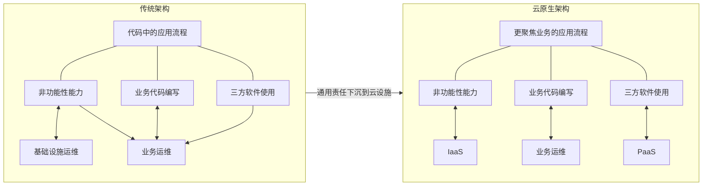

# 2020 年下半年系统架构设计师论文真题

> **底稿：** `02.历年真题/2020年下半年-系统架构设计师-论文.md`
>
> **主试题数：** 4
>
> **作答规则：** 4 道主试题中任选 1 道作答；正式规则以当次考试说明为准。
>
> **内容状态：** 题面据仓库底稿清洗；“备考提示”沿用底稿中的非官方解析，不是官方答案或范文。
>
> **已知限制：** 尚未与官方纸质试卷逐字核对；底稿未提供参考范文及评分细则。第 2 题解析引用的示意图未随底稿收录，现已依据 2021 年公开的同文同图页面恢复其责任映射；该页面晚于考试，只能核对非官方解析图，不能证明官方题面或原卷版式。

## 试题一：论数据分片技术及其应用

数据分片是按照一定规则，将数据集划分为相互独立、正交的数据子集，再将数据子集分布到不同节点上。通过设计合理的数据分片规则，可将系统中的数据分布在不同的物理数据库中，达到提升应用系统数据处理速度的目的。

请围绕“论数据分片技术及其应用”论题，依次从以下三个方面进行论述。

### 写作要求

1. 概要叙述你参与管理和开发的软件项目，以及你所承担的工作。
2. Hash 分片、一致性 Hash 分片和按数据范围分片是三种常用的数据分片方式。请简要阐述三种分片方式的原理。
3. 具体阐述你参与管理和开发的项目采用了哪些分片方式，并具体说明其实现过程和应用效果。

### 备考提示（非官方）

> 以下内容沿用底稿中的解析，仅供备考梳理，不是官方答案或范文。

#### 对应要求一

简要叙述所参与管理和开发的软件项目，明确指出在其中承担的主要任务和开展的主要工作。

#### 对应要求二

三种分片方式的具体描述如下：

1. **Hash 分片：** 基于哈希表思想，按照数据的某一特征（Key）计算哈希值，并将哈希值与系统节点建立映射关系，从而将哈希值不同的数据分布到不同节点。其优点是映射关系简单，需要管理的元数据较少，只需记录节点数目和 Hash 方式；缺点是加入或删除节点时会有大量数据需要移动，也较难解决原始数据特征值分布不均、单条可修改记录不断变大等造成的数据不均衡问题。
2. **一致性 Hash 分片：** 将数据按特征值映射到首尾相接的 Hash 环上，同时将节点按 IP 地址或机器名的 Hash 值映射到环上。对于一项数据，从其在环上的位置开始，顺时针遇到的第一个节点就是数据的存储节点。与普通 Hash 分片相比，一致性 Hash 需要额外维护节点在环上的位置，但数据量较小；增加或删除节点时，仅影响 Hash 环上的相应节点，不会发生大规模数据迁移。
3. **按数据范围分片：** 按关键值划分不同区间，每个物理节点负责一个或多个区间。这种方式可理解为物理节点在 Hash 环上的位置动态变化；区间大小不固定，每个数据区间的数据量与区间大小没有必然关系。例如数据较集中时，区间应较小，即以数据量作为分片标准。实际工程中，一个节点往往负责多个区间，每个区间构成一个数据块；数据块达到阈值后分裂为两个数据块，以便在新节点加入时快速达到均衡。

#### 对应要求三

结合项目实际工作，详细论述项目采用了哪些分片方式，并说明其实现过程和应用效果。

## 试题二：论云原生架构及其应用

近年来，随着数字化转型不断深入，科技创新与业务发展持续融合，各行各业正在从大工业时代的固化范式演进为面向创新型组织与灵活型业务的新模式。在这一背景下，以容器和微服务架构为代表的云原生技术作为云计算服务的新模式，已经逐渐成为企业持续发展的主流选择。云原生架构是基于云原生技术的一组架构原则和设计模式的集合，旨在最大程度地从云应用中剥离非业务代码，使云设施接管应用中原有的大量非功能特性，例如弹性、韧性、安全、可观测性和灰度发布等；在使业务减少非功能性中断困扰的同时，具备轻量、敏捷和高度自动化的特点。云原生架构有利于组织在公有云、私有云和混合云等动态环境中构建并运行可弹性扩展的应用，其代表技术包括容器、服务网格、微服务、不可变基础设施和声明式 API 等。

请围绕“论云原生架构及其应用”论题，依次从以下三个方面进行论述。

### 写作要求

1. 概要叙述你参与管理和开发的软件项目，以及你所承担的主要工作。
2. 服务化、弹性、可观测性和自动化是云原生架构的四类设计原则，请简要阐述这四类设计原则的内涵。
3. 具体阐述你参与管理和开发的项目如何采用云原生架构，并围绕上述四类设计原则，详细论述项目设计与实现过程中遇到的实际问题及解决方法。

### 备考提示（非官方）

> 以下内容沿用底稿中的解析，仅供备考梳理，不是官方答案或范文。

#### 对应要求一

结合自己参与的信息系统项目，说明在其中所承担的工作。

#### 对应要求二

从技术角度看，云原生架构是基于云原生技术的一组架构原则和设计模式的集合。它旨在最大程度地从云应用中剥离非业务代码，使云设施接管应用中原有的大量非功能特性，从而使业务代码具备轻量、敏捷和高度自动化的特点。

底稿引用的示意图将代码分为业务代码、第三方软件和处理非功能特性的代码三部分，但原始图片资产未入库。现有正文给出的解释是：“业务代码”指实现业务逻辑的代码；“第三方软件”是业务代码所依赖的第三方库，包括业务库和基础库；“处理非功能特性的代码”指实现高可用、安全、可观测性等非功能性能力的代码。只有业务代码直接创造业务价值，另外两部分属于附属内容。随着软件和业务模块规模扩大、部署环境增多、分布式复杂性增强，软件构建日益复杂，对开发人员技能的要求也越来越高。云原生架构将大量非功能特性从业务代码剥离到 IaaS 和 PaaS 中，从而减少业务代码开发人员需要关注的技术范围，并借助云服务提供者的专业能力提升应用的非功能性能力；但并非所有非功能特性都能被剥离，例如易用性。

> **图表状态：** 下图依据阿里云开发者社区 2021-03-08 发布的[同文公开页](https://developer.aliyun.com/article/782503)及其[固定图像](https://ucc.alicdn.com/images/lark/0/2021/png/293076/1614301790399-7772bfb9-b879-4666-84c1-ea38dc03fc16.png)结构化重绘。公开图像尺寸为 `2564×738`，SHA-256 为 `a79173246da6111b6110fb6e167c989ff1417c50e1e02d26245f2d9f3a058382`，访问日期 2026-07-12；该页面晚于考试，是对底稿解析文字和责任关系的后期交叉核验，不是官方原卷或底稿原始图片。

> **重建边界：** “传统架构/云原生架构”两栏、三类责任，以及“非功能性能力→IaaS、业务代码编写→业务运维、三方软件使用→PaaS”的云原生责任映射可由固定图像直接核对；重绘不复刻人物图标、代码内部流程图元、颜色、面积比例或像素级布局。“易用性不能完全剥离”来自底稿正文，不是固定图像中的节点。

云原生架构的四类原则包括：

1. **服务化原则：** 当代码规模超出小团队的协作范围时，需要进行服务化拆分，包括微服务架构和小服务（Mini Service）架构。服务化将生命周期不同的模块分离，使其分别进行业务迭代，避免迭代频繁的模块被迭代较慢的模块拖慢，从而提高整体进度和稳定性。服务化架构面向接口编程，服务内部功能高度内聚，并通过提取公共功能模块提高软件复用程度。分布式环境下的限流降级、熔断、隔舱、灰度、反压和零信任安全等，本质上都是基于服务流量而非网络流量的控制策略。云原生架构强调服务化，也为了从架构层面抽象业务模块之间的关系、标准化服务流量传输，帮助业务模块进行基于服务流量的策略控制和治理，而不受服务开发语言限制。
2. **弹性原则：** 系统部署规模可随业务量变化自动伸缩，无须根据预先的容量规划准备固定软硬件资源。良好的弹性能力可以缩短从采购到上线的时间，减少闲置资源成本，降低企业 IT 成本；当业务规模突发性扩张时，还能避免因日常资源储备不足而无法承载业务，保障企业收益。
3. **可观测原则：** 分布式环境需要关联多台主机上的信息，才能回答服务为何宕机、哪些服务违反 SLO、故障影响哪些用户，以及某次变更影响哪些服务指标等问题。可观测性不同于传统监控、业务探活和 APM 等系统提供的能力；它在分布式系统中主动通过日志、链路跟踪和度量等手段，使一次应用操作背后的多次服务调用耗时、返回值和参数清晰可见，甚至可以下钻到第三方软件调用、SQL 请求、节点拓扑和网络响应等信息，使运维、开发和业务人员能够实时掌握软件运行情况，并结合多维数据进行关联分析，持续衡量和优化业务健康度与用户体验。
4. **自动化原则：** 容器、微服务、DevOps 和大量第三方组件在降低分布式复杂性、提高迭代速度的同时，也增大了技术栈复杂度和组件规模，带来软件交付复杂性。通过在 CI/CD 流水线中实践 IaC（Infrastructure as Code）、GitOps、OAM（Open Application Model）、Kubernetes Operator 和自动化交付工具，一方面可标准化企业内部的软件交付过程，另一方面可在标准化基础上实现自动化。通过配置数据自描述和面向终态的交付过程，自动化工具能够理解交付目标与环境差异，实现软件交付和运维的自动化。

#### 对应要求三

结合项目实际说明如何采用云原生架构，围绕四类原则论述遇到的问题及解决方法，并评价实施效果。

## 试题三：论软件测试中缺陷管理及其应用

软件缺陷是计算机软件程序中存在的、破坏正常运行能力的问题或错误，也可以是隐藏的功能缺陷。缺陷会导致软件产品在某种程度上不能满足用户需要。在软件开发过程中，缺陷难以完全避免；软件测试是发现缺陷的主要手段，其核心目标是尽可能多地找出软件代码中存在的缺陷，进而保证软件质量。软件缺陷管理是软件质量管理的重要组成部分。

请围绕“论软件测试中缺陷管理及其应用”论题，依次从以下三个方面进行论述。

### 写作要求

1. 概要叙述你参与管理和开发的软件项目，以及你所承担的主要工作。
2. 详细论述常见的缺陷种类和级别，并论述缺陷管理的基本流程。
3. 结合你参与管理和开发的实际项目，说明如何进行缺陷管理，以及具体实施过程和应用效果。

### 备考提示（非官方）

> 以下内容沿用底稿中的解析，仅供备考梳理，不是官方答案或范文。

#### 对应要求一

简要叙述所参与管理和开发的软件项目，并明确指出在其中承担的主要任务和开展的主要工作。

#### 对应要求二

根据底稿所引 IEEE 标准，软件测试中发现的缺陷主要包括输入/输出错误、逻辑错误、计算错误、接口错误、数据错误等；从软件测试角度还可以将缺陷分为功能缺陷、系统缺陷、加工缺陷、数据缺陷和代码缺陷。不同企业的缺陷分类可能不同。

根据缺陷后果的严重程度，可以将缺陷分为多个级别。例如，底稿列出的 Beizer 十级分类包括轻微、中等、使人不悦、影响使用、严重、非常严重、极为严重、无法容忍、灾难性和传染性。

缺陷管理是对软件测试环节中缺陷状态的完整跟踪和管理，确保每个被发现的缺陷得到妥善处理。其目标是跟踪各阶段测试发现的缺陷，保证各级缺陷的修复率达到标准，并确保信息一致、缺陷得到有效跟踪、缩短沟通时间、提高问题解决效率，以及收集并分析缺陷数据，为缺陷度量提供依据。

缺陷管理的基本流程如下：

1. **缺陷提交：** 测试人员发现缺陷后提交缺陷报告。
2. **缺陷审查：** 确定缺陷问题、种类和级别。
3. **修复流程：** 缺陷通过审查后进入修复流程，缺陷报告转发给相应的软件开发人员进行修复。
4. **验证流程：** 开发人员提交修复后的代码后进入验证流程，通过回归测试等方法验证缺陷已经修复。
5. **缺陷关闭：** 确认缺陷已完全解决后关闭缺陷。

部分缺陷管理流程还包括对缺陷状态的持续跟踪。

#### 对应要求三

结合实际项目说明所开展的缺陷管理活动、具体实施过程，并分析实际应用效果。

## 试题四：论企业集成架构设计及应用

企业集成架构（Enterprise Integration Architecture，EIA）是企业集成平台的核心，也是解决企业信息孤岛问题的关键。企业集成架构设计包括企业信息、业务过程和应用系统集成架构的设计。实现企业集成的技术多种多样：早期通过在不同应用之间开发一对一专用接口，实现应用之间的数据集成，即采用点到点集成方式；后来提出利用集成平台实现企业集成，将分散的信息系统通过统一接口，以可管理、可重复的方式实现单点集成。企业集成架构设计技术方案按照所解决的问题类型，可以分为数据集成、应用集成和企业集成。

请围绕“论企业集成架构设计及应用”论题，依次从以下三个方面进行论述。

### 写作要求

1. 概要叙述你参与的软件开发项目，以及你所承担的主要工作。
2. 详细说明三类企业集成架构设计技术分别要解决的问题及其含义，并阐述每类技术具体包含哪些集成模式。
3. 根据你所参与的项目，说明采用了哪些企业集成架构设计技术，以及实施效果。

### 备考提示（非官方）

> 以下内容沿用底稿中的解析，仅供备考梳理，不是官方答案或范文。

#### 对应要求一

简要描述所参与的软件系统开发项目，并明确指出在其中承担的主要任务和开展的主要工作。

#### 对应要求二

三类企业集成架构设计技术如下：

1. **数据集成：** 用于解决不同应用和系统之间的数据共享和交换需求，具体包括共享信息管理、共享模型管理和数据操作管理三部分。共享信息管理通过定义统一的集成服务模型和共享信息访问机制，完成对集成平台运行过程中产生的数据信息的共享、分发和存储管理；共享模型管理提供数据资源配置管理、集成资源关系管理、资源运行生命周期管理及相应的业务数据协同监控管理等功能；数据操作管理为集成平台用户提供数据操作服务，包括多通道异构模型之间的数据转换、数据映射、数据传递和数据操作等。数据集成模式包括数据联邦、数据复制和基于结构的数据集成模式。
2. **应用集成：** 两个或多个应用系统根据业务逻辑需要进行功能之间的相互调用和互操作。应用集成需要在数据集成基础上完成，并在底层网络集成和数据集成基础上实现异构应用系统之间应用层次的互操作，共同构成企业集成化运行所需的技术支持。应用集成模式包括集成适配器、集成信使、集成面板和集成代理模式。
3. **企业集成：** 企业应用软件系统从功能逻辑上可分为表示、业务逻辑和数据三个层次。表示层负责系统与用户交互的接口定义；业务逻辑层根据具体业务规则处理相应的业务数据；数据层存储业务逻辑层处理产生的业务数据，是系统中相对稳定的部分。支持企业间应用集成和交互的集成平台通常采用多层结构，以最大限度提高系统柔性；设计和开发集成平台时，还需按照功能的通用程度对系统实现模块分层。企业集成模式包括前端集成、后端集成和混合集成模式。

#### 对应要求三

结合所参与的项目，说明使用的企业集成架构设计技术、实施过程和具体实施效果。
