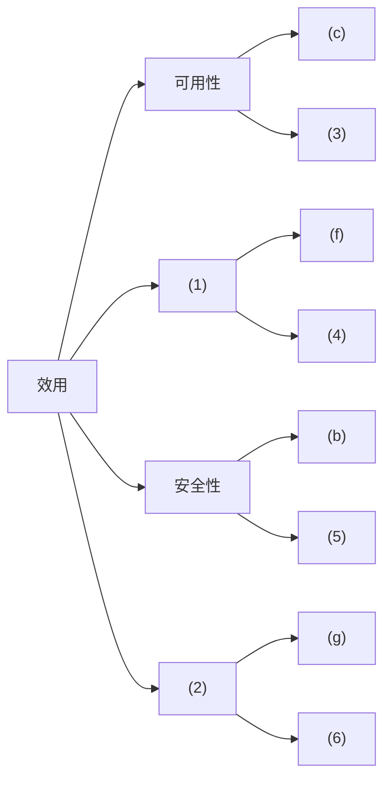
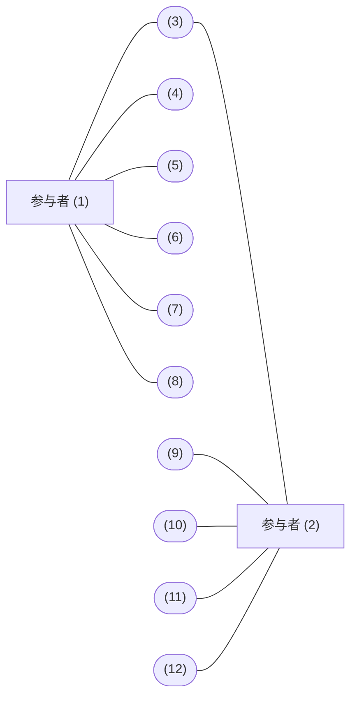
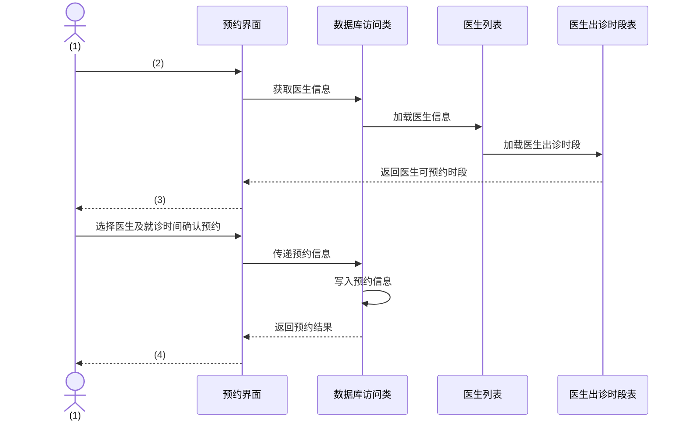
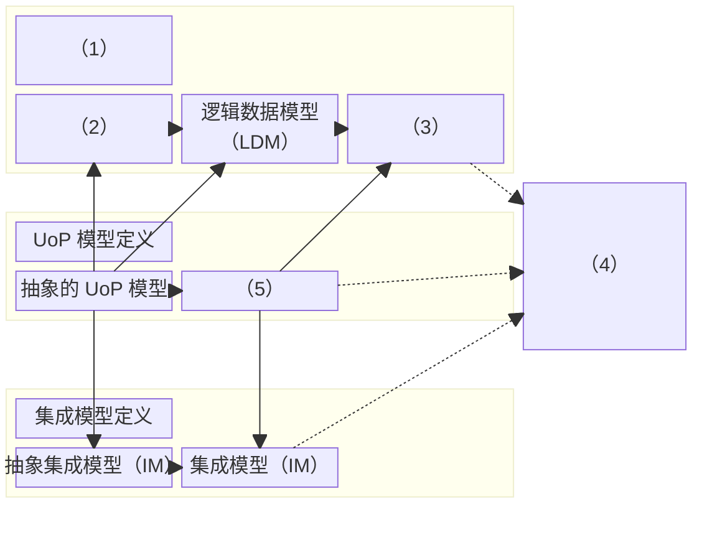
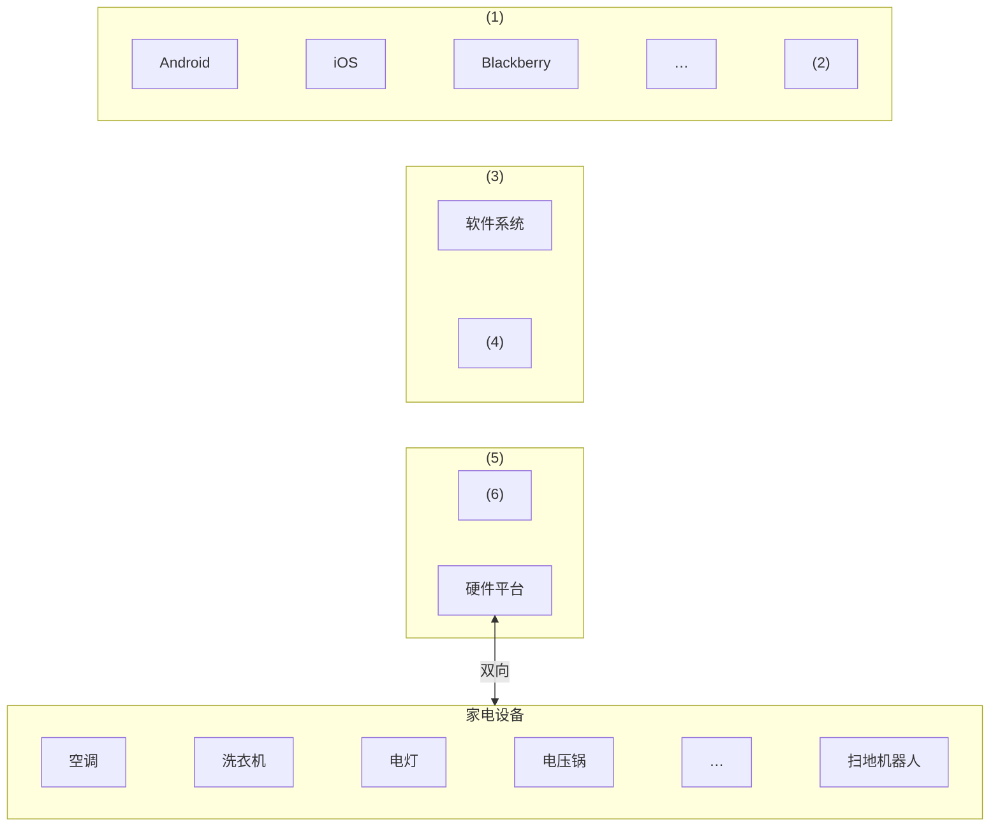

# 2021 年下半年系统架构设计师案例分析真题（清洗版）

> **主试题数量：** 5 道（试题一至五）。本次依据可追溯的公开题库页补回两个本地底稿均缺失的试题三。
>
> **底稿路径：** [本地原始版](../02.历年真题/2021年下半年-系统架构设计师-案例分析.md)
>
> **版本选择：** 试题一、二、四、五以统一清单指定的原始版为底稿；[本地补充版](<../02.历年真题(补充)/2021年下半年-系统架构设计师-案例分析.md>)用于校正主试题编号映射。试题三由公开题库页补录，并由整卷目录和独立回忆页交叉确认。
>
> **非官方性质：** 题面、参考答案及解析均为第三方整理，未获考试主管机构确认。
>
> **作答规则：** 按通常卷面结构，试题一必答，试题二至五任选二题；正式规则仍应以当次原卷为准。
>
> **清洗状态：** 已按五道主试题重排、恢复问题层级并清理显见排版噪声；逐页目视核对固定提交中的 20 页非官方下午题 PDF，恢复其中四个可作答图形结构；另以固定公开题图和 FACE 官方标准 Figure 19 交叉恢复试题三的数据模型语言图。
>
> **图表恢复来源：** [Altria1979/System_Architect 固定提交中的 2021 年下半年下午题 PDF](https://github.com/Altria1979/System_Architect/blob/472e0e3fc3860aa1dffcac9f1d278a943ea5eb59/%E7%9C%9F%E9%A2%98%20%28%E9%87%8D%E7%82%B9%29/%E5%8E%86%E5%B9%B4%E7%9C%9F%E9%A2%98%E5%8F%8A%E8%A7%A3%E6%9E%90/2021%E5%B9%B4%E4%B8%8B%E5%8D%8A%E5%B9%B4%E7%B3%BB%E7%BB%9F%E6%9E%B6%E6%9E%84%E8%AE%BE%E8%AE%A1%E5%B8%88%20%20%E3%80%90%E4%B8%8B%E5%8D%88%E7%9C%9F%E9%A2%98%E3%80%91%E4%BB%A5%E5%8F%8A%EF%BC%88%E7%AD%94%E6%A1%88%E8%A7%A3%E6%9E%90%EF%BC%89.pdf)，访问日期：2026-07-12；固定 Git blob 为 `52fbbf5cd677f0fc63f299ab324f5e2fa1264418`，本地核对文件 SHA-256 为 `f1851dcecf37dbeda3853f24a8b01096f9b6bcfb9cda0d99aa875d828bbe00d9`。该仓库在固定提交中包含 Apache-2.0 许可证，但这不代表其有权为第三方试题内容重新授权；本文只转录空号、节点、连线和分组关系，不复制扫描页、水印或原图版式。
>
> **已知限制：** 试题一的效用树、试题二的用例图与顺序图、试题三的 FACE 数据模型语言图、试题五的架构图均已恢复为可作答的结构化重绘，但都不是考试主管机构发布的原图；所有参考答案也不能替代官方标准答案。
>
> **公开核验来源（访问日期：2026-07-11）：** [希赛试题三单题页](https://www.educity.cn/tiku/60374091.html)保留了题面、选项和非官方答案；[希赛整卷目录](https://wangxiao.xisaiwang.com/tiku2/131/tp30361035.html)用于确认整卷含 5 道案例题；[博客园回忆整理](https://www.cnblogs.com/wzqnxd/p/17781198.html)用于交叉核对试题三主题、题号和表格内容；[Hyperplasma 案例整理](https://www.hyperplasma.top/ruankao-case-analysis-problem-answers/)用于复核试题二的参与者与用例分组。上述页面均为第三方公开材料，不是考试主管机构发布的原卷。
>
> **FACE 图固定证据（访问日期：2026-07-12）：** 希赛页 HTML SHA-256 为 `bbb9ce79c7d1c40378fd5f7d3855266f4c4758699633d1d1ed89f86d1f9d690e`，其[图 3-1 题图](https://img.kuaiwenyun.com/images/shiti/2023-08/823/D3PQsYSqJJ.png) SHA-256 为 `78c8688513cb5683d412786842541adc3986918f8e9b3c6314245b68c085f4b2`，[填值图](https://img.kuaiwenyun.com/images/shiti/2023-08/389/4xYVnsCQxJ.png) SHA-256 为 `85d026b2cd35f569b00662edab279961a147d06331980aece72eaf753a65028b`。The Open Group 的 [FACE Documents & Tools](https://www.opengroup.org/face/docsandtools) 将 FACE Technical Standard 列为核心标准；公开的 [FACE Technical Standard, Edition 3.1](https://www.vdl.afrl.af.mil/programs/arsenl/files/FACE%20Technical%20Standard%20v3.1.pdf)（本次下载 SHA-256 `f5e6b1c27ab42284126fb43a608b481374d9b5cbc07dc7364953ad8ebd1f6824`）第 4.9.1 节 Figure 19（PDF 第 118 页、印刷页 96）独立确认了三行模型分组、从抽象到具体的横向提炼、向上的消息选择、向下的传输定义及右侧制品生成关系。固定 GitHub blob `52fbbf5cd677f0fc63f299ab324f5e2fa1264418` 的 20 页 PDF 已全部目视检查，其中不含试题三，故不把该 PDF 当作本图几何来源。

---

## 试题一（25 分）

阅读以下关于软件架构设计与评估的叙述，在答题纸上回答问题1和问题2。

### 说明
某公司拟开发一套机器学习应用开发平台，支持用户使用浏览器在线进行基于机器学习的智能应用开发活动。

该平台的核心应用场景是用户通过拖拽算法组件灵活定义机器学习流程，采用自助方式进行智能应用设计、实现与部署，并可以开发新算法组件加入平台中。在需求分析与架构设计阶段，公司提出的需求和质量属性描述如下:

(a)平台用户分为算法工程师、软件工程师和管理员等三种角色，不同角色的功能界面有所不同；

(b)平台应该具备数据库保护措施，能够预防核心数据库被非授权用户访问；

(c)平台支持分布式部署,当主站点断电后，应在20秒内将请求重定向到备用站点；

(d)平台支持初学者和高级用户两种界面操作模式，用户可以根据自己的情况灵活选择合适的模式；

(e)平台主站点宕机后，需要在15秒内发现错误并启用备用系统；

(f)在正常负载情况下，机器学习流程从提交到开始执行，时间间隔不大于5秒；

(g)平台支持硬件扩容与升级，能够在3人天内完成所有部署与测试工作；

(h)平台需要对用户的所有操作过程进行详细记录，便于审计工作；

(i)平台部署后，针对界面风格的修改需要在3人天内完成;

(j)在正常负载情况下，平台应在0.5秒内对用户的界面操作请求进行响应；

(k)平台应该与目前国内外主流的机器学习应用开发平台的界面风格保持一致；

(l)平台提供机器学习算法的远程调试功能，支持算法工程师进行远程调试。

在对平台需求、质量属性描述和架构特性进行分析的基础上，公司的架构师给出了三种候选的架构设计方案，公司目前正在组织相关专家对平台架构进行评估。

### 问题 1（9 分）
在架构评估过程中，质量属性效用树(utility tree)是对系统质量属性进行识别和优先级排序的重要工具。 请将合适的质量属性名称填入图1-1中(1)、(2)空白处，并从题干中的(a)-(l)中选择合适的质量属性描述,填入(3)-(6)空白处，完成该平台的效用树。

> **图表状态：** 原图未入库；下图依据文件头所列非官方 PDF 第 3 页转录效用树的分支、既有选项字母和空号位置，是结构化重绘示意，不是原图。

> **版本差异：** 固定 PDF 第 2 页的选项标签出现两个 `(i)`，随后直接列 `(j)`、`(l)`；本地底稿按 `(i)`、`(j)`、`(k)`、`(l)` 连续编号，且其答案把“0.5 秒内响应”记为 `(j)`。上图只转录 PDF 中稳定可见的分支与空号，不据该处标签瑕疵改写本地答案。

### 问题 2（16 分）
针对该系统的功能，赵工建议采用解释器(interpreter)架构风格，李工建议采用管道过滤器(pipe-and-filter)的架构风格，王工则建议采用隐式调用(implicit invocation)架构风格。请针对平台的核心应用场景，从机器学习流程定义的灵活性和学习算法的可扩展性两个方面对三种架构风格进行对比与分析，并指出该平台更适合采用哪种架构风格。

### 参考答案与解析（非官方）
【问题1】

（1） 性能

（2） 可修改性

（3）（e）可用性

（4）（j）性能

（5）（h）安全性

（6）（i）可修改

本题是架构案例中的经典题型，问题1难度低，出现的频度高，是要求必须掌握的。

首先我们需要注意的是：在架构评估中，质量效用树，默认有4大质量属性，分别为：性能、可用性、安全性和可修改性，这个条件题目一般不直接给出，需要考生掌握这个知识背景。所以（1）和（2）只能在性能和可修改性中选择。由于（f）是性能要求，所以（1）填性能，（2）为可修改性。（e）强调了系统出故障限定多长时间切换到备用系统，是典型的系统修复时间限定，属于可用性。（j）强调响应时间，应为性能。（h）强调记录操作并审计，属于安全性。（i）强调做系统修改时，时限要求，为可修改性。

【问题2】

本题系统中有多个应用场景提到了系统分角色有不同的操作流程与界面，以及在修改扩充系统时，需要能够在限定时间内快速完成任务。基于这样的情况，我们从两方面进行分析：

解释器：机器学习流程定义的灵活性高，可扩展能力强，因为解释器风格可以通过自定义流程规则及配套流程解释引擎开发，做到用户层面的流程完全定义，而不需要修改代码，所以无论是修改已有的业务流程，还是要扩展不同的角色，创建新角色的流程都非常便利。

管道过滤器：机器学习流程定义的灵活性较低，可扩展能力较弱，因为管道过滤器是把数据处理职能做成过滤器，把数据传递做成管道，此时如果流程不发生变化，是可以通过这种方式实现的，但一旦流程变化，或是扩展功能，需要对过滤器进行修改调整，或是流程在程序层面重建，此时必须修改代码完成任务。

隐式调用：机器学习流程定义的灵活性一般，可扩展能力一般，隐式调用强调的是通过间接方式进行调用，如采用事件机制，要完成某个动作时先触发事件，事件与相关动作关联，以提升灵活度，本题中可把角色执行业务的流程用事件触发。这种做法比管道过滤器强，但弱于完全自定义的解释器。

---

## 试题二（25 分）

阅读以下关于软件系统设计与建模的叙述，在答题纸上回答问题1至问题3。

### 说明
某医院拟委托软件公司开发一套预约挂号管理系统，以便为患者提供更好的就医体验，为医院提供更加科学的预约管理。本系统的主要功能描述如下：(a)注册登录，(b)信息浏览，(c)账号管理，(d)预约挂号，(e)查询与取消预约，(F)号源管理，(g)报告查询，(h)预约管理，(i)报表管理和(j)信用管理等。

### 问题 1（6 分）
若采用面向对象方法对预约挂号管理系统进行分析,得到如图2-1所示的用例图。请将合适的参与者名称填入图2-1中的(1)和(2)处，使用题干给出的功能描述(a)~(j)，完善用例(3)~(12)的名称，将正确答案填在答题纸上。

> **图表状态：** 原图未入库；下图依据文件头所列非官方 PDF 第 6 页转录两个参与者与用例空号之间的关联，是结构化重绘示意，不是原图。矩形参与者节点仅用于表达关联，不复刻原图人物图标或几何位置。

> **版本冲突：** 固定 PDF 第 15 页解析给出 `(1)` 系统管理员、`(2)` 患者，并把 `(4)～(8)` 归为管理功能、`(9)～(12)` 归为患者功能；当前清洗稿所引 Hyperplasma 页面给出相反的参与者位置和空号分组。两者均非官方，本文保留空号关联和下方现有答案，不自动裁决。

### 问题 2（10 分）
预约人员(患者)登录系统后发起预约挂号请求，进入预约界面。进行预约挂号时使用数据库访问类获取医生的相关信息，在数据库中调用医生列表，并调取医生出诊时段表，将医生出诊时段反馈到预约界面，并显示给预约人员；预约人员选择医生及就诊时间后确认预约，系统反馈预约结果，并向用户显示是否预约成功。

采用面向对象方法对预约挂号过程进行分析，得到如图2-2所示的顺序图，使用题干中给出的描述，完善图2-2中对象(1),及消息(2)~(4)的名称，将正确答案填在答题纸上，请简要说明在描述对象之间的动态交互关系时，协作图与顺序图存在哪些区别。

> **图表状态：** 原图未入库；下图依据文件头所列非官方 PDF 第 7 页转录对象、消息、返回方向和空号位置，是结构化重绘示意，不是原图。

### 问题 3（9 分）
采用面向对象方法开发软件，通常需要建立对象模型、动态模型和功能模型，请分别介绍这3种模型,并详细说明它们之间的关联关系，针对上述模型，说明哪些模型可用于软件的需求分析？

### 参考答案与解析（非官方）
【问题1】

（1）患者（预约人员）

（2）医院管理人员（系统管理员）

（3）（a）注册登录

（4）～（8）：（b）信息浏览、（c）账号管理、（d）预约挂号、（e）查询与取消预约、（g）报告查询，组内顺序需结合原图。

（9）～（12）：（f）号源管理、（h）预约管理、（i）报表管理、（j）信用管理，组内顺序需结合原图。

【问题2】

（1）预约人员（患者）

（2）预约挂号请求

（3）显示医生可预约时段

（4）显示预约是否成功

顺序图强调的是对象交互的时间次序。通信图/协作图强调的是对象之间的组织结构。

【问题3】

概念：

对象模型描述了系统的静态结构，一般使用对象图来建模。对象模型是整个体系中最基础，最核心的部分。

动态模型描述了系统的交互次序，一般使用状态图来建模。

功能模型描述 了系统的数据变换，一般使用数据流图来建模。

相互关系：

对象模型描述了动态模型和功能模型所操作的数据结构，对象模型中的操作对应于动态模型中事件和功能模型中的函数；

动态模型描述了对象模型的控制结构，告诉我们哪些决策是依赖于对象值，哪些引起对象的变化，并激活功能；

功能模型描述了由对象模型中操作和动态模型中动作所激活的功能，而功能模型作用在对象模型说明的数据上，同时还表示了对对象值的约束。

上述对象模型、动态模型和功能模型均可用于需求分析，分别从静态结构、动态行为和数据变换三个角度描述需求。

---

## 试题三（25 分）

阅读以下关于嵌入式数据架构设计的相关描述，回答问题1至问题3。

### 说明

数据架构（Data Architecture）是系统架构设计的主要工作之一，用于描述业务数据以及数据间的关系。数据架构着重考虑“数据需求”，关注持久化数据的组织，其设计过程主要包括数据定义、数据分布与数据管理。

某公司为适应宇航装备的持续发展，希望改变原来事件驱动的架构设计模式。张工经过分析和调研，给出了企业宇航产品未来的架构规划方案。

### 问题 1（9 分）

张工指出，要实现以数据为中心的架构设计模式，应改变各子系统独立设计的方式，解决装备数据共享、管理和存储等问题，做好顶层数据架构规划。请用 300 字以内的文字说明数据定义、数据分布与数据管理的具体内涵。

### 问题 2（7 分）

张工提出未来产品应遵从开放式架构体系，并形成规格化的数据模型语言。图3-1说明了数据模型语言在 FACE（Future Airborne Capability Environment）架构模型中的作用。请从下列 a～g 中选择，填入图3-1的（1）～（7）。

- a. 数据模型定义
- b. 平台数据模型（PDM）
- c. UoP（Unit of Portability）数据模型（UM）
- d. 提炼
- e. 传输定义
- f. 代码和配置
- g. 概念数据模型（CDM）

> **图表状态：** 下图按固定题图转录空号、三行分组、节点顺序和跨行关系，并由 FACE Technical Standard Edition 3.1 第 4.9.1 节 Figure 19 交叉核对；它是可维护的语义重绘，不复制第三方位图的像素版式。这里没有使用常见的 FACE 五段式参考架构图，因为那不是本题的数据模型语言图。

| 图中边或方向 | 原题图例 |
| --- | --- |
| 同一行内由左向右的粗黑箭头 | （6） |
| 从 UoP 模型行指向数据模型行的向上箭头 | 消息选择 |
| 从 UoP 模型行指向集成模型行的向下箭头 | （7） |
| 三行模型指向右侧（4）的虚线箭头 | 人工生产（题图原文） |

> **重绘约定：** 三行横向长箭头自上而下分别标为“数据精炼”“接口精炼”“集成精炼”。原题把（6）和（7）各放在图下方的图例中，而不是在每条边上重复标号；上表保留这一设计。题图把制品生成虚线标作“人工生产”，三条虚线都指向右侧同一个（4），不是三个不同空；此处保留题图措辞，不静默改写。

### 问题 3（9 分）

判断表3-1中的 9 项需求是否属于数据需求。

| 序号 | 需求项（结构化转录，非原表） |
| --- | --- |
| 1 | 操作系统段的一个可移植单元应支持分区、进程、线程和存储管理功能。 |
| 2 | 在安全传输时，模块支持单元（USM）应该为可移植单元提供所有可用的数据元素。 |
| 3 | I/O 服务应该为对应的每条 I/O 总线体系结构提供 I/O 服务管理能力。 |
| 4 | USM 访问传输段接口时，应包括可移植单元需要发送的所有数据元素。 |
| 5 | 特定域数据模型（DSDM）应该遵循 FACE 共享数据模型管理。 |
| 6 | 当安全传输作为可移植组件段内可移植单元执行时，访问安全传输的所有数据的界限应与 FACE 数据架构保持一致。 |
| 7 | DSDM 应该是遵守 EMOF 2.0 约束的 XML 文件。 |
| 8 | 可移植单元应该为每个 FACE 接口提供一个注入实例。 |
| 9 | 可移植单元包中的所有可移植单元应该设计在相同分区内操作。 |

> **图表状态：** 原表版式未收录；上表仅转录文字内容，不代表原卷的列宽、勾选栏或排版。

### 参考答案与解析（非官方）

【问题1】

- **数据定义：** 从业务本质出发定义数据及关系，保证数据架构全面、一致、完整；划分应用系统边界，明确数据引用关系和系统间集成接口，并形成概念、逻辑、物理模型及数据标准。
- **数据分布：** 根据业务需要分析数据在业务环节和系统之间的创建、引用、修改、删除及分析关系，并选择适合的数据存储和部署方式。
- **数据管理：** 建立覆盖数据生命周期的模型、分布、质量、安全等管理制度，同时明确相应组织和岗位，保证数据得到持续、有效管理。

【问题2】

| 空号 | 答案 | 图中位置或关系 |
| --- | --- | --- |
| （1） | a. 数据模型定义 | 顶行左侧分组 |
| （2） | g. 概念数据模型（CDM） | 顶行最左模型 |
| （3） | b. 平台数据模型（PDM） | 顶行最右模型 |
| （4） | f. 代码和配置 | 右侧虚线框 |
| （5） | c. UoP 数据模型（UM） | 中行右侧模型 |
| （6） | d. 提炼 | 粗黑横向箭头图例 |
| （7） | e. 传输定义 | 灰色向下箭头图例 |

> 以上空号位置由固定题图和同页填值图直接核对；FACE 官方 Figure 19 用于独立验证模型分组和箭头语义，不把新版标准中的其他细节增补进原题。

【问题3】

（1）否；（2）是；（3）否；（4）是；（5）是；（6）否；（7）是；（8）否；（9）否。

判断重点是需求是否直接约束数据元素、数据模型、数据表示或数据接口；仅描述操作系统服务、I/O 管理、运行分区或接口实例等行为的条目，不属于这里所称的数据需求。

---

## 试题四（25 分）

阅读以下关于数据库设计的叙述，在答题纸上回答问题1至问题3。

### 说明
某医药销售企业因业务发展，需要建立线上药品销售系统，为用户提供便捷的互联网药品销售服务、该系统除了常规药品展示、订单、用户交流与反馈功能外,还需要提供当前热销产品排名、评价分类管理等功能。通过对需求的分析，在数据管理上初步决定采用关系数据库（MySQL）和数据库缓存（Redis）的混合架构实现。

经过规范化设计之后，该系统的部分数据库表结构如下所示。

供应商（供应商ID，供应商名称，联系方式，供应商地址）；

药品（药品ID，药品名称，药品型号，药品价格，供应商ID）；

药品库存（药品ID，当前库存数量）；

订单（订单号码，药品ID，供应商ID，药品数量，订单金额）。

### 问题 1（9 分）
在系统初步运行后，发现系统数据访问性能较差。经过分析，刘工认为原来数据库规范化设计后，关系表过于细分,造成了大量的多表关联查询，影响了性能。例如当用户查询商品信息时，需要同时显示该药品的信息、供应商的信息、当前库存等信息。

为此，刘工认为可以采用反规范化设计来改造药品关系的结构，以提高查询性能。修改后的药品关系结构为:

药品(药品ID,药品名称，药品型号，药品价格,供应商ID，供应商名称，当前库存数量) ;

请用200字以内的文字说明常见的反规范化设计方法，并说明用户查询商品信息应该采用哪种反规范化设计方法。

### 问题 2（9 分）
王工认为，反规范化设计可提高查询的性能，但必然会带来数据的不一致性问题。请用200字以内的文字说明在反规范化设计中，解决数据不一致性问题的三种常见方法，并说明该系统应该采用哪种方法。

### 问题 3（7 分）
该系统采用了Redis来实现某些特定功能(如当前热销药品排名等)，同时将药品关系数据放到内存以提高商品查询的性能，但必然会造成Redis和MySQL的数据实时同步问题。

(1) Redis的数据类型包括String、 Hash、 List、 Set和ZSet等，请说明实现当前热销药品排名的功能应该选择使用哪种数据类型。

(2)请用200字以内的文字解释说明解决Redis和MySQL数据实时同步问题的常见方案。

### 参考答案与解析（非官方）
【问题1】

常见的反规范化技术包括：

（1）增加冗余列：增加冗余列是指在多个表中具有相同的列，它常用来在查询时避免连接操作。

（2）增加派生列：增加派生列指增加的列可以通过表中其他数据计算生成。它的作用是在查询时减少计算量，从而加快查询速度。

（3）重新组表：重新组表指如果许多用户需要查看两个表连接出来的结果数据，则把这两个表重新组成一个表来减少连接而提高性能。

（4）分割表：有时对表做分割可以提高性能。

用户查询商品信息应该采用：增加冗余列。

用户查询商品信息时，需要显示药品信息（药品表中），供应商信息（供应商表），库存信息（库存表中），此时查询的是药品表，但表中缺了供应商的信息和库存信息，可以通过增加冗余列的方式把这些信息并过来。以避免连接操作带来的查询性能下降。

【问题2】

针对反规范化数据不一致问题，可采用的解决方案包括：

1、触发器数据同步

2、应用程序数据同步

3、物化视图

【问题3】

（1）热销药品排名适合用：ZSet，即有序集合类型

（2）

1、实时同步方案，先查缓存，查不到再从DB查询，并保存到缓存；更新缓存时先更新数据库，再将缓存设置过期。

2、异步队列方式同步，可采用消息中间件处理。

3、通过数据库插件完成数据同步。

4、利用触发器进行缓存同步。

---

## 试题五（25 分）

阅读以下关于Web系统架构设计的叙述，在答题纸上回答问题1至问题3。

### 说明
某公司拟开发一个智能家居管理系统，该系统的主要功能需求如下：

1)用户可使用该系统客户端实现对家居设备的控制，且家居设备可向客户端反馈实时状态；

2)支持家居设备数据的实时存储和查询；

3)基于用户数据，挖掘用户生活习惯，向用户提供家居设备智能化使用建议。

基于上述需求，该公司组建了项目组，在项目会议上，张工给出了基于家庭网关的传统智能家居管理系统的设计思路，李工给出了基于云平台的智能家居系统的设计思路。经过深入讨论，公司决定采用李工的设计思路。

### 问题 1（8 分）
请用400字以内的文字简要描述基于家庭网关的传统智能家居管理系统和基于云平台的智能家居管理系统在网关管理、数据处理和系统性能等方面的特点，以说明项目组选择李工设计思路的原因。

### 问题 2（12 分）
请从下面给出的(a) ~ (j) 中进行选择，补充完善图5-1中空(1) ~ (6)处的内容，协助李工完成该系统的架构设计方案。

> **图表状态：** 原图未入库；下图依据文件头所列非官方 PDF 第 9 页转录四个分组、组内节点和空号位置，是结构化重绘示意，不是原图；仅保留题面中可见的层次关系，不复制扫描版式。

> **版本差异：** 固定 PDF 第 20 页解析另附填值后的多终端、多网关拓扑说明图，其节点含义与空号答案一致，但几何布局并非第 9 页题面空号图。本文恢复第 9 页的可作答结构，不将两张图拼成未经证实的单一原图。

(a) Wi-Fi

(b) 蓝牙

(c)驱动程序

(d)数据库

(e)家庭网关

(f)云平台

(g)微服务

(h)用户终端

(i)鸿蒙

(j)TCP/IP

### 问题 3（5 分）
该系统需实现用户终端与服务端的双向可靠通信，请用300字以内的文字从数据传输可靠性的角度对比分析TCP和UDP通信协议的不同，并说明该系统应采用哪种通信协议。

### 参考答案与解析（非官方）
【问题1】

网关管理：云平台更强，可以实现远程网关管理，可以对不同地点的多种设备进行统一管理，管理能力更强。

数据处理：数据一般经由网关传递到云上数据库中，再进行处理，这样对数据进行分析、挖掘更便利，同时存储在云端，数据更安全，有容灾能力。

系统性能：数据存在云上数据库中，通信效率更高，同时云也有更强的数据处理能力，所以会更高效。

【问题2】

（1）（h）用户终端

（2）（i）鸿蒙

（3）（f）云平台

（4）（d）数据库

（5）（e）家庭网关

（6）（c）驱动程序

> **图表引用：** 本答案的 `(1)～(6)` 与上方图5-1结构化重绘共用；第 20 页解析图的布局差异已在图后说明中隔离。

【问题3】

该系统应采用TCP协议，这样才能保障用户终端和服务端之间的双向可靠通信。

TCP是一种面向连接的、可靠的、基于字节流的传输层通信协议。TCP之所以可靠，是因为建立连接时有3次握手，通信时有回应机制，所以丢了包，能重传以保障通信可靠性。

UDP是一种面向无连接的传输层通信协议，丢了包不会重传，所以不能保障通信可靠性。

---
