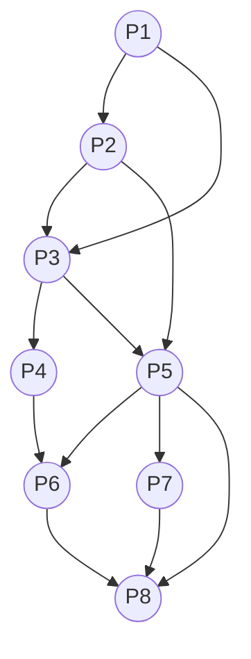
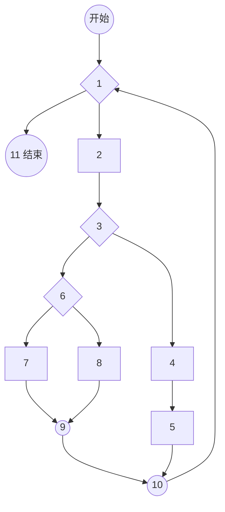

# 2021 年下半年系统架构设计师综合知识真题（清洗版）

> **题目数量：** 75（题号 1—75 连续；每题保留 A—D 四个选项、现有答案及解析）。
>
> **底稿路径：** [02.历年真题/2021年下半年-系统架构设计师-综合知识.md](../02.历年真题/2021年下半年-系统架构设计师-综合知识.md)
>
> **版本选择：** 以统一清单指定的本地原始版为唯一正文底稿；外部材料只用于补回底稿缺失的图表结构，不据此重排题目、替换选项或改写现有答案。
>
> **非官方性质：** 题面、答案与解析均来自第三方整理材料，不是考试主管机构发布的官方试卷或标准答案。
>
> **图表恢复来源（非官方）：** [xiaomabenten/system_architect 固定提交中的 2021 综合知识 PDF](<https://github.com/xiaomabenten/system_architect/blob/2e04df6ab9076f99c101a5b00f3e89fb3e4e1761/03%E3%80%81%E5%8E%86%E5%B9%B4%E7%9C%9F%E9%A2%98%282009%E5%B9%B4-2025%E5%B9%B4%29%2B%E7%AD%94%E6%A1%88%E8%A7%A3%E6%9E%90/2021%E5%B9%B4/2021%E5%B9%B411%E6%9C%88%E7%B3%BB%E7%BB%9F%E6%9E%B6%E6%9E%84%E5%B8%88%E7%9C%9F%E9%A2%98%EF%BC%88%E7%BB%BC%E5%90%88%E7%9F%A5%E8%AF%86%2B%E7%AD%94%E6%A1%88%E8%A7%A3%E6%9E%90%EF%BC%89.pdf>)（Git blob `5667678785ce6f3f24f468470687b4048e84776a`，本地核对文件 SHA-256 `666ae35239789e550cf62671136c5fd94c83f2a8f9e51fc63d6fb213325e1e5e`）、[希赛网 2021 上午题（一）](https://www.educity.cn/rk/2312401.html)与[上午题（四）](https://www.educity.cn/rk/2312425.html)、[CSDN 公开整理页](https://blog.csdn.net/yuanmayuzhou/article/details/143760605)，访问日期：2026-07-12。上述材料均不是官方原卷；本稿只转录单元格、节点和连线，不复制扫描图或原图版式。
>
> **清洗状态：** 已统一题号、A—D 选项与答案结构，标注共用题干空位，移除章节标签和页面噪声，并核验 75 道题均有一个现有答案；第 1、4、5、27、57、72、73 题缺失的图或表已恢复为可作答的结构化转录。
>
> **题序与版本差异：** 外部材料与本地底稿的题序并不一致，例如关系 R/S 双空题在公开整理页中列为第 7—8 题、McCabe 题列为第 34 题、项目作业题列为第 70 题，而本稿分别位于第 72—73、27、57 题。本次只按完整题干匹配并恢复结构，不据外部题号改动本稿题序。
>
> **已知限制：** 尚未与官方纸质原卷逐题校对；七处图表虽已恢复为可作答的结构化转录，但不是官方原图、原表。所有答案和解析仍按非官方底稿保留，可信度继续按低、待复核处理。

---
## 第1题

某计算机系统页面大小为4K，进程P1的页面变换表如下图所示，若P1要访问数据的逻辑地址为十六进制1B1AH，那么该逻辑地址经过变换后，其对应的物理地址应为十六进制（ ）。

> **结构化转录（不是原卷表格，来源非官方）：** 依据文件头所列希赛网 2021 上午题（一）的页表图片逐格转录；未复制原表版式。

| 页号 | 物理块号 |
| ---: | ---: |
| 0 | 1 |
| 1 | 6 |
| 2 | 3 |
| 3 | 8 |

- **A.** 1B1AH
- **B.** 3B1AH
- **C.** 6B1AH
- **D.** 8B1AH

**正确答案：C**

**解析：**

本题考查页式存储中的逻辑地址转物理地址。由于页面大小为4K，所以页内地址长度为12个二进制位，对应逻辑地址中的：B1A，所以页号为1，通过查询页表可知对应物理块号为6，所以物理地址为6B1AH。

---

## 第2题

嵌入式实时操作系统与一般操作系统相比，具备许多特点。以下不属于嵌入式实时操作系统特点的是（）。

- **A.** 可剪裁性
- **B.** 实时性
- **C.** 通用性
- **D.** 可固化性

**正确答案：C**

**解析：**

嵌入式实时操作系统兼具嵌入式操作系统的特点和实时操作系统的特点。
嵌入式操作系统主要有以下特点：
（1）微型化 （2）代码质量高 （3）专业化 （4）实时性强（5）可裁减、可配置。
实时操作系统的最核心特点是实时性强。
C选项的通用性与嵌入式操作系统相背，所以不属于嵌入式实时操作系统的特点。

---

## 第3题

人工智能技术已成为当前国际科技竞争的核心技术之一，AI芯片是占据人工智能市场的法宝。AI 芯片有别于通常处理器芯片，它应具备四种关键特征。（ ）是AI芯片的关键特点。

- **A.** 新型的计算范式、信号处理能力、低精度设计、专用开发工具
- **B.** 新型的计算范式、训练和推断、大数据处理能力、可重构的能力
- **C.** 训练和推断、大数据处理能力、可定制性，专用开发工具
- **D.** 训练和推断、低精度设计、新型的计算范式、图像处理能力

**正确答案：B**

**解析：**

AI芯片的特点包括 ：新型计算范式AI芯片的关键特征：

1、新型的计算范式
AI 计算既不脱离传统计算，也具有新的计算特质，如处理的内容往往是非结构化数据（视频、图片等）。处理的过程通常需要很大的计算量，基本的计算主要是线性代数运算，而控制流程则相对简单。处理的过程参数量大。
2、训练和推断
AI 芯片通常涉及训练和推断过程。简单来说，训练过程是指在已有数据中学习，获得某些能力的过程；而推断过程则是指对新的数据，使用这些能力完成特定任务（比如分类、识别等）。
3、 大数据处理能力
人工智能的发展高度依赖海量的数据。满足高效能机器学习的数据处理要求是AI 芯片需要考虑的最重要因素。
4、数据精度
低精度设计是AI 芯片的一个趋势，在针对推断的芯片中更加明显。对一些应用来说，降低精度的设计不仅加速了机器学习算法的推断（也可能是训练），甚至可能更符合神经形态计算的特征。
5、可重构的能力
针对特定领域而不针对特定应用的设计，将是AI 芯片设计的一个指导原则，具有可重构能力的AI 芯片可以在更多应用中大显身手，并且可以通过重新配置，适应新的AI 算法、架构和任务。
6、开发工具
就像传统的CPU需要编译工具的支持， AI 芯片也需要软件工具链的支持，才能将不同的机器学习任务和神经网络转换为可以在AI 芯片上高效执行的指令代码。

本题考查四种关键特征，只有B选项的内容都符合，本题选择B选项。

干扰项：
信号处理能力：把某一个信号变为与其相关的另一个信号的能力，例如把信号变换成容易分析与识别的形式。
可定制性：可以按照用户的要求设计制造。
图像处理能力：用计算机对图像进行分析，以达到所需结果的技术的能力。

---

## 第4题

前趋图（Precedence Graph）是一个有向无环图，记为：→={(Pi, Pj) | Pi must complete before Pj may start}。 假设系统中进程P={P1, P2,P3, P4, P5, P6, P7, P8}， 且进程的前驱图如下:

> **结构化重绘示意（不是原卷图，来源非官方）：** 依据文件头所列 CSDN 公开整理页的选项 C 有向边集合，并与本题现有解析逐边交叉核对；节点位置不表示额外含义。

- **A.** →={ (P1，P2) , (P3，P1) , (P4，P1), (P5，P2) , (P5，P3) , (P6，P4) , (P7，P5), (P7，P6) , (P5，P6), (P4，P5), (P6，P7) , (P7，P6) }
- **B.** →={(P1，P2) , (P1，P3) , (P2，P5) , (P2，P3) , (P3，P4) , (P3，P5) ,(P4，P5) , (P5，P6) , (P5，P7) , (P8，P5), (P6，P7) , (P7，P8) }
- **C.** →={(P1，P2) , (P1，P3) , (P2，P3), (P2，P5) , (P3，P4) , (P3，P5),(P4，P6) , (P5，P6) , (P5，P7) ,(P5，P8), (P6，P8) , (P7，P8) }
- **D.** →={ (P1，P2) , (P1，P3) , (P2，P3), (P2，P5) , (P3，P6) , (P3，P4) ,(P4，P7) ,(P5，P6) , (P6，P7),(P6，P5),(P7，P5) , (P7，P8) }

**正确答案：C**

**解析：**

本题考查前趋图的表示。其表示方法为：如图中有P1至P2的箭线，则说明P1执行完，才能执行P2，此时约束关系记为：（P1，P2）。

依据此原理，题目中前趋图的正确描述为： {（P1，P2）、（P1，P3）、（P2，P3）、（P2，P5）、（P3，P4）、（P3、P5）、（P4，P6）、（P5，P6）、（P5，P7），（P5，P8），（P6，P8）、（P7，P8）}

---

## 第5题

假设系统中互斥资源R的可用数为25。T0时刻进程P1、P2、P3、P4对资源R的最大需求数、已分配资源数和尚需资源数的情况如表a所示，若P1和P3分别申请资源R数为1和2，则系统（ ）。

> **结构化转录（不是原卷表格，来源非官方）：** 依据文件头所列 CSDN 公开整理页的“表 a”图片逐格转录；未复制原表版式。

| 进程 | 最大需求数 | 已分配资源数 | 尚需资源数 |
| --- | ---: | ---: | ---: |
| P1 | 10 | 6 | 4 |
| P2 | 11 | 4 | 7 |
| P3 | 9 | 7 | 2 |
| P4 | 12 | 6 | 6 |

- **A.** 只能先给P1进行分配，因为分配后系统状态是安全的
- **B.** 只能先给P3进行分配，因为分配后系统状态是安全的
- **C.** 可以先后给 P1、P3 进行分配，因为分配后系统状态是安全的
- **D.** 不能给P3进行分配，因为分配后系统状态是不安全的

**正确答案：B**

**解析：**

由于系统中一共有25个可用资源，分别给P1-P4分配了：6、4、7、6个资源，所以目前系统剩余资源数为：25-6-4-7-6=2。

此时，若给P1分配1个资源，则P1还需要3个资源，系统只余下1个资源。这1个资源分配给任何一个进程都无法满足进程的总资源需求量，从而导致系统进入死锁状态，这是不安全的系统状态。但若给P3分配2个资源，能满足P3的全部资源需求，P3执行完之后，将释放9个资源，此时执行P1、P2、P4中的任意一个均是安全状态，所以这种分配方式才是安全合理的。

---

## 第6题

某企业开发信息管理系统平台进行E-R图设计，人力部门定义的是员工实体具有属性：员工号、姓名、性别、出生日期、联系方式和部门，培训部门定义的培训师实体具有属性：培训师号、姓名和职称，其中职称={初级培训师，中级培训师，高级培训师}，这种情况属于（ ）。

在合并E-R图时，解决这一冲突的方法是（ ）。

> **共用题干：** 本题对应上述题干的第 1 空（共 2 空）。

- **A.** 属性冲突
- **B.** 结构冲突
- **C.** 命名冲突
- **D.** 实体冲突

**正确答案：B**

**解析：**

ER图集成时产生的冲突及解决办法：
属性冲突：包括属性域冲突和属性取值冲突。
命名冲突：包括同名异义和异名同义。
结构冲突：包括同一对象在不同应用中具有不同的抽象，以及同一实体在不同局部E-R图中所包含的属性个数和属性排列次序不完全相同。
本题中培训师属于员工的一种，所以不应该抽象为两个不同实体，这个冲突属于结构冲突，解决方案是员工实体中加入职称属性，剔除培训师实体。

---

## 第7题

某企业开发信息管理系统平台进行E-R图设计，人力部门定义的是员工实体具有属性：员工号、姓名、性别、出生日期、联系方式和部门，培训部门定义的培训师实体具有属性：培训师号、姓名和职称，其中职称={初级培训师，中级培训师，高级培训师}，这种情况属于（ ）。

在合并E-R图时，解决这一冲突的方法是（ ）。

> **共用题干：** 本题对应上述题干的第 2 空（共 2 空）。

- **A.** 员工实体和培训师实体均保持不变
- **B.** 保留员工实体，删除培训师实体
- **C.** 员工实体中加入职称属性，剔除培训师实体
- **D.** 将培训师实体所有属性并入员工实体，删除培训师实体

**正确答案：C**

**解析：**

ER图集成时产生的冲突及解决办法：
属性冲突：包括属性域冲突和属性取值冲突。
命名冲突：包括同名异义和异名同义。
结构冲突：包括同一对象在不同应用中具有不同的抽象，以及同一实体在不同局部E-R图中所包含的属性个数和属性排列次序不完全相同。
本题中培训师属于员工的一种，所以不应该抽象为两个不同实体，这个冲突属于结构冲突，解决方案是员工实体中加入职称属性，剔除培训师实体。

---

## 第8题

一般说来，SoC称为系统级芯片，也称片上系统，它是一个有专用目标的集成电路产品。以下关于SoC不正确的说法是（ ）。

- **A.** SoC是一种技术，是以实际的、确定的系统功能开始，到软/硬件划分，并完成设计的整个过程
- **B.** SoC是一款具有运算能力的处理器芯片，可面向特定用途进行定制的标准产品
- **C.** SoC是信息系统核心的芯片集成，是将系统关键部件集成在一块芯片上，完成信息系统的核心功能
- **D.** SoC是将微处理器、模拟IP核、数字IP核和存储器(或片外存储控制接口)集成在单一芯片上，是面向特定用途的标准产品

**正确答案：B**

**解析：**

SoC称为片上系统，它是一个产品，是一个有专用目标的集成电路，其中包含完整系统并有嵌入软件的全部内容。所以B的说法是错误的，SoC不是一块处理器芯片。同时它又是一种技术，用以实现从确定系统功能开始，到软/硬件划分，并完成设计的整个过程。（A是正确的）
从狭义角度讲，它是信息系统核心的芯片集成，是将系统关键部件集成在一块芯片上；（C是正确的）
从广义角度讲，SoC是一个微小型系统，如果说中央处理器（CPU）是大脑，那么SoC就是包括大脑、心脏、眼睛和手的系统。国内外学术界一般倾向将SoC定义为将微处理器、模拟IP核、数字IP核和存储器（或片外存储控制接口）集成在单一芯片上，它通常是客户定制的，或是面向特定用途的标准产品。（D是正确的）。

---

## 第9题

基于网络的数据库系统（Netware Database System，NDB）是基于4G/5G的移动通信之上，在逻辑上可以把嵌入式设备看作远程服务器的一个客户端。以下有关NDB的叙述中，不正确的是（ ）。

- **A.** NDB主要由客户端、通信协议和远程服务器等三部分组成
- **B.** NDB的客户端主要负责提供接口给嵌入式程序，通信协议负责规范客户端与远程服务器之间的通信，远程服务器负责维护服务器上的数据库数据
- **C.** NDB具有客户端小、无需支持可剪裁性、代码可重用等特点
- **D.** NDB是以文件方式存储数据库数据。即数据按照一定格式储存在磁盘中，使用时由应用程序通过相应的驱动程序甚至直接对数据文件进行读写

**正确答案：D**

**解析：**

基于网络的数据库系统（Netware Database System，NDB）是基于4G/5G的移动通信之上，主要由客户端、通信协议和远程服务器等三部分组成。NDB的客户端主要负责提供接口给嵌入式程序，在逻辑上可以把嵌入式设备看作远程服务器的一个客户端；通信协议负责规范客户端与远程服务器之间的通信；远程服务器负责维护服务器上的数据库数据。
基于文件的数据库一般以文件方式存储数据库数据。即数据按照一定格式储存在磁盘中。
D选项的说法是错误的，属于典型的张冠李戴，这里描述的是基于文件的数据库的定义而不是基于网络的数据库系统。

---

## 第10题

以下关于以太网交换机转发表的叙述中，正确的是（ ）。

- **A.** 交换机的初始MAC地址表为空
- **B.** 交换机接收到数据帧后，如果没有相应的表项，则不转发该帧
- **C.** 交换机通过读取输入帧中的目的地址来添加相应的MAC地址表项
- **D.** 交换机的MAC地址表项是静态增长的，重启时地址表清空

**正确答案：A**

**解析：**

B选项错误，因为交换机接收到数据帧后，如果没有相应的表项，交换机会采用ARP泛洪操作，即广播方式进行转发。
C选项错误，因为交换机通过读取输入帧中的源地址来添加相应的MAC地址表项。
D选项错误，交换机的MAC地址表项是动态增长的。

---

## 第11题

Internet网络核心采取的交换方式为（ ）。

- **A.** 分组交换
- **B.** 电路交换
- **C.** 虚电路交换
- **D.** 消息交换

**正确答案：A**

**解析：**

Internet网的网络层核心协议是IP协议，而IP协议是一种分组交换的协议，所以应选A。

分组交换是将用户的消息划分为一定长度的数据分组，然后在分组数据上加上控制信息和地址，然后经过分组交换机发送到目的地址。

---

## 第12题

SDN(Software Defined Network)的网络架构中不包含（ ）。

- **A.** 逻辑层
- **B.** 控制层
- **C.** 转发层
- **D.** 应用层

**正确答案：A**

**解析：**

SDN（Software Defined Networking，软件定义网络）是一种将网络控制平面与数据转发平面分离，并通过可编程接口实现网络控制的架构。SDN的基本架构通常包含以下几个关键层：

应用层（Application Layer）：这是最上层，包括各种网络应用程序和服务，它们可以通过SDN控制器提供的API来定制网络行为，比如流量路由、访问控制策略等。

控制层（Control Layer）：这一层的核心是SDN控制器，它集中管理网络视图、计算数据包转发路径，并下发相应的转发规则到数据平面设备。控制器是网络智能和策略决策的中心。

转发层（Data Plane or Forwarding Layer）：数据平面由网络交换机和其他数据转发设备组成，它们根据从控制层接收的指令转发数据包，而不再需要了解完整的网络拓扑或做出复杂的路由决策。

---

## 第13题

企业数字化转型的五个发展阶段依次是（ ）。

- **A.** 初始级发展阶段、单元级发展阶段、流程级发展阶段、网络级发展阶段、生态级发展阶段
- **B.** 初始级发展阶段、单元级发展阶段、系统级发展阶段、网络级发展阶段、生态级发展阶段
- **C.** 初始级发展阶段、单元级发展阶段、流程级发展阶段、网络级发展阶段、优化级发展阶段
- **D.** 初始级发展阶段、流程级发展阶段、系统级发展阶段、网络级发展阶段、生态级发展阶段

**正确答案：A**

**解析：**

本题考查企业数字化转型的相关概念。
企业数字化转型分为5个发展阶段：初始级发展阶段、单元级发展阶段、流程级发展阶段、网络级发展阶段和生态级发展阶段。
初始级发展阶段：处于该发展阶段的组织，在单一职能范围内初步开展了信息（数字）技术应用，但尚未有效发挥信息（数字）技术对主营业务的支持作用。
单元级发展阶段：处于该阶段的组织， 在主要或若干主营业务单一职能范围内开展了（新一代）信息技术应用，提升相关单项业务的运行规范性和效率。
流程级发展阶段：处于该阶段的组织， 在业务线范围内，通过流程级数字化和传感网级网络化，以流程为驱动，实现主营业务关键业务流程及关键业务与设备设施、软硬件、行为活动等要素间的集成优化。
网络级发展阶段：处于该阶段的组织，在全组织（企业）范围内，通过组织（企业）级数字化和产业互联网级网络化，推动组织（企业）内全要素、全过程互联互通和动态优化，实现以数据为驱动的业务模式创新。
生态级发展阶段：处于该阶段的组织，在生态组织范围内，通过生态级数字化和泛在物联网级网络化，推动与生态合作伙伴间资源、业务、能力等要素的开放共享和协同合作，共同培育智能驱动型的数字新业务。

---

## 第14题

从信息化建设的角度出发，以下说法错误的是（ ）。

- **A.** 有效开发利用信息资源
- **B.** 大力发展信息产业
- **C.** 充分建设信息化政策法规和标准规范
- **D.** 信息化的主体是程序员和项目经理

**正确答案：D**

**解析：**

信息化的主体是程序员和项目经理，原因是：信息化的主体是全体社会成员，包括政府、企业、事业、团体和个人。
此外，本题涉及到国家信息化体系的内容，国家信息化体系包括信息技术应用、信息资源、信息网络、信息技术和产业、信息化人才、信息化法规政策和标准规范6个要素。
1) 信息技术应用。
信息技术应用是指把信息技术广泛应用于经济和社会各个领域。信息技术应用是信息化体系六要素中的龙头，是国家信息化建设的主阵地。
2) 信息资源。
信息资源、材料资源和能源共同构成了国民经济和社会发展的三大战略资源。信息资源的开发利用是国家信息化的核心任务，是国家信息化建设取得实效的关键，也是我国信息化的薄弱环节。
3) 信息网络。
信息网络是信息资源开发利用和信息技术应用的基础，是信息传输、交换和共享的必要手段。目前，人们通常将信息网络分为电信网、广播电视网和计算机网。三种网络的发展方向是：互相融通，取长补短，逐步实现三网融合。
4) 信息技术和产业。
信息技术和产业是我国进行信息化建设的基础。
5) 信息化人才。
信息化人才是国家信息化成功之本，对其他各要素的发展速度和质量有着决定性的影响，是信息化建设的关键。
6) 信息化政策法规和标准规范。
信息化政策法规和标准规范用于规范和协调信息化体系各要素之间关系，是国家信息化快速、持续、有序、健康发展的根本保障。

---

## 第15题

政府、企业等对信息化的需求是能组织信息化的原动力，它决定了组织信息化的价值取向和成果效益水平，而需求本身又是极为复杂的，它是一个系统性的、多层次的目标体系，组织信息化需求通常包含三个层次，即（ ），三个层次的需求并不是相互孤立的，而是有着内在的联系。

- **A.** 战略需求、运作需求、功能需求
- **B.** 战略需求、运作需求、技术需求
- **C.** 市场需求、技术需求、用户需求
- **D.** 巿场需求、技术需求、领域需求

**正确答案：B**

**解析：**

本题考查组织信息化需求相关概念。

一般说来，信息化需求包含3个层次，即：战略需求、运作需求和技术需求。
一是战略需求。组织信息化的战略需求的目标是提升组织的竞争能力、为组织的可持续发展提供一个支持环境。从某种意义上来说，信息化对组织不仅仅是服务的手段和实现现有战略的辅助工具；信息化可以把组织战略提升到一个新的水平，为组织带来新的发展契机。特别是对于企业，信息化战略是企业竞争的基础。
二是运作需求。组织信息化的运作需求是组织信息化需求非常重要且关键的一环，它包含三方面的内容：一是实现信息化战略目标的需要；二是运营策略的需要；三是人才培养的需要。
三是技术需求。由于系统开发时间过长等问题在信息技术层面上对系统的完善、升级、集成和整合提出了需求。也有的组织，原来基本上没有大型的信息系统项目，有的也只是一些单机应用，这样的组织的信息化需求，一般是从头开发新的系统。

---

## 第16题

为了加强软件产品管理，促进我国软件产业的发展，原信息产业部颁布了《软件产品管理办法》，“办法”规定，软件产品的开发、生产、销售、进出口等活动遵守我国有关法律、法规和标准规范，任何单位和个人不得开发、生产、销售、进出口含有以下内容的软件产品（ ）。
①侵犯他人的知识产权
②含有计算机病毒
③可能危害计算机系统安全
④含有国家规定禁止传播的内容
⑤不符合我国软件标准规范
⑥未经国家正式批准

- **A.** 123
- **B.** 1234
- **C.** 12345
- **D.** 123456

**正确答案：C**

**解析：**

本题考查软件产品管理的相关概念。

根据软件产品管理办法第一章第四条：软件产品的开发、生产、销售、进出口等活动应遵守我国有关法律、法规和标准规范。任何单位和个人不得开发、生产、销售、进出口含有以下内容的软件产品：
(一)侵犯他人知识产权的；
(二)含有计算机病毒的；
(三)可能危害计算机系统安全的；
(四)含有国家规定禁止传播的内容的；
(五)不符合我国软件标准规范的。
可以开发未经国家正式批准的软件。
其中进口软件，是指在我国境外开发，以各种形式在我国生产、经营的软件产品。

---

## 第17题

某软件企业在项目开发过程中目标明确，实施过程遵守既定的计划与流程，资源准备充分，权责到人，对整个流程进行严格的监测、控制与审查，符合企业管理体系与流程制度。因此，该企业达到了CMMI评估的（ ）。

- **A.** 可重复级
- **B.** 已定义级
- **C.** 量化级
- **D.** 优化级

**正确答案：B**

**解析：**

本题考查CMMI各级需要达到的规范程度，题目中虽未明示管理过程域，但体现的思想是符合企业的体系与流程，而可重复级仅到项目层次，只有到已定义级，才是针对企业，而此时又未强调量化，所以应选已定义级。

---

## 第18题

产品配置是指一个产品在其生命周期各个阶段所产生的各种形式（机器可读或人工可读）和各种版本的（ ）的集合。

- **A.** 需求规格说明、设计说明、测试报告
- **B.** 需求规格说明、设计说明、计算机程序
- **C.** 设计说明、用户手册、计算机程序
- **D.** 文档、计算机程序、部件及数据

**正确答案：D**

**解析：**

本题考查产品配置的概念。
产品配置是指一个产品在其生命周期各个阶段所产生的各种形式（机器可读或人工可读）和各种版本的文档、计算机程序、部件及数据的集合。该集合中的每一个元素称为该产品配置的一个配置项。
注意选项中的需求规格说明、设计说明等均可归属于文档。

---

## 第19题

需求管理的主要活动包括（ ）。

- **A.** 变更控制、版本控制、需求跟踪、需求状态跟踪
- **B.** 需求获取、变更控制、版本控制、需求跟踪
- **C.** 需求获取、需求建模、变更控制、版本控制
- **D.** 需求获取、需求建模、需求评审、需求跟踪

**正确答案：A**

**解析：**

本题考查需求工程的相关概念。

需求工程包括需求开发和需求管理两大类活动。
其中，需求开发包括：需求获取，需求分析，需求定义，需求验证这些主要活动；而需求管理包括：变更控制、版本控制、需求跟踪和需求状态跟踪这些活动。

---

## 第20题

（ ）包括编制每个需求与系统元素之间的联系文档，这些元素包括其它需求、体系结构、设计部件、源代码模块、测试、帮助文件和文档等。

- **A.** 需求描述
- **B.** 需求分析
- **C.** 需求获取
- **D.** 需求跟踪

**正确答案：D**

**解析：**

本题考查需求跟踪的概念。
需求跟踪是将单个需求和其他系统元素之间的依赖关系和逻辑联系建立跟踪，这些元素包括各种类型的需求、业务规则、系统架构和构件、源代码、测试用例，以及帮助文件等。
需求跟踪一般采用需求跟踪矩阵做跟进工作，跟踪矩阵将从需求源头一直跟进到最终的软件产品。

---

## 第21题

根据传统的软件生命周期方法学，可以把软件生命周期划分为（ ）。

- **A.** 软件定义、软件开发、软件测试、软件维护
- **B.** 软件定义、软件开发、软件运行、软件维护
- **C.** 软件分析、软件设计、软件开发、软件维护
- **D.** 需求获取、软件设计、软件开发、软件测试

**正确答案：B**

**解析：**

本题考查软件生命周期的相关概念。

按照传统的软件生命周期方法学，可以把软件生命周期划分为软件定义、软件开发、软件运行与维护3个阶段。其主要活动阶段包括：可行性分析与计划制订、需求分析、软件设计（概要设计和详细设计）、软件实现（编码）、测试、维护等活动，其中软件开发阶段包括软件设计、实现与测试 。试题中将运行与维护进行了拆分，但意思是一样的。

---

## 第22题

以下关于敏捷方法的描述中，不属于敏捷方法核心思想的是（ ）。

- **A.** 敏捷方法是适应型，而非可预测型
- **B.** 敏捷方法以过程为本
- **C.** 敏捷方法是以人为本，而非以过程为本
- **D.** 敏捷方法是迭代增量式的开发过程

**正确答案：B**

**解析：**

敏捷方法是一种以人为核心、迭代、循序渐进的开发方法。在敏捷方法中，软件项目的构建被切分成多个子项目，各个子项目成果都经过测试，具备集成和可运行的特征。在敏捷方法中，从开发者的角度来看，主要的关注点有短平快的会议、小版本发布、较少的文档、合作为重、客户直接参与、自动化测试、适应性计划调整和结对编程；从管理者的角度来看，主要的关注点有测试驱动开发、持续集成和重构。

敏捷方法是以人为本，而非以过程为本，所以B选项错误。此处注意一个解题技巧，B和C的说法冲突，此时，这两个选项中至少有一个是错误的。

---

## 第23题

RUP(Rational Unified Process)软件开发生命周期是一个二维的软件开发模型，其中，RUP的9个核心工作流中不包括（ ）。

- **A.** 业务建模
- **B.** 配置与变更管理
- **C.** 成本
- **D.** 环境

**正确答案：C**

**解析：**

RUP中有9个核心工作流，分为6个核心过程工作流(Core Process Workflows)和3个核心支持工作流(Core Supporting Workflows)。
1、商业（业务）建模(Business Modeling)：商业建模工作流描述了如何为新的目标组织实现一个构想，并基于这个构想在商业用例模型和商业对象模型中定义组织的过程、角色和责任。
2、需求(Requirements)：需求工作流的目标是描述系统应该做什么，并使开发人员和用户就这一描述达成共识。为了达到该目标，要对需要的功能和约束进行提取、组织、文档化；最重要的是理解系统所解决问题的定义和范围。
3、分析和设计(Analysis & Design)：分析和设计工作流将需求转化成未来系统的设计，为系统开发一个健壮的结构并调整设计使其与实现环境相匹配，优化其性能。
4、实现(Implementation)：实现工作流的目的包括以层次化的子系统形式定义代码的组织结构；以组件的形式(源文件、二进制文件、可执行文件)实现类和对象；将开发出的组件作为单元进行测试以及集成由单个开发者（或小组）所产生的结果，使其成为可执行的系统。
5、测试(Test)：测试工作流要验证对象间的交互作用，验证软件中所有组件的正确集成，检验所有的需求已被正确的实现，识别并确认缺陷在软件部署之前被提出并处理。
6、部署(Deployment)：部署工作流的目的是成功的生成版本并将软件分发给最终用户。
7、配置和变更管理(Configuration & Change Management)：配置和变更管理工作流描绘了如何在多个成员组成的项目中控制大量的产物。
8、项目管理(Project Management)：软件项目管理平衡各种可能产生冲突的目标、管理风险，克服各种约束并成功交付使用户满意的产品。其目标包括：为项目的管理提供框架，为计划、人员配备、执行和监控项目提供实用的准则，为管理风险提供框架等。
9、环境(Environment)：环境工作流的目的是向软件开发组织提供软件开发环境，包括过程和工具。

---

## 第24题

在软件开发和维护过程中，一个软件会有多个版本，（ ）工具用来存储、更新、恢复和管理一个软件的多个版本。

- **A.** 软件测试
- **B.** 版本控制
- **C.** UML建模
- **D.** 逆向工程

**正确答案：B**

**解析：**

本题考查配置管理中的版本管理。

版本控制就是用来管理多个版本变迁的工具。

软件测试是描述一种用来促进鉴定软件的正确性、完整性、安全性和质量的过程。

UML 是一种软件工程中常用的标准化建模语言，用于描述和可视化软件系统的结构、行为和交互。UML建模的主要目的是帮助开发者、设计师和利益相关者更好地理解和沟通系统的设计和功能。

逆向工程是分析程序，力图在比源代码更高抽象层次上建立程序的表示过程，逆向工程是设计的恢复过程。

---

## 第25题

结构化设计是一种面向数据流的设计方法，以下不属于结构化设计工具的是（ ）。

- **A.** 盒图
- **B.** HIPO图
- **C.** 顺序图
- **D.** 程序流程图

**正确答案：C**

**解析：**

盒图、HIPO图、程序流程图均属于结构化设计工具，N-S盒图在流程图中完全去掉流程线，全部算法写在一个矩形阵内，在框内还可以包含其他框的流程图形式。即由一些基本的框组成一个大的框，这种流程图又称为N-S结构流程图（以两个人的名字的头一个字母组成）。N-S图包括顺序、选择和循环三种基本结构。HIPO 图由层次结构图和IPO 图两部分构成，层次图描述整个系统的设计结构以及各类模块之间的关系，IPO图描述某个特定模块内部的处理过程和输入/输出关系。HIPO 图一般由一张总的层次化模块结构图和若干张具体模块内部展开的IPO 图组成。

顺序图属于面向对象分析与设计工具，而非结构化设计工具。答案选择C选项。

---

## 第26题

UML（Unified Modeling Language）是面向对象设计的建模工具，独立于任何具体程序设计语言，以下（ ）不属于UML中的模型。

- **A.** 用例图
- **B.** 协作图
- **C.** 活动图
- **D.** PAD图

**正确答案：D**

**解析：**

UML2.0中一共定义了14种图。
其中结构图（静态图）包括：类图、对象图、构件图、部署图、 制品图、包图、组合结构图；行为图（动态图）包括：用例图、顺序图、通信图（协作图）、定时图、交互概览图、活动图、状态图。

PAD是问题分析图，常用于结构化设计。

---

## 第27题

使用McCabe方法可以计算程序流程图的环形复杂度，下图的环形复杂度为（ ）。

> **结构化重绘示意（不是原卷图，来源非官方）：** 依据文件头所列希赛网 2021 上午题（四）的流程图转录 12 个结点和 14 条有向边；矩形表示处理结点，菱形表示判定结点，圆形结点 9、10 表示汇合点。

> **计数口径差异：** 上图把独立起点、终点及其两条边计入，因此为 `E=14、N=12`；文件头所列固定 GitHub PDF 的非官方解析采用不计起点、终点的 `E=12、N=10`。两种口径均得到 `V(G)=4`，本稿保留原答案 B。

- **A.** 3
- **B.** 4
- **C.** 5
- **D.** 6

**正确答案：B**

**解析：**

本题考查环路复杂度计算：

方法一：图G的环形复杂度V(G)=E-N+2，其中，E是流图中边的条数，N是结点数。

边：开始→1、1→11、1→2、2→3、3→6、3→4、4→5、6→7、6→8、7→9、8→9、9→10、5→10、10→1，共14条。

结点：开始、1、2、3、4、5、6、7、8、9、10、11，共12个。

本题中，E=14，N=12，所以V（G）=14-12+2=4。

方法二： 图G的环形复杂度V(G)=P+1， 其中，P是流图中判定结点的数目。

判定结点：1、3、6。

本题中，P=3，所以V（G）=3+1=4。

考试中建议两种方法一起用，相互验证。

---

## 第28题

以下关于软件构件的叙述中，错误的是（ ）。

- **A.** 构件的部署必须能跟它所在的环境及其他构件完全分离
- **B.** 构件作为一个部署单元是不可拆分的
- **C.** 在一个特定进程中可能会存在多个特定构件的拷贝
- **D.** 对于不影响构件功能的某些属性可以对外部可见

**正确答案：D**

**解析：**

软件构件有3个核心特点：
1、独立部署单元；
2、作为第三方的组装单元；
3、没有（外部的）可见状态。
D选项的描述与第3个核心特点相冲突。

---

## 第29题

面向构件的编程目前缺乏完善的方法学支持，构件交互的复杂性带来了很多问题，其中（ ）问题会产生数据竞争和死锁现象。

- **A.** 多线程
- **B.** 异步
- **C.** 封装
- **D.** 多语言支持

**正确答案：A**

**解析：**

本题考查软件构件的相关概念。
面向构件的编程一般会涉及以下构件交互问题：
（1）异步
当前的构件互连标准大都使用某种形式的事件传播机制作为实现构件实例装配的手段。其思想是相对简单的：构件实例在被期望监听的状态发生变化时发布出特定的事件对象；事件分发机制负责接收这些事件对象，并把它们发送给对其感兴趣的其他构件实例；构件实例则需要对它们感兴趣的事件进行注册，因为它们可能需根据事件对象所标志的变化改变其自身的状态。
（2）多线程
多线程是指在同一个状态空间内支持并发地进行多个顺序活动的概念。相对于顺序编程，多线程的引入为编程带来了相当大的复杂性。特别是，需要避免对多个线程共享的变量进行并发的读写操作可能造成的冲突。这种冲突也被称作数据竞争，因为两个或多个线程去竞争对共享变量的操作。线程的同步使用某种形式的加锁机制来解决此类问题，但这又带来了一个新的问题：过于保守的加锁或者错误的加锁顺序都可能导致死锁。
（3）多语言支持
面向构件编程会涉及多语言问题，在进行不同语言环境涉及互通，最佳状态是编程语言直接支持转发类的构造，则很多问题都能解决，编程的开销也将是最小的，但目前还没有主流的编程语言支持。
（4）调用者封装
语言支持带来的另外一个好处是接口定义。当构件对外提供一个接口时，可能会涉及两种不同的意图。一方面，构件外部的代码可能会调用这个接口中的操作。另一方面，构件内部的代码可能需要调用实现这个接口的一些操作。

---

## 第30题

信息系统面临多种类型的网络安全威胁。其中，信息泄露是指信息被泄露或透露给某个非授权的实体；（ ）是指数据被非授权地进行修改；（ ）是指对信息或其他资源的合法访问被无条件地阻止；（ ）是指通过对系统进行长期监听，利用统计分析方法对诸如通信频度、通信的信息流向、通信总量的变化等参数进行研究，从而发现有价值的信息和规律。

> **共用题干：** 本题对应上述题干的第 1 空（共 3 空）。

- **A.** 非法使用
- **B.** 破坏信息的完整性
- **C.** 授权侵犯
- **D.** 计算机病毒

**正确答案：B**

**解析：**

数据被非授权地进行修改是破坏了数据的完整性，而拒绝服务攻击会破坏服务的可用性，使正常合法用户无法访问，利用统计分析方法对诸如通信频度、通信的信息流向、通信总量的变化等参数进行研究，从而发现有价值的信息和规律是业务流分析。

非法使用(非授权访问)：某一资源被某个非授权的人，或以非授权的方式使用。
破坏信息的完整性：数据被非授权地进行增删、修改或破坏而受到损失。

授权侵犯（内部攻击）：被授权以某一目的使用某一系统或资源的某个人，却将此权限用于其他非授权的目的。

计算机病毒：一种在计算机系统运行过程中能够实现传染和侵害功能的程序。

拒绝服务：对信息或其他资源的合法访问被无条件地阻止。

陷阱门：在某个系统或某个部件中设置的“机关”，使得在特定的数据输入时，允许违反安全策略。

旁路控制：攻击者利用系统的安全缺陷或安全性上的脆弱之处获得非授权的权利或特权。

业务欺骗：某一系统或系统部件欺骗合法的用户或系统自愿地放弃敏感信息等。

特洛伊木马：软件中含有一个觉察不出的有害的程序段，当它被执行时，会破坏用户的安全，这种应用程序称为特洛伊木马。

物理侵入：侵入者绕过物理控制而获得对系统的访问。

业务流分析：通过对系统进行长期监听，利用统计分析方法对诸如通信频度、通信的信息流向、通信总量的变化等参数进行研究，从中发现有价值的信息和规律。

---

## 第31题

信息系统面临多种类型的网络安全威胁。其中，信息泄露是指信息被泄露或透露给某个非授权的实体；（ ）是指数据被非授权地进行修改；（ ）是指对信息或其他资源的合法访问被无条件地阻止；（ ）是指通过对系统进行长期监听，利用统计分析方法对诸如通信频度、通信的信息流向、通信总量的变化等参数进行研究，从而发现有价值的信息和规律。

> **共用题干：** 本题对应上述题干的第 2 空（共 3 空）。

- **A.** 拒绝服务
- **B.** 陷阱门
- **C.** 旁路控制
- **D.** 业务欺骗

**正确答案：A**

**解析：**

数据被非授权地进行修改是破坏了数据的完整性，而拒绝服务攻击会破坏服务的可用性，使正常合法用户无法访问，利用统计分析方法对诸如通信频度、通信的信息流向、通信总量的变化等参数进行研究，从而发现有价值的信息和规律是业务流分析。

非法使用(非授权访问)：某一资源被某个非授权的人，或以非授权的方式使用。
破坏信息的完整性：数据被非授权地进行增删、修改或破坏而受到损失。

授权侵犯（内部攻击）：被授权以某一目的使用某一系统或资源的某个人，却将此权限用于其他非授权的目的。

计算机病毒：一种在计算机系统运行过程中能够实现传染和侵害功能的程序。

拒绝服务：对信息或其他资源的合法访问被无条件地阻止。

陷阱门：在某个系统或某个部件中设置的“机关”，使得在特定的数据输入时，允许违反安全策略。

旁路控制：攻击者利用系统的安全缺陷或安全性上的脆弱之处获得非授权的权利或特权。

业务欺骗：某一系统或系统部件欺骗合法的用户或系统自愿地放弃敏感信息等。

特洛伊木马：软件中含有一个觉察不出的有害的程序段，当它被执行时，会破坏用户的安全，这种应用程序称为特洛伊木马。

物理侵入：侵入者绕过物理控制而获得对系统的访问。

业务流分析：通过对系统进行长期监听，利用统计分析方法对诸如通信频度、通信的信息流向、通信总量的变化等参数进行研究，从中发现有价值的信息和规律。

---

## 第32题

信息系统面临多种类型的网络安全威胁。其中，信息泄露是指信息被泄露或透露给某个非授权的实体；（ ）是指数据被非授权地进行修改；（ ）是指对信息或其他资源的合法访问被无条件地阻止；（ ）是指通过对系统进行长期监听，利用统计分析方法对诸如通信频度、通信的信息流向、通信总量的变化等参数进行研究，从而发现有价值的信息和规律。

> **共用题干：** 本题对应上述题干的第 3 空（共 3 空）。

- **A.** 特洛伊木马
- **B.** 业务欺骗
- **C.** 物理侵入
- **D.** 业务流分析

**正确答案：D**

**解析：**

数据被非授权地进行修改是破坏了数据的完整性，而拒绝服务攻击会破坏服务的可用性，使正常合法用户无法访问，利用统计分析方法对诸如通信频度、通信的信息流向、通信总量的变化等参数进行研究，从而发现有价值的信息和规律是业务流分析。

非法使用(非授权访问)：某一资源被某个非授权的人，或以非授权的方式使用。
破坏信息的完整性：数据被非授权地进行增删、修改或破坏而受到损失。

授权侵犯（内部攻击）：被授权以某一目的使用某一系统或资源的某个人，却将此权限用于其他非授权的目的。

计算机病毒：一种在计算机系统运行过程中能够实现传染和侵害功能的程序。

拒绝服务：对信息或其他资源的合法访问被无条件地阻止。

陷阱门：在某个系统或某个部件中设置的“机关”，使得在特定的数据输入时，允许违反安全策略。

旁路控制：攻击者利用系统的安全缺陷或安全性上的脆弱之处获得非授权的权利或特权。

业务欺骗：某一系统或系统部件欺骗合法的用户或系统自愿地放弃敏感信息等。

特洛伊木马：软件中含有一个觉察不出的有害的程序段，当它被执行时，会破坏用户的安全，这种应用程序称为特洛伊木马。

物理侵入：侵入者绕过物理控制而获得对系统的访问。

业务流分析：通过对系统进行长期监听，利用统计分析方法对诸如通信频度、通信的信息流向、通信总量的变化等参数进行研究，从中发现有价值的信息和规律。

---

## 第33题

软件测试是保障软件质量的重要手段。（ ）是指被测试程序不在机器上运行，而采用人工监测和计算机辅助分析的手段对程序进行监测。（ ）也称为功能测试，不考虑程序的内部结构和处理算法，只检查软件功能是否能按照要求正常使用。

> **共用题干：** 本题对应上述题干的第 1 空（共 2 空）。

- **A.** 静态测试
- **B.** 动态测试
- **C.** 黑盒测试
- **D.** 白盒测试

**正确答案：A**

**解析：**

静态测试是指被测试程序不在机器上运行，而采用人工检测和计算机辅助静态分析的手段对程序进行检测。静态测试包括对文档的静态测试和对代码的静态测试。对文档的静态测试主要以检查单的形式进行，而对代码的静态测试一般采用桌前检查（Desk Checking）、代码审查和代码走查。经验表明，使用这种方法能够有效地发现30%～70%的逻辑设计和编码错误。与之对应的动态测试是利用计算机运行得到测试结果的方式进行测试。

动态测试中的黑盒测试不关注程序的内部结构，只从程序块的功能、输入、输出角度分析问题，设计测试用例并展开测试工作。

---

## 第34题

软件测试是保障软件质量的重要手段。（ ）是指被测试程序不在机器上运行，而采用人工监测和计算机辅助分析的手段对程序进行监测。（ ）也称为功能测试，不考虑程序的内部结构和处理算法，只检查软件功能是否能按照要求正常使用。

> **共用题干：** 本题对应上述题干的第 2 空（共 2 空）。

- **A.** 系统测试
- **B.** 集成测试
- **C.** 黑盒测试
- **D.** 白盒测试

**正确答案：C**

**解析：**

静态测试是指被测试程序不在机器上运行，而采用人工检测和计算机辅助静态分析的手段对程序进行检测。静态测试包括对文档的静态测试和对代码的静态测试。对文档的静态测试主要以检查单的形式进行，而对代码的静态测试一般采用桌前检查（Desk Checking）、代码审查和代码走查。经验表明，使用这种方法能够有效地发现30%～70%的逻辑设计和编码错误。与之对应的动态测试是利用计算机运行得到测试结果的方式进行测试。

动态测试中的黑盒测试不关注程序的内部结构，只从程序块的功能、输入、输出角度分析问题，设计测试用例并展开测试工作。

---

## 第35题

基于架构的软件设计(Architecture-Based Software Design，ABSD)方法是架构驱动的方法，该方法是一个（ ）的方法，软件系统的架构通过该方法得到细化，直到能产生（ ）。

> **共用题干：** 本题对应上述题干的第 1 空（共 2 空）。

- **A.** 自顶向下
- **B.** 自底向上
- **C.** 原型
- **D.** 自顶向下和自底向上结合

**正确答案：A**

**解析：**

基于架构的软件设计（ABSD）方法以构成软件架构的商业、质量和功能需求等要素来驱动整个软件开发过程，是一个自顶向下，递归细化的软件开发方法。 软件系统的体系结构通过该方法得到细化，直到能产生软件构件和类。 它以软件系统功能的分解为基础，通过选择架构风格实现质量和商业需求，并强调在架构设计过程中使用软件架构模板。采用ABSD方法，设计活动可以从项目总体功能框架明确后就开始。因此该方法特别适用于开发一些不能预先决定所有需求的软件系统，如软件产品线系统或长生命周期系统等，也可为需求不能在短时间内明确的软件项目提供指导。

---

## 第36题

基于架构的软件设计(Architecture-Based Software Design，ABSD)方法是架构驱动的方法，该方法是一个（ ）的方法，软件系统的架构通过该方法得到细化，直到能产生（ ）。

> **共用题干：** 本题对应上述题干的第 2 空（共 2 空）。

- **A.** 软件质量属性
- **B.** 软件连接性
- **C.** 软件构件或模块
- **D.** 软件接口

**正确答案：C**

**解析：**

基于架构的软件设计（ABSD）方法以构成软件架构的商业、质量和功能需求等要素来驱动整个软件开发过程，是一个自顶向下，递归细化的软件开发方法。 软件系统的体系结构通过该方法得到细化，直到能产生软件构件和类。 它以软件系统功能的分解为基础，通过选择架构风格实现质量和商业需求，并强调在架构设计过程中使用软件架构模板。采用ABSD方法，设计活动可以从项目总体功能框架明确后就开始。因此该方法特别适用于开发一些不能预先决定所有需求的软件系统，如软件产品线系统或长生命周期系统等，也可为需求不能在短时间内明确的软件项目提供指导。

---

## 第37题

4+1视图模型可以从多个视图或视角来描述软件架构。其中，（ ）用于捕捉设计的并发和同步特征；（ ）描述了在开发环境中软件的静态组织结构。

> **共用题干：** 本题对应上述题干的第 1 空（共 2 空）。

- **A.** 逻辑视图
- **B.** 开发视图
- **C.** 过程视图
- **D.** 物理视图

**正确答案：C**

**解析：**

4+1视图中各个部分的情况如下：
（1）逻辑视图。逻辑视图主要支持系统的功能需求，即系统提供给最终用户的服务。一般用类图和对象图描述。
（2）开发视图。开发视图也称为模块视图，在UML中被称为实现视图，它主要侧重于软件模块的组织和管理。该视图可描述源代码，系统文件结构。
（3）过程视图。过程视图侧重于系统的运行特性，主要关注一些非功能性需求，例如，系统的性能和可用性等。过程视图强调并发性、分布性、系统集成性和容错能力，以及逻辑视图中的功能抽象如何适合进程结构等，它也定义了逻辑视图中的各个类的操作具体是在哪一个线程中被执行的。
（4）物理视图。物理视图在UML中被称为部署视图，它主要考虑如何把软件映射到硬件上，它通常要考虑到解决系统拓扑结构、系统安装和通信等问题。当软件运行于不同的物理节点上时，各视图中的构件都直接或间接地对应于系统的不同节点上。因此，从软件到节点的映射要有较高的灵活性，当环境改变时，对系统其他视图的影响最小化。
（5）场景。场景可以看作是那些重要系统活动的抽象，它使四个视图有机联系起来，从某种意义上说场景是最重要的需求抽象。场景视图对应UML中的用例视图。

---

## 第38题

4+1视图模型可以从多个视图或视角来描述软件架构。其中，（ ）用于捕捉设计的并发和同步特征；（ ）描述了在开发环境中软件的静态组织结构。

> **共用题干：** 本题对应上述题干的第 2 空（共 2 空）。

- **A.** 类视图
- **B.** 开发视图
- **C.** 过程视图
- **D.** 用例视图

**正确答案：B**

**解析：**

4+1视图中各个部分的情况如下：
（1）逻辑视图。逻辑视图主要支持系统的功能需求，即系统提供给最终用户的服务。一般用类图和对象图描述。
（2）开发视图。开发视图也称为模块视图，在UML中被称为实现视图，它主要侧重于软件模块的组织和管理。该视图可描述源代码，系统文件结构。
（3）过程视图。过程视图侧重于系统的运行特性，主要关注一些非功能性需求，例如，系统的性能和可用性等。过程视图强调并发性、分布性、系统集成性和容错能力，以及逻辑视图中的功能抽象如何适合进程结构等，它也定义了逻辑视图中的各个类的操作具体是在哪一个线程中被执行的。
（4）物理视图。物理视图在UML中被称为部署视图，它主要考虑如何把软件映射到硬件上，它通常要考虑到解决系统拓扑结构、系统安装和通信等问题。当软件运行于不同的物理节点上时，各视图中的构件都直接或间接地对应于系统的不同节点上。因此，从软件到节点的映射要有较高的灵活性，当环境改变时，对系统其他视图的影响最小化。
（5）场景。场景可以看作是那些重要系统活动的抽象，它使四个视图有机联系起来，从某种意义上说场景是最重要的需求抽象。场景视图对应UML中的用例视图。

---

## 第39题

软件架构风格是描述某一特定应用领域中系统组织方式的惯用模式，按照软件架构风格，物联网系统属于（ ）软件架构风格。

- **A.** 层次型
- **B.** 事件系统
- **C.** 数据流
- **D.** C2

**正确答案：A**

**解析：**

由于物联网从架构角度来看，是分三层的：

感知层：识别物体、采集信息。如：二维码、RFID、摄像头、传感器（温度、湿度）。

网络层：传递信息和处理信息。 网络层包括通信网与互联网的融合网络、网络管理中心、信息中心和智能处理中心等。

应用层：解决信息处理和人机交互的问题。

所以应属于层次型架构风格。

---

## 第40题

特定领域软件架构(Domain Specific Software Architecture，DSSA)是指特定应用领域中为一组应用提供组织结构参考的标准软件架构。从功能覆盖的范围角度，（ ）定义了一个特定的系统族，包含整个系统族内的多个系统，可作为该领域系统的可行解决方案的一个通用软件架构；（ ）定义了在多个系统和多个系统族中功能区域的共有部分，在子系统级上涵盖多个系统族的特定部分功能。

> **共用题干：** 本题对应上述题干的第 1 空（共 2 空）。

- **A.** 垂直域
- **B.** 水平域
- **C.** 功能域
- **D.** 属性域

**正确答案：A**

**解析：**

从功能覆盖的范围角度理解DSSA中领域的含义有两种方法：
（1）垂直域。定义了一个特定的系统族，导出在该领域中可作为系统的可行解决方案的一个通用软件架构。
（2）水平域。定义了在多个系统和多个系统族中功能区域的共有部分，在子系统级上涵盖多个系统（族）的特定部分功能。

在特定领域架构中，垂直域关注的是与行业相关的，聚焦于行业特性的内容，而水平域关注的是各行业共性部分的内容。

---

## 第41题

特定领域软件架构(Domain Specific Software Architecture，DSSA)是指特定应用领域中为一组应用提供组织结构参考的标准软件架构。从功能覆盖的范围角度，（ ）定义了一个特定的系统族，包含整个系统族内的多个系统，可作为该领域系统的可行解决方案的一个通用软件架构；（ ）定义了在多个系统和多个系统族中功能区域的共有部分，在子系统级上涵盖多个系统族的特定部分功能。

> **共用题干：** 本题对应上述题干的第 2 空（共 2 空）。

- **A.** 垂直域
- **B.** 水平域
- **C.** 功能域
- **D.** 属性域

**正确答案：B**

**解析：**

从功能覆盖的范围角度理解DSSA中领域的含义有两种方法：
（1）垂直域。定义了一个特定的系统族，导出在该领域中可作为系统的可行解决方案的一个通用软件架构。
（2）水平域。定义了在多个系统和多个系统族中功能区域的共有部分，在子系统级上涵盖多个系统（族）的特定部分功能。

在特定领域架构中，垂直域关注的是与行业相关的，聚焦于行业特性的内容，而水平域关注的是各行业共性部分的内容。

---

## 第42题

某公司拟开发一个个人社保管理系统，该系统的主要功能需求是根据个人收入、家庭负担、身体状态等情况，预估计算个人每年应支付的社保金，该社保金的计算方式可能随着国家经济的变化而动态改变，针对上述需求描述，该软件系统适宜采用（ ）架构风格设计，该风格的主要特点是（ ）。

> **共用题干：** 本题对应上述题干的第 1 空（共 2 空）。

- **A.** Layered system
- **B.** Data flow
- **C.** Event system
- **D.** Rule-based system

**正确答案：D**

**解析：**

本题考查架构风格应用，根据题目描述，最核心的业务特点是变化大，变化之后要能及时响应变化。此时，可以理解为，可以自行定义计算的方式与规则，所以使用虚拟机风格较为合适。题目中提到的规则系统属于虚拟机风格。该风格最显著的特点是会把变化的内容定义为规则。

---

## 第43题

某公司拟开发一个个人社保管理系统，该系统的主要功能需求是根据个人收入、家庭负担、身体状态等情况，预估计算个人每年应支付的社保金，该社保金的计算方式可能随着国家经济的变化而动态改变，针对上述需求描述，该软件系统适宜采用（ ）架构风格设计，该风格的主要特点是（ ）。

> **共用题干：** 本题对应上述题干的第 2 空（共 2 空）。

- **A.** 将业务逻辑中频繁变化的部分定义为规则
- **B.** 各构件间相互独立
- **C.** 支持并发
- **D.** 无数据不工作

**正确答案：A**

**解析：**

本题考查架构风格应用，根据题目描述，最核心的业务特点是变化大，变化之后要能及时响应变化。此时，可以理解为，可以自行定义计算的方式与规则，所以使用虚拟机风格较为合适。题目中提到的规则系统属于虚拟机风格。该风格最显著的特点是会把变化的内容定义为规则。

---

## 第44题

在架构评估过程中，评估人员所关注的是系统的质量属性。其中,（ ）是指系统的响应能力:即费经过多长的间才能对某个事件做出响应，或者在某段时间内系统所能处理的事件的（ ）。

> **共用题干：** 本题对应上述题干的第 1 空（共 2 空）。

- **A.** 安全性
- **B.** 性能
- **C.** 可用性
- **D.** 可靠性

**正确答案：B**

**解析：**

性能（performance）是指系统的响应能力，即要经过多长时间才能对某个事件做出响应，或者在某段时间内系统所能处理的事件的个数。

---

## 第45题

在架构评估过程中，评估人员所关注的是系统的质量属性。其中,（ ）是指系统的响应能力:即费经过多长的间才能对某个事件做出响应，或者在某段时间内系统所能处理的事件的（ ）。

> **共用题干：** 本题对应上述题干的第 2 空（共 2 空）。

- **A.** 个数
- **B.** 速度
- **C.** 消耗
- **D.** 故障率

**正确答案：A**

**解析：**

安全性是系统向合法用户提供服务并阻止非法用户的能力。性能是指系统的响应能力，即要经过多长时间才能对某个事件做出响应，或者在某段时间内系统所能处理的事件的。可用性是是系统能够正常运行的时间比例。经常用两次故障之间的时 间长度或在出现故障时系统能够恢复正常的速度来表示。

可靠性是软件系统在应用或系统错误面前，在意外或错误使用的情况 下维持软件系统的功能特性的基本能力。

---

## 第46题

软件设计过程中，可以用耦合和内聚两个定性标准来衡量模块的独立程度，耦合衡量不同模块彼此间互相依赖的紧密程度，应采用以下设计原则（ ），内聚衡量一个模块内部各个元素彼此结合的紧密程度，以下属于高内聚的是（ ）。

> **共用题干：** 本题对应上述题干的第 1 空（共 2 空）。

- **A.** 尽量使用内容耦合、少用控制耦合和特征耦合、限制公共环境耦合的范围、完全不用数据耦合
- **B.** 尽量使用数据耦合、少用控制耦合和特征耦合、限制公共环境耦合的范围、完全不用内容耦合
- **C.** 尽量使用控制耦合、少用数据耦合和特征耦合、限制公共环境耦合的范围、完全不用内容耦合
- **D.** 尽量使用特征耦合、少用数据耦合和控制耦合、限制公共环境耦合的范围、完全不用内容耦合

**正确答案：B**

**解析：**

软件模块之间的耦合性，从低到高为：
非直接耦合：两个模块之间没有直接关系，它们之间的联系完全是通过主模块的控制和调用来实现的。
数据耦合：一组模块借助参数表传递简单数据。
标记耦合（特征耦合）：一组模块通过参数表传递记录信息（数据结构）。
控制耦合：模块之间传递的信息中包含用于控制模块内部逻辑的信息。
外部耦合：一组模块都访问同一全局简单变量，而且不是通过参数表传递该全局变量的信息。
公共耦合：多个模块都访问同一个公共数据环境。
内部耦合（内容耦合）：，指一个模块直接访问另一个模块的内部数据；一个模块不通过正常入口转到另一个模块的内部；两个模块有一部分程序代码重叠；一个模块有多个入口。
本题实际上就是对题目选项出现的几种耦合做排序。
非直接耦合>数据耦合>特征耦合>控制耦合>外部耦合>公共耦合>内容耦合

---

## 第47题

软件设计过程中，可以用耦合和内聚两个定性标准来衡量模块的独立程度，耦合衡量不同模块彼此间互相依赖的紧密程度，应采用以下设计原则（ ），内聚衡量一个模块内部各个元素彼此结合的紧密程度，以下属于高内聚的是（ ）。

> **共用题干：** 本题对应上述题干的第 2 空（共 2 空）。

- **A.** 偶然内聚
- **B.** 时间内聚
- **C.** 功能内聚
- **D.** 逻辑内聚

**正确答案：C**

**解析：**

软件模块内聚按高到低排列为：
功能内聚：完成一个单一功能，各个部分协同工作，缺一不可。
顺序内聚：处理元素相关，而且必须顺序执行。
通信内聚：所有处理元素集中在一个数据结构的区域上。
过程内聚：处理元素相关，而且必须按特定的次序执行。
瞬时内聚（时间内聚）：所包含的任务必须在同一时间间隔内执行。
逻辑内聚 完成逻辑上相关的一组任务。
偶然内聚（巧合内聚）：完成一组没有关系或松散关系的任务。
最高的为功能内聚。

---

## 第48题

为实现对象重用，COM支持两种形式的外部对象的（ ）重用形式下，一个外部对象拥有指向一个内部对象的唯—引用，外部对象只是把请求转发给内部对象：在（ ）重用形式下，直接把内部对象的接口引用传给外部对象的客户，而不再转发请求。

> **共用题干：** 本题对应上述题干的第 1 空（共 2 空）。

- **A.** 聚集
- **B.** 包含
- **C.** 链接
- **D.** 多态

**正确答案：B**

**解析：**

COM不支持任何形式的实现继承。
COM支持两种形式的对象组装：包含（Containment）和 聚集（Aggregation）。
包含是一个对象拥有指向另一个对象的唯一引用。
外部对象只是把请求转发给内部对象，所谓转发就是调用内部对象的方法。
包含能重用内含于其他构件的实现，是完全透明的。
如果包含层次较深，或者被转发的方法本身相对简单，包含会存在性能上的问题。
因此 COM定义第二类重用形式，聚集。
聚集直接把内部对象接口引用传给外部对象的客户，而不是再转发请求。
保持透明性是很重要的，因为外部对象的客户无法辨别哪个特定接口是从内部对象聚集而来的。

---

## 第49题

为实现对象重用，COM支持两种形式的外部对象的（ ）重用形式下，一个外部对象拥有指向一个内部对象的唯—引用，外部对象只是把请求转发给内部对象：在（ ）重用形式下，直接把内部对象的接口引用传给外部对象的客户，而不再转发请求。

> **共用题干：** 本题对应上述题干的第 2 空（共 2 空）。

- **A.** 引用
- **B.** 转发
- **C.** 包含
- **D.** 聚集

**正确答案：D**

**解析：**

COM不支持任何形式的实现继承。
COM支持两种形式的对象组装：包含（Containment）和 聚集（Aggregation）。
包含是一个对象拥有指向另一个对象的唯一引用。
外部对象只是把请求转发给内部对象，所谓转发就是调用内部对象的方法。
包含能重用内含于其他构件的实现，是完全透明的。
如果包含层次较深，或者被转发的方法本身相对简单，包含会存在性能上的问题。
因此 COM定义第二类重用形式，聚集。
聚集直接把内部对象接口引用传给外部对象的客户，而不是再转发请求。
保持透明性是很重要的，因为外部对象的客户无法辨别哪个特定接口是从内部对象聚集而来的。

---

## 第50题

在一个分布式软件系统中，一个构件失去了与另一个远程构件的连接。在系统修复后，连接于30秒之内恢复，系统可以重新正常工作。这一描述体现了软件系统的（ ）。

- **A.** 安全性
- **B.** 可用性
- **C.** 兼容性
- **D.** 可移植性

**正确答案：B**

**解析：**

可用性(availability)是系统能够正常运行的时间比例。经常用两次故障之间的时间长度或在出现故障时系统能够恢复正常的速度来表示。

安全性（security）是指系统在向合法用户提供服务的同时能够阻止非授权用户使用的企图或拒绝服务的能力。

兼容性（compatibility）是指硬件之间、软件之间或是软硬件组合系统之间的相互协调工作的程度。

可移植性（transferability）是指从某一种环境转移到另一环境的难易程度。

---

## 第51题

安全性是根据系统可能受到的安全威胁的类型来分类的。其中，（ ）保证信息不泄露给未授权的用户、实体或过程；（ ）保证信息的完整和准确，防止信息被篡改。

> **共用题干：** 本题对应上述题干的第 1 空（共 2 空）。

- **A.** 可控性
- **B.** 机密性
- **C.** 安全审计
- **D.** 健壮性

**正确答案：B**

**解析：**

安全性(security)是指系统在向合法用户提供服务的同时能够阻止非授权用户使用的企图或拒绝服务的能力。安全性是根据系统可能受到的安全威胁的类型来分类的。安全性又可划分为机密性、完整性、不可否认性及可控性等特性。
机密性保证信息不泄露给未授权的用户、实体或过程；
完整性保证信息的完整和准确，防止信息被非法修改；
不可否认性是指防止发送方否认发送过信息；
可控性保证对信息的传播及内容具有控制的能力，防止为非法者所用。

---

## 第52题

安全性是根据系统可能受到的安全威胁的类型来分类的。其中，（ ）保证信息不泄露给未授权的用户、实体或过程；（ ）保证信息的完整和准确，防止信息被篡改。

> **共用题干：** 本题对应上述题干的第 2 空（共 2 空）。

- **A.** 可控性
- **B.** 完整性
- **C.** 不可否认性
- **D.** 安全审计

**正确答案：B**

**解析：**

安全性(security)是指系统在向合法用户提供服务的同时能够阻止非授权用户使用的企图或拒绝服务的能力。安全性是根据系统可能受到的安全威胁的类型来分类的。安全性又可划分为机密性、完整性、不可否认性及可控性等特性。
机密性保证信息不泄露给未授权的用户、实体或过程；
完整性保证信息的完整和准确，防止信息被非法修改；
不可否认性是指防止发送方否认发送过信息；
可控性保证对信息的传播及内容具有控制的能力，防止为非法者所用。

---

## 第53题

在架构评估中，场景是从（ ）的角度对与系统交互的描述，一般采用（ ）三方面来对场景进行描述。

> **共用题干：** 本题对应上述题干的第 1 空（共 2 空）。

- **A.** 系统设计者
- **B.** 系统开发者
- **C.** 风险承担者
- **D.** 系统测试者

**正确答案：C**

**解析：**

场景（scenarios）：在进行体系结构评估时，一般首先要精确地得出具体的质量目标，并以之作为判定该体系结构优劣的标准。为得出这些目标而采用的机制叫作场景。场景是从风险承担者的角度对与系统的交互的简短描述。在体系结构评估中，一般采用刺激（stimulus）、环境（environment）和响应（response）三方面来对场景进行描述。

---

## 第54题

在架构评估中，场景是从（ ）的角度对与系统交互的描述，一般采用（ ）三方面来对场景进行描述。

> **共用题干：** 本题对应上述题干的第 2 空（共 2 空）。

- **A.** 刺激源、制品、响应
- **B.** 刺激、制品、响应
- **C.** 刺激、环境、响应
- **D.** 参与者、制品、环境

**正确答案：C**

**解析：**

场景（scenarios）：在进行体系结构评估时，一般首先要精确地得出具体的质量目标，并以之作为判定该体系结构优劣的标准。为得出这些目标而采用的机制叫作场景。场景是从风险承担者的角度对与系统的交互的简短描述。在体系结构评估中，一般采用刺激（stimulus）、环境（environment）和响应（response）三方面来对场景进行描述。

---

## 第55题

在架构评估中，（ ）是一个或多个构件(和/或构件之间的关系)的特性。改变加密级别的设计决策属于（ ），因为它可能会对安全性和性能产生非常重要的影响。

> **共用题干：** 本题对应上述题干的第 1 空（共 2 空）。

- **A.** 敏感点
- **B.** 非风险点
- **C.** 权衡点
- **D.** 风险点

**正确答案：A**

**解析：**

敏感点(sensitivity point)和权衡点(tradeoff point)。

敏感点和权衡点是关键的架构决策。敏感点是一个或多个构件（和／或构件之间的关系）的特性。研究敏感点可使设计人员或分析员明确在搞清楚如何实现质量目标时应注意什么。权衡点是影响多个质量属性的特性，是多个质量属性的敏感点。例如，改变加密级别可能会对安全性和性能产生非常重要的影响。提高加密级别可以提高安全性，但可能要耗费更多的处理时间，影响系统性能。如果某个机密消息的处理有严格的时间延迟要求，则加密级别可能就会成为一个权衡点。

---

## 第56题

在架构评估中，（ ）是一个或多个构件(和/或构件之间的关系)的特性。改变加密级别的设计决策属于（ ），因为它可能会对安全性和性能产生非常重要的影响。

> **共用题干：** 本题对应上述题干的第 2 空（共 2 空）。

- **A.** 敏感点
- **B.** 非风险点
- **C.** 权衡点
- **D.** 风险点

**正确答案：C**

**解析：**

敏感点(sensitivity point)和权衡点(tradeoff point)。

敏感点和权衡点是关键的架构决策。敏感点是一个或多个构件（和／或构件之间的关系）的特性。研究敏感点可使设计人员或分析员明确在搞清楚如何实现质量目标时应注意什么。权衡点是影响多个质量属性的特性，是多个质量属性的敏感点。例如，改变加密级别可能会对安全性和性能产生非常重要的影响。提高加密级别可以提高安全性，但可能要耗费更多的处理时间，影响系统性能。如果某个机密消息的处理有严格的时间延迟要求，则加密级别可能就会成为一个权衡点。

---

## 第57题

某项目包括A~G七个作业，各作业之间的衔接关系和所需时间如下表：

其中，作业C所需的时间，乐观估计为5天，最可能为14天，保守估计为17天。假设其他作业都按计划进度实施，为使该项目按进度计划如期全部完成。作业C（ ）。

> **结构化转录（不是原卷表格，来源非官方）：** 依据文件头所列固定 GitHub PDF 第 27 页作业表，并与 CSDN 公开整理页的表格图片逐格交叉核对；作业 C 的所需天数由题干另行给出，原表对应单元格为空。

| 作业 | A | B | C | D | E | F | G |
| --- | --- | --- | --- | --- | --- | --- | --- |
| 紧前作业 | — | A | A | B | C、D | — | E、F |
| 所需天数 | 5 | 7 | — | 8 | 3 | 20 | 4 |

- **A.** 必须在期望时间内完成
- **B.** 必须在14天内完成
- **C.** 比期望时间最多可拖延1天
- **D.** 比期望时间最多可拖延2天

**正确答案：D**

**解析：**

首先使用3点估算法计算出C的所需天数：（5+14*4+17）/6=13。

然后构造网络图，计算关键路径，关键路径为：ABDEG，长度27，C不在关键路径上。进一步计算C的总时差，会发现C的总时差为2，所以C可以比期望时间最多拖延2天。

---

## 第58题

非负变量x和y，在x≤4，y≤3和x+2y≤8的约束条件下，目标函数2x+3y的最大值为（ ）。

- **A.** 13
- **B.** 14
- **C.** 15
- **D.** 16

**正确答案：B**

**解析：**

本题考察线性规划问题中目标函数的最大值求解。​在约束条件x≤4、y≤3、x+2y≤8下，目标函数2x+3y的最大值为14​。需通过可行解区域的顶点法，计算各边界交点的函数值比较得出最优解。

---

## 第59题

某Web网站向CA申请了数字证书。用户登录过程中可通过验证（ ），确认该数字证书的有效性，以（ ）。

> **共用题干：** 本题对应上述题干的第 1 空（共 2 空）。

- **A.** CA的签名
- **B.** 网站的签名
- **C.** 会话密钥
- **D.** DES密码

**正确答案：A**

**解析：**

本题考查安全相关知识。

每个数字证书上都会有其颁发机构的签名，我们可以通过验证CA对数字证书的签名来核实数字证书的有效性。如果证书有效，说明此网站经过CA中心的认证，是可信的网站，所以这个动作是用来验证网站真伪的，而不能验证客户方的真伪。

---

## 第60题

某Web网站向CA申请了数字证书。用户登录过程中可通过验证（ ），确认该数字证书的有效性，以（ ）。

> **共用题干：** 本题对应上述题干的第 2 空（共 2 空）。

- **A.** 向网站确认自己的身份
- **B.** 获取访问网站的权限
- **C.** 和网站进行双向认证
- **D.** 验证该网站的真伪

**正确答案：D**

**解析：**

本题考查安全相关知识。

每个数字证书上都会有其颁发机构的签名，我们可以通过验证CA对数字证书的签名来核实数字证书的有效性。如果证书有效，说明此网站经过CA中心的认证，是可信的网站，所以这个动作是用来验证网站真伪的，而不能验证客户方的真伪。

---

## 第61题

X公司接受Y公司的委托开发了一款应用软件，双方没有订立任何书面合同。在此情形下，（ ）享有该软件的著作权。

- **A.** X、Y公司共同
- **B.** X公司
- **C.** Y公司
- **D.** X、Y公司均不

**正确答案：B**

**解析：**

委托创作中，没有约定著作权归属，则默认由创作方获得著作权。

---

## 第62题

在三层C/S架构中，（ ）是应用的用户接口部分，负责与应用逻辑间的对话功能；（ ）是应用的本体，负责具体的业务处理逻辑。

> **共用题干：** 本题对应上述题干的第 1 空（共 2 空）。

- **A.** 表示层
- **B.** 感知层
- **C.** 设备层
- **D.** 业务逻辑层

**正确答案：A**

**解析：**

三层C/S体系结构是将应用功能分成表示层、功能层和数据层三个部分。
（1）表示层
表示层是应用的用户接口部分担负与应用逻辑间的对话功能。它用于用户从工作站输入的数据，并显示应用输出的数据。为使用户能直观地进行操作，一般要使用图形用户界面(GUI)，在变更用户界面时，只需改写显示控制和数据检查程序，而不影响业务逻辑。
（2）功能层
功能层是应用的本体，它负责具体的业务处理逻辑，例如在制作订购合同时要计算合同金额。表示层和功能层之间的数据互交要尽可能简洁。例如，用户检索数据时，要将有关检索要求的信息一次性地传送给功能层，检索结果数据也由功能层一次性地传送给表示层。
（3）数据层
数据层通常是数据库管理系统，负责管理对数据库数据的读写。数据库系统必须能迅速执行大量数据的更新和检索。
三层C/S的解决方案对这三层进行明确分割，不同层构件相互独立，层间的接口简洁，适合复杂事务处理。

---

## 第63题

在三层C/S架构中，（ ）是应用的用户接口部分，负责与应用逻辑间的对话功能；（ ）是应用的本体，负责具体的业务处理逻辑。

> **共用题干：** 本题对应上述题干的第 2 空（共 2 空）。

- **A.** 数据层
- **B.** 分发层
- **C.** 功能层
- **D.** 算法层

**正确答案：C**

**解析：**

三层C/S体系结构是将应用功能分成表示层、功能层和数据层三个部分。
（1）表示层
表示层是应用的用户接口部分担负与应用逻辑间的对话功能。它用于用户从工作站输入的数据，并显示应用输出的数据。为使用户能直观地进行操作，一般要使用图形用户界面(GUI)，在变更用户界面时，只需改写显示控制和数据检查程序，而不影响业务逻辑。
（2）功能层
功能层是应用的本体，它负责具体的业务处理逻辑，例如在制作订购合同时要计算合同金额。表示层和功能层之间的数据互交要尽可能简洁。例如，用户检索数据时，要将有关检索要求的信息一次性地传送给功能层，检索结果数据也由功能层一次性地传送给表示层。
（3）数据层
数据层通常是数据库管理系统，负责管理对数据库数据的读写。数据库系统必须能迅速执行大量数据的更新和检索。
三层C/S的解决方案对这三层进行明确分割，不同层构件相互独立，层间的接口简洁，适合复杂事务处理。

---

## 第64题

赵某购买了一款有注册商标的应用App，擅自复制成光盘出售，其行为是侵犯（ ）的行为。

- **A.** 注册商标专用权
- **B.** 软件著作权
- **C.** 光盘所有权
- **D.** 软件专利权

**正确答案：B**

**解析：**

赵某的行为是未经允许私自制作并出售盗版光盘的行为，此时侵犯的是版权，即著作权。

---

## 第65题

下列关于著作权归属的表述，正确的是（ ）。

- **A.** 改编作品的著作权归属于改编人
- **B.** 职务作品的著作权都归属于企业法人
- **C.** 委托作品的著作权都归属于委托人
- **D.** 合作作品的著作权归属于所有参与和组织创作的人

**正确答案：A**

**解析：**

本题A选项正确，改编、翻译、注释、整理已有作品而产生的作品，其著作权由改编、翻译、注释、整理人享有，但行使著作权时不得侵犯原作品的著作权。

B选项职务作品的著作权不一定归属于企业法人，有可能归属于个人，企业有优先使用权。

C选项委托作品的著作权可以由合同约定归属人，不一定都归属于委托人。

D选项合作作品的著作权归属于所有参与人不含组织创作的人。

---

## 第66题

某文件系统文件存储采用文件索引节点法。假设文件索引节点中有8个地址项iaddr[0]～iaddr[7]，每个地址项大小为4字节，其中地址项iaddr[0]～iaddr[4]为直接地址索引，iaddr[5]～iaddr[6]是一级间接地址索引，iaddr[7]是二级间接地址索引，磁盘索引块和磁盘数据块大小均为1KB。若要访问iclsClient.dll文件的逻辑块号分别为1、518，则系统应分别采用（ ）。

- **A.** 直接地址索引、直接地址索引
- **B.** 直接地址索引、一级间接地址索引
- **C.** 直接地址索引、二级间接地址索引
- **D.** 一级间接地址索引、二级间接地址索引

**正确答案：C**

**解析：**

直接索引范围：1KB×5=5KB ，对应逻辑块号：0-4；
一级间接索引范围：(1KB/4B)×1KB×2=512KB ，对应逻辑块号：5-516；
二级间接索引范围：(1KB/4B)× (1KB/4B)×1KB=65536KB ，对应逻辑块号：517以及上。

---

## 第67题

The prevailing distributed computing model of the current era is called client/server computing. A（ ）is a solution in which the presentation, presentation logic, application logic, data manipulation and data layers are distributed between client PCs and one or more servers. A ( ) is a personal computer that does not have to be very powerful in terms of processor speed and memory because it only presents the interface to the user. A（ ）is a personal computer, notebook.computer, or workstation that is typically more powerful in terms of processor speed, memory, and storage capacity. A（ ）hosts one or more shared database but also executes all database commands and services for information systems. A (n)（ ）hosts Internet or intranet web sites, it communicates with clients by returning to them documents and data.

> **共用题干：** 本题对应上述题干的第 1 空（共 5 空）。

- **A.** Client/Server system
- **B.** Client-side
- **C.** Server-sider
- **D.** Database

**正确答案：A**

**解析：**

当前流行的分布式计算模型称为客户端服务器计算。（）是一种解决方案，其中表示、表示逻辑、应用程序逻辑、数据操作和数据层分布在客户端PC和一个或多个服务器之间。（）是一种个人计算机，它不必在处理器速度和内存方面非常强大，因为它只向用户提供界面。（）是个人电脑、笔记本电脑。通常在处理器速度、内存和存储容量方面更强大的计算机或工作站。（）托管一个或多个共享数据库，但也执行信息系统的所有数据库命令和服务。（）托管Internet或intranet网站，它通过向客户返回文档和数据与客户进行通信。

A客户/服务器系统 B客户端 C服务器端 D数据库
A服务器端 B浏览器 C胖客户端 D 瘦客户端
A云平台 B集群系统 C胖客户端 D瘦客户端
A事务服务群 B数据库服务器 C应用服务器 D消息服务器
A数据库服务器 B消息库服务器 C网络服务器 D应用服务器

---

## 第68题

The prevailing distributed computing model of the current era is called client/server computing. A（ ）is a solution in which the presentation, presentation logic, application logic, data manipulation and data layers are distributed between client PCs and one or more servers. A ( ) is a personal computer that does not have to be very powerful in terms of processor speed and memory because it only presents the interface to the user. A（ ）is a personal computer, notebook.computer, or workstation that is typically more powerful in terms of processor speed, memory, and storage capacity. A（ ）hosts one or more shared database but also executes all database commands and services for information systems. A (n)（ ）hosts Internet or intranet web sites, it communicates with clients by returning to them documents and data.

> **共用题干：** 本题对应上述题干的第 2 空（共 5 空）。

- **A.** Server-sider
- **B.** Browser
- **C.** Fat client
- **D.** Thin client

**正确答案：D**

**解析：**

当前流行的分布式计算模型称为客户端服务器计算。（）是一种解决方案，其中表示、表示逻辑、应用程序逻辑、数据操作和数据层分布在客户端PC和一个或多个服务器之间。（）是一种个人计算机，它不必在处理器速度和内存方面非常强大，因为它只向用户提供界面。（）是个人电脑、笔记本电脑。通常在处理器速度、内存和存储容量方面更强大的计算机或工作站。（）托管一个或多个共享数据库，但也执行信息系统的所有数据库命令和服务。（）托管Internet或intranet网站，它通过向客户返回文档和数据与客户进行通信。

A客户/服务器系统 B客户端 C服务器端 D数据库
A服务器端 B浏览器 C胖客户端 D 瘦客户端
A云平台 B集群系统 C胖客户端 D瘦客户端
A事务服务群 B数据库服务器 C应用服务器 D消息服务器
A数据库服务器 B消息库服务器 C网络服务器 D应用服务器

---

## 第69题

The prevailing distributed computing model of the current era is called client/server computing. A（ ）is a solution in which the presentation, presentation logic, application logic, data manipulation and data layers are distributed between client PCs and one or more servers. A ( ) is a personal computer that does not have to be very powerful in terms of processor speed and memory because it only presents the interface to the user. A（ ）is a personal computer, notebook.computer, or workstation that is typically more powerful in terms of processor speed, memory, and storage capacity. A（ ）hosts one or more shared database but also executes all database commands and services for information systems. A (n)（ ）hosts Internet or intranet web sites, it communicates with clients by returning to them documents and data.

> **共用题干：** 本题对应上述题干的第 3 空（共 5 空）。

- **A.** Cloud platform
- **B.** Cluster system
- **C.** Fat client
- **D.** Thin client

**正确答案：C**

**解析：**

当前流行的分布式计算模型称为客户端服务器计算。（）是一种解决方案，其中表示、表示逻辑、应用程序逻辑、数据操作和数据层分布在客户端PC和一个或多个服务器之间。（）是一种个人计算机，它不必在处理器速度和内存方面非常强大，因为它只向用户提供界面。（）是个人电脑、笔记本电脑。通常在处理器速度、内存和存储容量方面更强大的计算机或工作站。（）托管一个或多个共享数据库，但也执行信息系统的所有数据库命令和服务。（）托管Internet或intranet网站，它通过向客户返回文档和数据与客户进行通信。

A客户/服务器系统 B客户端 C服务器端 D数据库
A服务器端 B浏览器 C胖客户端 D 瘦客户端
A云平台 B集群系统 C胖客户端 D瘦客户端
A事务服务群 B数据库服务器 C应用服务器 D消息服务器
A数据库服务器 B消息库服务器 C网络服务器 D应用服务器

---

## 第70题

The prevailing distributed computing model of the current era is called client/server computing. A（ ）is a solution in which the presentation, presentation logic, application logic, data manipulation and data layers are distributed between client PCs and one or more servers. A ( ) is a personal computer that does not have to be very powerful in terms of processor speed and memory because it only presents the interface to the user. A（ ）is a personal computer, notebook.computer, or workstation that is typically more powerful in terms of processor speed, memory, and storage capacity. A（ ）hosts one or more shared database but also executes all database commands and services for information systems. A (n)（ ）hosts Internet or intranet web sites, it communicates with clients by returning to them documents and data.

> **共用题干：** 本题对应上述题干的第 4 空（共 5 空）。

- **A.** Transaction server
- **B.** Database server
- **C.** Application server
- **D.** Message server

**正确答案：B**

**解析：**

当前流行的分布式计算模型称为客户端服务器计算。（）是一种解决方案，其中表示、表示逻辑、应用程序逻辑、数据操作和数据层分布在客户端PC和一个或多个服务器之间。（）是一种个人计算机，它不必在处理器速度和内存方面非常强大，因为它只向用户提供界面。（）是个人电脑、笔记本电脑。通常在处理器速度、内存和存储容量方面更强大的计算机或工作站。（）托管一个或多个共享数据库，但也执行信息系统的所有数据库命令和服务。（）托管Internet或intranet网站，它通过向客户返回文档和数据与客户进行通信。

A客户/服务器系统 B客户端 C服务器端 D数据库
A服务器端 B浏览器 C胖客户端 D 瘦客户端
A云平台 B集群系统 C胖客户端 D瘦客户端
A事务服务群 B数据库服务器 C应用服务器 D消息服务器
A数据库服务器 B消息库服务器 C网络服务器 D应用服务器

---

## 第71题

The prevailing distributed computing model of the current era is called client/server computing. A（ ）is a solution in which the presentation, presentation logic, application logic, data manipulation and data layers are distributed between client PCs and one or more servers. A ( ) is a personal computer that does not have to be very powerful in terms of processor speed and memory because it only presents the interface to the user. A（ ）is a personal computer, notebook.computer, or workstation that is typically more powerful in terms of processor speed, memory, and storage capacity. A（ ）hosts one or more shared database but also executes all database commands and services for information systems. A (n)（ ）hosts Internet or intranet web sites, it communicates with clients by returning to them documents and data.

> **共用题干：** 本题对应上述题干的第 5 空（共 5 空）。

- **A.** Database server
- **B.** Message server
- **C.** Web server
- **D.** Application server

**正确答案：C**

**解析：**

当前流行的分布式计算模型称为客户端服务器计算。（）是一种解决方案，其中表示、表示逻辑、应用程序逻辑、数据操作和数据层分布在客户端PC和一个或多个服务器之间。（）是一种个人计算机，它不必在处理器速度和内存方面非常强大，因为它只向用户提供界面。（）是个人电脑、笔记本电脑。通常在处理器速度、内存和存储容量方面更强大的计算机或工作站。（）托管一个或多个共享数据库，但也执行信息系统的所有数据库命令和服务。（）托管Internet或intranet网站，它通过向客户返回文档和数据与客户进行通信。

A客户/服务器系统 B客户端 C服务器端 D数据库
A服务器端 B浏览器 C胖客户端 D 瘦客户端
A云平台 B集群系统 C胖客户端 D瘦客户端
A事务服务群 B数据库服务器 C应用服务器 D消息服务器
A数据库服务器 B消息库服务器 C网络服务器 D应用服务器

---

## 第72题

若关系R、S如下表所示，则关系R与S进行自然连接运算后的属性列数和元组个数分别为（ ），关系代数表达式 π1,5( σ2<5(R×S))与关系代数表达式（ ）等价。
> **结构化转录（不是原卷表格，来源非官方）：** 依据文件头所列 CSDN 公开整理页的关系 R、S 图片逐格转录；未复制原表版式。

关系 R：

| A | B | C | D |
| ---: | ---: | ---: | ---: |
| 6 | 6 | 1 | 5 |
| 6 | 1 | 5 | 1 |
| 6 | 1 | 5 | 4 |
| 6 | 3 | 7 | 4 |

关系 S：

| B | C |
| ---: | ---: |
| 6 | 1 |
| 1 | 5 |
| 6 | 3 |

> **共用题干：** 本题对应上述题干的第 1 空（共 2 空）。

- **A.** 6和7
- **B.** 4和4
- **C.** 4和3
- **D.** 3和4

**正确答案：C**

**解析：**

元组是行，代表记录数。
属性是列，对应数据表的列数。
题目所讲的是自然连接，自然连接规则是：
（1）把参与运算的两个关系模式R与S的相同名称列找出来。即：B与C。
（2）针对R与S做B与C属性的等值连接。同时两个关系的相同属性只保留1个，即两个B只保留1个，两个C也只保留1个。
这样产生的结果记录为：

| A | B | C | D |
| ---: | ---: | ---: | ---: |
| 6 | 6 | 1 | 5 |
| 6 | 1 | 5 | 1 |
| 6 | 1 | 5 | 4 |

第一空答案选C。

关系代数表达式 π1,5( σ2<5(R×S)) 为笛卡尔积连接，笛卡尔积的目为两者目数相加，即4+2=6，对应列为：A, R.B, R.C, D, S.B, S.C，也可用数字表示： 1， 2， 3， 4， 5， 6。所以2<5就是 R.B< S.B ， π1,5就是 πA,S.B，所以第二空答案选择D选项。

---

## 第73题

若关系 R、S 如下表所示，则关系 R 与 S 进行自然连接运算后的属性列数和元组个数分别为（ ），关系代数表达式 π1,5(σ2<5(R×S)) 与关系代数表达式（ ）等价。

> **结构化转录（不是原卷表格，来源非官方）：** 本题与第 72 题共用同一组关系 R、S；为使本题可独立阅读，依据同一公开图片重复转录如下。

关系 R：

| A | B | C | D |
| ---: | ---: | ---: | ---: |
| 6 | 6 | 1 | 5 |
| 6 | 1 | 5 | 1 |
| 6 | 1 | 5 | 4 |
| 6 | 3 | 7 | 4 |

关系 S：

| B | C |
| ---: | ---: |
| 6 | 1 |
| 1 | 5 |
| 6 | 3 |

> **共用题干：** 本题对应上述题干的第 2 空（共 2 空）。

- **A.** πA,B(σC=D(RXS))
- **B.** πA,R.B(σR.B<S.B(RXS))
- **C.** πA,S.B(σS.B<R.B(RXS))
- **D.** πA,S.B(σR.B<S.B(RXS))

**正确答案：D**

**解析：**

自然连接是在等值连接的基础上去掉重复的属性列，而等值连接又要求R和S有相等的属性才能连接。自然连接的结果是6615、6151、6154。

---

## 第74题

在Web服务器的测试中，反映其性能的指标不包括：（ ），常见的 Web服务器性能评测方法有基准性能测试、压力测试和（ ）。

> **共用题干：** 本题对应上述题干的第 1 空（共 2 空）。

- **A.** 链接正确跳转
- **B.** 最大并发连接数
- **C.** 响应延迟
- **D.** 吞吐量

**正确答案：A**

**解析：**

性能评估是为了一个目的，按照一定的步骤，选用一定的度量项目，通过建模和实验，对一个系统的性能进行各项检测，对测试结果作出解释，并形成一份文档的技术。 性能评估的一个目的是为性能的优化提供参考。在Web服务器的测试中，反映其性能的指标主要有：最大并发连接数、响应延迟、连接速度和吞吐量等。第一空选择A选项。常见的Web服务器性能评测方法有基准性能测试、压力测试和可靠性测试。 第二空选择D选项。

---

## 第75题

在Web服务器的测试中，反映其性能的指标不包括：（ ），常见的 Web服务器性能评测方法有基准性能测试、压力测试和（ ）。

> **共用题干：** 本题对应上述题干的第 2 空（共 2 空）。

- **A.** 功能测试
- **B.** 黑盒测试
- **C.** 白盒测试
- **D.** 可靠性测试

**正确答案：D**

**解析：**

性能评估是为了一个目的，按照一定的步骤，选用一定的度量项目，通过建模和实验，对一个系统的性能进行各项检测，对测试结果作出解释，并形成一份文档的技术。 性能评估的一个目的是为性能的优化提供参考。在Web服务器的测试中，反映其性能的指标主要有：最大并发连接数、响应延迟、连接速度和吞吐量等。第一空选择A选项。常见的Web服务器性能评测方法有基准性能测试、压力测试和可靠性测试。 第二空选择D选项。

---
