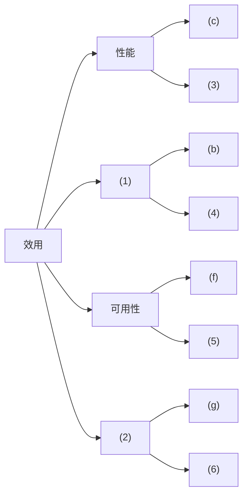
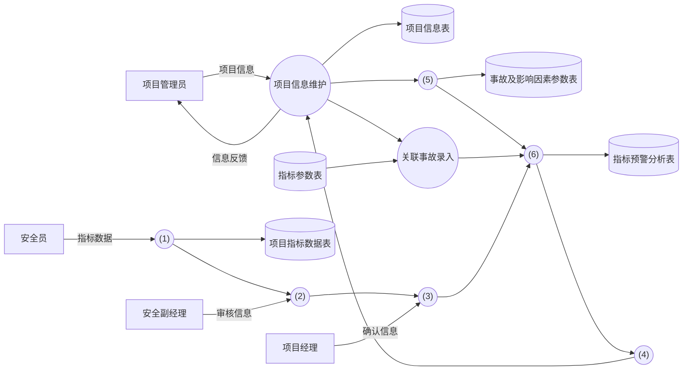
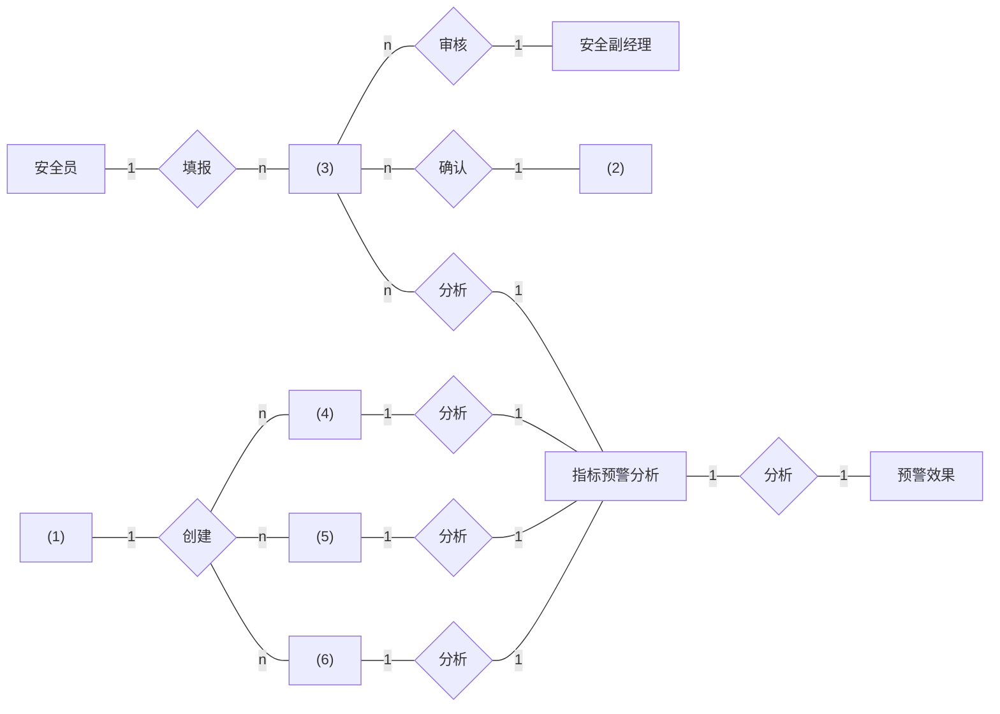
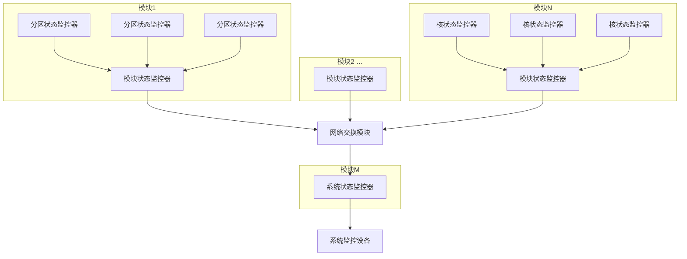
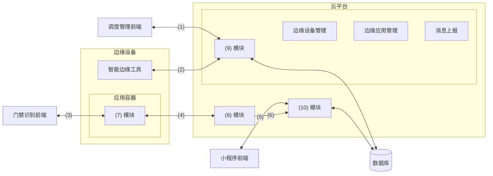

# 2022 年下半年系统架构设计师案例分析真题（清洗版）

> **主试题数量：** 5（共 14 个子问题）。
>
> **底稿路径：** [02.历年真题(补充)/2022年下半年-系统架构设计师-案例分析.md](<../02.历年真题(补充)/2022年下半年-系统架构设计师-案例分析.md>)
>
> **版本选择：** 采用统一清单指定的本地补充版；仓库未记录第二份同科目来源，未拼接其他试卷。
>
> **非官方性质：** 题面与参考答案均为第三方整理材料，不是考试主管机构发布的官方试卷或标准答案。
>
> **作答规则：** 按通常卷面结构，试题一必答，试题二至五任选二题；正式规则以当次原卷为准。
>
> **清洗状态：** 已按 5 道主试题整理，统一子问题与参考答案层级并移除显见排版噪声；另逐页目视核对固定提交中的 8 页非官方下午题 PDF，并用可追溯公开题页恢复 6 项可作答图表结构。
>
> **固定题面来源：** [Altria1979/System_Architect 固定提交中的 2022 年下午题 PDF](https://github.com/Altria1979/System_Architect/blob/472e0e3fc3860aa1dffcac9f1d278a943ea5eb59/%E7%9C%9F%E9%A2%98%20%28%E9%87%8D%E7%82%B9%29/%E5%8E%86%E5%B9%B4%E7%9C%9F%E9%A2%98%E5%8F%8A%E8%A7%A3%E6%9E%90/2022%E5%B9%B4%E7%B3%BB%E7%BB%9F%E6%9E%B6%E6%9E%84%E8%AE%BE%E8%AE%A1%E5%B8%88%E8%80%83%E8%AF%95%E4%B8%8B%E5%8D%88%E7%9C%9F%E9%A2%98.pdf.pdf)，访问日期：2026-07-12；固定提交为 `472e0e3fc3860aa1dffcac9f1d278a943ea5eb59`，Git blob 为 `e7c619ac500b963495a25aa516faa3768260b6b5`，本地 PDF SHA-256 为 `b14fca616b5f59882e9b0e00fe119a9860dd9042f4d2e5127d7e8c257cd3fba8`。该 8 页扫描件可核对题面，但六处图表位置均为空白，不能作为几何依据。
>
> **图表几何来源：** 图2-1、图2-2另由[按知识点导出的公开 PDF](https://oss.cheko.cc/e15bcf09a875e46990908331ac0a6352a966412c4686a0fe04067a4ed887f375.pdf)交叉核对，本地文件 SHA-256 为 `e15bcf09a875e46990908331ac0a6352a966412c4686a0fe04067a4ed887f375`；六项结构还分别对照希赛公开题页，精确链接与图像校验值见相邻说明。所有来源均非考试主管机构发布的官方原卷；本文只转录空号、节点、连线、关系基数和表格单元格，不复制扫描页、水印或原图版式。固定 GitHub 仓库虽在该提交包含 Apache-2.0 许可证，也不代表其有权为第三方试题内容重新授权。
>
> **已知限制：** 六项标准缺图、缺表均已恢复为可作答的结构化重绘，但不是官方原图；E-R 实体答案、故障分类答案和智能门禁协议答案在第三方来源间存在冲突，均已就近隔离且未自动裁决。全卷仍未与官方原卷逐字核对。

---

## 试题一（25 分）

阅读以下关于软件架构设计与评估的叙述，在答题纸上回答问题1和问题2。
### 说明
某电子商务公司拟升级其会员与促销管理系统，向用户提供个性化服务，提高用户的粘性。在项目立项之初，公司领导层一致认为本次升级的主要目标是提升会员管理方式的灵活性，由于当前用户规模不大，业务也相对简单，系统性能方面不做过多考虑，新系统除了保持现有的四级固定会员制度外，还需要根据用户的消费金额、偏好、重复性等相关特征动态调整商品的折扣力度，并支持在特定的活动周期内主动筛选与活动主题高度相关的用户集合，提供个性化的打折促销活动。
在需求分析与架构设计阶段，公司提出的需求和质量属性描述如下：
(a)管理员能够在页面上灵活设置折扣力度规则和促销活动逻辑，设置后即可生效；
(b)系统应该具备完整的安全防护措施，支持对恶意攻击行为进行检测与报警；
(c)在正常负载情况下，系统应在0.3秒内对用户的界面操作请求进行响应；
(d)用户名是系统唯一标识，要求以字母开头，由数字和字母组合而成，长度不少于6个字符。
(e)在正常负载情况下，用户支付商品费用后在3秒内确认订单支付信息；
(f)系统主站点电力中断后，应在5秒内将请求重定向到备用站点；
(g)系统支持横向存储扩展，要求在2人天内完成所有的扩展与测试工作；
(h)系统宕机后，需要在10秒内感知错误，并自动启动热备份系统；
(i)系统需要内置接口函数，支持开发团队进行功能调试与系统诊断；
(j)系统需要为所有的用户操作行为进行详细记录，便于后期查阅与审计；
(k)支持对系统的外观进行调整和配置，调整工作需要在4人天内完成。
在对系统需求、质量属性描述和架构特性进行分析的基础上，系统架构师给出了两种候选的架构设计方案，公司目前正在组织相关专家对系统架构进行评估。

### 问题 1（12 分）
在架构评估过程中，质量属性效用树 (utility tree)是对系统质量属性进行识别和优先级排序的重要工具。请将合适的质量属性名称填入图1-1中(1)、(2)空白处，并选择题干描述的(a)~(k)填入(3)~(6)空白处，完成该系统的效用树。

图1-1会员与促销管理系统效用树

> **图表状态：** 原图未入库；下图依据[希赛试题一公开页](https://www.educity.cn/tiku/60098416.html)转录效用树的分支、既有选项字母和空号位置，是结构化重绘示意，不是原图。访问日期：2026-07-12；核对图像 SHA-256 为 `5bc1d5ce7c2492dd33ed08d2e9a559123cdc45714d3e820b5c42c45b40ae3cd3`。

#### 参考答案（非官方）
（1）安全性 （2）可修改性 （3）e （4）j （5）h （6）k

### 问题 2（13 分）
针对该系统的功能，李工建议采用面向对象的架构风格，将折扣力度计算和用户筛选分别封装为独立对象，通过对象调用实现对应的功能：王工则建议采用解释器(interpreters) 架构风格，将折扣力度计算和用户筛选条件封装为独立的规则，通过解释规则实现对应的功能。请针对系统的主要功能，从折扣规则的可修改性、个性化折扣定义灵活性和系统性能三个方面对这两种架构风格进行比较与分析，并指出该系统更适合采用哪种架构风格。

#### 参考答案（非官方）
解释器
可修改性：
面向对象风格通过编写新的规则实现代码，并通过应用重启或热加载添加规则，可修改性稍差；解释器风格通过编写新的规则文件，并通过导入资源文件或外部配置添加规则，可修改性较好。
灵活性：
面向对象风格通过策略模式定义规则对象，规则以程序逻辑实现，灵活性较差，解释器风格可灵活定义规则计算表达式，灵活性更好。
性能：
面向对象风格以编译后代码运算规则，性能好；而虚拟机风格需要加载规则，解析规则，规则运算，再得出结果，性能较差。
从项目关注点来看，系统性能不做过多考虑，则王工建议的解释器风格较为合适；但根据项目需求来看，规则系统风格更加合适该项目。

---

## 试题二（25 分）

阅读以下关于软件系统设计与建模的叙述，在答题纸上回答问题1至问题3。
### 说明
煤炭生产是国民经济发展的主要领域之一，其煤矿的安全非常重要。某能源企业拟
开发一套煤矿建设项目安全预警系统，以保护煤矿建设项目从业人员生命安全。本系统
的主要功能包括如下(a)~(h)所述。
(a)项目信息维护
(b)影响因素录入
(c)关联事故录入
(d)安全评价得分
(e)项目指标预警分析
(f)项目指标填报
(g)项目指标审核
(h)项目指标确认

### 问题 1（9 分）
王工根据煤矿建设项目安全预警系统的功能要求，设计完成了系统的数据流图，如
图2-1所示。请使用题干中描述的功能(a)~(h)，补充完善空(1)~(6)处的内容，
并简要介绍数据流图在分层细化过程中遵循的数据平衡原则。

图2-1 煤矿建设项目安全预警系统数据流图

> **图表状态：** 原图未入库；下图依据文件头所列公开 PDF 第 1 页及[希赛试题二公开页](https://www.educity.cn/tiku/60098417.html)转录外部实体、加工、数据存储、数据流方向和空号位置，是结构化重绘示意，不是原图。访问日期：2026-07-12；希赛核对图像 SHA-256 为 `4a2777c150b3ba5c1aab54c9d3f5f6bada185d4e635f49eed204087d786401be`。

#### 参考答案（非官方）
(1)f (2)g (3)h (4)d (5)b (6)e
层间平衡：数据流个数一致，方向一致
图内平衡：有输入无输出的黑洞，有输出无输入的奇迹，输入不足的灰洞

### 问题 2（9 分）
请根据【问题1】中数据流图表示的相关信息，补充完善煤矿建设项目安全预警系统总体ER图(见图2-2)中实体(1)-(6)的具体内容，将正确答案填在答题纸上。

图2-2 煤矿建设项目安全预警系统总体E-R图

> **图表状态：** 原图未入库；下图依据文件头所列公开 PDF 第 2 页及[希赛试题二公开页](https://www.educity.cn/tiku/60098417.html)转录实体、关系、基数和空号位置，是结构化重绘示意，不是原图。访问日期：2026-07-12；希赛核对图像 SHA-256 为 `81e4fd79e4163749ae6bc3984f0283330b59ff2391dcf146fd6723e862b74e41`。

> **版本冲突：** 本地底稿答案写为 `(3)`“项目指标”，并把 `(4)～(6)` 依次写成“项目信息、影响因素、关联事故”；公开 PDF 与希赛解析写为 `(3)`“项目指标数据”，且将 `(4)～(6)` 解释为“指标参数、项目信息、事故及影响因素参数”，不限定三者顺序。两者均非官方，本文只恢复关系结构，不自动改写下方答案。

#### 参考答案（非官方）
(1)项目管理员    (2)项目经理    (3)项目指标    (4)项目信息    (5)影响因素    (6)关联事故

### 问题 3（7 分）
在结构化分析和设计过程中，数据流图和数据字典是常用的技术手段，请用200字
以内的文字简要说明它们在软件需求分析和设计阶段的作用。

#### 参考答案（非官方）
在分析阶段：
数据流图用于界定系统上下文范围和建立业务流程的加工说明，自顶向下对系统进行功能分解；指明数据在系统内移动变换；描述功能及加工规约。
数据字典用于建立业务概念有组织的集合，是模型核心库，有组织的系统相关数据元素列表，使涉众对模型中元素有共同的理解。
在设计阶段
结构化设计根据不同的数据流图类别分别做变换和事务映射来初始化系统结构图；根据数据字典中的数据存储描述来建立数据库存储设计。

---

## 试题三（25 分）

阅读以下关于嵌入式系统故障检测和诊断的相关描述，在答题纸上回答问题1至问题3
### 说明
系统的故障检测和诊断是宇航系统提高装备可靠性的主要技术之一，随着装备信息化的发展，分布式架构下的资源配置越来越多、资源布局也越来越分散，这对系统的故障检测和诊断方法提出了新的要求，为了适应宇航装备的分布式综合化电子系统的发展，解决由于系统资源部署的分散性，造成系统状态的综合和监控困难的问题，公司领导安排张工进行研究。张工经过分析、调研提出了针对分布式综合化电子系统架构的故障检测和诊断的方案。

### 问题 1（8 分）
张工提出：宇航装备的软件架构可采用四层的层次化体系结构，即模块支持层、操作系统层、分布式中间件层和功能应用层。为了有效、方便地实现分布式系统的故障检测和诊断能力，方案建议将系统的故障检测和诊断能力构建在分布式中间件内，通过使用心跳或者超时探测技术来实现故障检测器。请用300字以内的文字分别说明心跳检测和超时探测技术的基本原理及特点。

#### 参考答案（非官方）
心跳检测技术是节点每隔一个固定周期就向其他节点发送心跳信息，表示自己存活。如果其他节点在几个周期之后仍然没有收到来自此节点的心跳，就认定节点已失效，接管其资源和服务。其优点是可以快速反应，缺点是容易产生误判。为了减少误判，通常会采用多种介质冗余传输心跳信息，如串口、网络、共享磁盘等。
超时探测技术是节点主动向被探测节点发出PING信号，被探测节点则在收到PING信号后回复一个ECHO信号，表示自己的健康状态良好，还可以附加一些状态信息。如果在预定的时间之后仍然收不到ECHO信号，则判定被探测节点失效。优点是可以获得更详细的探测结果，缺点是判断的周期较长。

### 问题 2（8 分）
张工针对分布式综合化电子系统的架构特征，给出了初步设计方案，指出每个节点的故障监测与诊断器主要负责监控系统中所有的故障信息，并将故障信息进行综合分析判断，使用故障诊断器分析出故障原因，给出解决方案和措施。系统可以给模块的每个处理机器核配置核状态监控器、给每个分区配置分区状态监控器、给每个模块配置模块状态监控器、给系统配置系统状态监控器，如图3-1所示。

图3-1系统故障检测和诊断原理

> **图表状态：** 原图未入库；下图依据[希赛试题三公开页](https://www.educity.cn/rk/5443818.html)转录模块、各级状态监控器、网络交换模块和系统监控设备之间的层次与连接，是结构化重绘示意，不是原图。访问日期：2026-07-12；核对图像 SHA-256 为 `61fbb2fffb1323ac11711fe5c13ce9b2b930acf29cde2dee79894f37ff8027f9`。

请根据下面给出的分布式综合化电子系统可能产生的故障(a)-(h)，判断这些故障分别属于哪类监控器检测的范围，完善表3-1的(1)～(8)的空白。
(a)应用程序除零
(b)看门狗故障
(c)任务超时
(d)网络诊断故障
(e)BIT检测故障
(f)分区堆栈溢出
(g)操作系统异常
(h)模块掉电
表3-1故障分类

> **图表状态：** 原表未入库；下表依据[希赛试题三公开页](https://www.educity.cn/rk/5443818.html)转录表头、监控器类别和空号分组，不是原表。访问日期：2026-07-12；核对图像 SHA-256 为 `ed44d564acd473eaec97a169470e1b2832b22c8e92e06a1153d529806d668351`。

| 监控器类别 | 故障空号 |
|---|---|
| 核状态监控器 | (1)、(2) |
| 分区状态监控器 | (3) |
| 模块状态监控器 | (4)、(5)、(6) |
| 系统状态监控器 | (7)、(8) |

> **版本冲突：** 本地底稿答案依次给出 `(1)a、(2)b、(3)f、(4)c、(5)e、(6)h、(7)d、(8)g`；希赛解析按表中类别给出核状态 `a、c`，分区状态 `f`，模块状态 `b、e、g`，系统状态 `d、h`。两者均非官方，本文保留原底稿答案并只转录空号分组，不自动裁决。

#### 参考答案（非官方）
(1)a (2)b (3)f (4)c (5)e (6)h (7)d (8)g

### 问题 3（9 分）
张工在方案中指出，本系统的故障诊断采用故障诊断器实现，它可综合多种故障信息和系统状态，依据智能决策数据库提供的决策策略判定出故障类型和处理方法。智能决策数据库中的策略可以对故障开展定性或定量分析，通常，在定量分析中，普遍采用基于解析模型的方法和数据驱动的方法，张工在方案中提出该系统定量分析时应采用基于解析模型的方法。但是此提议受到王工的反对，王工指出采用数据驱动的方法更适合分布式综合化电子系统架构的设计。请用300字以内的文字，说明数据驱动方法的基本概念，以及王工提出采用此方法的理由。

#### 参考答案（非官方）
数据驱动方法是一种问题求解方法。从初始的数据或观测值出发，运用启发式规则，寻找和建立内部特征之间的关系，从而发现一些定理或定律。通常也指基于大规模统计数据的自然语言处理方法。
在本题中，由于是分布式环境，需要综合多种故障信息和系统状态，依据智能决策数据库的决策策略判定，如果采用预先定制的解析模型，这个模型可能会非常复杂。因此采用数据驱动方法能通过已有的数据去训练模型，可以达到逐渐精细化，并兼容未来的变化。

---

## 试题四（25 分）

阅读以下关于数据库缓存的叙述，在答题纸上回答问题1至问题3
### 说明
某大型电商平台建立了一个在线 B2B 商店系统，并在全国多地建设了货物仓储中心，通过提前备货的方式来提高货物的运送效率。但是在运营过程中，发现会出现很多跨仓储中心调货从而延误货物运送的情况。为此，该企业计划新建立一个全国仓储货物管理系统，在实现仓储中心常规管理功能之外，通过对在线 B2B商店系统中订单信息进行及时的分析和挖掘，并通过大数据分析预测各地仓储中心中各类货物的配置数量，从而提高运送效率，降低成本。
当用户通过在线 B2B商店系统选购货物时，全国仓储货物管理系统会通过该用户所在地址、商品类别以及仓储中心的货物信息和地址，实时为用户订单反馈货物起运地(某仓储中心)并预测送达时间。反馈送达时间的响应时间应小于1秒。
为满足反馈送达时间功能的性能要求，设计团队建议在全国仓储货物管理系统中采用数据缓存集群的方式，将仓储中心基本信息、商品类别以及库存数量放置在内存的缓存中，而仓储中心的其它商品信息则存储在数据库系统。

### 问题 1（9 分）
设计团队在讨论缓存和数据库的数据一致性问题时，李工建议采取数据实时同步更新方案，而张工则建议采用数据异步准实时更新方案。
请用200字以内的文字，简要介绍两种方案的基本思路，说明全国仓储货物管理系统应该来用哪种方案，并说明采取该方案的原因。

#### 参考答案（非官方）
李工同步方案思路：
更新数据时在同一事务内依此完成删除缓存，更新数据库，再写入缓存。
张工异步准实时方案思路：
更新数据时在同一事务内首先通过消息队列发布待更新数据的消息给缓存更新服务，再更新数据库；缓存更新服务订阅消息队列，待收到更新事件执行缓存更新。
项目数据量极大，且性能要求高，较适合采用张工提出的异步准实时方案较好。

### 问题 2（9 分）
随着业务的发展，仓储中心以及商品的数量日益增加，需要对集群部署多个缓存节点，提高缓存的处理能力。李工建议采用缓存分片方法，把缓存的数据拆分到多个节点分别存储，减轻单个缓存节点的访问压力，达到分流效果。
缓存分片方法常用的有哈希算法和一致性哈希算法，李工建议采用一致性哈希算法来进行分片。请用200字以内的文字简要说明两种算法的基本原理，并说明李工采用一致性哈希算法的原因。

#### 参考答案（非官方）
哈希算法通过某种哈希算法散列得到一个值，按该值将数据分配到集群响应节点进行缓存。
一致性哈希算法将整个哈希值空间映射成一个按顺时针方向组织的虚拟圆环，使用哈希算法算出数据哈希值，然后根据哈希值的位置沿圆环顺时针查找，将数据分配到第一个遇到的集群节点进行缓存。
一致性哈希算法有两大优点，
1）,,可扩展性。一致性哈希算法保证了增加或减少服务器时，数据存储的改变最少，相比传统哈希算法大大节省了数据移动的开销。
2）, 更好地适应数据的快速增长。

### 问题 3（7 分）
全国仓储货物管理系统开发完成，在运营一段时间后，系统维护人员发现大量黑客故意发起非法的商品送达时间查询请求，造成了缓存穿透，张工建议尽快采用布隆过滤器方法解决。请用200字以内的文字解释布隆过滤器的工作原理和优缺点。

#### 参考答案（非官方）
布隆过滤器的原理是当一个元素被加入集合时，通过K个散列函数将这个元素映射成一个位数组中的K个点，把它们置为1。检索时，只要看看这些点是不是都是1就大概知道集合中有没有它了；如果这些点有任何一个0，则被检元素一定不在；如果都是 1，则被检元素很可能在。
优点：
1.,增加和查询元素的时间复杂度为：O(K), (K为哈希函数的个数，一般比较小)，与数据量大小无关
2.,哈希函数相互之间没有关系，方便硬件并行运算
3.,布隆过滤器不需要存储元素本身，在某些对保密要求比较严格的场合有很大优势
4.,在能够承受一定的误判时，布隆过滤器比其他数据结构有这很大的空间优势
5.,数据量很大时，布隆过滤器可以表示全集，其他数据结构不能
6.,使用同一组散列函数的布隆过滤器可以进行交、并、差运算
缺点：
1.,有误判率
2.,不能获取元素本身
3.,一般情况下不能从布隆过滤器中删除元素
4.,如果采用计数方式删除，可能会存在计数回绕问题

---

## 试题五（25 分）

阅读以下关于Web系统架构设计的叙述，在答题纸上回答问题1至问题3
### 说明
某公司拟开发一套基于边缘计算的智能门禁系统，用于如园区、新零售、工业现场等存在来访、被访业务的场景。来访者在来访前，可以通过线上提前预约的方式将自己的个人信息记录在后台，被访者在系统中通过此请求后，来访者在到访时可以直接通过“刷脸”的方式通过门禁，无需做其他验证。此外，系统的管理员可对正在运行的门禁设备进行管理。
基于项目需求，该公司组建项目组，召开了项目讨论会。会上，张工根据业务需求并结合边缘计算的思想，提出本系统可由访客注册模块、模型训练模块、端侧识别模块与设备调度平台模块等四项功能组成，李工从技术层面提出该系统可使用 Flask 框架与SSM 框架为基础来开发后台服务器，将开发好的系统通过 Docker 进行部署，并使用MQTT 协议对 Docker 进行管理。

### 问题 1（5 分）
MQTT协议在工业物联网中得到广泛的应用，请用300字以内的文字简要说明MQTT协议。

#### 参考答案（非官方）
MQTT是一个物联网传输协议，它被设计用于轻量级的发布/订阅式消息传输，旨在为低带宽和不稳定的网络环境中的物联网设备提供可靠的网络服务。MQTT是专门针对物联网开发的轻量级传输协议。MQTT协议针对低带宽网络，低计算能力的设备，做了特殊的优化，使得其能适应各种物联网应用场景。

### 问题 2（14 分）
在会议上，张工对功能模块进行了更进一步的说明：访客注册模块用于来访者提交申请与被访者确认申请，主要处理提交来访申请、来访申请审核业务，同时保存访客数据，为训练模块准备训练数据集：模型训练模块用于使用访客数据进行模型训练，为端侧设备的识别业务提供模型基础；端侧识别模块在边缘门禁设备上运行，使用训练好的模型来识别来访人员，与云端服务协作完成访客来访的完整业务；设备调度平台模块用于对边缘门禁设备进行管理，管理人员能够使用平台对边缘设备进行调度管理与状态监控，实现云端协同。
图5-1给出了基于边缘计算的智能门禁系统架构图，请结合 HTTP 协议和 MQTT协议的特点，为图5-1中(1)~(6)处选择合适的协议：并结合张工关于功能模块的描述，补充完善图5-1中(7)~(10)处的空白。

> **图表状态：** 原图未入库；下图依据[希赛试题五公开页](https://www.educity.cn/tiku/60098420.html)转录前端、边缘设备、云平台、数据库、协议空号和模块空号之间的连接，是结构化重绘示意，不是原图；并以[墨天轮公开整理页](https://www.modb.pro/db/1707604719676518400)交叉核对几何关系。访问日期：2026-07-12；两处核对图像 SHA-256 分别为 `c948c0157e8b4a64b979f74bed293df81a67c16857c3433686bbf5286745933a`、`fe9c3b330722f71d2c5fb97d219b2f8807c41600c410761f29ae69cb2df0248e`。

> **版本冲突：** 本地底稿的 `(1)～(6)` 为 `HTTP、HTTP、MQTT、HTTP、HTTP、HTTP`；希赛解析为 `HTTP、MQTT、HTTP、HTTP、HTTP、HTTP`；墨天轮文字整理则为 `HTTP、MQTT、MQTT、MQTT、HTTP、HTTP`。三者均非官方，且后两处复用了相同几何图；本文只恢复空号连接，不自动改写下方答案。

#### 参考答案（非官方）
(1)HTTP (2)HTTP (3)MQTT (4)HTTP (5)HTTP (6)HTTP
(7)端侧识别模块 (8)模型训练模块 (9)设备调度平台模块 (10)访客注册模块

### 问题 3（6 分）
请用300字以内的文字，从数据通信、数据安全和系统性能等方面简要分析在传统云计算模型中引入边缘计算模型的优势。

#### 参考答案（非官方）
速度：如果使用边缘计算，则物联网设备将在边缘数据中心或本地处理数据。因此，数据无需传输回中央服务器，速度优势明显;
安全：边缘计算将在不同的数据中心和设备之间分配数据处理工作。黑客无法通过攻击一台设备来影响整个网络;
可扩展性：通过购买具有足够计算能力的设备来扩展边缘网络。企业无需为其数据需求建立自己的私有或集中式数据中心;
可靠性：所有的边缘数据中心和物联网设备都位于用户附近。因此，网络中断的可能性非常小。

---
