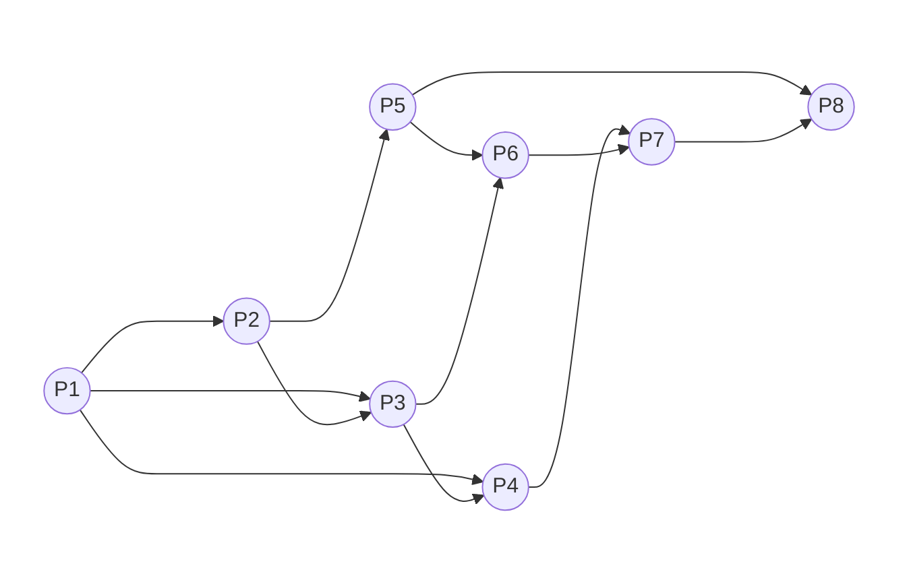
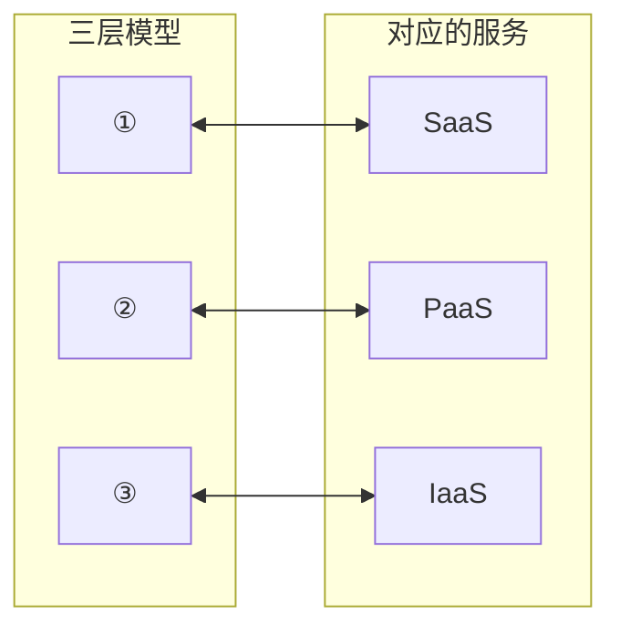
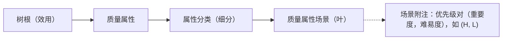

# 2022 年下半年系统架构设计师综合知识真题（清洗版）

> **题目数量：** 75（题号 1—75 连续；每题保留 A—D 四个选项、现有答案及解析）。
>
> **底稿路径：** [02.历年真题/2022年下半年-系统架构设计师-综合知识.md](../02.历年真题/2022年下半年-系统架构设计师-综合知识.md)
>
> **版本选择：** 采用统一清单指定的本地原始版。备选的[本地补充版](<../02.历年真题(补充)/2022年下半年-系统架构设计师-综合知识.md>)仅用于确认其自身也有 75 个题号；两版题面并不相同，本文件没有按题号覆盖或拼接备选内容。
>
> **非官方性质：** 两个本地版本及本文件中的答案、解析均为第三方整理，不是考试主管机构发布的官方试卷或标准答案。
>
> **图表恢复来源（非官方）：** [xiaomabenten/system_architect 固定提交中的《2022年系统架构设计师考试上午真题》PDF](<https://github.com/xiaomabenten/system_architect/blob/2e04df6ab9076f99c101a5b00f3e89fb3e4e1761/03%E3%80%81%E5%8E%86%E5%B9%B4%E7%9C%9F%E9%A2%98(2009%E5%B9%B4-2025%E5%B9%B4)%2B%E7%AD%94%E6%A1%88%E8%A7%A3%E6%9E%90/2022%E5%B9%B4/2022%E5%B9%B4%E7%B3%BB%E7%BB%9F%E6%9E%B6%E6%9E%84%E8%AE%BE%E8%AE%A1%E5%B8%88%E8%80%83%E8%AF%95%E4%B8%8A%E5%8D%88%E7%9C%9F%E9%A2%98.pdf>)（固定提交 `2e04df6ab9076f99c101a5b00f3e89fb3e4e1761`，Git blob `15e8c90e4cd48f07e3f896811c2f5c42ec081f03`，本地核对文件 SHA-256 `B38E0CB0A425D127CF3DE004876E44E7C2DC8573C46475787F7A8A2163141184`，访问日期：2026-07-12）。该 PDF 共 24 页，已逐页目视核对。
>
> **来源题号映射：** 固定 PDF 第 1、2、4 题分别对应本稿第 15、3、5 题，固定 PDF 第 59、70 题对应本稿同号题；映射按完整题干而非题号猜测。第 15、3、5、70 题的题面图表分别见 PDF 第 1、2、3、23 页；第 59 题题面见第 19 页，但固定 PDF 未附解析示意图。
>
> **概念复核来源：** 第 59 题效用树层次另以 Carnegie Mellon University Software Engineering Institute 的 [CMU/SEI-2000-TR-004《ATAM: Method for Architecture Evaluation》](https://insights.sei.cmu.edu/documents/629/2000_005_001_13706.pdf)第 17 页（PDF 第 29 页，Figure 3）复核，访问日期：2026-07-12；本地核对文件 SHA-256 为 `F3D40302402A9F075615B2BF431E4ED84397CB4072FCA6D842432191E9BDF324`。
>
> **版权与复原边界：** 固定试题 PDF 不是考试主管机构发布的官方原卷，所在仓库也未声明适用于试题内容的许可证；本稿只转录表格单元格、节点、连线和层次关系，不嵌入扫描页，也不复制原图、原表版式。第 59 题解析图是依据现有文字与 SEI 官方概念文档绘制的学习示意，不冒充原卷图。
>
> **清洗状态：** 已统一题号、A—D 选项与答案结构，标注共用题干空位，移除章节标签和页面噪声，核验 75 道题均有一个现有答案，并恢复第 3、5、15、70 题的作答所需图表及第 59 题解析示意。
>
> **已知限制：** 尚未与官方原卷逐题校对；五处图表均为结构化转录或重绘，不是官方原图、原表。固定 PDF 第 70 题 D 项与本地首选底稿存在差异，已在题下并列记录而未改动本地选项；所有答案和解析仍按非官方底稿保留，不能据此标为官方完整或高可信度。

---

## 第1题

基于体系结构的软件设计（Architecture-Based Software Design，ABSD）方法是体系结构驱动，即指构成体系结构的（ ）的组合驱动的。ABSD方法是一个自顶向下、递归细化的方法，软件系统的体系结构通过该方法得到细化，直到能产生（ ）。

> **共用题干：** 本题对应上述题干的第 1 空（共 2 空）。

- **A.** 产品、功能需求和设计活动
- **B.** 商业、质量和功能需求
- **C.** 商业、产品和功能需求
- **D.** 商业、质量和设计活动

**正确答案：B**

**解析：**

基于架构的软件设计（Architecture-Based Software Design，ABSD）方法强调由商业、质量和功能需求的组合驱动软件架构设计。ABSD是一个自顶向下，递归细化的软件开发方法，软件系统的体系结构通过该方法得到细化，直到能产生软件构件和类。它以软件系统功能的分解为基础，通过选择架构风格实现质量和商业需求，并强调在架构设计过程中使用软件架构模板。ABSD方法有三个基础：第一个基础是功能分解，在功能分解中使用已有的基于模块的内聚和耦合技术。第二个基础是通过选择体系结构风格来实现质量和商业需求。第三个基础是软件模板的使用。所以第一空答案为B选项，第二空答案也为B选项。

---

## 第2题

基于体系结构的软件设计（Architecture-Based Software Design，ABSD）方法是体系结构驱动，即指构成体系结构的（ ）的组合驱动的。ABSD方法是一个自顶向下、递归细化的方法，软件系统的体系结构通过该方法得到细化，直到能产生（ ）。

> **共用题干：** 本题对应上述题干的第 2 空（共 2 空）。

- **A.** 软件产品和代码
- **B.** 软件构件和类
- **C.** 软件构件和连接件
- **D.** 类和软件代码

**正确答案：B**

**解析：**

基于架构的软件设计（Architecture-Based Software Design，ABSD）方法强调由商业、质量和功能需求的组合驱动软件架构设计。ABSD是一个自顶向下，递归细化的软件开发方法，软件系统的体系结构通过该方法得到细化，直到能产生软件构件和类。它以软件系统功能的分解为基础，通过选择架构风格实现质量和商业需求，并强调在架构设计过程中使用软件架构模板。ABSD方法有三个基础：第一个基础是功能分解，在功能分解中使用已有的基于模块的内聚和耦合技术。第二个基础是通过选择体系结构风格来实现质量和商业需求。第三个基础是软件模板的使用。所以第一空答案为B选项，第二空答案也为B选项。

---

## 第3题

前趋图(Precedence Graph)是一个有向无环图，记为：→={(Pi, Pj) | Pi must complete before Pj may start}，假设系统中进程P={P1，P2，P3，P4，P5，P6，P7，P8}，且进程的前趋图如下图所示。那么,该前趋图可记为（ ）

> **结构化重绘示意（不是原卷图，来源非官方）：** 固定 PDF 第 2 页的 8 个节点和 12 条有向边逐条转录如下；节点位置和扫描图样式未复制。

- **A.** →={(P1，P2) ,(P1，P3),(P1，P4),(P2，P5),(P3，P5),(P4，P7) ,(P5，P6) ,(P5，P7), (P7，P6) ,(P4，P5) , (P6，P7) , (P7，P8)}
- **B.** →={ (P1，P2) , (P1，P3),(P1，P4) ,(P2，P3) , (P2，P5), (P3，P4), (P3，P6),(P4，P7) , (P5，P6) ,(P5，P8), (P6，P7), (P7，P8) }
- **C.** →={(P1，P2) ,(P1，P3), (P1，P4) ,(P2，P3), (P2，P5),(P3，P4) , (P3，P5),(P4，P6) ,(P5，P7) ,(P5，P8),(P6，P7) ,(P7，P8) }
- **D.** →={(P1，P2) ,(P1，P3),(P2，P3) ,(P2，P5), (P3，P4), (P3，P6) ,(P4，P7),(P5，P6), (P5，P8), (P6，P7) , (P6，P8), (P7，P8) }

**正确答案：B**

**解析：**

按数字先小后大原则找出箭头表示的12对逻辑关系∶{ (P1，P2) , (P1，P3), (P1，P4) , (P2，P3),(P2，P5) ,(P3，P4) ,(P3，P6),(P4，P7) ,(P5，P6) ,(P5，P8) ,(P6，P7) ，(P7，P8) }，经核对只有B为正确选项。

A、C选项均有(P3，P5)，而图中无此逻辑，显然不对，排除;

D选项缺(P1，P1)，排除。

---

## 第4题

若系统正在将（ ）文件修改的结果写回磁盘时系统发生掉电，则对系统的影响相对较大。

- **A.** 目录
- **B.** 空闲块
- **C.** 用户程序
- **D.** 用户数据

**正确答案：A**

**解析：**

当文件处于“未打开”状态时，文件需占用三种资源：一个目录项；一个磁盘索引节点项；若干个盘块。当文件被引用或“打开”时，须再增加三种资源：一个内存索引节点项，它驻留在内存中；文件表中的一个登记项；用户文件描述符表中的一个登记项。由于对文件的读写管理，必须涉及上述各种资源，因而对文件的读写管理，又在很大程度上依赖于对这些资源的管理，故可从资源管理观点上来介绍文件系统。这样，对文件的管理就必然包括：①对索引节点的管理；②对空闲盘块的管理；③对目录文件的管理；④对文件表和描述符表的管理；⑤对文件的使用。因此如果目录文件在写回磁盘时发生异常，对系统的影响是很大的。对于空闲块、用户数据和程序并不影响系统的工作，因此不会有较大的影响。所以答案选择A选项。

---

## 第5题

在磁盘调度管理中，应先进行移臂调度，再进行旋转调度。假设磁盘移动臂位于20号柱面上，进程的请求序列如下表所示。如果采用最短移臂调度算法，那么系统的响应序列应为（ ）。

> **结构化转录（不是原卷表格，来源非官方）：** 固定 PDF 第 3 页第 4 题的请求表转录如下；只保留单元格内容，不复制扫描表格版式。

| 请求序列 | 柱面号 | 磁头号 | 扇区号 |
|---:|---:|---:|---:|
| ① | 18 | 8 | 6 |
| ② | 16 | 6 | 3 |
| ③ | 16 | 9 | 6 |
| ④ | 21 | 10 | 5 |
| ⑤ | 18 | 8 | 4 |
| ⑥ | 21 | 3 | 10 |
| ⑦ | 18 | 7 | 6 |
| ⑧ | 16 | 10 | 4 |
| ⑨ | 22 | 10 | 8 |

- **A.** ②⑧③④⑤①⑦⑥⑨
- **B.** ②③⑧④⑥⑨①⑤⑦
- **C.** ④⑥⑨⑤⑦①②⑧③
- **D.** ④⑥⑨⑤⑦①②③⑧

**正确答案：C**

**解析：**

当进程请求读磁盘时，操作系统先进行移臂调度，再进行旋转调度。由于移动臂位于20号柱面上，按照最短寻道时间优先的响应柱面序列为20->21->22->18->16。进程在21号柱面上的请求序列有④⑥。进程在22号柱面上的请求序列有⑨。进程在18号柱面上的请求序列有⑤⑦①。进程在16号柱面上的请求序列有②③⑧。然后再根据扇区号从小到大，在21号柱面上的请求序列应该先读④（5号扇区），再是⑥（10号扇区），在18号柱面上的请求序列应该先读⑤（4号扇区），再是⑦和①（6号扇区），进程在16号柱面上的请求序列先读②（3号扇区），再是⑧（4号扇区），最后是③（6号扇区），所以系统的响应序列应为④⑥⑨⑤⑦①②⑧③，答案选择C选项。

---

## 第6题

采用三级模式结构的数据库系统中，如果对一个表创建聚簇索引，那么改变的是数据库的（ ）。

- **A.** 外模式
- **B.** 模式
- **C.** 内模式
- **D.** 用户模式

**正确答案：C**

**解析：**

本题考查数据库三级模式两级映射。对于三级模式，分为外模式，模式和内模式。其中外模式对应视图级别，是用户与数据库系统的接口，是用户用到那部分数据的描述，比如说：用户视图；对于模式而言，又叫概念模式，对于表级，是数据库中全部数据的逻辑结构和特质的描述，由若干个概念记录类型组成，只涉及类型的描述，不涉及具体的值；而对于内模式而言，又叫存储模式，对应文件级，是数据物理结构和存储方式的描述，是数据在数据库内部表示的表示方法，定义所有内部的记录类型，索引和文件的组织方式，以及数据控制方面的细节。例如：B树结构存储，Hash方法存储，聚簇索引等等。所以如果对一个表创建聚簇索引，那么改变的是数据库的内模式。答案选择C选项。

---

## 第7题

假设系统中有正在运行的事务，若要转储全部数据库，则应采用 （ ）方式。

- **A.** 静态全局转储
- **B.** 动态增量转储
- **C.** 静态增量转储
- **D.** 动态全局转储

**正确答案：D**

**解析：**

数据的转储分为静态转储和动态转储、海量转储和增量转储。①静态转储和动态转储。静态转储是指在转储期间不允许对数据库进行任何存取、修改操作；动态转储是在转储期间允许对数据库进行存取、修改操作，故转储和用户事务可并发执行。②海量转储和增量转储。海量转储是指每次转储全部数据；增量转储是指每次只转储上次转储后更新过的数据。综上所述，假设系统中有运行的事务，若要转储全部数据库应采用动态全局转储方式。答案选择D选项。

---

## 第8题

完整的信息安全系统至少包含三类措施，即技术方面的安全措施、管理方面的安全措施和相应的（ ）。其中，信息安全的技术措施主要有：信息加密、数字签名、身份鉴别、访问控制、网络控制技术、反病毒技术、（ ）。

> **共用题干：** 本题对应上述题干的第 1 空（共 2 空）。

- **A.** 用户需求
- **B.** 政策法律
- **C.** 市场需求
- **D.** 领域需求

**正确答案：B**

**解析：**

一个完整的信息安全系统至少包含三类措施：技术方面的安全措施，管理方面的安全措施和相应的政策法律。 信息安全技术涉及信息传输的安全、信息存储的安全以及对网络传输信息内容的审计三方面，当然也包括对用户的鉴别和授权。信息安全的技术措施主要有：信息加密、数字签名、身份鉴别、访问控制、网络控制技术、反病毒技术、数据备份和灾难恢复。 实现安全管理，应有专门的安全管理机构；有专门的安全管理人员；有逐步完善的管理制度；有逐步提供的安全技术设施。 信息安全管理主要涉及以下几个方面：人事管理；设备管理；场地管理；存储媒体管理；软件管理；网络管理；密码和密钥管理。 国内的相关法规：中华人民共和国计算机安全保护条例、中华人民共和国商用密码条例 中华人民共和国计算机信息网络国际联网管理暂行办法、关于对与国际联网的计算机信息系统进行备案工作的通知、计算机信息网络国际联网安全保护管理办法等。 综上，答案选择B、C选项。

---

## 第9题

完整的信息安全系统至少包含三类措施，即技术方面的安全措施、管理方面的安全措施和相应的（ ）。其中，信息安全的技术措施主要有：信息加密、数字签名、身份鉴别、访问控制、网络控制技术、反病毒技术、（ ）。

> **共用题干：** 本题对应上述题干的第 2 空（共 2 空）。

- **A.** 数据备份和数据测试
- **B.** 数据迁移和数据备份
- **C.** 数据备份和灾难恢复
- **D.** 数据迁移和数据测试

**正确答案：C**

**解析：**

一个完整的信息安全系统至少包含三类措施：技术方面的安全措施，管理方面的安全措施和相应的政策法律。 信息安全技术涉及信息传输的安全、信息存储的安全以及对网络传输信息内容的审计三方面，当然也包括对用户的鉴别和授权。信息安全的技术措施主要有：信息加密、数字签名、身份鉴别、访问控制、网络控制技术、反病毒技术、数据备份和灾难恢复。 实现安全管理，应有专门的安全管理机构；有专门的安全管理人员；有逐步完善的管理制度；有逐步提供的安全技术设施。 信息安全管理主要涉及以下几个方面：人事管理；设备管理；场地管理；存储媒体管理；软件管理；网络管理；密码和密钥管理。 国内的相关法规：中华人民共和国计算机安全保护条例、中华人民共和国商用密码条例 中华人民共和国计算机信息网络国际联网管理暂行办法、关于对与国际联网的计算机信息系统进行备案工作的通知、计算机信息网络国际联网安全保护管理办法等。 综上，答案选择B、C选项。

---

## 第10题

给定关系模式R（U，F），其中U为属性集，F是U上的一组函数依赖，那么函数依赖的公理系统（Armstrong 公理系统）中的分解规则是指（ ）为F所蕴涵。

- **A.** 若X→Y，Y→Z，则X→Z
- **B.** 若Y⊆X⊆U，则X→Y
- **C.** 若X→Y，Z⊆Y，则X→Z
- **D.** 若X→Y，Y→Z，则X→YZ

**正确答案：C**

**解析：**

从已知的一些函数依赖，可以推导出另外一些函数依赖，这就需要一系列推理规则。函数依赖的推理规则最早出现在1974年W.W.Armstrong的论文里，这些规则常被称作“Armstrong公理”。
关系模式R<U，F>来说有以下的推理规则：
自反律（Reflexivity）：若Y⊆X⊆U，则X→Y成立。
增广律（Augmentation）：若Z⊆U且X→Y，则XZ→YZ成立。
传递律（Transitivity）：若X→Y且Y→Z，则X→Z成立。
根据上面这三条推理规则可以得到下面三条推理规则：
合并规则：由X→Y，X→Z，有X→YZ。
伪传递规则：由X→Y，WY→Z，有XW→Z。
分解规则：由X→Y及Z⊆Y，有X→Z。
综上可以得出C选项为分解规则。所以答案选择C选项。

---

## 第11题

给定关系R（A，B，C，D)和S(A，C，E，F)，以下（ ）与𝜎R.B > S.E(R⋈S)等价。

- **A.** 𝜎 2 > 7(RxS)
- **B.** 𝜋 1,2,3,4,7,8(𝜎 1=5∧2 > 7∧3=6(RxS))
- **C.** 𝜎 2 > '7'(RxS)
- **D.** 𝜋 1,2,3,4,7,8(𝜎1=5∧2 > '7'∧3=6(RxS))

**正确答案：B**

**解析：**

本题求自然连接的笛卡尔积等价表达式，首先笛卡尔积需要选取同名属性列且值相等的元组，本题A、C为同属性名，因此需要满足R.A=S.A且R.C=S.C，转换为数字序号则为：1=5∧3=6。而对于选择条件R.B > S.E，转换为数字序号则为2 > 7，综上满足题意的只有B选项。

---

## 第12题

以下关于鸿蒙操作系统的叙述中，不正确的是（ ）。

- **A.** 鸿蒙操作系统整体架构采用分层的层次化设计，从下向上依次为：内核层、系统服务层、框架层和应用层
- **B.** 鸿蒙操作系统内核层采用宏内核设计，拥有更强的安全特性和低时延特点
- **C.** 鸿蒙操作系统架构采用了分布式设计理念，实现了分布式软总线、分布式设备虚拟化、分布式数据管理和分布式任务调度等四种分布式能力
- **D.** 架构的系统安全性主要体现在搭载HarmonyOS的分布式终端上，可以保证“正确的人，通过正确的设备，正确地使用数据”

**正确答案：B**

**解析：**

HarmonyOS系统架构整体上遵从分层设计，从下向上分为内核层、系统服务层、框架层和应用层。HarmonyOS系统功能按照“系统->子系统->功能/模块”逐步逐级展开，在多设备部署场景下，支持根据实际需求裁剪或增加子系统或功能/模块。
内核层：鸿蒙系统分为内核子系统和驱动子系统。在内核子系统中鸿蒙系统采用多内核设计，支持针对不同资源受限设备选用合适的OS内核；鸿蒙系统驱动框架是鸿蒙系统硬件生态开放的基础，它提供统一外设访问能力和驱动开发、管理框架。
系统服务层：系统服务层是鸿蒙系统的核心能力集合，通过框架层对应用程序提供服务。包含了系统基本能力子系统集、基础软件服务子系统集、增强软件服务子系统集、硬件服务子系统四个部分。
框架层：框架层为鸿蒙系统应用程序提供Java/C/C++/JS等多语言用户程序框架和Ability框架，及各种软硬件服务对外开放的多语言框架API，也为搭载鸿蒙系统的电子设备提供C/C++/JS等多语言框架API。
应用层：应用层包括系统应用和第三方非系统应用，鸿蒙系统应用由一个或多个FA或PA组成。
系统安全：在搭载鸿蒙系统的分布式终端上保证“正确的人通过正确的电子设备，正确地使用数据”。通过“分布式多段协同身份认证”保证“正确的人”，通过“在分布式终端构筑可信运行环境”保证“正确的电子设备”，通过“分布式数据在跨终端流动的过程中，对数据进行分类分级管理”来保证“正确地使用数据”。
综上，B选项说法错误。

---

## 第13题

系统（ ）是指在规定的时间内和规定条件下能有效地实现规定功能的能力。它不仅取决于规定的使用条件等因素，还与设计技术有关。常用的度量指标主要有故障率（或失效率）、平均失效等待时间、平均失效间隔时间和可靠度等。其中，（ ）是系统在规定工作时间内无故障的概率。

> **共用题干：** 本题对应上述题干的第 1 空（共 2 空）。

- **A.** 可靠性
- **B.** 可用性
- **C.** 可理解性
- **D.** 可测试性

**正确答案：A**

**解析：**

可靠性：指在规定的时间内和规定条件下能有效地实现规定功能的能力。它不仅取决于规定的使用条件等因素，还与设计技术有关。常用的度量指标主要有故障率（或失效率）、平均失效等待时间、平均失效间隔时间和可靠度等。其中，可靠度是系统在规定工作时间内无故障的概率。 可用性是系统能够正常运行的时间比例。经常用两次故障之间的时间长度或出现故障时系统能够恢复正常的速度来表示。 可测试性：是指验证软件程序正确的难易程度。可测试性好的软件，通常意味着软件设计简单，复杂性低。因为软件的复杂性越大，测试的难度也就越大。 可理解性：通过阅读源代码和相关文档，了解程序功能及其如何运行的容易程度。 综上，答案应该为AD。

---

## 第14题

系统（ ）是指在规定的时间内和规定条件下能有效地实现规定功能的能力。它不仅取决于规定的使用条件等因素，还与设计技术有关。常用的度量指标主要有故障率（或失效率）、平均失效等待时间、平均失效间隔时间和可靠度等。其中，（ ）是系统在规定工作时间内无故障的概率。

> **共用题干：** 本题对应上述题干的第 2 空（共 2 空）。

- **A.** 失效率
- **B.** 平均失效等待时间
- **C.** 平均失效间隔时间
- **D.** 可靠度

**正确答案：D**

**解析：**

可靠性：指在规定的时间内和规定条件下能有效地实现规定功能的能力。它不仅取决于规定的使用条件等因素，还与设计技术有关。常用的度量指标主要有故障率（或失效率）、平均失效等待时间、平均失效间隔时间和可靠度等。其中，可靠度是系统在规定工作时间内无故障的概率。 可用性是系统能够正常运行的时间比例。经常用两次故障之间的时间长度或出现故障时系统能够恢复正常的速度来表示。 可测试性：是指验证软件程序正确的难易程度。可测试性好的软件，通常意味着软件设计简单，复杂性低。因为软件的复杂性越大，测试的难度也就越大。 可理解性：通过阅读源代码和相关文档，了解程序功能及其如何运行的容易程度。 综上，答案应该为AD。

---

## 第15题

云计算服务体系结构如下图所示，图中①、②、③分别与SaaS、PaaS、IaaS相对应，图中①、②、③应为（ ）。

> **结构化重绘示意（不是原卷图，来源非官方）：** 固定 PDF 第 1 页第 1 题的三层纵向顺序及三组双向对应关系转录如下；保留待选编号，不把答案预填入图中。

- **A.** 应用层、基础设施层、平台层
- **B.** 应用层、平台层、基础设施层
- **C.** 平台层、应用层、基础设施层
- **D.** 平台层、基础设施层、应用层

**正确答案：B**

**解析：**

云计算包括三种基本类型。

1.软件即服务 软件即服务（Software-as-a-Service，SaaS）是基于互联网提供软件服务的软件应用模式。作为一种在21世纪开始兴起的创新的软件应用模式，SaaS是软件科技发展的最新趋势。SaaS提供商为企业搭建信息化所需要的所有网络基础设施及软件、硬件运作平台，并负责所有前期的实施、后期的维护等一系列服务，企业无须购买软硬件、建设机房、招聘IT人员，即可通过互联网使用信息系统。就像打开自来水龙头就能用水一样，企业根据实际需要，从SaaS提供商租赁软件服务。

2.平台即服务 平台即服务（Platform-as-a-Service，PaaS）是把服务器平台或者开发环境作为一种服务提供的商业模式，如将软件研发的平台作为一种服务，以SaaS的模式提交给用户。因此，PaaS也是SaaS模式的一种应用。但是，PaaS的出现可以加快SaaS的发展，尤其是加快SaaS应用的开发速度。
3.基础设施即服务 基础设施即服务（Infrastructure as a Service，IaaS）是指消费者通过Internet 可以从完善的计算机基础设施获得服务，如《纽约时报》就使用成百上千台AmazonEC2实例在36小时内处理TB级的文档数据。如果没有EC2，《纽约时报》处理这些数据将要花费数天或者数月的时间。

综上，图中①、②、③应为应用层、平台层、基础设施层，答案选择B选项。

---

## 第16题

GPU目前已广泛应用于各行各业，GPU中集成了同时运行在GHz的频率上的成千上万个core，可以高速处理图像数据。最新的GPU峰值性能可高达（ ）以上。

- **A.** 100 TFlops
- **B.** 50 TFlops
- **C.** 10 TFlops
- **D.** 1TFlops

**正确答案：A**

**解析：**

BR 100 通用GPU 16位浮点算力达到1000T以上、8位定点算力达到2000T以上，单芯片峰值算力达到PFLOPS级别，FP32算力超越英伟达在售旗舰GPU一个数量级。答案选择A选项。

注：2022年8月9日，壁仞科技发布首款通用GPU芯片BR100。实际性能指标还在持续提升。

---

## 第17题

AI芯片是当前人工智能技术发展的核心技术，其能力要支持训练和推理，通常，AI芯片的技术架构包括（ ）等三种。

- **A.** GPU、FPGA、ASIC
- **B.** CPU、FPGA、DSP
- **C.** GPU、CPU、ASIC
- **D.** GPU、FPGA、SOC

**正确答案：A**

**解析：**

AI芯片主要有三种技术架构
第一种是GPU，可以高效支持AI 应用的通用芯片，但是相对于FPGA和ASIC来说，价格和功耗过高；
第二种是FPGA（现场可编程门阵列），可对芯片硬件层进行编程和配置，实现半定制化，相对于GPU有更低的功耗；
第三种是ASIC（专用集成电路），专门为特定的 AI 产品或者服务而设计，主要是侧重加速机器学习（尤其是神经网络、深度学习），它针对特定的计算网络结构采用了硬件电路实现的方式，能够在很低的功耗下实现非常高的能效比，这也是目前AI 芯片中最多的形式。答案选择A选项。

---

## 第18题

以下关于HTTPS和HTTP协议的描述中，不正确的是（ ）。

- **A.** HTTPS协议使用加密传输
- **B.** HTTPS协议默认服务端口号是443
- **C.** HTTP协议默认服务端口号是80
- **D.** 电子支付类网站应使用HTTP协议

**正确答案：D**

**解析：**

HTTP协议传输的数据都是未加密的，也就是明文的，因此使用HTTP协议传输隐私信息非常不安全，为了保证这些隐私数据能加密传输，SSL协议用于对HTTP协议传输的数据进行加密，从而就诞生了HTTPS。简单来说，HTTPS协议是由SSL+HTTP协议构建的可进行加密传输、身份认证的网络协议，要比http协议安全。
HTTPS和HTTP的区别主要如下：
1、https协议需要到ca申请证书，一般免费证书较少，因而需要一定费用。
2、http是超文本传输协议，信息是明文传输，https则是具有安全性的ssl加密传输协议。
3、http和https使用的是完全不同的连接方式，用的端口也不一样，前者是80，后者是443。
4、http的连接很简单，是无状态的；HTTPS协议是由SSL+HTTP协议构建的可进行加密传输、身份认证的网络协议，比http协议安全
综上，D选项说法错误，电子支付类网站应使用HTTPS协议。

---

## 第19题

电子邮件客户端通过发起对（ ）服务器的（ ）端口的TCP连接来进行邮件发送。

> **共用题干：** 本题对应上述题干的第 1 空（共 2 空）。

- **A.** POP3
- **B.** SMTP
- **C.** HTTP
- **D.** IMAP

**正确答案：B**

**解析：**

POP3：110端口，邮件收取

SMTP：25端口，邮件发送
HTTP：80端口，超文本传输协议，网页传输
IMAP：143端口，邮件客户端可以通过这种协议从邮件服务器上获取邮件的信息，下载邮件等
这里题干要求的是进行邮件发送，所以应该通过发起对SMTP服务器的25端口的TCP连接来进行。第一空答案选择B选项，第二空答案也选择B选项。

---

## 第20题

电子邮件客户端通过发起对（ ）服务器的（ ）端口的TCP连接来进行邮件发送。

> **共用题干：** 本题对应上述题干的第 2 空（共 2 空）。

- **A.** 23
- **B.** 25
- **C.** 110
- **D.** 143

**正确答案：B**

**解析：**

POP3：110端口，邮件收取

SMTP：25端口，邮件发送
HTTP：80端口，超文本传输协议，网页传输
IMAP：143端口，邮件客户端可以通过这种协议从邮件服务器上获取邮件的信息，下载邮件等
这里题干要求的是进行邮件发送，所以应该通过发起对SMTP服务器的25端口的TCP连接来进行。第一空答案选择B选项，第二空答案也选择B选项。

---

## 第21题

数据资产的特征包括（ ）。
①可增值②可测试③可共享④可维护⑤可控制⑥可量化

- **A.** ①②③④
- **B.** ①②③⑤
- **C.** ①②④⑤
- **D.** ①③⑤⑥

**正确答案：D**

**解析：**

日常生活中，数据无处不在，但并不是所有的数据都可以成为资产。数据作为资产需要具有以下特性：可控制、可量化、可变现。所以数据资产一般具备虚拟性、共享性、时效性、安全性、交换性和规模性。

---

## 第22题

数据管理能力成熟度评估模型（DCMM）是我国首个数据管理领域的国家标准，DCMM提出了符合我国企业的数据管理框架，该框架将组织数据管理能力划分为8个能力域，分别为：数据战略、数据治理、数据架构、数据标准、数据质量、数据安全、（ ）。

- **A.** 数据应用和数据生存周期
- **B.** 数据应用和数据测试
- **C.** 数据维护和数据生存周期
- **D.** 数据维护和数据测试

**正确答案：A**

**解析：**

DCMM定义了数据战略、数据治理、数据架构、数据应用、数据安全、数据质量、数据标准和数据生存周期等8个核心能力域，细分为28个过程域和445条能力等级标准，将企业数据管理能力成熟度划分为五个等级，自低向高依次为：初始级（1级）、受管理级（2级）、稳健级（3级）、量化管理级（4级）和优化级（5级）。 数据战略：数据战略规划、数据战略实施、数据战略评估 数据治理：数据治理组织、数据制度建设、数据治理沟通 数据架构：数据模型、数据分布、数据集成与共享、元数据管理 数据应用：数据分析、数据开放共享、数据服务 数据安全：数据安全策略、数据安全管理、数据安全审计 数据质量：数据质量需求、数据质量检查、数据质量分析、数据质量提升 数据标准：业务数据、参考数据和主数据、数据元、指标数据 数据生存周期：数据需求、数据设计和开放、数据运维、数据退役 所以答案选择A选项。

---

## 第23题

与瀑布模型相比，（ ）降低了实现需求变更的成本，更容易得到客户对于已完成开发工作的反馈意见，并且客户可以更早地使用软件并从中获得价值。

- **A.** 快速原型模型
- **B.** 敏捷开发
- **C.** 增量式开发
- **D.** 智能模型

**正确答案：C**

**解析：**

增量模型的优点：降低了实现需求变更的成本。较瀑布模型而言，重新分析和修改文档的工作流要少很多。在开发过程中更容易得到客户对已完成的开发工作的反馈意见。客户可以对软件的已有版本进行评价，并可以判断项目进度；客户通常会觉得从软件设计文档中评价项目、判断项目进度很困难。即使并未实现所有功能，也可以在早期向客户交付有用的软件，相对瀑布模型而言，客户可以更早地使用软件

增量模型的缺点：过程不可见。管理人员需要常规的交付物来掌握进度。如果系统是快速开发的，那么要产生每个版本的文档就很不划算。伴随新的增量的加入，系统结构会退化。敏捷方法建议定期对软件重构。面对大型、复杂以及长生命周期的系统，增量模型的以上缺点更为突出。大型系统不同部分由不同团队开发，需要稳定的框架或体系结构，这种体系结构需要事先进行计划而不是增量地开发。这里应该选择C选项。

---

## 第24题

CMMI是软件企业进行多方面能力评价的、集成的成熟度模型，软件企业在实施过程中，为了达到本地化，应组织体系编写组，建立基于CMMI的软件质量管理体系文件，体系文件的层次结构一般分为四层，包括：
①顶层方针 ②模板类文件 ③过程文件 ④规程文件
按照自顶向下的塔型排列，以下顺序正确的是（ ）。

- **A.** ①④③②
- **B.** ①④②③
- **C.** ①②③④
- **D.** ①③④②

**正确答案：D**

**解析：**

各个过程定义的负责人根据CMMI体系文件编写规范，完成相关文件的编写。 相关文件自顶向下排列为： 1)方针文件：过程文件及其他相关文件都应遵循方针文件 2)过程文件：根据过程文件模板编制各PA过程文件，并对流程进行描述。 3）指南/规范文件：结合相应模板清晰说明如何完成这项工作，并说明对应的标准和需求。 4)模板文件：模板分为两类，一类是word文档模板，一类是excel表格模板。 Word文档：尽量利用公司现有的模板来制作，对需要填写替换的部分，给出具体解释或举例说明； Excel表格：主要用于需要自动计算数据的模板，对需要填写替换的部分，给出具体解释或举例说明。所以答案选择D选项。

---

## 第25题

信息建模方法是从数据的角度对现实世界建立模型，模型是现实系统的一个抽象，信息建模方法的基本工具是（ ）。

- **A.** 流程图
- **B.** 实体联系图
- **C.** 数据流图
- **D.** 数据字典

**正确答案：B**

**解析：**

常见的几种信息系统建模方法： （1）结构化建模方法 结构化建模方法是以过程为中心的技术，可用于分析一个现有的系统以及定义新系统的业务需求。结构化建模方法的基本工具是数据流图（DFD）。 （2）信息建模方法 信息建模方法是从数据的角度对现实世界建立模型，模型是现实系统的一个抽象，它强调在分析和研究过程需求之前，首先研究和分析数据需求。信息建模方法的基本工具是实体联系图（ERD）。 （3）面向对象建模方法。 面向对象建模方法将“数据”和“过程”集成到被称为“对象”的结构中，消除了数据和过程的人为分离现象。面向对象建模方法所创建的模型被称为对象模型。随着面向对象技术的不断发展和应用，形成了面向对象的建模标准，即UML（统一建模语言）。UML定义了这些模型图以对象的形式共建一个信息系统或应用系统。所以答案选择B选项。

---

## 第26题

（ ）通常为一个迭代过程，其中的活动包括需求发现、需求分类和组织、需求协商、需求文档化。

- **A.** 需求确认
- **B.** 需求管理
- **C.** 需求抽取
- **D.** 需求规格说明

**正确答案：C**

**解析：**

需求抽取过程的目的是，理解利益相关者所做的事情以及他们会如何使用一个新系统来支持他们的工作。从系统利益相关者那里抽取和理解需求是一个困难的过程，主要原因有：1.利益相关者经常不知道他们想从一个计算机系统中得到什么，除了一些非常泛泛的说法；他们可能会觉得很难表达他们想让系统做的事情；他们可能会提出一些不切实际的要求，因为他们不知道哪些可行哪些不可行。2.一个系统中的利益相关者会很自然地用他们自己的话来表达需求，其中隐含着一些关于他们自己工作的知识。3.不同的利益相关者有各种不同的需求，他们会以不同的方式表达他们的需求。4.政治性因素可能影响系统的需求。5.进行需求分析时所处的经济和业务环境是动态的，不可避免地会在分析过程中发生变化。
需求抽取和分析的过程主要分为以下四个步骤：1.需求发现和理解；2.需求分类和组织；3.需求优先级排序和协商；4.需求文档化。答案选择C选项。
需求抽取有两个基本的方法：1.访谈，开发者和其他人谈论他们做的事情。2.观察或人种学调查，观察人们做自己的工作来了解他们使用哪些制品、他们如何使用这些制品等。

---

## 第27题

使用模型驱动的软件开发方法，软件系统被表示为—组可以被自动转换为可执行代码的模型。其中，（ ）在不涉及实现的情况下对软件系统进行建模。

- **A.** 平台无关模型
- **B.** 计算无关模型
- **C.** 平台相关模型
- **D.** 实现相关模型

**正确答案：A**

**解析：**

软件建模的三个层面: （1）计算无关模型(CIM) : Computational lndependent Model (2)平台无关模型(PIM): PIatform lndependent Model (3)平台相关模型(PSM):Platform Dependent Model，又称平台特定模型从1到3，从抽象到具体

---

## 第28题

在分布式系统中，中间件通常提供两种不同类型的支持，即（ ）。

- **A.** 数据支持和交互支持
- **B.** 交互支持和提供公共服务
- **C.** 安全支持和提供公共服务
- **D.** 数据支持和提供公共服务

**正确答案：B**

**解析：**

在一个分布式系统中，中间件通常提供两种不同类型的支持：1、交互支持，中间件协调系统中的不同组件之间的交互。2、提供公共服务，即中间件提供对服务的可复用的实现。这些服务可能会被分布式系统中的很多组件所需要。公共服务是指被不同组件需求的服务，不管这些组件的功能是什么。你可以把这些服务看作是中间件容器提供的。可以在这个容器中部署你的组件并且这些组件可以访问和使用这些公共服务。答案选择B选项。

---

## 第29题

工作流表示的是业务过程模型，通常使用图形形式来描述，以下不可用来描述工作流的是（ ）。

- **A.** 活动图
- **B.** BPMN
- **C.** 用例图
- **D.** Petri-Net

**正确答案：C**

**解析：**

业务流程建模方法主要有：1、流程图(flow chart)，是最早用于业务流程的一种图形化描述方法，易学习、好理解，但存在无法清楚界定流程界限、不支持层次化描述业务流程等问题；2、角色活动图(Role Activity Diagram，RAD)和角色交互图(Role Interaction Diagram，RID)，擅长描述角色与活动、角色与角色的交互关系，但不支持层次化描述业务流程；3、IDEF0和IDEF3，IDEF0描述业务流程做什么，但没指明谁做；IDEF3回答了怎么做，但描述复杂业务流程难度大；4、高级Petri网有很强的数学基础，可以计算／仿真分析业务流程性能，但用户的学习难度大；5、统一建模语言(Uniform Modeling Language，UML)活动图易学习和使用，但模型的仿真和分析能力差；6、BPMN是一种以业务流程图的形式表示业务流程的图形方法，可以用其定义的一系列业务组件，组成业务流程图。答案选择C选项。

---

## 第30题

（ ）的常见功能包括版本控制、变更管理、配置状态管理、访问控制和安全控制等。

- **A.** 软件测试工具
- **B.** 版本控制工具
- **C.** 软件维护工具
- **D.** 配置管理工具

**正确答案：D**

**解析：**

配置管理工具的常见功能包括版本控制、变更管理、配置状态管理，访问控制和安全控制等。配置管理工具是包含了版本控制工具的。版本控制工具用来存储、更新、恢复和管理一个软件的多个版本。答案选择D选项。

---

## 第31题

与UML的UML 1.x不同，为了更清楚地表达UML的结构，从UML2开始，整个UML规范被划分为基础结构和上层结构两个相对独立的部分，基础结构是（ ） ，它定义了构造UML模型的各种基本元素:而上层结构则定义了面向建模用户的各种UML模型的语法、语义和表示。

- **A.** 元元素
- **B.** 模型
- **C.** 元模型
- **D.** 元元模型

**正确答案：C**

**解析：**

OMG在发布2.0修订信息需求之后，广泛听取了来自建模工具提供商、用户、学术团体、咨询机构以及其他标准化组织的26个响应者的建议，并于2000年年初发布了UML 2.0的4个组成部分的提案需求(RFP)，分别是:基础结构(Infrastructure)、上层结构(Superstructure)、对象约束语言(OCL)和图交换(Diagram Interchange)的需求。其中基础结构和上层结构构成了UML2.0提案需求的主体部分。
UML 2.0基础结构的设计目标是:定义一个元语言的核心InfrastructureLibrary，通过对此核心的复用，除了可以定义一个自展的UML元模型，也可以定义其他元模型，包括MOF和CWM(Common Warehouse Model，公共仓库模型)。
UML 2.0上层结构的设计目标是:严格地复用基础结构InfrastructureLibrary包中的构造物;提高对基于构件开发和MDA(Model Driven Architecture，模型驱动体系结构)的支持;优化构架规约的能力;增强行为图的可伸缩性、精确性、集成性等。

---

## 第32题

领域驱动设计提出围绕（ ）进行软件设计和开发，该模型是由开发人员与领域专家协作构建出的一个反映深层次领域知识的模型。

- **A.** 行为模型
- **B.** 领域模型
- **C.** 专家模型
- **D.** 知识库模型

**正确答案：B**

**解析：**

领域驱动设计强调领域模型的重要性，并通过模型驱动设计来保障领域模型与程序设计的一致。从业务需求中提炼出统一语言（Ubiquitous Language），再基于统一语言建立领域模型；这个领域模型会指导着程序设计以及编码实现；最后，又通过重构来发现隐式概念，并运用设计模式改进设计与开发质量。领域模型是由开发人员与领域专家协作构建出的一个反映深层次领域知识的模型。

---

## 第33题

以下关于微服务架构与面向服务架构的描述中，正确的是（ ）。

- **A.** 两者均采用去中心化管理
- **B.** 两者均采用集中式管理
- **C.** 微服务架构采用去中心化管理，面向服务架构采用集中式管理
- **D.** 微服务架构采用集中式管理，面向服务架构采用去中心化管理

**正确答案：C**

**解析：**

微服务架构使用去中心化的扁平化管理方式，每个服务都是一个独立的应用程序，独立管理、使用独立的数据库、独立部署和独立运行。 SOA 是一种整体式架构，使用集中式的管理方式和统一的数据中心。答案选择C选项。

---

## 第34题

在UML2.0（Unified Modeling Language）中，顺序图用来描述对象之间的消息交互，其中循环、选择等复杂交互使用（ ）表示，对象之间的消息类型包括（ ）。

> **共用题干：** 本题对应上述题干的第 1 空（共 2 空）。

- **A.** 嵌套
- **B.** 泳道
- **C.** 组合
- **D.** 序列片段

**正确答案：D**

**解析：**

序列图(顺序图)是用来显示参与者如何以一系列顺序的步骤与系统的对象交互的模型。顺序图可以用来展示对象之间是如何进行交互的。顺序图将显示的重点放在消息序列上，即强调消息是如何在对象之间被发送和接收的，其中循环、选择等复杂交互使用序列片段表示，对象之间的消息类型包括同步消息、异步消息、返回消息、参与者创建消息、参与者销毁消息，其中同步消息的发送者等待消息接收对象将消息处理完成后再继续，异步消息的发送者在发送完消息后不等待接收方就继续自己的处理。返回消息是指当一个对象将消息发送给另一个对象后，另一个对象返回的虚线有向边，表示原消息已处理的消息。创建消息是表示对消息传递目标对象的创建。销毁消息是表示对消息传递目标对象的删除。

---

## 第35题

在UML2.0（Unified Modeling Language）中，顺序图用来描述对象之间的消息交互，其中循环、选择等复杂交互使用（ ）表示，对象之间的消息类型包括（ ）。

> **共用题干：** 本题对应上述题干的第 2 空（共 2 空）。

- **A.** 同步消息、异步消息、返回消息、动态消息、静态消息
- **B.** 同步消息、异步消息、动态消息、参与者创建消息、参与者销毁消息
- **C.** 同步消息，异步消息、静态消息、参与者创建消息、参与者销毁消息
- **D.** 同步消息、异步消息、返回消息、参与者创建消息、参与者销毁消息

**正确答案：D**

**解析：**

序列图(顺序图)是用来显示参与者如何以一系列顺序的步骤与系统的对象交互的模型。顺序图可以用来展示对象之间是如何进行交互的。顺序图将显示的重点放在消息序列上，即强调消息是如何在对象之间被发送和接收的，其中循环、选择等复杂交互使用序列片段表示，对象之间的消息类型包括同步消息、异步消息、返回消息、参与者创建消息、参与者销毁消息，其中同步消息的发送者等待消息接收对象将消息处理完成后再继续，异步消息的发送者在发送完消息后不等待接收方就继续自己的处理。返回消息是指当一个对象将消息发送给另一个对象后，另一个对象返回的虚线有向边，表示原消息已处理的消息。创建消息是表示对消息传递目标对象的创建。销毁消息是表示对消息传递目标对象的删除。

---

## 第36题

以下有关构件特性的描述中，说法不正确的是（ ）。

- **A.** 构件是独立部署单元
- **B.** 构件可作为第三方的组装单元
- **C.** 构件没有外部的可见状态
- **D.** 构件作为部署单元，是可拆分的

**正确答案：D**

**解析：**

构件的定义 定义1:软件构件是一种组装单元，它具有规范的接口规约和显式的语境依赖。软件 构件可以被独立地部署并由第三方任意地组装。 定义2：构件是某系统中有价值的、几乎独立的并可替换的一个部分，它在良好定义 的体系构语境内满足某清晰的功能。 定义3：构件是一个独立发布的功能部分，可以通过其接口访问它的服务。 构件的特性 1、独立部署单元； 2、作为第三方的组装单元； 3、没有（外部的）可见状态。 构件的特性只有以上三点，D选项说法不正确，所以答案选D。

---

## 第37题

在构件的定义中，（ ）是一个已命名的一组操作的集合。

- **A.** 接口
- **B.** 对象
- **C.** 函数
- **D.** 模块

**正确答案：A**

**解析：**

接口是一个已命名的一组操作的集合。构件的客户（通常是其他构件）通过这些访问点 来使用构件提供的服务。通常来说，构件在不同的访问点有多个不同的接口。每一个访问 点会提供不同的服务，以迎合不同的客户需求。强调构件接口规范的合约性非常重要，因 为构件和它的客户是在互不知情的情况下分别独立开发的，是合约提供了保证两者成功交 互的公共中间层。答案选择A选项。

---

## 第38题

在服务端构件模型的典型解决方案中，（ ）较为适用于应用服务器。

- **A.** EJB和COM+模型
- **B.** EJB和servlet模型
- **C.** COM+和ASP模型
- **D.** COM+和servlet模型

**正确答案：A**

**解析：**

关于服务端构件模型的典型解决方案包括适用于应用服务器的EJB模型（Sun公司J2EE的一部分）和COM+模型（微软公司），以及适用于Web服务器的servlet模型（基于Sun公司JSP技术）和Visual Basic及其他微软的技术（基于微软公司ASP技术）。NET框架还引入了一种新的同时适用于客户端和服务端的基于CLl（Command Line lnterface）的构件模型。所以答案选择A选项。

---

## 第39题

以下有关构件演化的描述中，说法不正确的是（ ）

- **A.** 安装新版本构件可能与现有系统发生冲突
- **B.** 构件通常也会经历一般软件产品具有的演化过程
- **C.** 解决遗留系统移植问题,还需要通过使用包裹器构件，更适配旧版软件
- **D.** 为安装新版本的构建，必须终止系统中所有已有版本构件后运行

**正确答案：D**

**解析：**

此题采用排除法，ABC显然都是正确的。另，安装新版本构件时，有两种方式,—种是全量构建，另一种是增量构建，后一种不需要停止所有已有版本构件的运行只要升级增量部分即可。

---

## 第40题

软件复杂性度量中，（ ）可以反映源代码结构的复杂度。

- **A.** 模块数
- **B.** 环路数
- **C.** 用户数
- **D.** 对象数

**正确答案：B**

**解析：**

程序图的环路数是源代码复杂程度的度量。环路复杂度是一种代码复杂度的衡量标准，目标是为了指导程序员写出更具可测性和可维护性的代码。它可以用来衡量一个模块判定结构的复杂程度，根据McCabe度量法，计算公式为：V(G) = e － n + 2 ，其中e代表在控制流图中的边的数量，n代表在控制流图中的节点数量，包括起点和终点。

---

## 第41题

在白盒测试中，测试强度最高的是（ ）。

- **A.** 语句覆盖
- **B.** 分支覆盖
- **C.** 判定覆盖
- **D.** 路径覆盖

**正确答案：D**

**解析：**

白盒测试根据软件的内部逻辑设计测试用例，常用的技术是逻辑覆盖，即考察用测试数据运行被测程序时对程序逻辑的覆盖程度。主要的覆盖标准有6种：语句覆盖、判定覆盖、条件覆盖、判定/条件覆盖、组合条件覆盖和路径覆盖。 （1）语句覆盖。语句覆盖是指选择足够多的测试用例，使得运行这些测试用例时，被测程序的每个语句至少执行一次。很显然，语句覆盖是一种很弱的覆盖标准。 （2）判定覆盖。判定覆盖又称分支覆盖，它的含义是，不仅每个语句至少执行一次，而且每个判定的每种可能的结果（分支）都至少执行一次。判定覆盖比语句覆盖强，但对程序逻辑的覆盖程度仍然不高。 （3）条件覆盖。条件覆盖的含义是，不仅每个语句至少执行一次，而且使判定表达式中的每个条件都取得各种可能的结果。条件覆盖不一定包含判定覆盖，判定覆盖也不一定包含条件覆盖。 （4）判定/条件覆盖。同时满足判定覆盖和条件覆盖的逻辑覆盖称为判定/条件覆盖。它的含义是，选取足够的测试用例，使得判定表达式中每个条件的所有可能结果至少出现一次，而且每个判定本身的所有可能结果也至少出现一次。 （5）条件组合覆盖。条件组合覆盖的含义是，选取足够的测试用例，使得每个判定表达式中条件结果的所有可能组合至少出现一次。显然，满足条件组合覆盖的测试用例，也一定满足判定/条件覆盖。因此，条件组合覆盖是上述5种覆盖标准中最强的一种。然而，条件组合覆盖还不能保证程序中所有可能的路径都至少经过一次。 （6）路径覆盖。路径覆盖的含义是，选取足够的测试用例，使得程序的每条可能执行到的路径都至少经过一次（如果程序中有环路，则要求每条环路路径至少经过一次）。 路径覆盖实际上考虑了程序中各种判定结果的所有可能组合，因此是一种较强的覆盖标准。 综上，答案应该选择D选项。

---

## 第42题

在黑盒测试方法中，（ ）方法最适合描述在多个逻辑条件取值组合所构成的复杂情况下，分别要执行哪些不同的动作。

- **A.** 等价类
- **B.** 边界值
- **C.** 判定表
- **D.** 因果图

**正确答案：C**

**解析：**

黑盒测试基于产品功能规格说明书，从用户角度针对产品特定的功能和特性进行验证活动，确认每个功能是否得到完整实现，用户能否正常使用这些功能。主要用于集成测试、确认测试和系统测试阶段。
黑盒测试在不知道系统或组件内部结构的情况下进行，不考虑内部逻辑结构，着眼于程序外部结构，在软件接口处进行测试。试图发现的错误：功能不正确或遗漏；界面错误；数据库访问错误；性能错误；初始化和终止错误等
主要的方法有：等价类划分法、边界值分析法、因果图法、判定表驱动法、错误推测法。

答案选择C选项。

---

## 第43题

（ ）的目的是测试软件变更之后，变更部分的正确性和对变更需求的符合性，以及软件原有的、正确的功能、性能和其它规定的要求的不损害性。

- **A.** 验收测试
- **B.** Alpha测试
- **C.** Beta测试
- **D.** 回归测试

**正确答案：D**

**解析：**

确认测试又称合格性测试，用来验证软件与用户需求的一致性。确认测试包括：内部确认测试、Alpha测试、Beta测试等。其中Alpha测试和Beta测试一般是针对产品型的软件。Alpha测试：是在开发环境下进行的测试，由用户/内部用户模拟实际操作环境下进行的受控测试。Beta测试：是用户在实际使用环境下进行的测试。 验收测试的目的是确保软件准备就绪，并且可以让最终用户将其用于执行软件的既定功能和任务。 验收测试是向未来的用户表明系统能够像预定要求那样工作。 回归测试的目的是测试软件变更之后，变更部分的正确性和对变更需求的符合性，以及软件原有的、正确的功能、性能和其它规定的要求的不损害性。 答案选择D选项。

---

## 第44题

在对遗留系统进行评估时，对于技术含量较高、业务价值较低且仅能完成某个部门的业务管理的遗留系统，一般采用的遗留系统演化策略是（ ）策略。

- **A.** 淘汰
- **B.** 继承
- **C.** 集成
- **D.** 改造

**正确答案：C**

**解析：**

在坐标的四个象限内。对处在不同象限的遗留系统采取不同的演化策略：
1、改造策略
第一象限为高水平、高价值区，即遗留系统的技术含量较高且具有较高的商业价值，本身还有极大的生命力。改造策略在遗留系统的基础上，新增功能或做改进使用。
2、集成策略
第二象限 为高水平、低价值区，即遗留系统的技术含量较高，但其业务价值较低。形成了一个个信息孤岛，对这种遗留系统的演化策略为集成。
3、淘汰策略
第三象限为低水平、低价值区，即遗留系统的技术含量较低，且具有较低的业务价值。对这种遗留系统的演化策略为淘汰，即全面重新开发新的系统以代替遗留系统。
4、继承策略

第四象限 为低水平、高价值区，即遗留系统的技术含量较低，但具有较高的商业价值，对这种遗留系统的演化策略为继承。

---

## 第45题

在软件体系结构的建模与描述中，多视图是一种描述软件体系结构的重要途径，其体现了（ ）的思想，其中，4+1模型是描述软件体系结构的常用模型，在该模型中，“1”指的是（ ）。

> **共用题干：** 本题对应上述题干的第 1 空（共 2 空）。

- **A.** 关注点分离
- **B.** 面向对象
- **C.** 模型驱动
- **D.** UML

**正确答案：A**

**解析：**

多视图表示从不同的视角描述特定系统的体系结构，从而得到多个视图，并将这些视图组织起来以描述整体模型。系统的每一个不同侧面的视图反映了一组系统相关人员所关注的系统的特定方面，多视图体现了关注点分离的思想。其中，4+1模型是描述软件体系结构的常用模型， “4+1”视图模型从逻辑视图、进程视图、物理视图、开发视图和场景来描述软件架构。每个视图只关心系统的一个侧面，结合在一起才能反映系统软件架构的全部内容。在该模型中，“1”指的是统一场景。所以第一空答案为A选项，第二空答案也为A选项。

---

## 第46题

在软件体系结构的建模与描述中，多视图是一种描述软件体系结构的重要途径，其体现了（ ）的思想，其中，4+1模型是描述软件体系结构的常用模型，在该模型中，“1”指的是（ ）。

> **共用题干：** 本题对应上述题干的第 2 空（共 2 空）。

- **A.** 统一场景
- **B.** 开发视图
- **C.** 逻辑视图
- **D.** 物理视图

**正确答案：A**

**解析：**

多视图表示从不同的视角描述特定系统的体系结构，从而得到多个视图，并将这些视图组织起来以描述整体模型。系统的每一个不同侧面的视图反映了一组系统相关人员所关注的系统的特定方面，多视图体现了关注点分离的思想。其中，4+1模型是描述软件体系结构的常用模型， “4+1”视图模型从逻辑视图、进程视图、物理视图、开发视图和场景来描述软件架构。每个视图只关心系统的一个侧面，结合在一起才能反映系统软件架构的全部内容。在该模型中，“1”指的是统一场景。所以第一空答案为A选项，第二空答案也为A选项。

---

## 第47题

软件体系结构风格是描述某一特定应用领域中系统组织方式的惯用模式，其中，在批处理风格软件体系结构中，每个处理步骤是一个单独的程序，每一步必须在前一步结束后才能开始，并且数据必须是完整的，以（ ）的方式传递。基于规则的系统包括规则集、规则解释器、规则/数据选择器及（ ）。

> **共用题干：** 本题对应上述题干的第 1 空（共 2 空）。

- **A.** 迭代
- **B.** 整体
- **C.** 统一格式
- **D.** 递增

**正确答案：B**

**解析：**

软件体系结构风格是描述某一特定应用领域中系统组织方式的惯用模式。体系结构风格反映了领域中众多系统所共有的结构和语义特性，并指导如何将各个模块和子系统有效地组织成一个完整的系统。其中，批处理风格的每一步处理都是独立的，并且每一步是顺序执行的。只有当前一步处理完，后一步处理才能开始。数据传送在步与步之间作为一个整体。（组件为一系列固定顺序的计算单元，组件间只通过数据传递交互。每个处理步骤是一个独立的程序，每一步必须在前一步结束后才能开始，数据必须是完整的，以整体的方式传递）批处理的典型应用：（1）经典数据处理；（2）程序开发；（3）Windows下的BAT程序就是这种应用的典型实例。虚拟机风格的基本思想是人为构建一个运行环境，在这个环境之上，可以解析与运行自定义的一些语言，这样来增加架构的灵活性，虚拟机风格主要包括解释器和规则为中心两种架构风格。其中，基于规则的系统包括规则集、规则解释器、规则/数据选择器及工作内存。所以第一空答案为B选项，第二空答案为D选项。

---

## 第48题

软件体系结构风格是描述某一特定应用领域中系统组织方式的惯用模式，其中，在批处理风格软件体系结构中，每个处理步骤是一个单独的程序，每一步必须在前一步结束后才能开始，并且数据必须是完整的，以（ ）的方式传递。基于规则的系统包括规则集、规则解释器、规则/数据选择器及（ ）。

> **共用题干：** 本题对应上述题干的第 2 空（共 2 空）。

- **A.** 解释引擎
- **B.** 虚拟机
- **C.** 数据
- **D.** 工作内存

**正确答案：D**

**解析：**

软件体系结构风格是描述某一特定应用领域中系统组织方式的惯用模式。体系结构风格反映了领域中众多系统所共有的结构和语义特性，并指导如何将各个模块和子系统有效地组织成一个完整的系统。其中，批处理风格的每一步处理都是独立的，并且每一步是顺序执行的。只有当前一步处理完，后一步处理才能开始。数据传送在步与步之间作为一个整体。（组件为一系列固定顺序的计算单元，组件间只通过数据传递交互。每个处理步骤是一个独立的程序，每一步必须在前一步结束后才能开始，数据必须是完整的，以整体的方式传递）批处理的典型应用：（1）经典数据处理；（2）程序开发；（3）Windows下的BAT程序就是这种应用的典型实例。虚拟机风格的基本思想是人为构建一个运行环境，在这个环境之上，可以解析与运行自定义的一些语言，这样来增加架构的灵活性，虚拟机风格主要包括解释器和规则为中心两种架构风格。其中，基于规则的系统包括规则集、规则解释器、规则/数据选择器及工作内存。所以第一空答案为B选项，第二空答案为D选项。

---

## 第49题

通常，嵌入式中间件没有统一的架构风格，根据应用对象的不同可存在多种类型，比较常见的是消息中间件和分布式对象中间件，以下有关消息中间件的描述中，不正确的是（ ）。

- **A.** 消息中间件是消息传输过程中保存消息的一种容器
- **B.** 消息中间件具有两个基本特点：采用异步处理模式、应用程序和应用程序调用关系为松耦合关系
- **C.** 消息中间件主要由一组对象来提供系统服务，对象间能够跨平台通信
- **D.** 消息中间件的消息传递服务模型有点对点模型和发布-订阅模型之分

**正确答案：C**

**解析：**

消息中间件是在消息的传输过程中保存信息的容器。消息中间件在将消息从它的源中继到它的目标时充当中间人的作用。队列的主要目的是提供路由并保证消息的传递；如果发送消息时接收者不可用，消息队列会保留消息，直到可以成功地传递它为止，当然，消息队列保存消息也是有期限的。
消息中间件的特点：（1）采用异步处理模式。消息发送者可以发送一个消息而无须等待响应。消息发送者将消息发送到一条虚拟的通道（主题或队列）上，消息接收者则订阅或是监听该通道。一条信息可能最终转发给一个或多个消息接收者，这些接收者都无需对消息发送者做出同步回应。整个过程都是异步的。（2）应用程序和应用程序调用关系为松耦合关系。主要体现在如下两点：发送者和接受者不必了解对方、只需要确认消息；发送者和接受者不必同时在线。比如在线交易系统为了保证数据的最终一致，在支付系统处理完成后会把支付结果放到消息中间件里通知订单系统修改订单支付状态。两个系统通过消息中间件解耦。
消息中间件的传输模式：（1）点对点模型。点对点模型用于消息生产者和消息消费者之间点到点的通信。消息生产者将消息发送到由某个名字标识的特定消费者。这个名字实际上对应于消费服务中的一个队列（Queue），在消息传递给消费者之前它被存储在这个队列中。队列消息可以放在内存中也可以是持久的，以保证在消息服务出现故障时仍然能够传递消息。（2）发布-订阅模型（Pub/Sub）。发布-订阅模型支持向一个特定的消息主题生产消息。0或多个订阅者可能对接收来自特定消息主题的消息感兴趣。在这种模型下，发布者和订阅者彼此不知道对方。这种模式就好比是匿名公告板。这种模式被概况为：多个消费者可以获得消息，在发布者和订阅者之间存在时间依赖性。发布者需要建立一个订阅（subscription），以便能够消费者订阅。订阅者必须保持持续的活动状态及接收消息，除非订阅者建立了持久的订阅。
综上，ABD选项说法都是正确的，只有C选项说法错误，C选项描述的是分布式对象中间件的特点。

---

## 第50题

在软件架构复用中，（ ）是指开发过程中，只要发现有可复用的资产，就对其进行复用。（ ）是指在开发之前，就要进行规划，以决定哪些需要复用。

> **共用题干：** 本题对应上述题干的第 1 空（共 2 空）。

- **A.** 发现复用
- **B.** 机会复用
- **C.** 资产复用
- **D.** 过程复用

**正确答案：B**

**解析：**

软件架构复用的类型包括机会复用和系统复用，机会复用是指开发过程中，只要发现有可复用的资产，就对其进行复用。系统复用是指在开发之前，就要进行规划，以决定哪些需要复用。

---

## 第51题

在软件架构复用中，（ ）是指开发过程中，只要发现有可复用的资产，就对其进行复用。（ ）是指在开发之前，就要进行规划，以决定哪些需要复用。

> **共用题干：** 本题对应上述题干的第 2 空（共 2 空）。

- **A.** 预期复用
- **B.** 计划复用
- **C.** 资产复用
- **D.** 系统复用

**正确答案：D**

**解析：**

软件架构复用的类型包括机会复用和系统复用，机会复用是指开发过程中，只要发现有可复用的资产，就对其进行复用。系统复用是指在开发之前，就要进行规划，以决定哪些需要复用。

---

## 第52题

软件复用过程的主要阶段包括（ ）。

- **A.** 分析可复用的软件资产、管理可复用资产和使用可复用资产
- **B.** 构造/获取可复用的软件资产、管理可复用资产和使用可复用资产
- **C.** 构造/获取可复用的软件资产和管理可复用资产
- **D.** 分析可复用的软件资产和使用可复用资产

**正确答案：B**

**解析：**

软件复用是指在软件开发过程中重复使用相同或相似软件元素的过程，是在软件开发中避免重复劳动的解决方案，它使得应用系统的开发不再采用一切从零开始的模式，而是以已有的工作模式为基础，充分利用过去应用系统开发中积累的知识和经验，从而将开发的重点集中于应用的特有构成成分。软件复用过程的主要阶段包括构造/获取可复用的软件资产、管理可复用资产和使用可复用资产。答案选择B选项。

---

## 第53题

DSSA（Domain Specific Software Architecture）就是在一个特定应用领域中为一组应用提供组织结构参考的标准软件体系结构，实施DSSA的过程中包含了一些基本的活动。其中，领域模型是（ ）阶段的主要目标。

- **A.** 领域设计
- **B.** 领域实现
- **C.** 领域分析
- **D.** 领域工程

**正确答案：C**

**解析：**

特定领域软件架构（Domain Specific Software Architecture，DSSA）以一个特定问题领域为对象，形成由领域参考模型、参考需求、参考架构等组成的开发基础架构，其目标是支持一个特定领域中多个应用的生成。DSSA的基本活动包括领域分析、领域设计和领域实现。其中领域分析的主要目的是获得领域模型，领域模型描述领域中系统之间共同的需求，即领域需求；领域设计的主要目标是获得DSSA，DSSA描述领域模型中表示需求的解决方案；领域实现的主要目标是依据领域模型和DSSA开发和组织可重用信息，并对基础软件架构进行实现。所以答案选择C选项。

---

## 第54题

软件系统质量属性(Quality Attribute)是一个系统的可测量或者可测试的属性,它被用来描还系统满足利益相关者需求的程度,其中，（ ）关注的是当需要修改缺陷、增加功能、提高质量属性时，定位修改点并实施修改的难易程度,（ ）关注的是当用户数和数据量增加时，软件系统维持高服务质量的能力。

> **共用题干：** 本题对应上述题干的第 1 空（共 2 空）。

- **A.** 可靠性
- **B.** 可测试性
- **C.** 可维护性
- **D.** 可重用性

**正确答案：C**

**解析：**

运行期质量属性：

性能：指软件系统及时提供相应服务的能力。（速度、吞吐量、持续高速性）
安全性：指软件系统同时兼顾向合法用户提供服务，以及阻止非授权使用的能力。
易用性：指软件系统易于被使用的程度。
可伸缩性：指当用户数和数据量增加时，软件系统维持高服务质量的能力。例如，通过增加 服务器来提高能力。
互操作性：与其他系统交换数据和相互调用服务的难易程度。
可靠性：在一定的时间内无故障运行的能力。
持续可用性：指系统长时间无故障运行的能力。与可靠性相关联，常将其纳入可靠性中。
鲁棒性：是指软件系统在一些非正常情况（如用户进行了非法操作、相关的软硬件系统发生了故障等）下仍能够正常运行的能力。也称健壮性或容错性。
开发期质量属性：
易理解性：指设计被开发人员理解的难易程度。
可扩展性：软件因适应需求变化而增加新功能的能力。也称为灵活性。
可重用性：指重用软件系统或某一部分的难易程度。
可测试性：对软件测试以证明其满足需求规范的难易程度。
可维护性：当需要修改缺陷、增加功能、提高质量属性时，定位修改点并实施修改的难易程度。
可移植性：将软件系统从一个运行环境转移到另一个不同的运行环境的难易程度。
综上，第一空答案也为C选项。

---

## 第55题

软件系统质量属性(Quality Attribute)是一个系统的可测量或者可测试的属性,它被用来描还系统满足利益相关者需求的程度,其中，（ ）关注的是当需要修改缺陷、增加功能、提高质量属性时，定位修改点并实施修改的难易程度,（ ）关注的是当用户数和数据量增加时，软件系统维持高服务质量的能力。

> **共用题干：** 本题对应上述题干的第 2 空（共 2 空）。

- **A.** 可用性
- **B.** 可扩展性
- **C.** 可伸缩性
- **D.** 可移植性

**正确答案：C**

**解析：**

运行期质量属性：
性能：指软件系统及时提供相应服务的能力。（速度、吞吐量、持续高速性）
安全性：指软件系统同时兼顾向合法用户提供服务，以及阻止非授权使用的能力。
易用性：指软件系统易于被使用的程度。
可伸缩性：指当用户数和数据量增加时，软件系统维持高服务质量的能力。例如，通过增加 服务器来提高能力。
互操作性：与其他系统交换数据和相互调用服务的难易程度。
可靠性：在一定的时间内无故障运行的能力。
持续可用性：指系统长时间无故障运行的能力。与可靠性相关联，常将其纳入可靠性中。
鲁棒性：是指软件系统在一些非正常情况（如用户进行了非法操作、相关的软硬件系统发生了故障等）下仍能够正常运行的能力。也称健壮性或容错性。
开发期质量属性：
易理解性：指设计被开发人员理解的难易程度。
可扩展性：软件因适应需求变化而增加新功能的能力。也称为灵活性。
可重用性：指重用软件系统或某一部分的难易程度。
可测试性：对软件测试以证明其满足需求规范的难易程度。
可维护性：当需要修改缺陷、增加功能、提高质量属性时，定位修改点并实施修改的难易程度。
可移植性：将软件系统从一个运行环境转移到另一个不同的运行环境的难易程度。
综上，第二空答案为C选项

---

## 第56题

为了精确描述软件系统的质量属性，通常采用质量属性场景（Quality Attribute Scenario）作为描述质量属性的手段。质量属性场景是一个具体的质量属性需求，是利益相关者与系统的交互的简短陈述，它由刺激源、刺激、环境、制品、（ ）六部分组成。其中，想要学习系统特性、有效使用系统、使错误的影响最低、适配系统、对系统满意属于（ ）质量属性场景的刺激。

> **共用题干：** 本题对应上述题干的第 1 空（共 2 空）。

- **A.** 响应和响应度量
- **B.** 系统和系统响应
- **C.** 依赖和响应
- **D.** 响应和优先级

**正确答案：A**

**解析：**

质量属性场景是一个具体的质量属性需求，是利益相关者与系统的交互的简短陈述，它由刺激源、刺激、环境、制品、响应和响应度量六部分组成。
刺激源：生成该刺激的实体（人、计算机系统或其他刺激器）；
刺激：刺激到达系统时可能产生的影响（即需要考虑和关注的情况）；
环境：该刺激在某条件内发生。如系统可能正处于过载情况；
制品：系统中受刺激的部分（某个制品被刺激）；
响应：刺激到达后所采取的行动；
响应度量：当响应发生时，应能够以某种方式对应其度量，用于对是否满足需求的测试。
所以第一空答案为A选项。
基于可用性质量属性场景的刺激为：疏忽、错误、崩溃、时间。
基于可修改性质量属性场景的刺激为：增加/删除/修改/改变：功能、质量属性、容量。
基于性能质量属性场景的刺激为：定期事件、随机事件、偶然事件。
基于安全性质量属性场景的刺激为：试图显示数据、改变/删除数据、访问系统服务、降低系统服务的可用性。
基于易用性质量属性场景的刺激为：学习系统特性、有效使用系统、使错误的影响最低、适配系统、对系统满意。
所以第二空答案为C选项。

---

## 第57题

为了精确描述软件系统的质量属性，通常采用质量属性场景（Quality Attribute Scenario）作为描述质量属性的手段。质量属性场景是一个具体的质量属性需求，是利益相关者与系统的交互的简短陈述，它由刺激源、刺激、环境、制品、（ ）六部分组成。其中，想要学习系统特性、有效使用系统、使错误的影响最低、适配系统、对系统满意属于（ ）质量属性场景的刺激。

> **共用题干：** 本题对应上述题干的第 2 空（共 2 空）。

- **A.** 可用性
- **B.** 性能
- **C.** 易用性
- **D.** 安全性

**正确答案：C**

**解析：**

质量属性场景是一个具体的质量属性需求，是利益相关者与系统的交互的简短陈述，它由刺激源、刺激、环境、制品、响应和响应度量六部分组成。
刺激源：生成该刺激的实体（人、计算机系统或其他刺激器）；
刺激：刺激到达系统时可能产生的影响（即需要考虑和关注的情况）；
环境：该刺激在某条件内发生。如系统可能正处于过载情况；
制品：系统中受刺激的部分（某个制品被刺激）；
响应：刺激到达后所采取的行动；
响应度量：当响应发生时，应能够以某种方式对应其度量，用于对是否满足需求的测试。
所以第一空答案为A选项。
基于可用性质量属性场景的刺激为：疏忽、错误、崩溃、时间。
基于可修改性质量属性场景的刺激为：增加/删除/修改/改变：功能、质量属性、容量。
基于性能质量属性场景的刺激为：定期事件、随机事件、偶然事件。
基于安全性质量属性场景的刺激为：试图显示数据、改变/删除数据、访问系统服务、降低系统服务的可用性。
基于易用性质量属性场景的刺激为：学习系统特性、有效使用系统、使错误的影响最低、适配系统、对系统满意。
所以第二空答案为C选项。

---

## 第58题

改变加密级别可能会对安全性和性能产生非常重要的影响，因此，在软件架构评估中，该设计决策是一个（ ）。

- **A.** 敏感点
- **B.** 风险点
- **C.** 权衡点
- **D.** 非风险点

**正确答案：C**

**解析：**

敏感点和权衡点是关键的架构决策。敏感点是一个或多个构件的特性。权衡点是影响多个质量属性的特性，是多个质量属性的敏感点。改变加密级别可能会对安全性和性能产生非常重要的影响。提高加密级别可以提高安全性，但可能要耗费更多的处理时间，影响系统性能。所以该设计决策是一个权衡点。所以答案为C选项。

---

## 第59题

效用树是采用架构权衡分析方法（Architecture Tradeoff Analysis Method，ATAM）进行架构评估的工具之一，其树形结构从根部到叶子节点依次为（ ）。

- **A.** 树根、属性分类、优先级、质量属性场景
- **B.** 树根、质量属性、属性分类、质量属性场景
- **C.** 树根、优先级、质量属性、质量属性场景
- **D.** 树根、质量属性、属性分类、优先级

**正确答案：B**

**解析：**

生成质量属性效用树过程：可以选取这样一棵树：根 —— 质量属性 —— 属性分类（细分） —— 质量属性场景（叶）。修剪这棵树，保留重要场景（不超过 50 个），再对场景按重要性给定优先级（用 H /M/ L 的形式），再按场景实现的难易度来确定优先级（用 H /M/ L 的形式），这样对所选定的每个场景就有一个优先级对（重要度，难易度），如（ H ， L ）表示该场景重要且易实现。如下图：

> **解析用结构化重绘示意（不是原卷图）：** 固定 PDF 第 19 页只含题面和选项、没有附图；下图仅把本解析明确给出的层次与优先级附注关系可视化，并以文件头所列 SEI 官方文档 Figure 3 复核，不复制其示例节点或版式。

> **术语差异（不影响本题选项）：** 本地解析把优先级对第二维称为“实现难易度”，SEI 文档称为“实现该节点的感知风险（perceived risk）”；本稿保留本地表述，不将两种来源静默合并。

---

## 第60题

平均失效等待时间（mean time to failure，MTTF）和平均失效间隔时间（mean time between failure，MTBF）是进行系统可靠性分析时的重要指标，在失效率为常数和修复时间很短的情况下，（ ）。

- **A.** MTTF远远小于MTBF
- **B.** MTTF和MTBF无法计算
- **C.** MTTF远远大于MTBF
- **D.** MTTF和MTBF几乎相等

**正确答案：D**

**解析：**

平均无故障时间 → (MTTF)系统无故障运行的平均时间。
平均故障修复时间 → (MTTR) 从出现故障到修复成功中间的这段时间。
平均故障间隔时间 → (MTBF) MTBF = MTTR + MTTF
平均检测时间 →（MTTD） 故障发生到被检测出来的时间【潜伏期】。
系统可用性 → MTTF/(MTTR+MTTF)×100%

在实际应用中，一般MTTR很小，所以通常认为MTBF≈MTTF。所以答案选择D选项。

---

## 第61题

在进行软件系统安全性分析时，（ ）保证信息不泄露给未授权的用户、实体或过程；完整性保证信息的完整和准确，防止信息被非法修改；（ ）保证对信息的传播及内容具有控制的能力，防止为非法者所用。

- **A.** 完整性
- **B.** 不可否认性
- **C.** 可控性
- **D.** 机密性

**正确答案：D**

**解析：**

安全性(security）是指系统在向合法用户提供服务的同时能够阻止非授权用户使用的企图或拒绝服务的能力。安全性又可划分为机密性（信息不泄露给未授权的用户、实体或过程）、完整性（保证信息的完整和准确，防止信息被篡改）、不可否认性（不可抵赖，即由于某种机制的存在，发送者不能否认自己发送信息的行为和信息的内容。）及可控性（对信息的传播及内容具有控制的能力，防止为非法者所用）等特性。综上，第一空答案为D选项，第二空答案也为D选项。

---

## 第62题

在进行软件系统安全性分折时,（ ）保证信息不泄露给末授权的用户、实体或过程;完整性保证信息的完整和准确,防止信息被非法修改;（ ）保证对信息的传播及内容具有控制的能力，防止为非法者所用。

- **A.** 完整性
- **B.** 安全审计
- **C.** 加密性
- **D.** 可控性

**正确答案：D**

**解析：**

信息安全包括的要素有:

1、机密性:确保信息不暴露给未授权的实体或进程。
2、完整性:只有得到允许的人才能修改数据,并且能够判别出数据是否已被篡改。
3、可用性:得到授权的实体在需要时可以访问数据，即攻击者不能占用所有的资源而阻碍授权者的工作。
4、可控性:可以控制授权范围内的信息流向及行为方式。
5、可审查性:对出现的网络安全问题提供调查的依据和手段。

---

## 第63题

在进行架构评估时，首先要明确具体的质量目标，并以之作为判定该架构优劣的标准。为得出这些目标而采用的机制叫作场景，场景是从（ ）的角度对与系统的交互的简短描述。

- **A.** 用户
- **B.** 系统架构师
- **C.** 项目管理者
- **D.** 风险承担者

**正确答案：D**

**解析：**

场景（scenarios）：在进行体系结构评估时，一般首先要精确地得出具体的质量目标，并以之作为判定该体系结构优劣的标准。为得出这些目标而采用的机制叫做场景。场景是从风险承担者的角度对与系统的交互的简短描述。在体系结构评估中，一般采用刺激（stimulus）、环境（environment）和响应（response）三方面来对场景进行描述。综上，答案为D选项。

---

## 第64题

5G网络采用（ ）可将5G网络分割成多张虚拟网络，每个虚拟网络的接入，传输和核心网是逻辑独立的，任何一个虚拟网络发生故障都不会影响到其它虚拟网络。

- **A.** 网络切片技术
- **B.** 边缘计算技术
- **C.** 网络隔离技术
- **D.** 软件定义网络技术

**正确答案：A**

**解析：**

5G网络的切片技术是将5G网络分割成多张虚拟网络，从而支持更多的应用。就是将一个物理网络切割成多个虚拟的端到端的网络，每个虚拟网络之间，包括网络内的设备、接入、传输和核心网，是逻辑独立的，任何一个虚拟网络发生故障都不会影响到其他虚拟网络。在一个网络切片中，至少可分为无线网子切片、承载网子切片和核心网子切片三部分。故答案为A选项。

---

## 第65题

以下wifi认证方式中，（ ）使用了AES加密算法，安全性更高。

- **A.** 开放式
- **B.** WPA
- **C.** WPA2
- **D.** WEP

**正确答案：C**

**解析：**

开放式认证方式：完全不认证也不加密。
WEP：最基本的加密技术，全称为有线等效保密，是一种数据加密算法，它的安全技术源自于名为RC4的RSA数据加密技术，是无线局域网WLAN的必要的安全防护层。运用了该技术的无线网络，所有客户端与无线接入点的数据都会以一个共享的密钥进行加密，常见的密钥长度有64 bits和128 bits两种。
WPA：WiFi Protected Access，全称为WiFi网络安全存取。WPA协议是在前一代有线等效加密（WEP）的基础上产生的，解决了前任WEP的缺陷问题，它使用TKIP（临时密钥完整性）协议，是IEEE 802.11i标准中的过渡方案。在安全的防护上比WEP更为周密，主要体现在身份认证、加密机制和数据包检查等方面，而且它还提升了无线网络的管理能力。
WPA2：是WPA加密的升级版。它是WiFi联盟验证过的IEEE 802.11i标准的认证形式，WPA2实现了802.11i的强制性元素，特别是Michael算法被公认彻底安全的CCMP（计数器模式密码块链消息完整码协议）讯息认证码所取代、而RC4加密算法也被AES（高级加密）所取代。所以答案选择C选项。
WPA-PSK/WPA2-PSK：是WPA与WPA2两种加密算法的混合体，是目前安全性最好的WiFi加密模式。WPA-PSK也叫作WPA-Personal（WPA个人）。WPA-PSK使用TKIP加密方法把无线设备和接入点联系起来。WPA2-PSK使用AES加密方法把无线设备和接入点联系起来。使用AES加密算法不仅安全性能更高，而且由于其采用的是最新技术，因此，在无线网络传输速率上面也要比TKIP更快。

---

## 第66题

程序员甲将其编写完成的某软件程序发给同事乙并进行讨论，之后甲放弃该程序并决定重新开发，后来乙将该程序稍加修改并署自己名在某技术论坛发布。以下说法中，正确的是（ ）。

- **A.** 乙的行为侵犯了甲对该程序享有的软件著作权
- **B.** 乙的行为未侵权，因其发布的场合是以交流学习为目的的技术论坛
- **C.** 乙的行为没有侵犯甲的软件著作权，因为甲已放弃该程序
- **D.** 乙对该程序进行了修改，因此乙享有该程序的软件著作权

**正确答案：A**

**解析：**

著作权因作品的完成而自动产生，不必履行任何形式的登记或注册手续，也不论其是否已经发表，所以甲对该软件作品享有著作权。乙未经甲的许可擅自使用甲的软件作品的行为，侵犯了甲的软件著作权。答案选择A选项。

---

## 第67题

以下关于软件著作权产生时间的叙述中，正确的是（ ）。

- **A.** 软件著作权产生自软件首次公开发表时
- **B.** 软件著作权产生自开发者有开发意图时
- **C.** 软件著作权产生自软件开发完成之日起
- **D.** 软件著作权产生自软件著作权登记时

**正确答案：C**

**解析：**

根据《计算机软件保护条例》规定，软件著作权自软件开发完成之日起产生。自然人的软件著作权，保护期为自然人终生及其死亡后50年，截止于自然人死亡后第50年的12月31日;软件是合作开发的，截止于最后死亡的自然人死亡后第50年的12月31日。法人或者其他组织的软件著作权，保护期为50年，截止于软件首次发表后第50年的12月31日。所以答案选择C选项。

---

## 第68题

M公司将其开发的某软件产品注册了商标，为确保公司可在市场竞争中占据优势地位，M公司对员工进行了保密约束，此情形下，该公司不享有（ ）。

- **A.** 软件著作权
- **B.** 专利权
- **C.** 商业秘密权
- **D.** 商标权

**正确答案：B**

**解析：**

M公司对商标进行了注册，那么其就享有该商标的商标权，而在注册前就应该完成了该商标的设计和职责，自然就享有其著作权，而同时，为了确保公司在市场竞争中占据优势，对员工进行了保密约束，那么就具有商业秘密权。专利权是需要申请的，这里并没有提及申请专利，所以该公司不享有专利权，答案选B。

---

## 第69题

计算机产生的随机数大体上能在（0，1）区间内均匀分布。假设某初等函数f(x)在（0，1）区间内取值也在（0，1）区间内，如果由计算机产生的大量的（M个）随机数对（r1，r2）中，符合r2≤f（r1）条件的有N个，则N/M可作为（ ）的近似计算结果。

- **A.** 求解方程f(x)=x
- **B.** 求f(x)的极大值
- **C.** 求f(x)的极小值
- **D.** 求积分

**正确答案：D**

**解析：**

我们知道定积分其实就是一个面积，将其设为1，现在我们就是要求出这个1。通过在包含定积分的面积为的区域（通常为矩形）内随机产生一些随机数，其数量为M，再统计在积分 区域内的随机数，其数量为N，则产生的随机数在积分区域内的概率为N/M，这与积分区域面积与总区域面积1的比值就是N/M（也就是定积分1所求面积的近似值）。答案选择D选项。

---

## 第70题

某项目包括A、B、C、D四道工序，各道工序之间的衔接关系。正常进度下各工序所需的时间和直接费用、赶工进度下所需的时间和直接费用如下表所示。该项目每天需要的间接费用为4.5万元。根据此表，以最低成本完成该项目需要（ ）天。

> **结构化转录（不是原卷表格，来源非官方）：** 固定 PDF 第 23 页第 70 题的工序表转录如下；只保留单元格内容，不复制扫描表格版式。

| 工序代号 | 紧前工序 | 正常进度所需时间（天） | 正常进度直接费用（万元） | 赶工进度至少需用时间（天） | 赶工进度直接费用（万元） |
|---|---|---:|---:|---:|---:|
| A | — | 3 | 10 | 1 | 18 |
| B | A | 7 | 15 | 3 | 19 |
| C | A | 4 | 12 | 2 | 20 |
| D | C | 5 | 8 | 2 | 14 |

> **来源差异（未裁决）：** 固定 PDF 第 23 页第 70 题的 D 项为“5”，本地首选底稿为“12”。本文遵循统一清单指定的本地首选底稿，保留 D 项“12”及现有答案 A，不据该非官方 PDF 改题或改答案。

- **A.** 7
- **B.** 9
- **C.** 10
- **D.** 12

**正确答案：A**

**解析：**

这里表格的意思是，A作业本来是3天完成，一共需要10万，他最少也要一天完成，一共需要18万 ，也就是说A作业压缩两天增加了18-10=8万， 压缩一天就是增加8/2=4万。同理可以算出，压缩B作业1天需要增加1万元， 压缩C作业1天需要增加4万元， 压缩D作业1天需要增加2万元。所以先压缩关键路径上的 D作业，压缩2天，此时关键路径改变为AB和ACD，想要减短工期则需要同时压缩这两条关键路径，可以先选择压缩A作业2天，然后只能同时压缩BD才能使增加的直接费用少于4.5，所以 BD作业同时压缩1天。此时为最低成本，A作业还需1天完成，B作业还需6天完成，C作业还需4天完成，D作业还需2天完成，关键路径为AB和ACD，工期为7天。答案选择A选项。

---

## 第71题

Micro-service is a software development technology, which advocates dividing a single application into a group of small services, which coordinates and cooperates with each other to provide ultimate value for users. The micro-service （ ）has many important benefits. First, it solves the problem of business complexity. It decomposes the original huge single application into a group of services. Although the total amount of functions remains the same, the application has been decomposed into manageable services. The development speed of a single service is much faster, and it is easier to understand and（ ）. Second, this architecture allows each service to be（ ）independently by a team. Developers are free to choose any appropriate technology. Third, the micro-service architecture mode enables each service to be（ ）independently. Developers never need to coordinate the deployment of local changes to their services. These types of changes can be deployed immediately after testing. Finally, the micro-service architecture enables each service to（ ）independently.

> **共用题干：** 本题对应上述题干的第 1 空（共 5 空）。

- **A.** architecture
- **B.** software
- **C.** application
- **D.** technology

**正确答案：A**

**解析：**

微服务是一种软件开发技术，它主张将单个应用程序划分为一组小服务，这些服务相互协调和合作，为用户提供最终价值。微服务（）有许多重要的好处。首先，它解决了业务复杂性的问题。它将原来庞大的单个应用程序分解为一组服务。尽管功能的总数保持不变，但应用程序已被分解为可管理的服务。单个服务的开发速度要快得多，而且更容易理解和（）。其次，这种体系结构允许每个服务由一个团队独立（）。开发人员可以自由选择任何合适的技术。第三，微服务架构模式允许各个服务独立（）。开发人员永远不需要协调对其服务的本地更改的部署。这些类型的更改可以在测试后立即部署。最后，微服务架构允许每个服务能够独立地（）。
A、体系结构 B、软件 C、应用程序 D、技术
A、发展 B、维护 C、利用 D、部署
A、计划 B、开发 C、利用 D、部署
A、利用 B、开发 C、测试 D、部署
A、分析 B、使用 C、设计 D、扩展

---

## 第72题

Micro-service is a software development technology, which advocates dividing a single application into a group of small services, which coordinates and cooperates with each other to provide ultimate value for users. The micro-service （ ）has many important benefits. First, it solves the problem of business complexity. It decomposes the original huge single application into a group of services. Although the total amount of functions remains the same, the application has been decomposed into manageable services. The development speed of a single service is much faster, and it is easier to understand and（ ）. Second, this architecture allows each service to be（ ）independently by a team. Developers are free to choose any appropriate technology. Third, the micro-service architecture mode enables each service to be（ ）independently. Developers never need to coordinate the deployment of local changes to their services. These types of changes can be deployed immediately after testing. Finally, the micro-service architecture enables each service to（ ）independently.

> **共用题干：** 本题对应上述题干的第 2 空（共 5 空）。

- **A.** develop
- **B.** maintain
- **C.** utilize
- **D.** deploy

**正确答案：B**

**解析：**

微服务是一种软件开发技术，它主张将单个应用程序划分为一组小服务，这些服务相互协调和合作，为用户提供最终价值。微服务（）有许多重要的好处。首先，它解决了业务复杂性的问题。它将原来庞大的单个应用程序分解为一组服务。尽管功能的总数保持不变，但应用程序已被分解为可管理的服务。单个服务的开发速度要快得多，而且更容易理解和（）。其次，这种体系结构允许每个服务由一个团队独立（）。开发人员可以自由选择任何合适的技术。第三，微服务架构模式允许各个服务独立（）。开发人员永远不需要协调对其服务的本地更改的部署。这些类型的更改可以在测试后立即部署。最后，微服务架构允许每个服务能够独立地（）。
A、体系结构 B、软件 C、应用程序 D、技术
A、发展 B、维护 C、利用 D、部署
A、计划 B、开发 C、利用 D、部署
A、利用 B、开发 C、测试 D、部署
A、分析 B、使用 C、设计 D、扩展

---

## 第73题

Micro-service is a software development technology, which advocates dividing a single application into a group of small services, which coordinates and cooperates with each other to provide ultimate value for users. The micro-service （ ）has many important benefits. First, it solves the problem of business complexity. It decomposes the original huge single application into a group of services. Although the total amount of functions remains the same, the application has been decomposed into manageable services. The development speed of a single service is much faster, and it is easier to understand and（ ）. Second, this architecture allows each service to be（ ）independently by a team. Developers are free to choose any appropriate technology. Third, the micro-service architecture mode enables each service to be（ ）independently. Developers never need to coordinate the deployment of local changes to their services. These types of changes can be deployed immediately after testing. Finally, the micro-service architecture enables each service to（ ）independently.

> **共用题干：** 本题对应上述题干的第 3 空（共 5 空）。

- **A.** planned
- **B.** developed
- **C.** utilized

- **D.** deployed

**正确答案：B**

**解析：**

微服务是一种软件开发技术，它主张将单个应用程序划分为一组小服务，这些服务相互协调和合作，为用户提供最终价值。微服务（）有许多重要的好处。首先，它解决了业务复杂性的问题。它将原来庞大的单个应用程序分解为一组服务。尽管功能的总数保持不变，但应用程序已被分解为可管理的服务。单个服务的开发速度要快得多，而且更容易理解和（）。其次，这种体系结构允许每个服务由一个团队独立（）。开发人员可以自由选择任何合适的技术。第三，微服务架构模式允许各个服务独立（）。开发人员永远不需要协调对其服务的本地更改的部署。这些类型的更改可以在测试后立即部署。最后，微服务架构允许每个服务能够独立地（）。
A、体系结构 B、软件 C、应用程序 D、技术
A、发展 B、维护 C、利用 D、部署
A、计划 B、开发 C、利用 D、部署
A、利用 B、开发 C、测试 D、部署
A、分析 B、使用 C、设计 D、扩展

---

## 第74题

Micro-service is a software development technology, which advocates dividing a single application into a group of small services, which coordinates and cooperates with each other to provide ultimate value for users. The micro-service （ ）has many important benefits. First, it solves the problem of business complexity. It decomposes the original huge single application into a group of services. Although the total amount of functions remains the same, the application has been decomposed into manageable services. The development speed of a single service is much faster, and it is easier to understand and（ ）. Second, this architecture allows each service to be（ ）independently by a team. Developers are free to choose any appropriate technology. Third, the micro-service architecture mode enables each service to be（ ）independently. Developers never need to coordinate the deployment of local changes to their services. These types of changes can be deployed immediately after testing. Finally, the micro-service architecture enables each service to（ ）independently.

> **共用题干：** 本题对应上述题干的第 4 空（共 5 空）。

- **A.** utilized
- **B.** developed
- **C.** tested
- **D.** deployed

**正确答案：D**

**解析：**

微服务是一种软件开发技术，它主张将单个应用程序划分为一组小服务，这些服务相互协调和合作，为用户提供最终价值。微服务（）有许多重要的好处。首先，它解决了业务复杂性的问题。它将原来庞大的单个应用程序分解为一组服务。尽管功能的总数保持不变，但应用程序已被分解为可管理的服务。单个服务的开发速度要快得多，而且更容易理解和（）。其次，这种体系结构允许每个服务由一个团队独立（）。开发人员可以自由选择任何合适的技术。第三，微服务架构模式允许各个服务独立（）。开发人员永远不需要协调对其服务的本地更改的部署。这些类型的更改可以在测试后立即部署。最后，微服务架构允许每个服务能够独立地（）。
A、体系结构 B、软件 C、应用程序 D、技术
A、发展 B、维护 C、利用 D、部署
A、计划 B、开发 C、利用 D、部署
A、利用 B、开发 C、测试 D、部署
A、分析 B、使用 C、设计 D、扩展

---

## 第75题

Micro-service is a software development technology, which advocates dividing a single application into a group of small services, which coordinates and cooperates with each other to provide ultimate value for users. The micro-service （ ）has many important benefits. First, it solves the problem of business complexity. It decomposes the original huge single application into a group of services. Although the total amount of functions remains the same, the application has been decomposed into manageable services. The development speed of a single service is much faster, and it is easier to understand and（ ）. Second, this architecture allows each service to be（ ）independently by a team. Developers are free to choose any appropriate technology. Third, the micro-service architecture mode enables each service to be（ ）independently. Developers never need to coordinate the deployment of local changes to their services. These types of changes can be deployed immediately after testing. Finally, the micro-service architecture enables each service to（ ）independently.

> **共用题干：** 本题对应上述题干的第 5 空（共 5 空）。

- **A.** analyze
- **B.** use
- **C.** design
- **D.** expand

**正确答案：D**

**解析：**

微服务是一种软件开发技术，它主张将单个应用程序划分为一组小服务，这些服务相互协调和合作，为用户提供最终价值。微服务（）有许多重要的好处。首先，它解决了业务复杂性的问题。它将原来庞大的单个应用程序分解为一组服务。尽管功能的总数保持不变，但应用程序已被分解为可管理的服务。单个服务的开发速度要快得多，而且更容易理解和（）。其次，这种体系结构允许每个服务由一个团队独立（）。开发人员可以自由选择任何合适的技术。第三，微服务架构模式允许各个服务独立（）。开发人员永远不需要协调对其服务的本地更改的部署。这些类型的更改可以在测试后立即部署。最后，微服务架构允许每个服务能够独立地（）。
A、体系结构 B、软件 C、应用程序 D、技术
A、发展 B、维护 C、利用 D、部署
A、计划 B、开发 C、利用 D、部署
A、利用 B、开发 C、测试 D、部署
A、分析 B、使用 C、设计 D、扩展

---
