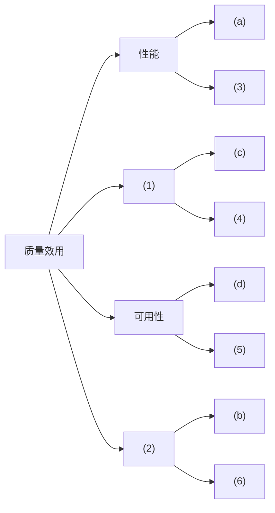
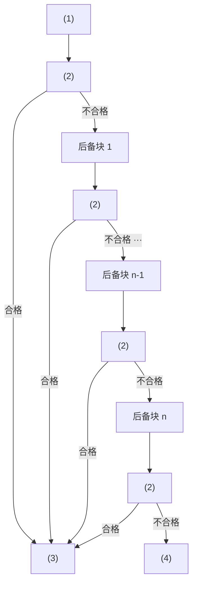

# 2023 年下半年系统架构设计师案例分析真题（清洗版）

> **主试题数量：** 5（共 14 个子问题）。
>
> **底稿路径：** [02.历年真题(补充)/2023年下半年-系统架构设计师-案例分析.md](<../02.历年真题(补充)/2023年下半年-系统架构设计师-案例分析.md>)
>
> **版本选择：** 采用统一清单指定的本地补充版；仓库未记录第二份同科目来源，未拼接其他试卷。
>
> **非官方性质：** 本文件属于回忆/整理版，题面与参考答案均未获考试主管机构确认。
>
> **作答规则：** 按通常卷面结构，试题一必答，试题二至五任选二题；正式规则以当次原卷为准。
>
> **清洗状态：** 已按 5 道主试题整理，统一子问题与参考答案层级，修复显见排版问题；原缺失的效用树、可靠性对照表、恢复块图和比较表已按审计源作结构化恢复。
>
> **图表审计源（访问日期：2026-07-12）：** 试题一效用树依据 [51CTO 整理页](https://blog.51cto.com/u_14032829/14509024?isFull=1) 所载 [原始图片](https://s2.51cto.com/images/blog/202603/14000553_69b435e1a088b98057.png) 重绘；图片 SHA-256 为 `00C9C6C2217FA1B3109BAF11443673E541F8FC8161E775407893BCFA406E8018`。该网页为非官方、可变来源，未发现明确授权声明，故仅转录图的事实性结构，不嵌入原图。
>
> **可靠性图表审计源：** 依据 GitHub 仓库 `xiaomabenten/system_architect` 的[固定提交](https://github.com/xiaomabenten/system_architect/tree/2e04df6ab9076f99c101a5b00f3e89fb3e4e1761) `2e04df6ab9076f99c101a5b00f3e89fb3e4e1761` 中 `2015年下半年 系统架构设计师  案例分析.pdf`（Git blob `ac5d4c62087f83d0bddfab23ebde1a8c3c6144f1`，PDF SHA-256 `E729E438FEC4D8705C90DC236FC6E109729B1593560BDC848D30C4EA0BFF68F7`）的 PDF 第 8～9 页（卷面第 7～8 页）结构化转录；该文件为第三方再封装资料，不视作官方原卷，13 页已全部渲染目视检查。
>
> **来源冲突：** 同一固定提交中的 `2023年11月系统架构设计师真题回忆版.pdf`（Git blob `446e72250687cc8e76d0a0ff8cd03ad65bc1183b`，PDF SHA-256 `0ABCA5E0AFA369AB82218243A4A8A74F420B45B17197AF5A3834AD38F7045CBD`）共 11 页，渲染检查后确认其案例题序列与本文件不同，不能用来补图；本文件试题三则与上述 2015 PDF 对应。为避免越权改题，本次不改文件标题、题面和既有参考答案，仅记录冲突并隔离该 2023 来源。
>
> **已知限制：** 尚未取得考试主管机构发布的官方原卷，题面与参考答案仍属非官方整理；恢复图表只解决原有显式缺图，不代表已完成整卷逐字核定。

---
## 试题一（25 分）

阅读以下关于软件架构评估的说明，回答下列问题。
### 说明
某大型医院计划开发一套综合医疗信息管理系统，旨在提升医疗服务效率，加强患者数据管理和保护患者隐私。在系统需求分析与架构设计阶段，用户提出的部分需求和关键质量属性场景如下：
（a）在高峰时段，系统响应时间不得超过3秒，以支持快速挂号和就诊；
（b）更新系统的用户界面以同时适应老中青的操作习惯，必须在2周内完成；
（c）所有用户密码必须遵循复杂性规则，包括大小写字母、数字和特殊字符；
（d）当主数据库服务器故障时，系统需立即切换至备用服务器，切换时间不超过5分钟；
（e）系统需支持对新增子系统的无缝集成；
（f）系统必须能够准确识别并提示患者药物过敏信息，以避免医疗事故；
（g）系统需具备快速恢复功能，在遭遇严重故障后，能在2小时内恢复服务；
（h）支持不小于100个门诊终端和20个取药终端。
在此基础上开发部门目前正在组织系统开发的相关人员对系统架构进行评估。

### 问题 1（12 分）
在架构评估过程中，质量属性效用树（utility tree）是对系统质量属性进行识别和优先级排序的重要工具。请给出合适的质量属性，填入图1中（1）、（2）空白处；并选择题干描述中的（a）～（b），将恰当的序号填入（3）～（6）空白处，完成该系统的效用树。
图1综合医疗信息管理系统效用树

*图 1-1 综合医疗信息管理系统效用树（依据审计源结构化重绘，保留待填空项）*

#### 参考答案（非官方）
【问题1】

### 问题 2（4 分）
基于软件系统的生命周期，可以将软件系统的质量属性分为开发期质量属性和运行期质量属性2个部分。请把以上四个质量属性分别归类。

#### 参考答案（非官方）
【问题2】
性能、安全性、可用性属于运行期质量属性；
可修改性属于开发期质量属性。

### 问题 3（9 分）
列举质量属性场景的6要素，并在（a）中找出至少3个要素。

#### 参考答案（非官方）
【问题3】质量属性场景包括刺激源（Source）、刺激（Stimulus）、环境（Environment）、制品（Artifact）、响应（Response）、响应度量（Measurement）6个要素。
在（a）”在高峰时段，系统响应时间不得超过3秒，以支持快速挂号和就诊“中，
（1）刺激源是用户请求；
（2）刺激是快速挂号和就诊；
（3）环境是在高峰时段；
（4）制品是系统；
（5）响应是系统响应/处理刺激；
（6）响应度量是不得超过3秒；
上面（a）中要素答出3个即可。

---

## 试题二（25 分）

阅读以下关于软件系统建模的叙述，在答题纸上回答问题1至问题3。
### 说明
一家图书馆计划开发一套图书管理系统，以提高图书借阅和管理的效率。该图书管理系统基本的需求包括：
（1）读者需通过身份验证登录系统，才能借阅图书；
（2）图书馆管理员管理图书的入库、出库、归还和分类；
（3）读者可以搜索图书信息，查看图书详情，预约图书，并查看借阅历史；
（4）系统自动记录图书的借阅情况，并生成借阅报告；
（5）图书馆管理员可以批量导入图书信息，并管理读者账户；
（6）系统支持读者在线续借图书；
（7）系统在图书归还时自动检查是否超时，如超时则记录违约情况。
项目组决定采用UML进行系统建模。

### 问题 1（10 分）
请根据题目所述需求，说明图书管理系统中有哪些参与者。并列举项目中使用的所有实体类。

#### 参考答案（非官方）
【问题1】
参与者有：读者、图书馆管理员、系统时间。
实体类有：图书、借阅记录、借阅报告、图书分类、读者账户、图书信息、违约记录。

### 问题 2（7 分）
在UML建模中，顺序图用于描述对象之间交互的顺序。请指出在UML建模中，顺序图中的消息有哪些类型？对题目所述图书管理系统的需求建模时，"读者借阅图书"场景中的消息类型可能包括哪些？

#### 参考答案（非官方）
【问题2】顺序图中的消息类型包括：同步消息（Synchronous Message）、异步消息（Asynchronous Message）、返回消息（Return Message）和自关联消息（Self-Message）。
"读者借阅图书"场景中的消息类型可能包括：同步消息（如读者提交借阅请求，系统响应借阅成功或失败）、异步消息（如读者提交预约图书请求）、返回消息（如系统返回图书的详情）。

### 问题 3（8 分）
请列举顺序图中常见的几种元素。

#### 参考答案（非官方）
【问题3】
（1）对象（Object），对象是系统中具有特定职责和行为的实体。
（2）生命线（Lifeline），生命线表示对象在交互过程中存在的时间线。
（3）激活（Activation）/控制焦点（Focus of Control），激活表示对象正在执行某个动作或处于活动状态的时间段。
（4）消息（Message），消息是对象之间传递的信息，用于触发接收对象的动作或状态变化。
（5）交互片段（Interaction Fragment），交互片段用于表示顺序图中的一组特殊交互，如循环、条件分支等。
(答出4种即满分）

---

## 试题三（25 分）

阅读以下关于嵌入式系统可靠性设计方面的描述，回答下列问题。
### 说明
某宇航公司长期从事宇航装备的研制工作，嵌入式系统的可靠性分析与设计已成为该公司产品研制中的核心工作，随着宇航装备的综合化技术发展，嵌入式软件规模发生了巨大变化，代码规模已从原来的几十万扩展到上百万，从而带来了由于软件失效而引起系统可靠性降低的隐患。公司领导非常重视软件可靠性工作，决定抽调王工程师等5人组建可靠性研究团队，专门研究提高本公司宇航装备的系统可靠性和软件可靠性问题，并要求在三个月内，给出本公司在系统和软件设计方面如何考虑可靠性设计的方法和规范。可靠性研究团队很快拿出了系统及硬件的可靠性提高方案，但对于软件可靠性问题始终没有研究出一种普遍认同的方法。

### 问题 1（9 分）
请用200字以内文字说明系统可靠性的定义及包含的4个子特性，并简要指出提高系统可靠性一般采用哪些技术？

#### 参考答案（非官方）
【问题1】
系统可靠性定义：系统在规定的时间内及规定的环境条件下，完成规定功能的能力，就是系统无故障运行的概率。
根据国家标准《软件工程产品质量第1部分：质量模型》（GB/T16260.1-2006）的规定，系统可靠性包括：成熟性、容错性、易恢复性和可靠性的依从性4个子特性。
提高系统可靠性一般采用以下4类技术：
（1）冗余技术；
（2）软件容错技术；
（3）双机容错技术；
（4）集群技术。

### 问题 2（8 分）
王工带领的可靠性研究团队之所以没能快速取得软件可靠性问题的技术突破，其核心原因是他们没有搞懂高可靠性软件应具备的特点。软件可靠性一般致力于系统性地减少和消除对软件程序性能有不利影响的系统故障。除非被修改，否则软件系统不会随着时间的推移而发生退化。请根据你对软件可靠性的理解，给出下表所列出的硬件可靠性特征与其对应的软件可靠性特征之间的差异或相似之处，将答案写在答题纸上。

**表 3-1 硬件和软件可靠性对比（依据审计源结构化转录）**

| 序号 | 硬件可靠性 | 软件可靠性 |
| --- | --- | --- |
| 1 | 失效率服从浴缸曲线。老化状态类似于软件调试状态 | (1) |
| 2 | 即使不适用，材料劣化也会导致失效 | (2) |
| 3 | 硬件维修会恢复原始状态 | (3) |
| 4 | 硬件失效之前会有报警 | (4) |

> **原表异文：** 固定 PDF 的第 2 行写作“即使不适用”，本文件既有参考答案写作“即使不使用”；此处按图表源忠实转录，未裁决原表疑似笔误。

#### 参考答案（非官方）
【问题2】（1）从硬件角度分析，由于硬件一旦生产完成，其可靠性指标将会随着使用时间延长而逐步老化，从而带来可靠性降低，即呈现失效率服从浴缸曲线；而软件不存在随时间延长而老化的现象，因此，在不考虑软件演化的情况下，失效率在统计上是非增的。
（2）由于硬件是由多种电子器件组成，即使不使用，材料劣化也会导致失效；而软件就不同了，软件一旦调试完成，固化到设备中，在不考虑存储介质的老化因素的前提下，即使不使用该软件，软件也永远不会发生失效。
（3）由于硬件存在可更换性，其硬件通过维修，可恢复原始状态；而对于软件而言，一旦需要维护，必然是存在需求更改、程序存在bug等现象，其维护必然会创建新的软件代码。
（4）一般而言，硬件失效存在一个发展过程，在发生故障之前必然会有报警现象出现，而软件失效之前很少会有警告。

### 问题 3（8 分）
王工带领的可靠性研究团队在分析了大量相关资料基础上，提出软件的质量和可靠性必须在开发过程构建到软件中，也就是说，为了提高软件的可靠性，必须在需求分析、设计阶段开展软件可靠性筹划和设计。研究团队针对本公司承担的飞行控制系统制定出了一套飞控软件的可靠性设计要求。飞行控制系统是一种双余度同构型系统，输入采用了独立的两路数据通道，在系统内完成输入数据的交叉对比、表决、制导率计算，输出数据的交叉对比、表决、输出等功能，系统的监控模块实现对系统失效或失步的检测与定位。
请根据恢复块方法工作原理完成下图，在（1）～（4）中填入恰当的内容。并比较恢复块方法与N版本程序设计方法，将比较结果（5）~（8）填入下表中。

*图 3-1 恢复块方法（依据审计源结构化重绘，保留待填空项）*

**表 3-2 恢复块方法与 N 版本程序设计的比较（依据审计源结构化转录）**

|  | 恢复块方法 | N 版本程序设计 |
| --- | --- | --- |
| 硬件运行环境 | 单机 | 多机 |
| 错误检测方法 | 验证测试程序 | (5) |
| 恢复策略 | (6) | 向前恢复 |
| 实时性 | (7) | (8) |

#### 参考答案（非官方）
【问题3】1.恢复块方法：
（1）主块
（2）验证测试
（3）输出正确结果
（4）异常处理
2.恢复块方法与N版本程序设计的比较
（5）表决
（6）反向恢复
（7）差
（8）好

---

## 试题四（25 分）

阅读以下关于分布式数据库缓存设计的叙述，在答题纸上回答问题1至问题2。
### 说明
一家金融科技公司为了提升交易系统的处理能力和响应速度，决定引入分布式缓存系统。王工提出使用ElastiCache（基于Amazon的Redis或Memcached服务）作为缓存解决方案，而赵工则倾向于使用自建的Redis集群。考虑到金融数据的敏感性和一致性要求，技术团队决定采用Redis集群作为缓存解决方案，并计划实施严格的数据同步和一致性控制策略。

### 问题 1（13 分）
请简述分布式数据库缓存的主要作用，并比较ElastiCache与自建Redis集群在成本、灵活性和扩展性方面的差异。

#### 参考答案（非官方）
【问题1】
分布式数据库缓存的主要作用是减少数据库访问压力，提高数据访问速度，从而提升系统整体性能。ElastiCache与自建Redis集群的差异在于：
（1）成本：ElastiCache提供按需付费的云服务，初期成本较低，但业务增长后长期成本可能较高；自建Redis集群需要自行承担硬件和维护成本，但长期成本可控。
（2）灵活性：ElastiCache提供多种配置选项，但可能受限于云服务提供商的设定；自建Redis集群可以根据业务需求自由配置和优化。
（3）扩展性：ElastiCache支持自动扩展，但可能受限于云服务提供商的扩展策略；自建Redis集群可以通过增加节点和重新分片来灵活扩展。

### 问题 2（12 分）
列举Redis集群的三种模式并比较其优缺点。

#### 参考答案（非官方）
【问题2】
Redis集群的三种主要模式包括主从模式、哨兵（Sentinel）模式和集群（Cluster）模式，每种方式都有其独特的优缺点。以下是对这三种方式的详细比较：
（1）主从模式
优点：读写分离、同步非阻塞服务、负载均衡。
缺点：容错性差、数据一致性差、在线扩容困难。
(2）哨兵模式
优点：自动故障转移、监控与通知、简化运维管理。
缺点：部署复杂、网络通信频繁、在线扩容困难。
(3）集群模式
优点：无中心架构、可用性好、伸缩性较好、降低运维成本。
缺点：配置复杂、数据一致性差、客户端实现复杂、资源隔离性差。
（每个答出4点即可满分）

---

## 试题五（25 分）

阅读以下关于Web电商平台架构设计的描述，回答下列问题。
### 说明
某电商平台计划开发一个面向全球消费者的在线购物系统，该系统需支持多语言、多货币及多地区配送。为应对未来用户量激增及高并发交易的需求，系统需具备高度可扩展性和高可用性。项目团队决定采用微服务架构进行系统设计，并计划使用Docker容器化技术部署服务。
在架构设计过程中，需考虑以下关键因素：
（1）系统需支持分布式事务处理，确保数据一致性；
（2）采用微服务架构后，服务间的通信和数据共享需高效且安全；
（3）系统需集成多种支付方式，并符合不同地区的支付法规；
（4）考虑到全球访问，需部署CDN以优化用户体验。
团队初步规划了用户服务、商品服务、订单服务、支付服务等几个核心微服务，并讨论了服务间的调用机制及数据同步方案。

### 问题 1（5 分）
简述微服务架构相较于传统单体架构的主要优势。

#### 参考答案（非官方）
【问题1】
微服务架构相较于传统单体架构的主要优势包括：
（1）高可伸缩性：微服务架构允许独立地伸缩各个服务，根据业务需求灵活调整资源，而不需要对整个应用进行调整。
（2）技术栈灵活性：每个微服务可以使用最适合其需求的技术栈进行开发，无需受限于整个应用的技术选择。
（3）快速迭代和部署：由于服务之间的解耦，团队可以并行开发、测试和部署不同的服务，从而加快产品迭代速度。
（4）故障隔离：单个服务的故障不会影响到整个系统，提高了系统的稳定性和可靠性。
（5）更好的团队协作：微服务架构促进了小型、自治的团队形成，每个团队可以专注于自己的服务，提高了开发效率和代码质量。

### 问题 2（12 分）
在微服务架构下，服务间的通信和数据共享是核心问题之一。请比较常见的服务间通信方式RESTful API和gRPC，并基于电商平台的需求，推荐一种合适的通信方式并说明选择原因。

#### 参考答案（非官方）
【问题2】
RESTful API和gRPC的区别如下：
（1）RESTful API：基于HTTP协议，使用JSON或XML等格式进行数据传输，具有良好的跨平台性和易用性。它支持丰富的HTTP方法（如GET、POST、PUT、DELETE等），便于实现资源的CRUD操作。对于电商平台而言，RESTful API因其简单性和广泛的支持度，是一个很好的选择。它允许前端、移动应用和其他服务通过统一的接口与后端服务进行交互。
(2）gRPC：由Google开发，基于HTTP/2协议，支持多种语言，并使用Protocol Buffers作为接口定义语言（IDL）。gRPC在性能上略优于RESTful API，特别是在需要低延迟和高吞吐量的场景下。然而不如RESTful API那样易于学习和使用，且对客户端的支持不如RESTful API广泛。
基于电商平台的需求，推荐采用RESTful API作为服务间的通信方式。原因包括：
（1）电商平台通常需要与多种客户端（如Web前端、移动应用、第三方服务等）进行交互，RESTful API的广泛支持度使其成为理想选择。
（2）RESTful API的易用性和简单性有助于降低开发成本和提高开发效率。
（3）常见电商平台对实时性要求不是特别高，因此RESTful API的性能足以满足需求。

### 问题 3（8 分）
在微服务架构下，如何确保各个微服务之间的数据一致性和服务的高可用性？请列举几种常见的策略或技术。

#### 参考答案（非官方）
【问题3】
（1）分布式事务：使用两阶段提交（2PC）、三阶段提交（3PC）或基于SAGA模式等分布式事务解决方案确保跨多个服务的数据一致性。然而，分布式事务可能会引入额外的复杂性和性能开销，因此需要谨慎使用。
（2）最终一致性：在不需要强一致性的场景下，可以采用最终一致性模型。通过事件驱动架构（EDA）或消息队列等方式，异步地更新数据，并在一段时间后达到一致状态。这种方式可以提高系统的可用性和性能。
（3）服务熔断与降级：为了防止某个服务的故障影响到整个系统，可以实施服务熔断机制。当服务调用失败率达到一定阔值时，自动熔断该服务，防止进一步的失败扩散。同时，可以实施服务降级策略，在资源不足或系统负载过高时，提供简化的服务响应。
（4）服务注册与发现：使用服务注册中心（如Eureka、Consul等）来管理服务的注册和发现。服务实例在启动时向注册中心注册自己，并在关闭时注销。其他服务通过注册中心来发现需要调用的服务实例，从而实现服务的动态发现和负载均衡。
（5）数据复制与缓存：通过数据复制和缓存技术，提高数据的可用性和访问速度。例如，可以使用数据库的主从复制来确保数据的高可用性，并使用缓存（如Redis、Memcached等）来减少数据库的访问压力和提高数据访问速度。
（6）API网关：在微服务架构中，API网关作为所有客户端请求的入口点，负责路由、过滤、认证、限流等职责。通过API网关，可以集中管理跨服务的通信和数据共享，提高系统的安全性和可维护性。
（答出4条即可）。

---
