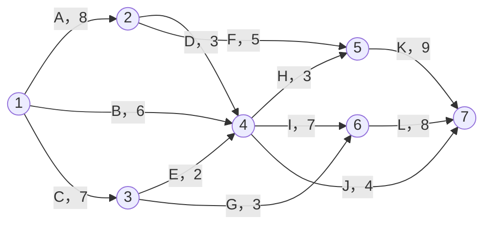

# 2024年上半年-系统架构设计师-综合知识

> 题目数量：75
>
> 清洗说明：本稿以本地“补充”版为初始骨架，参考本地原版与固定公开材料校对；多空共用题干只保留一次，并按题号标注空位。第 15 题网络图、第 68 题原料利润表及第 69～70 题作业表已据同一固定第三方 PDF 结构化恢复；资料仍非官方原卷或标准答案。
>
> 漏题与混题勘误：续审发现初始骨架漏掉真正的第 4 题，导致原第 4～66 题整体前移一位；原第 67 题“软件测试工具”则与[希赛 2012 年下半年固定 PDF](https://www.educity.cn/rk/zhenti/jiagou/jiagou2012zonghe.pdf?fcode=h58_e1178)第 37 题逐字一致，属于误混旧题，已移除。现按[2024 年固定 PDF](https://oss-hqwx-video.hqwx.com/2024%E5%B9%B4%E4%B8%8A%E5%8D%8A%E5%B9%B4%E7%B3%BB%E7%BB%9F%E6%9E%B6%E6%9E%84%E8%AE%BE%E8%AE%A1%E5%B8%88%E8%80%83%E8%AF%95%E7%9C%9F%E9%A2%98%E5%8F%8A%E7%AD%94%E6%A1%88%E8%A7%A3%E6%9E%90_a3c8f9f07e1f97980c13dc31438b0d4516b97778.pdf)第 1 页、[希赛近时题页](https://www.educity.cn/rk/5315416.html)及 [RKPass 同题页](https://www.rkpass.cn/tk_timu/4_905_1_xuanze.html)补回第 4 题；修正后 75 题题序与固定 PDF 对齐。

---

## 第1题

（ ）是最简单的一种调度算法。顾名思义，先来先服务的基本思想就是按照任务到达的先后次序来进行调度。它是一种不可抢占的调度方式，如果当前任务占用着 CPU 在运行，那么就要一直等到它执行完毕或者因为某种原因被阻塞，才会让出 CPU 给其他的任务。

- **A.** 先来先服务（FCFS，First-Come, First-Served）
- **B.** 短作业优先（SJF，Shortest Job First）
- **C.** 轮转调度（Round Robin）
- **D.** 最短剩余时间优先（SRTF，Shortest Remaining Time First）

**正确答案：A**

---

## 第2题

多道程序设计技术不仅使CPU得到充分利用，同时改善 I/O设备和内存的（ ），从而提高了整个系统的资源利用率和系统吞吐量（单位时间内处理作业（程序）的个数），最终提高了整个系统的效率。

- **A.** 可靠性
- **B.** 利用率
- **C.** 稳定性
- **D.** 兼容性

**正确答案：B**

---

## 第3题

在 UML 用例图中，不属于用例与用例之间关系的是（ ）。

- **A.** 扩展关系
- **B.** 聚合关系
- **C.** 包含关系
- **D.** 继承关系

**正确答案：B**

---

## 第4题

以下关于软件测试的说法中，错误的是（ ）。

- **A.** 每个测试用例都必须定义预期的输出或结果
- **B.** 测试用例中不仅要说明合法、有效的输入条件，还应描述不期望的、非法的输入条件
- **C.** 软件测试可以证明被测对象的正确性
- **D.** 约 80% 的软件错误可在约 20% 的模块中找到根源

**正确答案：C**

> **恢复说明：** 题干、四项和答案由上述 2024 年固定 PDF、希赛近时题页与 RKPass 同题页交叉核对。软件测试只能发现缺陷并提高质量信心，不能穷尽所有输入从而“证明”被测对象绝对正确；本题来源仍为非官方整理。

---

## 第5题

在数字孪生生态系统中，（ ）包括描述、诊断、预测、决策四个方面。

- **A.** 数据互动层
- **B.** 模型构建层
- **C.** 仿真分析层
- **D.** 共性应用层

**正确答案：D**

---

## 第6题

物联网是指通过信息传感设备，按约定的协议，将任何物体与网络相连接，物体通过信息传播媒介进行信息交换和通信，以实现智能化识别、定位、跟踪、监管等功能。物联网应用通常分为三层，分别是（ ）。

- **A.** 感知层、网络传输层和操作系统层
- **B.** 应用层、中间件和操作系统层
- **C.** 感知层、协议层和应用层
- **D.** 感知层、网络传输层和应用层

**正确答案：D**

---

## 第7题

企业应用集成 (EAI) 构建统一标准的基础平台，将进程、软件、标准和硬件联合起来，提供4个层次的服务，从下至上依次为（ ）。

- **A.** 通讯服务、信息传递与转化服务、流程控制服务、应用连接服务
- **B.** 通讯服务、流程控制服务、应用连接服务、信息传递与转化服务
- **C.** 通讯服务、应用连接服务、信息传递与转化服务、流程控制服务
- **D.** 通讯服务、信息传递与转化服务、应用连接服务、流程控制服务

**正确答案：D**

---

## 第8题

关于知识产权的地位，下列表述中正确的是（ ）。

- **A.** 知识产权属于行政法的范畴
- **B.** 知识产权属于刑法的范畴
- **C.** 知识产权属于经济法的范畴
- **D.** 知识产权属于民法的范畴

**正确答案：D**

---

## 第9题

如果X和Y都是某线性规划问题的最优解，则当（ ）时，λX+μY一定也是其最优解。

- **A.** λ+μ=1
- **B.** λ,μ>=0，λ+μ=1
- **C.** λ,μ>=0
- **D.** λ,μ>=0，λ+μ=2

**正确答案：B**

---

## 第10题

事务是数据库系统中不可分割的逻辑工作单位，（ ）不属于事务的特性。

- **A.** 持久性
- **B.** 原子性
- **C.** 一致性
- **D.** 并发性

**正确答案：D**

---

## 第11题

关系R有m个元组，关系S有n个元组，则R和S的笛卡尔积有（ ）个元组。

- **A.** n
- **B.** m
- **C.** m+n
- **D.** m*n

**正确答案：D**

---

## 第12题

下列表达式与 R∩S 等价的是（ ）。

- **A.** R−(R−S)
- **B.** R∪S
- **C.** R−(S−R)
- **D.** S−(R−S)

**正确答案：A**

---

## 第13题

大多数嵌入式系统都具备实时特征，其典型架构可概括为（ ）两种模型。

- **A.** 层次化模式架构和代理模式架构
- **B.** 层次化模式架构和点对点模式架构
- **C.** 层次化模式架构和递归模式架构
- **D.** 递归模式架构和点对点模式架构

**正确答案：C**

---

## 第14题

嵌入式系统分为三层：应用软件、操作系统软件和中间件，中间件的主要作用是（ ）。

- **A.** 提供用户界面
- **B.** 屏蔽底层操作系统的差异
- **C.** 管理存储设备
- **D.** 进行数据加密

**正确答案：B**

---

## 第15题

某项目包括A~L共12个作业，其实施的衔接关系如下图所示。图中各作业箭线旁标注了作业名称以及完成该作业所需的天数。求完成此项目最少需要（ ）天

> **图表状态：** 原扫描图未入库；下图依据[固定第三方 PDF 第 2 页](https://oss-hqwx-video.hqwx.com/2024%E5%B9%B4%E4%B8%8A%E5%8D%8A%E5%B9%B4%E7%B3%BB%E7%BB%9F%E6%9E%B6%E6%9E%84%E8%AE%BE%E8%AE%A1%E5%B8%88%E8%80%83%E8%AF%95%E7%9C%9F%E9%A2%98%E5%8F%8A%E7%AD%94%E6%A1%88%E8%A7%A3%E6%9E%90_a3c8f9f07e1f97980c13dc31438b0d4516b97778.pdf)逐箭线结构化重绘，保留事件编号、作业名、方向和工期，不是原扫描图。访问日期：2026-07-12；PDF SHA-256：`1c81e2560e890c03afe3c7251dd28af28868c436849eecd9b7b344254d450121`。

- **A.** 26
- **B.** 65
- **C.** 10
- **D.** 22

**正确答案：A**

---

## 第16题

《计算机信息系统安全保护等级划分准则》把计算机信息安全划分为了5个等级，其中安全保护等级最高的是（ ）。

- **A.** 安全标记保护级
- **B.** 结构化保护级
- **C.** 系统审计保护级
- **D.** 访问验证保护级

**正确答案：D**

---

## 第17题

在软件可靠性管理过程中，以下工作不属于需求分析阶段应完成的是（ ）。

- **A.** 分析可能影响可靠性的因素
- **B.** 确定软件的可靠性目标
- **C.** 可靠性建模
- **D.** 确定可靠性的验收标准

**正确答案：C**

---

## 第18题

在软件系统质量属性（Quality Attribute）中，（18）关注系统在一定时间内正常工作的时间所占的比例；（19）关注软件系统与其他系统交换数据和相互调用服务的难易程度。

第18题选项：

- **A.** 可用性
- **B.** 可修改性
- **C.** 性能
- **D.** 安全性

**正确答案：A**

---

## 第19题

第19题选项：

- **A.** 可伸缩性
- **B.** 可靠性
- **C.** 互操作性
- **D.** 易用性

**正确答案：C**

---

## 第20题

构件组装是指构件相互直接集成或是用“胶水代码”将其整合在一起来创造一个系统或另一个构件的过程。其中，构件组装常见的方式不包括（20）组装。同时，构件组装中经常会面临接口不兼容的问题，如果一个构件的提供接口是另一个构件请求接口的一个子集，则属于（21）的情况。

第20题选项：

- **A.** 层次
- **B.** 叠加
- **C.** 顺序
- **D.** 循环

**正确答案：D**

---

## 第21题

第21题选项：

- **A.** 参数不兼容
- **B.** 操作不兼容
- **C.** 返回值不匹配
- **D.** 操作不完备

**正确答案：D**

---

## 第22题

为了精确描述软件系统的质量属性，通常采用（22）作为描述质量属性的手段。其中，（23）描述在激励到达后所采取的行动。

第22题选项：

- **A.** 质量属性场景
- **B.** 质量属性环境分析
- **C.** 质量属性效用树
- **D.** 质量属性需求用例分析

**正确答案：A**

---

## 第23题

第23题选项：

- **A.** 响应度量
- **B.** 制品
- **C.** 响应
- **D.** 刺激

**正确答案：C**

---

## 第24题

以下关于REST的描述中，（ ）是不正确的。

- **A.** REST的状态转移是借助HTTP方法来实现
- **B.** URI和资源是多对多关系
- **C.** REST是一种架构风格而不是一个架构
- **D.** REST是以资源为中心构建的

**正确答案：B**

---

## 第25题

基于软件系统的生命周期，可以将软件系统的质量属性分为（ ）两个部分。

- **A.** 需求分析期质量属性和设计期质量属性
- **B.** 开发期质量属性和运行期质量属性
- **C.** 设计期质量属性和开发期质量属性
- **D.** 设计期质量属性和运行期质量属性

**正确答案：B**

---

## 第26题

软件复用的基本过程可以划分为三个阶段，其中，（ ）阶段主要是构造恰当的、可复用的资产。

- **A.** 获取可复用的资产
- **B.** 分析可复用资产
- **C.** 管理可复用资产
- **D.** 使用可复用资产

**正确答案：A**

---

## 第27题

以下关于构件的描述中，（ ）是不正确的。

- **A.** 构件是二进制形式，无需在部署前编译
- **B.** 构件元数据是构件本身相关的数据
- **C.** 构件是通用实体，不能对构件进行配置来适应应用系统
- **D.** 构件是一个独立的软件单元

**正确答案：C**

---

## 第28题

在 ATAM 评估方法设计之初，其主要关注的4种质量属性，分别为（ ）。

- **A.** 性能、实用性、安全性和可修改性
- **B.** 性能、可测试性、安全性和可修改性
- **C.** 性能、可修改性、可用性和可测试性
- **D.** 安全性、可测试性、可用性和可测试性

**正确答案：A**

---

## 第29题

在经典的体系结构风格分类中，黑板体系结构风格属于（ ）的子风格。

- **A.** 以数据中心风格
- **B.** 解释器风格
- **C.** 独立构件风格
- **D.** 虚拟机风格

**正确答案：A**

---

## 第30题

与两层C/S结构相比，三层C/S结构增加了一个应用服务器。这时，整个应用逻辑驻留在应用服务器上，（ ）存在于客户机上。

- **A.** 感知层
- **B.** 服务层
- **C.** 表示层
- **D.** 数据层

**正确答案：C**

---

## 第31题

在特定应用领域软件体系结构的设计中，（ ）阶段的主要目标是获得领域模型。

- **A.** 领域实现
- **B.** 领域设计
- **C.** 领域建模
- **D.** 领域分析

**正确答案：D**

---

## 第32题

以下关于软件敏捷开发方法的核心思想说法错误的是（ ）。

- **A.** 敏捷方法遵循迭代增量式开发过程
- **B.** 敏捷方法以原型开发思想为基础
- **C.** 敏捷方法是适应型、可预测型
- **D.** 敏捷方法以人为本而非以过程为本

**正确答案：C**

---

## 第33题

系统测试的依据是（ ）。

- **A.** 软件详细设计说明书
- **B.** 软件需求规格说明书
- **C.** 软件概要设计说明书
- **D.** 软件用户手册

**正确答案：B**

---

## 第34题

以下关于净室软件工程的描述中，（ ）是不正确的。

- **A.** 净室软件工程是一种开发成本很高的软件开发方法
- **B.** 净室软件工程开发的模块无需进行传统的模块测试
- **C.** 净室软件工程的理论基础主要是函数理论和抽样理论
- **D.** 采用正确性验证，使得净室项目的软件质量有了极大的提高

**正确答案：B**

---

## 第35题

操作系统进程在其存在的过程中存在三种状态，当进程获得了除 CPU 外的一切所需资源，一旦得到处理机即可运行，则该进程处于（ ）。

- **A.** 运行状态
- **B.** 就绪状态
- **C.** 阻塞状态
- **D.** 准备状态

**正确答案：B**

---

## 第36题

以太网中，数据的传输使用（ ）。

- **A.** 直接的二进制码
- **B.** 循环码
- **C.** 曼彻斯特编码
- **D.** 差分曼彻斯特编码

**正确答案：C**

---

## 第37题

处理一个连续时间信号，对其进行采样的频率为3KHz，要不失真的恢复该连续信号,则该连续信号的最高频率可能是为（ ）。

- **A.** 6KHz
- **B.** 1.5KHz
- **C.** 3KHz
- **D.** 2kHz

**正确答案：B**

---

## 第38题

在关系数据库中，只消除非主属性对码的部分依赖的范式是（ ）。

- **A.** BCNF
- **B.** 1NF
- **C.** 2NF
- **D.** 3NF

**正确答案：C**

---

## 第39题

在数据库设计的（ ）阶段进行关系反规范化。

- **A.** 需求分析
- **B.** 概念设计
- **C.** 逻辑设计
- **D.** 物理设计

**正确答案：C**

---

## 第40题

OSI定义了7层协议，其中除（ ）外，每一层均能提供相应的安全服务。

- **A.** 应用层
- **B.** 表示层
- **C.** 会话层
- **D.** 物理层

**正确答案：C**

---

## 第41题

二层交换机工作在（ ）。

- **A.** 物理层
- **B.** 数据链路层
- **C.** 网络层
- **D.** 高层

**正确答案：B**

---

## 第42题

下列（ ）不属于专利法范畴

- **A.** 发明
- **B.** 实用新型
- **C.** 外观设计
- **D.** 商标法

**正确答案：D**

---

## 第43题

在发明或者实用新型专利申请文件中，用于说明专利保护范围的是（ ）。

- **A.** 请求书
- **B.** 说明书
- **C.** 权利要求书
- **D.** 申请书

**正确答案：C**

---

## 第44题

UML中（ ）不属于需求分析常用的图。

- **A.** 活动图
- **B.** 构件图
- **C.** 用例图
- **D.** 类图

**正确答案：B**

---

## 第45题

以下不属于创建型模式的是（ ）。

- **A.** 桥接模式
- **B.** 单例模式
- **C.** 工厂方法模式
- **D.** 建造者模式

**正确答案：A**

---

## 第46题

体系结构演化包含六个步骤，按顺序分别（ ）。

- **A.** 需求变化归类、技术评审、制订体系结构演化计划、修改、增加或删除构件、更新构件的相互作用、构件组装与测试。
- **B.** 需求变化归类、制订体系结构演化计划、修改、增加或删除构件、更新构件的相互作用、构件组装与测试、技术评审。
- **C.** 技术评审、需求变化归类、制订体系结构演化计划、修改、增加或删除构件、更新构件的相互作用、构件组装与测试。
- **D.** 技术评审、需求变化归类、制订体系结构演化计划、构件组装与测试修改、增加或删除构件、更新构件的相互作用。

**正确答案：B**

---

## 第47题

管道-过滤器体系结构风格中，当数据源源不断地产生，系统就需要对这些数据进行若干处理（分析、计算、转换等）。现有的解决方案是把系统分解为几个连贯的处理步骤，这些步骤之间通过数据流连接，一个步骤的输出是另一个步骤的输入。每个处理步骤由一个（47）实现，处理步骤之间的数据传输由（48）负责。每个处理步骤都有一组输入和输出，过滤器从管道中读取输入的数据流，经过内部处理，然后产生输出数据流并写入管道中。

第47题选项：

- **A.** 过滤
- **B.** 管道
- **C.** 对象
- **D.** 构件

**正确答案：A**

---

## 第48题

第48题选项：

- **A.** 过滤
- **B.** 管道
- **C.** 构件
- **D.** 对象

**正确答案：B**

---

## 第49题

下面关于软件架构风格描述不正确的是（ ）。

- **A.** 架构设计一定要基于某个特定架构风格
- **B.** 层状风格系统被组织成一系列的逻辑层，每一层提供特定的服务，并且下层对上层透明。
- **C.** 管道-过滤器风格组件之间通过管道连接，数据在管道中流动，每个过滤器处理数据流的一部分。
- **D.** 事件驱动风格系统中的组件通过事件进行交互，事件的产生和响应定义了组件间的交互

**正确答案：A**

---

## 第50题

良好的架构设计不具有的作用是（ ）。

- **A.** 降低理解成本
- **B.** 提高代码的可重用性
- **C.** 使系统设计更符合需求
- **D.** 提高系统的可靠性

**正确答案：C**

---

## 第51题

以下关于事件、事件驱动的叙述中，错误的是（ ）。

- **A.** 事件是可以由窗体或控件识别的操作
- **B.** 事件可以由用户的动作触发
- **C.** 一个事件的发生不会影响另一个事件
- **D.** 事件可以由系统的某个状态的变化而触发

**正确答案：C**

---

## 第52题

UDDI是一种用于（ ）Web Service的技术，它是Web Service协议栈的一个重要部分。

- **A.** 描述、发现、集成
- **B.** 描述、发现、开发
- **C.** 描述、利用、开发
- **D.** 描述、连接、集成

**正确答案：A**

---

## 第53题

（53）针对最终架构而非详细设计进行评估，（54）用于分析多种质量属性之间的折中。

第53题选项：

- **A.** SAAM
- **B.** ATAM
- **C.** CBAM
- **D.** SAEM

**正确答案：A**

---

## 第54题

第54题选项：

- **A.** SAAM
- **B.** ATAM
- **C.** SAEM
- **D.** CBAM

**正确答案：B**

---

## 第55题

性能是指（55），可以通过（56）提高系统性能。

第55题选项：

- **A.** 处理事务所需时间或单位时间内处理事务数量
- **B.** 快速、高性价比地变更系统的能力
- **C.** 架构经扩充或变更成为新架构的能力
- **D.** 系统完成所期望工作的能力

**正确答案：A**

---

## 第56题

第56题选项：

- **A.** 追踪审计
- **B.** 增加资源（如CPU、内存）
- **C.** 主动冗余
- **D.** Ping/Echo

**正确答案：B**

---

## 第57题

确保信息没有非授权泄密，即确保信息不泄露给非授权的个人、实体或进程所用，是指（57）。（58）是指信息交换的双方不能否认其在交换过程中发送信息或接收信息的行为。

第57题选项：

- **A.** 完整性
- **B.** 可用性
- **C.** 机密性
- **D.** 不可否认性

**正确答案：C**

---

## 第58题

第58题选项：

- **A.** 可用性
- **B.** 完整性
- **C.** 机密性
- **D.** 不可否认性

**正确答案：D**

---

## 第59题

软件系统在非正常情况(如用户进行了非法操作、相关的软硬件系统发生了故障等)下仍能够正常运行的能力叫做（ ）。

- **A.** 安全性
- **B.** 健壮性
- **C.** 可靠性
- **D.** 可用性

**正确答案：B**

---

## 第60题

下面描述中，（ ）指的是平均故障检测时间。

- **A.** MTBF
- **B.** MTTD
- **C.** MTTR
- **D.** MTBR

**正确答案：B**

---

## 第61题

考虑体系结构时，要从不同的（ ）来观察对架构的描述，这需要软件设计师考虑体系结构的不同属性。

- **A.** 视角
- **B.** 层次
- **C.** 立场
- **D.** 功能

**正确答案：A**

---

## 第62题

4+1视图模型不包含的视图是（ ）。

- **A.** 逻辑视图
- **B.** 开发视图
- **C.** 物理视图
- **D.** 测试视图

**正确答案：D**

---

## 第63题

（63）通过对软件的需求规格说明书、设计说明书以及源程序做结构分析和流程图分析，从而来找出错误。（64）除了重视输出相对于输入的正确性，也看重其内部的程序逻辑。

第63题选项：

- **A.** 动态测试
- **B.** 静态测试
- **C.** 单元测试
- **D.** 自动化测试

**正确答案：B**

---

## 第64题

第64题选项：

- **A.** 白盒测试
- **B.** 黑盒测试
- **C.** 灰盒测试
- **D.** 动态测试

**正确答案：C**

---

## 第65题

下面不属于云计算之虚拟化技术的是（ ）。

- **A.** KVM
- **B.** Xen
- **C.** Hyper-V
- **D.** LVS

**正确答案：D**

---

## 第66题

基于任务的访问控制（TBAC）模型由（ ）组成。

- **A.** 工作流、授权结构体、受托人集、许可集
- **B.** 任务列表、授权结构体、受托人集、许可集
- **C.** 任务列表、访问控制列表、受托人集、许可集
- **D.** 工作流、授权结构体、代理人集、许可集

**正确答案：A**

---

## 第67题

为实现有效的灾难恢复，无需人工介入的自动站点故障切换功能是一个必须被纳入考虑范围的重要事项。目前通用的异地远程恢复标准采用的是1992年Anaheim的SHARE78，M028会议的报告中所阐述的七个层次，其中灾难恢复的最高级别，定义了（  ）。

- **A.** 两个中心同时处于活动状态并同时互相备份
- **B.** 在灾难发生时，仅是传送中的数据被丢失，恢复时间被降低到分钟级
- **C.** 热备份中心拥有足够的硬件和网络设备去支持关键应用
- **D.** 零数据丢失，自动系统故障切换

**正确答案：D**

---

## 第68题

某乳制品加工厂用纯牛奶和酸牛奶两种生产原料，加工生产甲、乙两种乳制品、该厂加工每单位乳制品消耗原料数、每单位乳制品的利润如下所示。则该公司的最大利润为（ ）万元。

| 项目 | 甲 | 乙 | 现有原料（吨） |
|---|---:|---:|---:|
| 纯牛奶消耗（吨） | 1 | 4 | 98 |
| 酸牛奶消耗（吨） | 5 | 3 | 150 |
| 利润（万元） | 3 | 4 | — |

> **表格恢复来源：** [环球网校固定第三方 PDF](https://oss-hqwx-video.hqwx.com/2024%E5%B9%B4%E4%B8%8A%E5%8D%8A%E5%B9%B4%E7%B3%BB%E7%BB%9F%E6%9E%B6%E6%9E%84%E8%AE%BE%E8%AE%A1%E5%B8%88%E8%80%83%E8%AF%95%E7%9C%9F%E9%A2%98%E5%8F%8A%E7%AD%94%E6%A1%88%E8%A7%A3%E6%9E%90_a3c8f9f07e1f97980c13dc31438b0d4516b97778.pdf)第 5～6 页，访问日期 2026-07-12，文件 SHA-256 `1c81e2560e890c03afe3c7251dd28af28868c436849eecd9b7b344254d450121`。跨页表的两类原料、甲乙消耗量、库存和利润均按渲染页逐格转录；该 PDF 不是官方原卷。

- **A.** 134
- **B.** 144
- **C.** 154
- **D.** 164

**正确答案：A**

**计算校核：** 设甲、乙产量分别为 $x,y$，则约束为 $x+4y\le 98$、$5x+3y\le 150$，目标函数为 $3x+4y$。两条资源边界交于 $(x,y)=(18,20)$，利润为 $3\times18+4\times20=134$ 万元；两个坐标轴端点的利润均更低，故选择 A。

---

## 第69题

某项目有 8 个作业 A~H，每个作业的紧前作业、所需天数和所需人数见表1。由于整个项目团队总共只有 10 人，各个作业都必须连续进行，中途不能停止，因此需要适当安排施工方案，使该项目能尽快在（69）内完工。在该方案中，作业 A 应安排在（70）内进行。

| 作业 | A | B | C | D | E | F | G | H |
|---|---:|---:|---:|---:|---:|---:|---:|---:|
| 紧前作业 | — | — | — | — | B | C | D、F | E、G |
| 所需天数 | 4 | 2 | 2 | 2 | 3 | 2 | 3 | 4 |
| 所需人数 | 8 | 2 | 6 | 4 | 6 | 7 | 2 | 1 |

> **表格恢复来源：** [环球网校固定第三方 PDF](https://oss-hqwx-video.hqwx.com/2024%E5%B9%B4%E4%B8%8A%E5%8D%8A%E5%B9%B4%E7%B3%BB%E7%BB%9F%E6%9E%B6%E6%9E%84%E8%AE%BE%E8%AE%A1%E5%B8%88%E8%80%83%E8%AF%95%E7%9C%9F%E9%A2%98%E5%8F%8A%E7%AD%94%E6%A1%88%E8%A7%A3%E6%9E%90_a3c8f9f07e1f97980c13dc31438b0d4516b97778.pdf)第 6 页，访问日期 2026-07-12，文件 SHA-256 `1c81e2560e890c03afe3c7251dd28af28868c436849eecd9b7b344254d450121`。第 22 页另给出紧前关系图、资源直方图以及（69）C、（70）D；本稿按图像逐格转录表 1，不复制扫描版式。该 PDF 为培训机构资料，不是官方原卷。

第69题选项：

- **A.** 10天
- **B.** 11天
- **C.** 12天
- **D.** 13天

**正确答案：C**

---

## 第70题

第70题选项：

- **A.** 第1~5天
- **B.** 第3~7天
- **C.** 第5~9天
- **D.** 第8~12天

**正确答案：D**

**排程核对：** 固定 PDF 第 22 页给出的可行资源组合依次为 D/C、B/F、E/G、A/H，各阶段同时用工分别不超过 10 人，并按其时标口径得到 12 天及 A 安排在第 8～12 天。这里保留来源的时标与答案字母；由于没有官方原卷或评分说明，不把该排程升级为官方答案。

---

## 第71题

The data dictionary is a specialized application of the kinds of dictionaries used as references in everyday life. The data dictionary is a reference work of data about data (that is, （71）), one that is compiled by systems analysts to guide them through analysis and design. As a document, the data dictionary collects and coordinates specific data terms, and it confirms what each term means to different people in the organization. The （72） covered before are an excellent starting point for collecting data dictionary entries. One important reason for maintaining a data dictionary is to keep clean data. This means that data must be （73）. If you store data about a man's sex as "M" in one record, "Male" in a second record, and as the number "1" in a third record, the data are not clean. Keeping a data dictionary will help in this regard.

Automated data dictionaries (part of the （74） mentioned earlier) are valuable for their capacity to cross-reference data items, thereby allowing necessary program changes to all programs sharing a common element. This feature supplants changing programs on a haphazard basis, or it prevents waiting until the program won't run because a change has not been implemented across all programs sharing the updated item. Clearly, automated data dictionaries become important for large systems that produce several thousand data elements requiring （75） and cross-referencing.

第71题选项：

- **A.** metadata
- **B.** big data
- **C.** data lake
- **D.** data warehouse

**正确答案：A**

---

## 第72题

第72题选项：

- **A.** DFD
- **B.** ERD
- **C.** STD
- **D.** DD

**正确答案：A**

---

## 第73题

第73题选项：

- **A.** atomic
- **B.** consistent
- **C.** isolated
- **D.** durable

**正确答案：B**

---

## 第74题

第74题选项：

- **A.** UML views
- **B.** test tools
- **C.** CASE tools
- **D.** AI libraries

**正确答案：C**

---

## 第75题

第75题选项：

- **A.** programming
- **B.** producing
- **C.** collecting
- **D.** cataloging

**正确答案：D**

---
