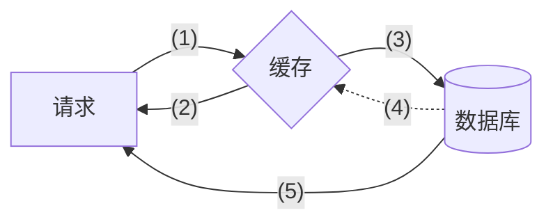
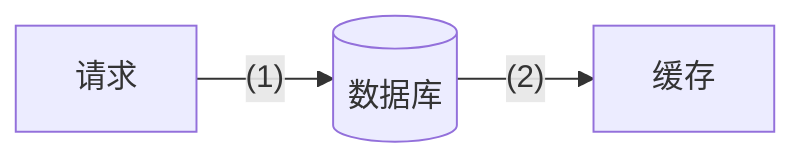
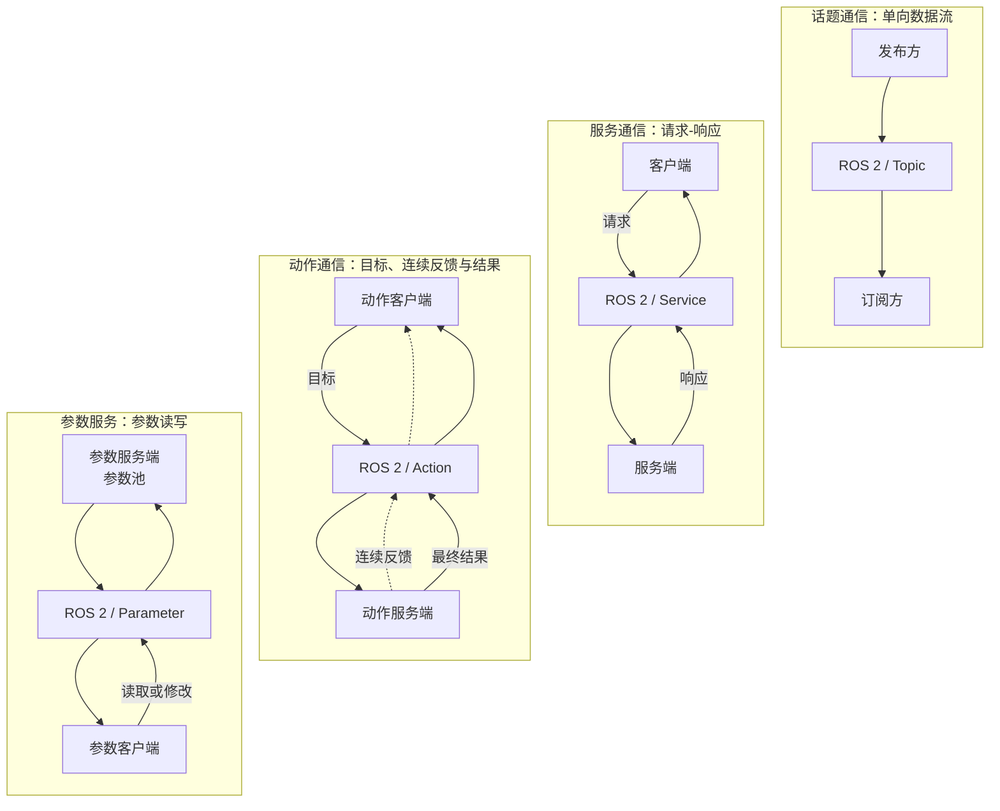
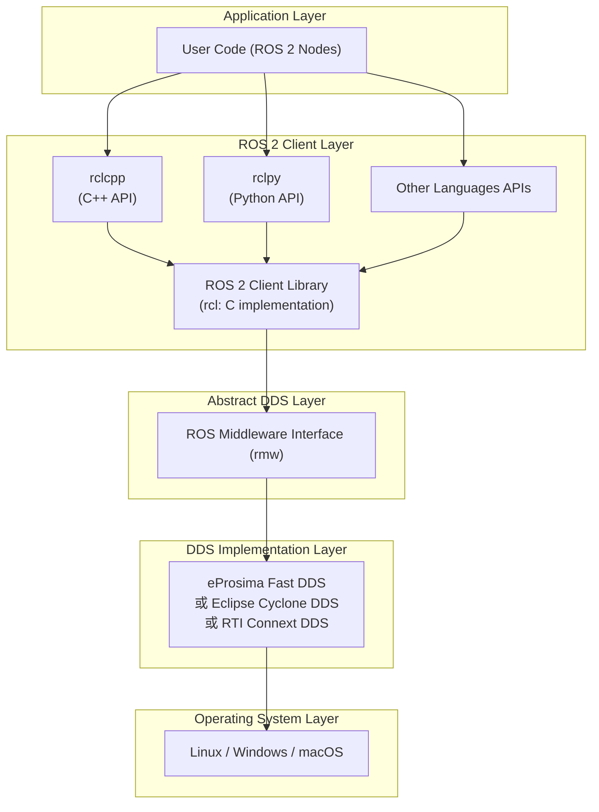
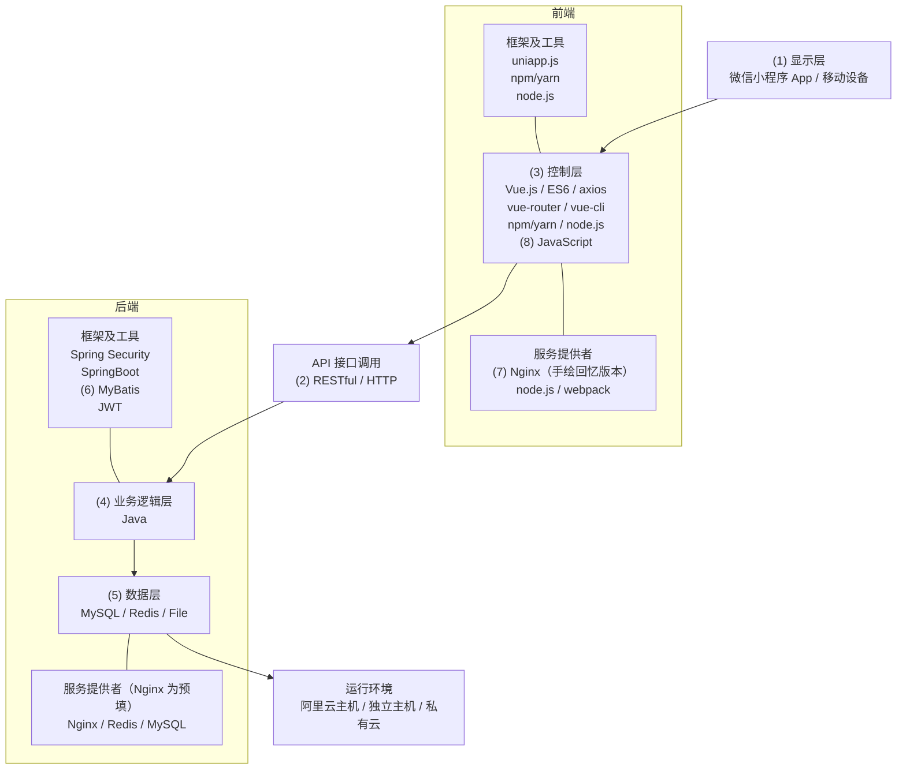
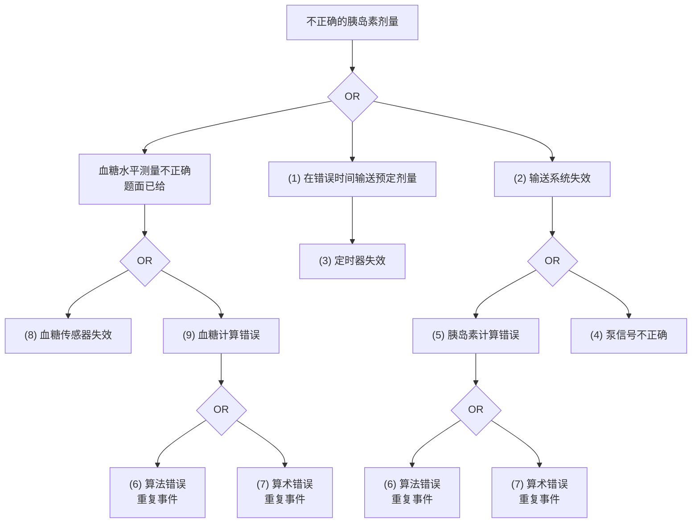

# 2024 年下半年系统架构设计师案例分析（清洗版）

> **主试题数量：** 5 道。两份本地底稿与信息较完整的公开回忆页均支持五题结构；希赛公开整卷页只列 4 题，与这些材料冲突，因此不作为题量依据。
>
> **本地底稿：** [原始整理版](../02.历年真题/2024年下半年-系统架构设计师-案例分析.md)保留五题主题，但题面严重残缺；[补充版](<../02.历年真题(补充)/2024年下半年-系统架构设计师-案例分析.md>)保留试题一、二和三的更多题面。本版仅在可交叉核对处合并二者。
>
> **非官方性质：** 题面、分值、图表空位与参考答案均为第三方回忆整理，未获考试主管机构确认。技术文档只能用于核验知识点，不能把回忆答案提升为官方标准答案。
>
> **作答规则：** 本地底稿未保留试卷总说明。案例分析科目通常为试题一必答、试题二至五任选二题，具体以当次官方试卷为准。
>
> **清洗勘误与来源差异：** Cache-Aside 读流程的第（2）空按题图恢复为“命中后返回”，第（3）空才是“未命中后查询数据库”；写流程为“更新数据库后删除缓存”。质量属性表依据考期内近时回忆裁定为 b 预填“可靠性”，并固定 c=（1）、d=（2）、e=（3）；后期把 b/c 对调的完整表只作为冲突版本保留。Web 架构图中前端 Nginx 的几何位置可以确认，但腾讯文档在考试当天 17:57 和 18:29 已先后保存（3）与（7）两套互相冲突的考生重构，后期模板又记为（8）；三种空号均不能视为官方编号。ROS 题采用能合计 25 分的 12、8、5 分口径；RKPass 回忆页另记 13、8、7 分，合计 28 分，已作为非官方冲突隔离。危险驱动的安全分析四步骤按 Sommerville 体系核为“危险识别、危险评估、危险分析、风险降低”。
>
> **已知限制：** Cache-Aside 两张流程图、ROS 通信与分层图、Web 架构图及胰岛素泵故障树均已恢复为可阅读、可作答的结构化转录，但不是官方原图，也不复刻原图版式。质量属性分类表的近时材料只保留 a～e、g、h 的部分精确状态和“共 7 空”；同日讨论中的行标签还发生漂移，其余格位不得从后期完整表反推为原卷。Web 图中 Nginx 空位的几何位置可确定为“前端—服务提供者”顶部，后端 Nginx 是预填项；同日数字化重构与手绘重构分别把该空位记为（3）和（7），后期模板另记（8），仍缺官方原图裁决。
>
> **公开回忆来源（访问日期：2026-07-11）：** [博客园详细回忆页](https://www.cnblogs.com/yangykaifa/p/19328433)用于恢复五题题面、分值、空位顺序和非官方答案；[优路教育考后回忆](https://www.youlu.com/rkgj/article/CA20241110030000000044)用于交叉确认质量属性题与 Cache-Aside 题；[希赛整卷页](https://wangxiao.xisaiwang.com/tiku2/131/tp30411116.html)仅用于记录其“四题”口径冲突，不用于补题。三者均非官方原卷。
>
> **考期内近时回忆（访问日期：2026-07-12）：** [Linux.do 原始讨论](https://linux.do/t/topic/255765/1)创建于 2024-11-10，讨论中的 2024-11-11 回复链接到只读腾讯文档[《2024.11系统架构设计师真题回忆》](https://docs.qq.com/doc/DRlNVSkZLZkZ6eHF6)。腾讯文档[公开 opendoc 元数据接口](https://docs.qq.com/dop-api/opendoc?u=&id=DRlNVSkZLZkZ6eHF6&normal=1&outformat=1&noEscape=1&commandsFormat=1&doc_chunk_version=3&preview_token=&doc_chunk_flag=1&callback=clientVarsCallback&xsrf=)返回 `createdDate=1731211780000`、`lastModifyTime=1731563761075`，换算为北京时间分别是 2024-11-10 12:09:40 和 2024-11-14 13:56:01；文档内也显示最后保存于 2024-11-14 13:56。公开 `initialAttributedText` 二进制载荷的 SHA-256 为 `6d9f02975257f8673aa933e4d2ae42b678702f99fe6e91c071b8761a715fb256`；[公开修订增量接口](https://docs.qq.com/dop-api/get/changes?padId=300000000%24FSUJFKfFzxqz&from=1&to=14022&commandsFormat=1)还可回放修订 1～14022，用于核对同日材料的先后。本版仅把它作为考期内形成的近时回忆，用来裁决来源先后及恢复其实际保留的信息，不把它称为官方原卷。
>
> **固定转录版本（访问日期：2026-07-12）：** [wujiaming88/awesome-ruankao 固定提交中的本卷案例分析 Markdown](https://github.com/wujiaming88/awesome-ruankao/blob/16093de843f618c7c35af3e83b47644b5fae2c6f/%E7%9C%9F%E9%A2%98/%E7%B3%BB%E7%BB%9F%E6%9E%B6%E6%9E%84%E8%AE%BE%E8%AE%A1%E5%B8%88/2024%E5%B9%B4%E4%B8%8B%E5%8D%8A%E5%B9%B4/%E6%A1%88%E4%BE%8B%E5%88%86%E6%9E%90.md)（提交 `16093de843f618c7c35af3e83b47644b5fae2c6f`，Git blob `844e3432c0792832925d94831c12d568dec76141`）用于固定五题转录、空号答案与来源冲突。该文件把 RKPass 称为“官方题库”，但 RKPass 并非考试主管机构；本稿不继承这一可信度判断。
>
> **技术核验来源（访问日期：2026-07-11）：** Cache-Aside 以 [Microsoft Azure Architecture Center](https://learn.microsoft.com/en-us/azure/architecture/patterns/cache-aside)核验；ROS/ROS 2 以官方 [ROS 简介](https://docs.ros.org/en/ros2_documentation/rolling/About-ROS.html)、[Topic/Service/Action 指南](https://docs.ros.org/en/ros2_documentation/rolling/Concepts/Basic/Interfaces-Topics-Services-Actions.html)、[内部接口说明](https://docs.ros.org/en/rolling/Concepts/About-Internal-Interfaces.html)及[中间件实现说明](https://docs.ros.org/en/jazzy/Concepts/Intermediate/About-Different-Middleware-Vendors.html)核验；Elasticsearch 分词器以 Elastic 官方 [Standard](https://www.elastic.co/docs/reference/text-analysis/analysis-standard-analyzer)、[Simple](https://www.elastic.co/docs/reference/text-analysis/analysis-simple-analyzer)、[Whitespace](https://www.elastic.co/guide/en/elasticsearch/reference/current/analysis-whitespace-analyzer.html)和 [Keyword](https://www.elastic.co/docs/reference/text-analysis/analysis-keyword-analyzer)文档核验；安全分析步骤以基于 Sommerville 教材的[安全工程课程笔记](https://www.fhsu.edu/cs/csci441/safetyengineering)核验，故障树关系另与公开的[胰岛素泵故障树示例](https://www.conceptdraw.com/examples/fault-tree-analysis-insulin-pump)交叉检查。

---

## 试题一（25 分）：面向质量属性的软件架构设计

### 说明（晚期完整转录；不与近时格位拼接）

以下（a）～（j）完整场景来自 2025-11-27 希赛页和 2025-12-09 博客园页这一晚期完整转录谱系，不是由考试当天腾讯文档完整保存。近时文档只保留后文所列部分格位，且行标签在协作讨论中发生漂移；因此这里保留完整文字用于学习，但不把其行序与近时 b/c 格位拼成唯一原卷。

某公司拟开发一个基于大语言模型的智能系统。多个大语言模型协作处理用户提交的任务，请求求解状态记录在任务板中；各模型根据任务板上的实时状态决定是否继续参与处理，并在处理后更新任务状态。项目组提出以下需求：

- （a）用户可在任务板查看任务状态和结果，并可多次调用大语言模型继续优化结果。
- （b）支持任务数据导入和导出，且在 1 分钟内完成。
- （c）数据服务器故障时立即切换到备份服务器并保证数据同步，使服务不中断。
- （d）正常负载下，查询任务状态和结果的响应时间不超过 2 秒。
- （e）保护用户数据和操作记录，防止未经授权的访问。
- （f）支持多语言界面，并提供查询词自动补全和搜索联想。
- （g）支持扩容以容纳更多用户和任务；由两名运维人员在 5 天内完成扩容。
- （h）系统部署在云服务器上；云服务器故障应在 1 分钟内检出，并在 1 小时内恢复。
- （i）可根据用户任务类型调用相应的大语言模型。
- （j）用户可搜索历史任务和结果，搜索结果在 3 秒内返回。

### 问题 1（14 分）

分析需求（a）～（j），完成原题分类表中的（1）～（7）。

> **图表状态：** 官方原表仍未取得。考期内腾讯文档的初始正文和修订增量保存了 b～e 等部分精确格位，足以裁决此前的 b/c 对调冲突并固定 c=（1）、d=（2）、e=（3）；但同日讨论中的行标签发生过漂移，也没有保存七个空在 a～j 中的完整编号分配。下面只恢复该近时材料实际保留的部分，后期完整表另列为冲突版本，不能拿它补齐未知格位。

#### 考期内近时表格记忆（本版用于裁决 b/c 并固定 d/e）

文件头所列腾讯文档形成于 2024-11-10 至 11-14。其正文明确说明本题采用 table 表格而不是质量属性效用树，并特别记下“可靠性”和“可用性”同时出现在表中；所保留的格位如下：

| 需求 | 近时文档保留的单元格状态 | 本版处理 |
| --- | --- | --- |
| a | 功能性（预填） | 可恢复 |
| b | 可靠性（预填） | **据此裁定，不采用后期 b=（1）版本** |
| c | （1） | **据此裁定，不采用后期 c=可靠性版本** |
| d | （2） | 可恢复 |
| e | （3） | 可恢复 |
| f | 初始表为空；同日讨论又以 f 指“增加新模块 / 3 天” | 标签记录漂移，不补空号或答案 |
| g | 初始表保留“操作不同任务导入支持不同模型”；同日讨论又以 g 指“三种国家语言、自动补全 / 检索联想” | 标签记录漂移，不补空号或答案 |
| h | 可用性（预填） | 可恢复 |
| i | 未保留 | 不补空号或答案 |
| j | 未保留 | 不补空号或答案 |

该文档还记得全表共 7 个空；同日讨论另提到云服务器故障切换、历史搜索 3 秒等需求，但使用了与现稿 a～j 不一致的 f/g/l/m 行标签。因而本版把 `b=可靠性（预填）、c=（1）、d=（2）、e=（3）` 视为已由近时证据固定；这些语义片段和“共 7 空”都不能单独推出（4）～（7）的精确行号与答案。

[2025-03-13 的 CSDN 回忆](https://blog.csdn.net/weixin_42273847/article/details/146226604)也独立记为 a=功能性、b=可靠性、c=（1）、d=（2）、e=（3）、h=可用性，但其页面后来在 2025-07-19 修改。本版只把它作为方向一致的较晚旁证，不用其未知部分扩写考期内材料。

#### 希赛后期完整表（冲突版本，不用于反改近时格位）

[希赛整理页](https://www.educity.cn/rk/5437194.html)发布于 2025-11-27；其[质量属性表静态图](https://img.kuaiwenyun.com/images/article/2025-11/912/b6sArtpsXq.png)为 865×460 像素，SHA-256 为 `ee3930f9fca5468b97db27bd7f04ef5328676014d15a5a2c328232bea8c8a468`（访问日期：2026-07-12）。该图把 b 画成（1）、c 预填“可靠性”，与考期内近时材料正好对调；它还给出下列完整结构：

| 需求 | 该后期图中的单元格 | 该来源给出的填写结果 |
| --- | --- | --- |
| a | 功能性（预填） | 功能性 |
| b | （1） | 性能 |
| c | 可靠性（预填） | 可靠性 |
| d | （2） | 性能 |
| e | （3） | 安全性 |
| f | （4） | 功能性 |
| g | （5） | 可修改性 |
| h | 可用性（预填） | 可用性 |
| i | （6） | 功能性 |
| j | （7） | 性能 |

希赛页面正文在转述行号时还出现把 i 写成“（1）”、把 h 写成“（n）”的编辑错误；上表仅用于如实记录该静态图自身。由于它发布晚于考试约一年且与近时材料冲突，本版不据此把 b 改回（1），也不把 f、g、i、j 的后期编号冒充成已恢复的原卷格位。

### 问题 2（11 分）

针对可用性需求（h），张工提出采用 Ping/Echo 策略检测故障，李工认为从系统资源利用率看采用心跳策略更优。

1. 分别说明 Ping/Echo 和心跳策略如何完成故障检测。
2. 解释在题设条件下心跳策略资源利用率更高的原因。

### 参考答案与解析（非官方）

【问题1】

后期希赛结构版及多份公开答案序列给出的七个答案依次为：

（1）性能；（2）性能；（3）安全性；（4）功能性；（5）可修改性；（6）功能性；（7）性能。

这组答案序列仍是非官方考后整理。考期内近时文档只把 c、d、e 保留为（1）、（2）、（3），没有保存（4）～（7）的精确行号；因此本版采用 `b=可靠性（预填）、c=（1）` 的格位裁决，但不把后期完整表对 f、g、i、j 的映射反向拼进近时表格。

下面是独立的语义核对，不用于改写或拼接上述两套表格位置：

| 需求 | 主要类别 | 判断依据 |
| --- | --- | --- |
| a | 功能性 | 查看状态、结果及再次调用模型是系统行为。 |
| b | 性能（近时表记为预填“可靠性”） | 用 1 分钟限定导入导出时间；这里是语义判断，不反改近时材料的格位记录。 |
| c | 可用性（近时表为（1），后期希赛图预填“可靠性”） | 故障切换、数据同步和服务不中断；不同回忆的格位记录与语义分类并不完全一致。 |
| d | 性能 | 用 2 秒限定响应时间。 |
| e | 安全性 | 防止未授权访问。 |
| f | 易用性兼具功能性 | 多语言、自动补全和联想改善使用体验，同时也是明确功能。原表主分类需以卷面预填项为准。 |
| g | 可修改性/可部署性 | 以人员和工期度量扩容变更成本。 |
| h | 可用性 | 明确故障检测与恢复时限。 |
| i | 功能性 | 按任务类型选择模型是系统行为。 |
| j | 性能兼具功能性 | 搜索是功能，3 秒返回是性能约束。 |

当前公开转录中的需求顺序与近时表格格位存在上述语义张力。没有官方题面时，只能分别保留“近时格位记录”和“按现有需求文字作出的语义核对”，不能通过调整需求顺序或答案内容消除冲突。

【问题2】

- **Ping/Echo：** 监控方周期性向被监控组件发送 Ping；收到 Echo 说明组件仍可达，连续未响应或超过阈值则判定故障。
- **心跳：** 被监控组件按周期主动发送简短的存活消息；监控方记录最后心跳时间，超过若干周期未收到心跳则判定故障。
- **资源比较：** 在题设的一次 Ping 对应一次 Echo、心跳为单向短消息的实现下，心跳减少了请求—应答消息和等待状态，因而可能降低网络、线程和连接开销。但这不是无条件结论；检测周期、消息大小、节点数量及是否复用业务连接都会影响实际资源消耗。

---

## 试题二（25 分）：Cache-Aside 缓存架构

### 说明

某购物网站为提升访问体验，把经常访问的商品信息放入临时高速缓存。项目组采用 Cache-Aside 策略，由应用程序负责协调缓存与主数据库。

### 问题 1（10 分）

完成 Cache-Aside 数据读取流程图中的（1）～（5）。

> **图表状态：** 原图未入库；下图依据[公开回忆整理页](https://blog.csdn.net/qq_36268452/article/details/150612429)所附[读流程静态图](https://i-blog.csdnimg.cn/direct/a7430b2a029b4db2acba46584546dc6f.png)转录节点、方向和空号位置，并与文件头固定 GitHub 转录交叉核对，是结构化重绘示意，不是原图。访问日期：2026-07-12；核对图像 SHA-256 为 `d55590579efe4068a35ad71bc48ea7ac9f35336f6ecf7532a4eceb1bf2c82912`。

### 问题 2（6 分）

完成 Cache-Aside 数据更新流程图中的（1）、（2）。

> **图表状态：** 原图未入库；下图依据同一公开整理页所附[写流程静态图](https://i-blog.csdnimg.cn/direct/f8f40b1bb1284fd592f8b28056ed10b2.png)转录节点、方向和空号位置，是结构化重绘示意，不是原图。访问日期：2026-07-12；核对图像 SHA-256 为 `28ad429b85e5f018955823c6845184e430a96dab1f43a25c341e33f846be60a1`。

### 问题 3（9 分）

线程 1 执行数据更新、线程 2 执行数据读取时，说明数据库与缓存为何可能不一致，并给出三种或以上解决方案。

### 参考答案与解析（非官方）

【问题1】

（1）向缓存请求读取该商品信息；（2）若命中则把缓存中的商品信息直接返回；（3）若未命中则访问数据库查询该商品信息；（4）把数据库查询结果写入缓存；（5）把数据库查询结果返回给请求方。

图中（2）和（3）分别是缓存菱形节点的“命中”与“未命中”两条分支；不能把（2）简写成“缓存未命中”，否则会丢失直接返回路径并与题图空号位置冲突。

【问题2】

（1）更新数据库；（2）删除（失效）缓存。

**结构化写入流程（非原图）：** 应用先提交数据库更新，成功后使对应缓存项失效；后续读取未命中时再从数据库回填。Cache-Aside 的常见写路径不是同时更新数据库和缓存。

【问题3】

缓存与数据库是两个独立资源，操作通常不具备同一原子事务；线程交错或其中一步失败都会造成短暂或持续不一致。例如：线程 2 缓存未命中并读到旧数据库值；线程 1 随后更新数据库并删除缓存；线程 2 最后把先前读到的旧值写回缓存，于是缓存再次变旧。

可按一致性要求组合以下措施：

1. 对同一业务键串行化更新和回填，例如互斥锁或单写者队列。
2. 使用事务消息、Outbox、数据库变更日志（CDC/binlog）或可靠消息队列，在提交后异步失效缓存，并配套重试、幂等和死信处理。
3. 为数据携带版本号或时间戳，回填时采用比较并设置，拒绝旧版本覆盖新版本。
4. 采用延迟双删，并设置合理 TTL，使遗漏的失效最终收敛；延迟值需结合实际读写耗时，不能保证强一致。
5. 对强一致数据绕过缓存，或把相关读写放入能提供所需一致性语义的统一数据服务。

---

## 试题三（25 分）：机器人操作系统 ROS 2

### 说明

考试当天腾讯文档按“定义/特点与改进、通信机制填空、架构层次”顺序保留 12、8、5 分，合计 25 分；后期希赛材料虽然交换后两问的题序，内容—分值对应仍是 12、8、5。RKPass 另记 13、8、7 分，合计 28 分，与本科目单题 25 分自相矛盾，故只作为非官方录入冲突保留，不据此改写下列分值。

某公司长期从事机器人产品研制，原产品使用开源 ROS 1。产品智能化升级时，张工建议继续采用其升级方向 ROS 2；王工指出 ROS 1 存在中心化 Master、通信和平台能力等限制，因此需要说明 ROS 2 的主要改进。

### 问题 1（12 分）

1. 概要说明 ROS 的定义和特点。
2. 说明 ROS 2 相对 ROS 1 的主要改进。

### 问题 2（8 分）

ROS 2 常见通信方式包括话题（Topic）、服务（Service）、动作（Action）和参数。判断下列描述分别对应哪一种：

1. 节点可读取或修改由节点维护的共享配置数据。
2. 发布者持续发布数据，订阅者按话题接收，数据流由发布者单向流向订阅者。
3. 客户端发出长时间运行的目标，服务端处理期间可连续反馈进度，最后返回结果。
4. 客户端发送请求，服务端处理后返回一次响应。

> **图表状态：** 原通信模型图未入库；下图依据 [RKPass 本题公开回忆页](https://www.rkpass.cn/tk_timu/4_909_3_anli.html)所附通信模型图转录四组端点、ROS 2 中介与数据方向，是结构化重绘示意，不是原图。访问日期：2026-07-12；核对图像 SHA-256 为 `735474c88e09d3a8c86d9ae5f6c3eaea9c438289d8f3725eddb36087a2354ec7`。

### 问题 3（5 分）

说明题图中 ROS 2 软件架构各层的主要功能。

> **图表状态：** 原图未入库；下图依据同一 RKPass 题页所附 ROS 2 架构图转录五层边界、客户端库、RMW、中间件实现与操作系统选项，是结构化重绘示意，不是原图。访问日期：2026-07-12；核对图像 SHA-256 为 `09dd6a96a554569335cc86324966aed40ad8311b33a7ae1de62df18edf321e97`。

### 参考答案与解析（非官方）

【问题1】

ROS 不是传统意义上的操作系统内核，而是一组用于构建机器人应用的开源软件库、工具和约定。它以节点组织功能，通过消息接口实现模块通信，并提供客户端库、包管理、构建、调试和可视化工具，具有模块化、分布式、可复用、多语言和社区生态丰富等特点。

ROS 2 的主要改进可概括为：

- 通过中间件抽象层（RMW）支持 DDS 等不同中间件实现，采用分布式发现，消除 ROS 1 对中心 Master 的依赖。
- 提供 QoS 策略，可按可靠性、历史深度、持久性和时限等需求配置通信。
- 更重视实时系统、生命周期管理和组件组合，支持进程内或跨进程部署。
- 扩展到 Linux、Windows、macOS 及部分实时操作系统和嵌入式场景。
- 可结合 DDS Security 提供认证、访问控制和加密等安全能力。

【问题2】

（1）参数；（2）话题；（3）动作；（4）服务。

话题适合连续数据流；服务适合快速完成的请求—响应；动作适合可取消、需要进度反馈的长任务。官方 ROS 2 中参数由各节点托管并通过参数服务访问，并不是任意进程直接共享同一内存变量。

【问题3】

公开回忆图中的五层由上至下为：

1. **Application Layer：** 实现具体机器人应用和任务逻辑。
2. **ROS 2 Client Layer：** 向应用提供节点、话题、服务、动作等客户端 API；回忆图把语言客户端库及其核心支撑简化为一层。
3. **Abstract DDS Layer：** 对具体中间件提供统一抽象，对应 ROS 2 的 RMW 接口职责，使上层不依赖某一家 DDS 实现。
4. **DDS Implementation Layer：** 由选定的 DDS/RTPS 或其他受支持中间件实现发现、序列化和数据传输。
5. **OS Layer：** 提供进程、线程、内存、时钟、网络和设备等底层运行环境。

> 官方 ROS 2 的实际内部接口还包括 `rclcpp`/`rclpy`、`rcl`、`rmw` 等更细层次；上面保留的是考试回忆图的五层简化模型。

---

## 试题四（25 分）：Elasticsearch 分词与 Web 架构

### 说明（近时回忆已恢复主题，完整题面仍未恢复）

考期内腾讯文档把本题记为“基于 Elasticsearch 分词的商品推荐系统（微信小程序接入）”。这足以恢复系统主题、检索技术和接入端，但文档没有保存完整业务叙事、全部题干句子或官方架构图，本版不据此扩写场景。

同一近时文档明确记载三问分值分别为 6、12、7 分：第 1 问比较四种分词器；第 2 问为 8 空架构填空；第 3 问讨论 RESTful 与前后端分离，合计 25 分。

### 问题 1（6 分）

说明 Standard、Simple、Whitespace 和 Keyword 四种 Elasticsearch 分析器如何分词。

### 问题 2（12 分）

从题给选项中完成系统架构图的 8 个空。公开回忆中的候选项包括显示层、控制层、业务逻辑层、数据层，以及 JavaScript、RESTful、MyBatis、Nginx 等。

> **图表状态：** 原考试架构图未取得。下图逐项转录腾讯文档中的[考期内手绘重构图](https://docimg8.docs.qq.com/image/AgAABYwafaW5_gEF1W9I5rAOKNhbdCDB.jpeg)，再以公开模板核对组件位置；它仍是“回忆图的结构化重绘”，不是官方题图。固定手绘图为 1892×2701 像素，HTTP `Last-Modified` 为 2024-11-10 10:29:37 GMT（北京时间 18:29:37），ETag 为 `41930a6e9aac81d6afd52b5e8bb5f84d`，SHA-256 为 `6b940f18c1ce94b2452d0ac83141560981e3eb27e904af1a62040fe8f70dcc76`（访问日期：2026-07-12），其中前端服务提供者顶部记为（7）。但修订 rev2450 在同日 17:57:32 已嵌入另一张数字化记忆重构，把同一位置记为（3）；两者都是考生回忆，不能按相差 32 分钟裁成唯一原卷空号。

#### Nginx 空位的同日（3）/（7）与后期（8）编号冲突

以下页面与静态图的访问日期均为 2026-07-12：

- 腾讯文档修订 rev2450 在北京时间 2024-11-10 17:57:32 嵌入一张[数字化记忆重构图](https://docimg3.docs.qq.com/image/AgAABYwafaW7bwM1tt5IRKtxIOzB1puS.png)，为 1192×1173 像素，HTTP `Last-Modified` 为 2024-11-10 09:57:32 GMT，ETag 为 `415747ff490667b3d7741ae3fce0416c`，SHA-256 为 `fb0a0ba245e4f1248d92e710a7d8830bf9ae607ecad5ea1811c6a3baaeeae9d6`。图上手注明确写有“（3）我填 Nginx、（7）我填 RESTful、（8）我填 MyBatis”，因此（3）并非只在 2025 年后的重构中出现。
- 腾讯文档中的[考期内手绘重构图](https://docimg8.docs.qq.com/image/AgAABYwafaW5_gEF1W9I5rAOKNhbdCDB.jpeg)在同日 18:29:37 把前端“服务提供者”顶部标为（7），结合候选项和模板几何，该空应填 Nginx。图像及时间、哈希元数据见本题“图表状态”。它与上述（3）版本只相隔约 32 分钟，两张图都是考生重构而非原卷截图，不能仅按时间先后选出“近时最强候选”。
- 同一腾讯文档后来补入一张[完整通用模板图](https://docimg2.docs.qq.com/image/AgAABYwafaW7c7eT5eRPmbPDPEZ6FQpa.png)，为 929×1051 像素，HTTP `Last-Modified` 为 2024-11-12 01:31:31 GMT，ETag 为 `17e3368ff074f677ec6ee6db9f768c60`，SHA-256 为 `6f82e45a1d5d2def8f1fdbe5ffa59078755b1521901b2feeb6cd18d21f67c764`。该后补模板采用（8）=Nginx 的整理口径，但相邻文字明确说明这是后来找到的完整模板，参与者已经记不清原题哪些位置挖空；因此它不能覆盖手绘近时记忆，也不能视为原题截图。
- [ProcessOn 原始模板页](https://www.processon.com/view/64200cecbe09c62a4cdbad33)发布于 2023-03-26，早于本次考试；其[完整模板图](https://pocdn.processon.com/poimg/template/fullimg_crop/64200cecbe09c62a4cdbad33/6459dd3b76213115b7c33a6b.png)为 1920×1179 像素，SHA-256 为 `1249a669f979a4a2455061d0ee98ca18caa0cf815d4a2cc7019058b157b35bdb`。模板在前端和后端两个“服务提供者”栏的顶部都写有 Nginx；它只能证明模板几何早已存在，不能证明考试直接采用了该模板。
- [2025-03-13 的 CSDN 重构页](https://blog.csdn.net/weixin_42273847/article/details/146226604)所附[空白题图](https://i-blog.csdnimg.cn/direct/f22a2ab9ea0d401ba75e4806460bb331.png)（SHA-256 `e56fe93da8aa7b54d2dbc45c2e08e18c44a9fb072bc422ac276750937b78b3b0`）把前端“服务提供者”顶部标为（3），后端 Nginx 已预填；同页[已填图](https://i-blog.csdnimg.cn/direct/4ae6887119444470b593588d5d415971.png)（SHA-256 `93d704352c167257839744d39cdd27c4da1601d203fe0d7c328e29585c74e8fb`）在该位置填入 Nginx。
- [另一份固定 Git 重构](https://github.com/louxj424/system-architect-exam/blob/98f6074ff4b96f08258f2e56d92861eba5dbde3b/2024_second/img/elasticsearch_archture.png)（提交 `98f6074ff4b96f08258f2e56d92861eba5dbde3b`，Git blob `34640e64d9cfe98b78051bda7435df21f202b57c`，图像 SHA-256 `1589164af4dce7ece5cbcda57f014ecffc11a61f574485017be0deb600fd6892`）也手注“（3）我填 Nginx”，但提交时间为 2025-08-02 且上游来源未知，只能作为独立的较晚“（3）”重构，不能当原卷。
- [RKPass 本题公开回忆页](https://www.rkpass.cn/tk_timu/4_909_4_anli.html)所附已填模板采用（8）=Nginx 口径，核对图像 SHA-256 为 `7654e4b11268ce7b5ed5fee69ff39792c5d2ce9801db9f9d36784b5b74d033cc`；页面未提供可与考期内手绘图相比的原始上传时间，也不是考试主管机构页面，故只作为另一份（8）重构。
- [较晚 ADG/CSDN 重构页](https://adg.csdn.net/6972e047437a6b40336b3c95.html)发布于 2025-10-10；其[编号图](https://i-blog.csdnimg.cn/direct/666a184c097c4f8981ef8474b762041b.png)为 440×493 像素，SHA-256 为 `8cec31094b21290c048f99977cfb1b604378e900fd1f25cadee15f44f27a847a`。同一个前端“服务提供者”顶部改标为（8），后端 Nginx 仍为预填。

上述来源共同支持的**几何结论**是：待填 Nginx 位于前端“服务提供者”栏顶部，后端“服务提供者”栏中的 Nginx 是预填项；现有证据不再支持“前端或后端均有可能”的说法。精确空号方面，考试当天已经同时存在（3）与（7）两套可检查重构，后期又有（8）模板；三者都不是官方原卷，当前没有唯一最强的空号候选。

### 问题 3（7 分）

说明 RESTful 架构的特点，以及如何实现前后端分离。

### 参考答案与解析（非官方）

【问题1】

1. **Standard analyzer：** 使用 Standard Tokenizer 按 Unicode 文本分段规则切词，再默认执行小写化；停用词过滤器默认关闭。它是 Elasticsearch 的默认分析器。
2. **Simple analyzer：** 遇到非字母字符时切分，只保留连续字母形成的词元，并转为小写。
3. **Whitespace analyzer：** 仅在空白字符处分词，不自动小写化，也不会按标点进一步切分。
4. **Keyword analyzer：** 不切分，把整个输入作为单一词元。

具体语言的分词效果应以所用 Elasticsearch 版本和 `_analyze` 实测为准；原底稿关于中文必然逐字切分的表述过于绝对，本版不保留。

【问题2】

考期内两张重构与两套后期完整重构的组件几何接近，但空号顺序不同，必须按所见题图分别作答；考试当天数字化图只把三处手写答案可靠固定下来，其余项不从后期表反填：

| 内容 | 考试当天手绘（7）版 | 考试当天数字化片段 | 2025-03 完整（3）版 | 后期完整（8）版 |
| --- | --- | --- | --- | --- |
| 显示层 | （1） | 未可靠固定 | （1） | （1） |
| RESTful | （2） | （7） | （5） | （4） |
| 控制层 | （3） | 未可靠固定 | （2） | （2） |
| 业务逻辑层 | （4） | 未可靠固定 | （6） | （5） |
| 数据层 | （5） | 未可靠固定 | （8） | （6） |
| MyBatis | （6） | （8） | （7） | （7） |
| 前端服务提供者顶部 Nginx | （7） | （3） | （3） | （8） |
| JavaScript | （8） | 未可靠固定 | （4） | （3） |

> **可信度说明：** 四列都是第三方回忆或模板重构，不是官方答案表。前两列形成于考试当天下午，却已对 Nginx 空号直接冲突，不能因相差约 32 分钟而指定唯一最强候选；后两列只用于隔离后期完整编号体系。可以确定的只有 Nginx 的前端几何位置及后端预填状态；实际作答仍须先确认所用题图的编号体系。

【问题3】

REST 风格的核心约束包括客户端—服务器分离、无状态、可缓存、统一接口、分层系统以及可选的按需代码。资源通过 URI 标识，客户端使用资源表述（常见为 JSON）并按统一 HTTP 语义交互。

实现前后端分离时，前端负责界面、交互和状态展示，后端负责业务规则、权限和数据访问；双方通过版本化 API 契约约定 URI、HTTP 方法、请求/响应结构、状态码、认证和错误格式。前后端可独立开发、测试和部署，但仍需通过接口兼容策略和自动化契约测试控制演进风险。

---

## 试题五（25 分）：安全关键系统与胰岛素泵

### 说明

一个模拟胰腺工作的医疗系统从传感器采集血糖数据，计算所需胰岛素剂量，再控制泵向患者输送。系统失效可能使患者受伤甚至死亡，因此需要进行安全需求分析。

### 问题 1（10 分）

说明危险驱动的安全分析过程的四个步骤，并分别简要解释。

### 问题 2（9 分）

不正确的胰岛素剂量可能来自三类顶层原因：血糖水平测量不正确、输送系统失效、在错误时间输送预定剂量。题目给出血糖传感器失效、泵信号不正确、定时器失效、血糖计算错误、胰岛素计算错误、算法错误和算术错误等事件。请完成故障树（1）～（9）。

> **图表状态：** 原题图未入库；下图依据文件头固定转录的空号答案及[里斯本大学课程页所引 Sommerville 胰岛素泵故障树](https://web.tecnico.ulisboa.pt/~joaofernandoferreira/2021/SoftSpec/jff/img/diag-fault-tree2.png)转录顶层事件、全部 OR 门、重复事件与因果连接，是结构化重绘示意，不是原图。访问日期：2026-07-12；核对图像 SHA-256 为 `c4cee8a38bce9eadd44f7879dbfcb640b2030e58d6359ea0ff2a86ef9e291412`。

### 问题 3（6 分）

说明在安全关键系统构建中使用形式化方法和软件测试技术各自的特点。

### 参考答案与解析（非官方）

【问题1】

1. **危险识别（Hazard identification）：** 找出可能威胁系统、人员或环境的危险。
2. **危险评估（Hazard assessment）：** 评估各危险发生的概率和后果严重度，确定风险及优先级。
3. **危险分析（Hazard analysis）：** 分析危险产生的根因、故障组合和传播路径，可使用故障树等方法。
4. **风险降低（Risk reduction）：** 提出消除危险或把风险降到可接受水平的安全需求与控制措施。

> 旧回忆答案写成“危险识别、风险分析、安全需求制定、安全需求验证”，与该题所依据的危险驱动教材流程不一致，故本版依据独立课程资料校正。

【问题2】

空号映射为：

（1）在错误时间输送预定剂量；（2）输送系统失效；（3）定时器失效；（4）泵信号不正确；（5）胰岛素计算错误；（6）算法错误；（7）算术错误；（8）血糖传感器失效；（9）血糖计算错误。

上图中的四个逻辑门均为 OR 门；（6）和（7）在“血糖计算错误”与“胰岛素计算错误”两条分支下各重复出现一次。自动布局不代表原卷几何位置，但门类型、父子关系和重复事件已由经典图核对。

【问题3】

- **形式化方法：** 用数学化规约、模型和证明精确描述并验证系统，可在实现前发现歧义、矛盾和某些设计错误，并可证明实现或模型满足给定性质；代价是建模和证明成本高、需要专门技能，且证明只能针对规约中的性质，错误或遗漏的规约仍会导致风险。
- **软件测试：** 通过执行软件并观察结果发现缺陷，易与真实设备、性能和异常场景结合，工程工具成熟；但测试只能覆盖有限输入和状态，发现缺陷不能证明不存在未测缺陷。安全关键系统通常需要把形式化分析、静态检查、测试和独立评审组合使用。
