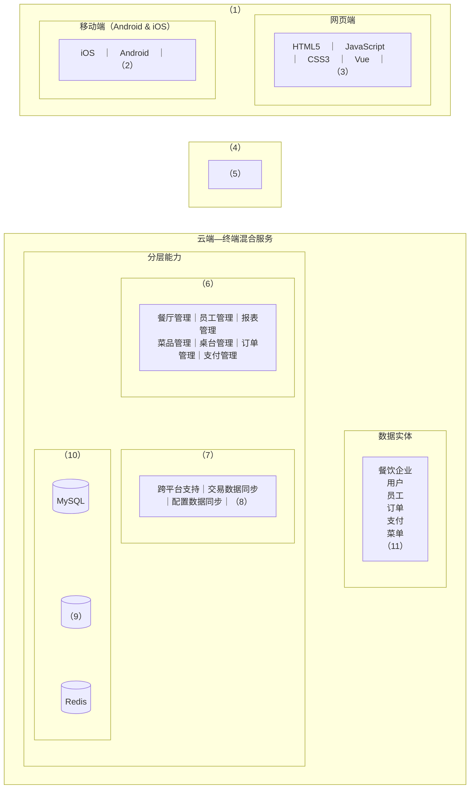
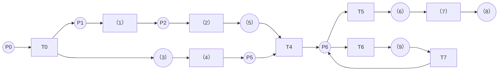

# 2025年下半年系统架构设计师案例分析（清洗版）

> **主试题数量：** 5 道大题（公开考生回忆版可识别数量；不能据此宣称与官方原卷逐字一致）。
>
> **底稿：** [补充整理版](<../02.历年真题(补充)/2025年下半年-系统架构设计师-案例分析.md>)；[原始整理版](../02.历年真题/2025年下半年-系统架构设计师-案例分析.md)仅用于交叉确认电动车充电主题。
>
> **外部参照：** 希赛网公开题库中的考生回忆页：[试题一](https://m.educity.cn/tiku/60494182.html)、[试题二](https://m.educity.cn/tiku/60494183.html)、[试题三](https://m.educity.cn/tiku/60494185.html)、[试题四](https://m.educity.cn/tiku/60494187.html)、[试题五](https://m.educity.cn/tiku/60494189.html)，访问日期均为 2026-07-11。
>
> **固定版本交叉核验：** 已通过本机 GitHub CLI 核验 `wujiaming88/awesome-ruankao` 的[固定提交 `16093de843f618c7c35af3e83b47644b5fae2c6f`](https://github.com/wujiaming88/awesome-ruankao/commit/16093de843f618c7c35af3e83b47644b5fae2c6f)，其中 `真题/系统架构设计师/2025年下半年/案例分析.md` 的 Git blob 为 `f3df3caa9658a65d58bde06eb1a81532317e5f2d`。该文件并列了多个回忆批次，部分题目与本文固定的希赛网页序列并非同一批次；本文不采用其“官方”措辞，也不把其他批次题目拼入当前五题。
>
> **非官方状态：** 上述页面均明确标为“考生回忆版”，不是考试主管机构发布的原卷或标准答案。本文只恢复能够由固定公开页面核对的题目结构、选项、流程空号及参考答案，并对必要的技术表述做清洗，不把第三方答案标成官方结论。
>
> **作答规则：** 公开回忆页显示五道试题各 25 分，但没有保留完整试卷总说明；选答规则仍应以当次官方试卷为准。
>
> **清洗状态：** 已把补充底稿的四题纠正并重组为五题；补回 AIOS 的第三问、缓存题两幅流程的五个空、点餐题缺失的候选项与第（7）空，以及整道 Petri 网题。试题四架构图、试题五表 1 和货物接运 Petri 网已按固定公开图片结构化重绘；问题 3 还恢复了可辨认的表 2。外部位图未复制入库。
>
> **剩余限制：** 试题五问题 3 的公开材料只有一幅被裁切的图 2 片段和表 2，完整 Petri 网、具体作答指令及答案仍无法恢复；以下重绘只能证明固定回忆页中可见的结构，不能替代官方原卷。其余内容也仍需官方材料复核。
>
> **问题 3 终止检索证据（复核日期：2026-07-12）：** 固定[试题五页面](https://m.educity.cn/tiku/60494189.html)标题自身含“【缺03】”，正文标注“此题不全”，答案栏为“无”；移动端 HTML SHA-256 为 `49df5d7b17f119a25962bb2719780a64957604d42e1a541be28185d43e1339d1`。其[裁切图 2](https://img.kuaiwenyun.com/images/shiti/2025-11/553/NhWUJZq2H9.png)（SHA-256 `a3da4700f619eb4783c94be638bac4de3fe2e46dc1aca80382fb1e8bcef84a52`）只能确认“未知库所→T1→P2→T2→未知库所”局部链；[表 2](https://img.kuaiwenyun.com/images/shiti/2025-11/733/EESLBdFes9.png)（SHA-256 `6e0c78a0452efbc7526e3fefc8bfaaef61c184cc5f627bdaeb8c17c8d9b0abfc`）只给出 P0～P4、T0～T4 的文字说明。Wayback CDX、Common Crawl 最近 8 个索引、`wujiaming88/awesome-ruankao` 与 `louxj424/system-architect-exam` 的固定 Git 历史和代码检索、[考后次日全科回忆视频](https://www.bilibili.com/video/BV1LykDBCEy2/)、[考后五天案例/论文视频](https://www.bilibili.com/video/BV1uTCtBeExG/)均未保留完整问题 3；公开网盘分享也已由发布者取消。因此当前缺口是来源本身不可恢复，不再从局部图反推完整网、题面或答案。

## 试题一：电动车充电智能规划系统（25 分）

> **本题来源：** [希赛网公开考生回忆页](https://m.educity.cn/tiku/60494182.html)，访问日期 2026-07-11；以下为清洗后的结构化转录，不是官方原卷。

### 说明（回忆整理）

某公司拟开发电动车充电智能规划系统，根据电池电量、实时电价、充电站分布及用户行程，规划充电时间和地点。回忆页列出以下质量需求：

- （a）收到充电查询后 3 秒内返回最优方案，高峰期支持 10000 名用户同时在线。
- （b）支持新增 API；集成新 API 的开发工作量不超过 5 人天，且无须修改现有代码结构。
- （c）新用户无须查看帮助文档，即可在 3 分钟内完成设置并取得首次推荐，首次使用成功率达到 95%。
- （d）移动应用在低于 1 Mbps 的弱网中切换到安全模式，仍能展示已保存路线和上次同步的充电站基本信息。
- （e）提供访问控制；用户只能访问自己的账户数据，管理员权限变更需经过多因素认证并记录审核日志。
- （f）用户个人数据和位置信息采用 AES-256 加密存储与传输。
- （g）充电费用计算模块可灵活配置，运维人员可在 2 小时内更新电价模型，无须开发人员介入或重新部署。
- （h）处理 50 公里范围内 200 个充电站的地图路径和站点筛选时，CPU 使用率不超过 40%。
- （i）提供测试接口，允许注入不同电量、充电站状态和电价数据，以验证推荐算法。
- （j）除计划维护外，系统可正常工作的时间达到 99.5%；计划维护提前 72 小时通知。
- （k）从车辆 API 获取电池状态到系统显示的延迟不超过 5 秒。
- （l）实现地理区域冗余；某一区域数据中心完全故障时，全局服务中断不超过 5 分钟。
- （m）提供可重现高峰期、恶劣天气和设备故障等状态的模拟环境。
- （n）为视力、听力或行动不便的用户提供符合相关标准的无障碍模式。

### 问题

#### 问题1（7 分）

将（a）～（n）填入对应质量属性的空（1）～（6）：

| 空号 | 质量属性 | 对应需求 |
|---|---|---|
| （1） | 可用性 | 待填 |
| （2） | 性能 | 待填 |
| （3） | 可修改性 | 待填 |
| （4） | 安全性 | 待填 |
| （5） | 可测试性 | 待填 |
| （6） | 易用性 | 待填 |

#### 问题2（9 分）

1. 用 100 字以内的文字写出质量属性场景的六个组成部分。
2. 指出需求（b）中的“集成新 API”和需求（l）中的“全局服务中断时间不超过 5 分钟”分别属于质量属性场景的哪个部分。

#### 问题3（9 分）

AES 的固定分组长度为 16 字节。用户个人信息、位置信息等敏感数据超过一个分组时，应如何安全处理？限 300 字以内。

### 参考答案（非官方）

#### 问题1

| 空号 | 答案 |
|---|---|
| （1） | （d）、（j）、（l） |
| （2） | （a）、（h）、（k） |
| （3） | （b）、（g） |
| （4） | （e）、（f） |
| （5） | （i）、（m） |
| （6） | （c）、（n） |

#### 问题2

1. 刺激源、刺激、环境、制品、响应、响应度量。
2. “集成新 API”描述的是系统对变更刺激采取的**响应**；“全局服务中断时间不超过 5 分钟”是量化恢复效果的**响应度量**。

#### 问题3

不要把长数据切成若干块后用 ECB 独立加密，而应选用标准、安全的工作模式。工程上优先采用带认证的 AEAD 模式（如 AES-GCM），按规范分段处理任意长度数据，并为每次加密生成在同一密钥下不重复的 Nonce/IV，同时校验认证标签。若采用需要填充的分组模式，则使用标准填充并另行提供完整性认证。还需使用成熟密码库、安全随机数和规范的密钥生成、轮换与保存机制。

## 试题二：嵌入式智能操作系统 AIOS（25 分）

> **本题来源：** [希赛网公开考生回忆页](https://m.educity.cn/tiku/60494183.html)，访问日期 2026-07-11；页面题面使用 IOS（Intelligence Operating System）缩写，本稿沿用常见主题名 AIOS，但不改动问题含义。

### 说明（回忆摘要）

某公司长期研制高安全嵌入式操作系统。随着 AI 广泛应用，团队围绕智能操作系统的范围、AI 与 OS 的双向赋能，以及嵌入式系统应采用的内核架构展开讨论。

### 问题

#### 问题1（7 分）

用 300 字以内的文字说明智能操作系统的定义，并列举至少 5 种智能化功能。

#### 问题2（11 分）

把下列技术要点分为 OS for AI（A）与 AI for OS（B）：

1. 算力的无限扩散；
2. 系统动态调优；
3. 推理性能提升；
4. 高效合理调度；
5. 高效数据流动；
6. 系统运维产生质变；
7. 提供虚拟资源和安全隔离；
8. 多端协同和云能力；
9. 人机交互 AI 化；
10. 可靠性保证；
11. 系统安全保证。

#### 问题3（7 分）

用 300 字以内的文字说明轻量级内核的特点。

### 参考答案（非官方）

#### 问题1

智能操作系统是在传统操作系统的资源管理、任务调度等能力上深度集成 AI，使系统具备感知、学习、推理、自主决策和自适应优化能力。可列举的功能包括：自适应资源管理、智能任务调度、故障预测与自愈、能耗优化、安全威胁检测、上下文感知服务、用户习惯学习等，写出其中至少 5 项即可。

#### 问题2

| 类别 | 技术要点编号 |
|---|---|
| A：OS for AI | （1）、（3）、（4）、（5）、（7）、（8）、（10）、（11） |
| B：AI for OS | （2）、（6）、（9） |

#### 问题3

轻量级内核通常采用微内核式模块化思想：内核只保留调度、内存管理、IPC 等最基本机制，文件系统、驱动等服务在用户态运行并彼此隔离。其结构清晰、代码量和资源占用小，便于移植、扩展和分布式通信；单个服务故障通常不直接破坏内核，安全性和可靠性较好。局限是服务间 IPC 和用户态/内核态切换会带来额外性能开销，实时性可能低于宏内核。

## 试题三：Redis 热点缓存失效处理（25 分）

> **本题来源：** [希赛网公开考生回忆页](https://m.educity.cn/tiku/60494185.html)，访问日期 2026-07-11；原页两幅图未复制，下列流程是按图中空号制作的文字转录。

### 说明（回忆摘要）

某信息查询系统先查 Redis，缓存未命中时再查数据库并回填缓存。热点数据集中失效会使大量请求瞬间访问数据库。王工采用互斥锁避免缓存击穿，李工采用逻辑过期和异步重建保证查询可用性。

### 问题

#### 问题1（10 分）

完成互斥锁方案流程图中的（1）～（5）：

| 执行者 | 公开回忆图的流程结构 |
|---|---|
| 线程 1 | 缓存未命中 →（1）→（2）→（3）→（4） |
| 线程 2 | 缓存未命中 →（5）→ 休眠并重试 → 缓存命中 |

#### 问题2（10 分）

完成逻辑过期方案流程图中的（1）～（5）：

| 执行者 | 公开回忆图的流程结构 |
|---|---|
| 请求线程 | 发现缓存逻辑过期 →（1）→ 创建重建线程，同时返回旧数据 |
| 重建线程 | （2）→（3）→（4） |
| 同期另一请求线程 | 发现缓存逻辑过期 →（5）→ 直接返回旧数据 |

#### 问题3（5 分）

用 300 字以内的文字比较两种方案的优缺点，并给出选择建议。

### 参考答案（非官方）

#### 问题1

| 空号 | 答案 |
|---|---|
| （1） | 获取互斥锁 |
| （2） | 查询数据库 |
| （3） | 写入缓存 |
| （4） | 释放互斥锁 |
| （5） | 尝试获取互斥锁失败 |

#### 问题2

| 空号 | 答案 |
|---|---|
| （1） | 获取互斥锁成功 |
| （2） | 查询数据库并重建缓存数据 |
| （3） | 写入缓存，重置逻辑过期时间 |
| （4） | 释放锁 |
| （5） | 获取互斥锁失败 |

#### 问题3

互斥锁方案可避免多个请求同时穿透到数据库，并能在重建完成前阻塞读取，从而获得较强一致性；缺点是锁竞争造成等待和延迟，重建线程异常还可能引发锁超时或可用性下降。逻辑过期方案让请求立即返回已有数据，只由一个后台线程重建，吞吐量和可用性较高；代价是存在读取旧数据的时间窗口，实现也更复杂。实时一致性优先时选择互斥锁；能容忍短暂旧数据且题设强调高可用时选择逻辑过期，也可按数据类型混合使用。

## 试题四：云端—终端混合餐饮服务系统（25 分）

> **本题来源：** [希赛网公开考生回忆页](https://m.educity.cn/tiku/60494187.html)，访问日期 2026-07-11；2026-07-12 下载的页面 HTML SHA-256 为 `e6933ed0869dacfca3e0df4a403ffd0c5796e8f2ccd421e6e04e37c0700aa651`，页面中的[架构图图片](https://img.kuaiwenyun.com/images/shiti/2025-11/829/b4dgZ8HzJD.png) SHA-256 为 `cf1c11c7644619282f3628eeaf944891ef9fe46da6c9c0f062c81124436e2734`。以下为结构化重绘，不是官方原图。

### 说明（回忆摘要）

某公司拟开发云端—终端混合餐饮服务系统：云端管理餐厅、菜品、员工等配置信息，终端处理店内订单交易；系统覆盖餐厅、员工、报表、菜品、桌台、订单、支付和数据同步等功能。团队计划以领域驱动设计支持后续扩展。

### 问题

#### 问题1（6 分）

用 300 字以内的文字说明限界上下文的定义，以及划分限界上下文的作用。

#### 问题2（11 分）

从候选项（a）～（t）中选择合适内容，完成原分层架构图中的（1）～（11）：

| 代码 | 候选项 | 代码 | 候选项 |
|---|---|---|---|
| （a） | 上下文 | （k） | 持久层 |
| （b） | 展示层 | （l） | 桌台 |
| （c） | Spring Security | （m） | 服务层 |
| （d） | Ajax | （n） | 数据实体 |
| （e） | Ktor | （o） | 原料 |
| （f） | 包裹 | （p） | 领域 |
| （g） | 网络层 | （q） | 业务层 |
| （h） | 设备层 | （r） | 基础能力层 |
| （i） | 统一代理层 | （s） | Realm |
| （j） | 操作日志 | （t） | Sqlite |

> **重绘边界：** 上图保留原图片中的分组、层次、组件名及空号位置；“云端—终端混合服务”和“分层能力”只是重绘容器标题，不是新增候选项。`~~~` 仅用于控制排版，不表示数据流，也不复刻像素尺寸。

#### 问题3（8 分）

系统需要完成云端向店内同步配置数据、店内向云端同步交易数据，以及店内设备间同步交易数据。用 400 字以内的文字说明弱网下可能出现的问题，并给出保证服务员点单可用性的解决方案。

### 参考答案（非官方）

#### 问题1

限界上下文是领域模型的明确语义边界；边界内的术语、概念和规则具有一致、无歧义的含义。划分限界上下文可把复杂领域拆分成高内聚、低耦合的部分，使各模型可独立开发和演进；它还能消除同名概念在不同业务中的歧义，并明确上下文之间通过防腐层、开放主机服务或发布语言等方式进行集成的关系。

#### 问题2

| 空号 | 答案 | 空号 | 答案 |
|---|---|---|---|
| （1） | （b）展示层 | （7） | （r）基础能力层 |
| （2） | （e）Ktor | （8） | （j）操作日志 |
| （3） | （d）Ajax | （9） | （s）Realm |
| （4） | （i）统一代理层 | （10） | （k）持久层 |
| （5） | （c）Spring Security | （11） | （l）桌台 |
| （6） | （q）业务层 |  |  |

#### 问题3

弱网会造成配置下发和交易上传延迟、消息丢失或重复、多设备离线修改同一订单时的数据冲突；若点单强依赖实时云连接，还会直接降低功能可用性。可采用离线优先设计：把菜单等关键配置预加载到终端，将订单可靠地持久化到本地，并用异步队列在网络恢复后增量同步；为消息设置唯一标识以支持幂等和自动重试，用版本号、时间戳或明确业务规则检测与解决冲突，最终达到一致。同步过程不阻塞点单界面，并应向服务员显示待同步或冲突状态。

## 试题五：物资入库流程 Petri 网建模（25 分，问题 3 残缺）

> **本题来源：** [希赛网公开考生回忆页](https://m.educity.cn/tiku/60494189.html)，访问日期 2026-07-11；2026-07-12 下载的页面 HTML SHA-256 为 `49df5d7b17f119a25962bb2719780a64957604d42e1a541be28185d43e1339d1`。该页面标题明确标注“缺 03”；问题 2 的表和图可完整辨认，问题 3 只保留裁切图、表 2 和“此题不全”标记。本稿只转录可核对内容，不猜测缺失题面或答案。

### 说明（回忆整理）

某企业拟开发物资入库管理系统，流程包括制定入库计划、货物接运、入库理货和入库上架。货物接运的可识别顺序为：送货车辆按预约到达并登记；工作人员引导车辆进入库区；审核预约单与入库单据，同时开始卸货准备；单据核对后引导车辆停靠对应月台；卸货准备就绪且车辆到位后开始卸货。技术人员拟用 Petri 网分析流程关键节点。

### 问题

#### 问题1（9 分）

用 300 字以内的文字说明业务流程建模的三个维度，以及 Petri 网描述系统动态行为的主要性质。

#### 问题2（9 分）

根据原题表 1 给出的库所、变迁说明，完成 Petri 网图中（1）～（9）的编号。

> **图表来源：** [表 1 图片](https://img.kuaiwenyun.com/images/shiti/2025-11/505/BN5rhJBZSz.png) SHA-256 为 `657af30aaaf7a0b7cfd34c1dd3ee6cea8fc9284df0f42c8ea389d6651d183804`；[图 1 图片](https://img.kuaiwenyun.com/images/shiti/2025-11/988/DVkERhrxN0.png) SHA-256 为 `0c94d881d52e83cf58421b1384dab458f7780b850c099088765d022940b3932f`。均于 2026-07-12 复核；下表和图为结构化转录。

**表 1　货物接运子过程 Petri 网中库所及变迁的说明**

| 库所 | 库所说明 | 变迁 | 变迁说明 |
|---|---|---|---|
| P0 | 卸货车辆到达库区 | T0 | 仓储工作人员进场准备接运 |
| P1 | 单证员准备就绪 | T1 | 审核单据 |
| P2 | 单据核对完成 | T2 | 引导送货车辆停放至月台 |
| P3 | 待卸货车辆准备卸货 | T3 | 进行卸货准备 |
| P4 | 着手进行卸货准备 | T4 | 卸车 |
| P5 | 卸货准备就绪 | T5 | 初步验收 |
| P6 | 卸车完成 | T6 | 初步验收 |
| P7 | 初步验收无误 | T7 | 中止入库流程 |
| P8 | 初步验收有误 | T8 | 单据签收 |
| P9 | 货物接运完成 |  |  |

> **原文保留：** 固定图片中 T5 与 T6 的说明均为“初步验收”；此处不擅自改写。

> **图形约定：** 圆形表示库所、矩形表示变迁；节点、分支、合流和 T7 回到 P6 的弧均按图 1 转录，未补画原图没有显示的初始标识。

| 空号 | 待填编号 | 空号 | 待填编号 | 空号 | 待填编号 |
|---|---|---|---|---|---|
| （1） | 待填 | （4） | 待填 | （7） | 待填 |
| （2） | 待填 | （5） | 待填 | （8） | 待填 |
| （3） | 待填 | （6） | 待填 | （9） | 待填 |

#### 问题3（7 分）

> **可恢复范围：** 固定页面只显示“03（7 分）”、一幅被裁切的“图 2　入库理货子过程 Petri 网模型”、提示“（此题不全）”以及表 2，没有具体作答指令。图 2 片段唯一可高置信读出的局部链为“顶部被裁切的未知库所 → T1 → P2 → T2 → 顶部被裁切的未知库所”；另有弧通向顶部裁切区，但节点、标号和方向不足以可靠恢复，不能据此补画完整网模型。
>
> **问题 3 图表来源：** [图 2 残片](https://img.kuaiwenyun.com/images/shiti/2025-11/553/NhWUJZq2H9.png) SHA-256 为 `a3da4700f619eb4783c94be638bac4de3fe2e46dc1aca80382fb1e8bcef84a52`；[表 2 图片](https://img.kuaiwenyun.com/images/shiti/2025-11/733/EESLBdFes9.png) SHA-256 为 `6e0c78a0452efbc7526e3fefc8bfaaef61c184cc5f627bdaeb8c17c8d9b0abfc`。均于 2026-07-12 复核。

**表 2　入库理货子过程 Petri 网中库所及变迁的说明**

| 库所 | 库所说明 | 变迁 | 变迁说明 |
|---|---|---|---|
| P0 | 货物到达理货区 | T0 | 货物验收 |
| P1 | 货物验收无误 | T1 | 货物验收 |
| P2 | 货物验收有误 | T2 | 中止入库流程 |
| P3 | 货物准备进行分类分拣 | T3 | 打印贴码 |
| P4 | 分类分拣完成 | T4 | 分类分拣 |

> **不可裁决项：** 表 2 原图中 T0 与 T1 的说明均为“货物验收”，此处照录；固定题页的答案栏也明确只有“无”。由于完整图 2、空号、初始标识和问题指令均缺失，不据流程常识推导答案，也不把其他回忆批次的 Petri 网题拼入本题。截至 2026-07-12，已核验上述固定 GitHub commit/blob 及该文件的多次历史版本，检索图题“入库理货子过程 Petri 网模型”、表内特征短语“货物准备进行分类分拣”“打印贴码”、两幅资源文件标识 `NhWUJZq2H9` 与 `EESLBdFes9`，并检查公开网页与网页归档服务；未找到可独立复核的完整问题 3。公开检索无结果不能证明材料绝对不存在，因此状态保持“残缺”，而不是宣称永久缺失。

> **载体边界复核（2026-07-12）：** [希赛题页](https://m.educity.cn/tiku/60494189.html)原始 HTML 的 SHA-256 为 `49df5d7b17f119a25962bb2719780a64957604d42e1a541be28185d43e1339d1`；页面直接标注“【缺03】”“（此题不全）”，答案栏为“无”。其[图 2 对象](https://img.kuaiwenyun.com/images/shiti/2025-11/553/NhWUJZq2H9.png)本身只有 489×229 像素，SHA-256 为 `a3da4700f619eb4783c94be638bac4de3fe2e46dc1aca80382fb1e8bcef84a52`，`Last-Modified=2025-11-24T03:13:37Z`；缺失区域不是网页 CSS 或缩略参数造成，无法从同一对象恢复。Wayback 对题页、图 2、表 2 和图片目录的精确 CDX 查询均无快照。

> 最后一项候选材料是 [CSDN 的 7 页 PDF 资料页](https://download.csdn.net/download/heikeyuit/92647100)，公开元数据仅能确认 1,706,193 字节、2026-02-09 发布，未登录只开放第 1 页且下载接口要求登录。上传者“小欢软考”的[公开题库目录](https://rk.5bei.cn/portal/subject/6232fa90-cdac-4529-a606-415f4dbde9c8/papers)及[科目 sitemap](https://www.rk.17we.com/sitemap_subject_6232fa90-cdac-4529-a606-415f4dbde9c8.xml)只列同卷试题一至四，随后即进入论文，没有可核验的试题五。因此，该候选的公开可验证范围不能补充 Petri 问题 3，也不据受限下载内容作反向猜测。

### 参考答案（非官方）

#### 问题1

业务流程建模包括**流程节点建模、流程内容建模、流程权限建模**三个维度。Petri 网常通过以下性质描述动态行为：**可达性**用于判断某个状态能否从初始标识到达；**有界性**判断各库所中的令牌数是否存在上限；**活性**判断各变迁是否仍有机会被触发、流程是否存在死结；**公平性**关注并发变迁能否获得触发机会、是否发生无限期饥饿。

#### 问题2

| 空号 | 答案 | 空号 | 答案 | 空号 | 答案 |
|---|---|---|---|---|---|
| （1） | T1 | （4） | T3 | （7） | T8 |
| （2） | T2 | （5） | P3 | （8） | P9 |
| （3） | P4 | （6） | P7 | （9） | P8 |

#### 问题3

固定页面的答案栏仅写“无”。由于完整题面和图 2 缺失，无法形成可核验答案。
